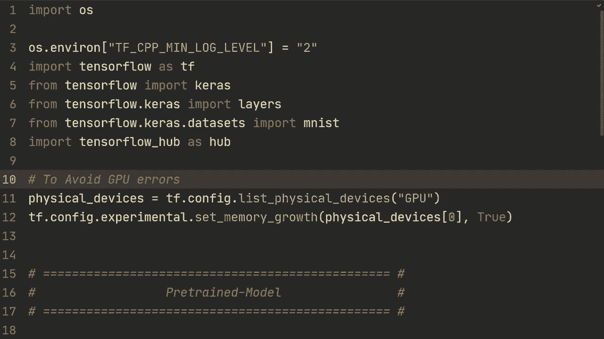
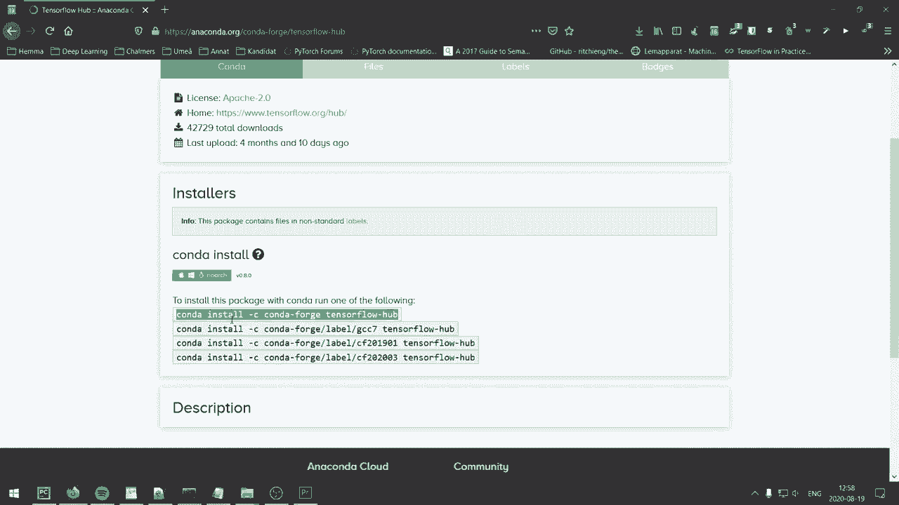
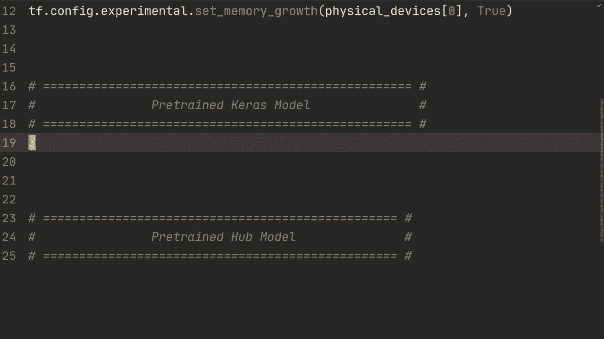
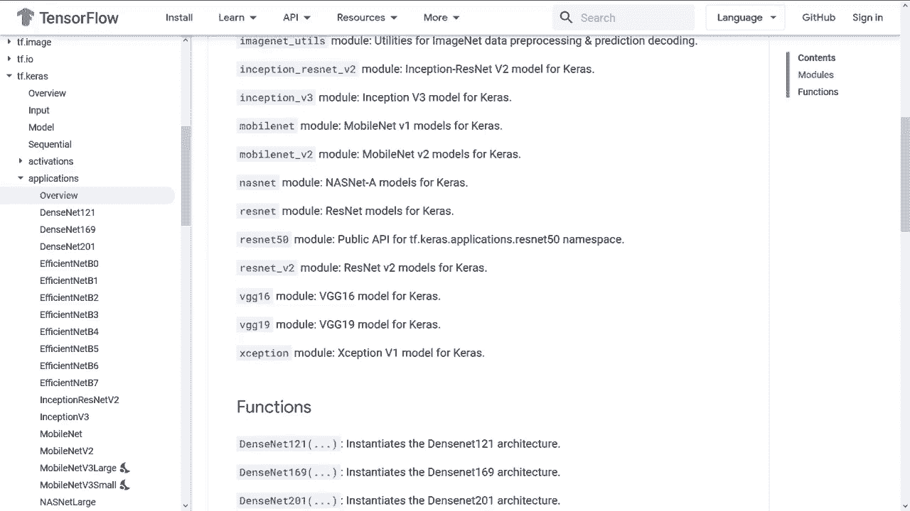
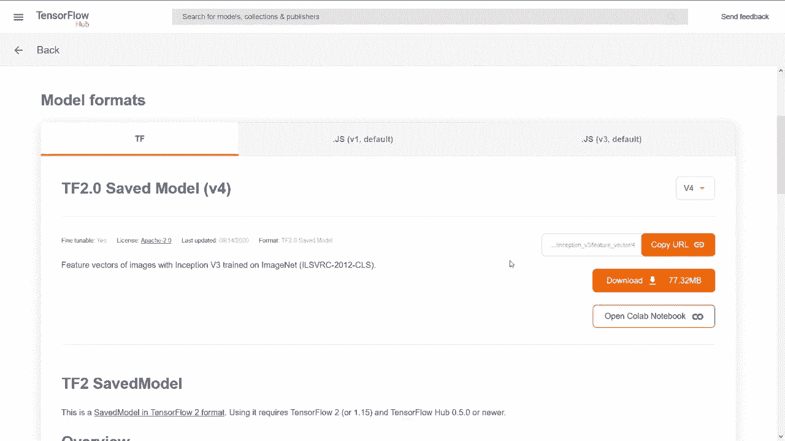
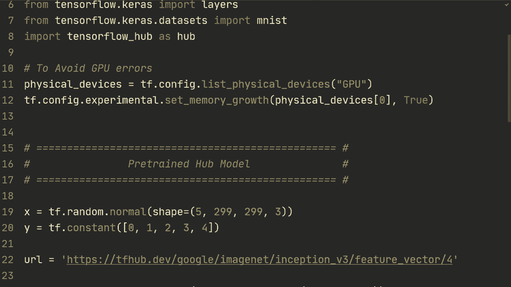

# 【双语字幕+资料下载】“当前最好的 TensorFlow 教程！”，看完就能自己动手做项目啦！＜实战教程系列＞ - P11：L11- 迁移学习、微调和 TensorFlow Hub - ShowMeAI - BV1em4y1U7ib

In this video I will show you how to use pretrain models。 including how to freeze layers and do fine tuning。 so let's get to it right after this beautiful intro。

Alright， so the code in front of us right now should hopefully feel very familiar。 We've been using these for pretty much all of the videos except this command right here。 Tensorflowlow hub。 So I'm going go into what that is a little bit later in the tutorial but first of all。 if you if you don't have it just Google Conda Tensorflowlow hubub and you'll get to this page it's also gonna to be in the description and you can download it with this command if you're using Conda if you're using Pip you're just going to do Pip install Tensorflowlow hub that's it。

And so so what I want to do in this video is essentially three things。 I'm going to first show you if you have a pretrain model that you've previously trained。 so check out my previous video on saving and loading models if you're unfamiliar with that。And then。I'm going to show you how to use a Pret Kas model， so KRS has a bunch of pretrain models that you can just easily import。

And then lastly， I'm going to show you。How to load pretrain models from Tensorflowlow hub。 So Tensorflowlow hub has a bunch of pretrain models。 And I'm going to， as I said。 I'm going to go into that a little bit later。 So first of all。 for this pretrain for our own pretrain model， I'm just going copy in sort of the data dataset loading。

 So the Ms data set right here。And so we've done this multiple videos。 And then I'm just gonna load a pretrain model。 So model is care thatmod do load model。 and this could be， I mean， if you've trained it， So it's in the pretrained folder。 So So this could be sort of a model that you've trained or I guess it could be a model that you've found on Github or something like that。

 So you would just load that model and then you could do print model dot summary。And then。 and then what you would do is you would check which of the parts you want， right， if you。 if this is， if you want entire model， then that's just loading the model you can continue training。 But normally when we're doing transfer learning， we're gonna pick out a couple of layers。

 So let's say we want。So let's say we want everything except the last one right let's say we have we have let's say that this number of classes would be 1000 for imagenet or something like that。 But for Ms we would have 10 classes so then we would have to replace this last dense layer with our own but we could use sort of the previous layers from that particular model So how we would do that is we would do sort of base inputs we would do model dot layers we would take the layer that we want for it to start in and that's the first one so we're going to do model layers 0 and then dot input then we're gonna to do base outputs and why I'm calling it base is because we're going use this pre chain model as our base model and then we're gonna sort of make a layer on top of that one So what we do here is that we sort of check which either by just checking sort zero1 to。

3，4，5，6，7。 So you want the output from the。Seventh one。 or you could count on from backwards so you could do， this is minus1 and then minus2。So what we're going to do here is we're going to do model that layers and then minus2。And then dot output。 So we want to output from this flatten layer here。 In other words， we're。

 we're removing this layer。The dense last layer。 So there are other ways to do this as well。 You could also do it with get layer and then sort of take the name。 But。 we're just gonna stick with the index。 That's fine。 And then we're gonna do。Output we're going to build our own。 so this could be a model。

 a sequential model or something like that。 We're just going to add a single layer。 So all we're going to do is layers then 10 10 output nodes and then of base outputs right so we're gonna first run it through here and then the output of base outputs is going be sent into this this final output。

And then so I guess we could call it that final outputs。And then we're gonna do model equals ks that。 no， wait， we're gonna do， yeah， Ks that model base input。Inputs is equal to base input。 outputs is equal to final output。Outputs， I guess，'cause it's， I have multiple。So then。We could do print。model that summary。And perhaps this should also be called something else then model so we could。

 you know we could call this new model since we've changed the the other one interesting interestingly。 we didn't actually change anything。 We just replaced it since the previous model that we had pretrained it had this exact layer。 but you sort of get the point that you could replace this with whatever you want with different number of classes and so on。So this is just a sort of a simple example to illustrate how you would actually do it。

 And so if we now print the new model that summary we'll yeah so as I said。 we'll get the exact say model， but this one here is is now a different one so if we for example。 would change this to 15 then the sort of the final layer would now have 15 output nodes right here but of course we want 10 in this case。And then you would do as normal so you would I'm gonna copy in the compile and the fit。

 I don't think it's very relevant。 we've seen that in previous videos。 so you would just do in this case， new model thatt compile and the new model thatt fit so we could now run this。Alright， so after just a single epoch， we can see that it has over 97% accuracy and this is only so this sort of suggests that the pre tradinging had some effect now also。 so we can see here that yeah， after three epochs， it has almost 99%。

And what you could also do is let's say that this pretrain model。 you don't want to actually train the entire thing， which， you know。 would be the case if you want to do fine tuning。 So what we would have to do is we would have to freeze the layer from this pretrain model and how you could do that very simply is do model that trainable。Trainable equals false。 So that's gonna freeze all of the layers and。

One other thing you could also do is you could iterate through the layers of the model。 so for layer in model dot layers。And then you could do， yeah， in this case。 we've already set every layer to not be trainable so we could do something like assert La trainable is false。 but what you could also do is if we hadn't done this one liner right here， for example。

 if you wanted to just change specific layers， you could also iterate through specific layers like doing one to5 or something like that and then you could do layers do trainable is false。Yeah， so just two different ways of doing the same thing here。 Yeah。

 so I noticed one error and when editing the video， I wrote layers that trainable is false and。Yeah。 I'm not sure really sure what that that does exactly。 but we want to do a layer dot trainable is false so that was just a typo right there some for some reason it still ran and I'm not sure what difference it made but this is what we you know what we want to do and and that is already done in this one liner so it doesn't really matter。

 but if you would iterate your layers this is how you would do it。The the benefit of doing this is if we would now run this。 rerun it and now I don't know if you if you saw it。 but it took about 15 seconds or 16 seconds or something like that to run one epoch and so if we now run it without we'll see that it's almost half the actual time so the benefit of doing this fine tuning and freezing layers is that it's going to run much faster and sort of this is the I guess the common use case of pretrain models is that you would take this gigantic model freeze the layers up to some certain point and then just add a couple of linear layers at the end for your specific for your specific use case and。

Yeah， so actually we can see here also is that its it actually got better performance in this case。 sort of the same。 And that's because these these layers that have imported had already been trained on Ms previously。 So I guess that's one scenario when you're just you have your own model or you've loaded your own model I'm gonna remove the code for this right now and we're gonna move on to the next one。 So that's if you want to use a pretrained ks model。

 So so the ks library has a lot of models that you can import very easily and I'm going show you just just a use case of that。 and it's gonna to be very similar to what we did but using the the CAs API for those models。 so let's just create some random data just for demonstration to run the model So we're gonna do Tf random do normal and then shape we're gonna do let's say three example five examples299。

and9 by three。 And this is just that it's gonna fit the model that we're gonna import。 So I'll show you in just a second。 but those are for the the X label or sort of the the features。So they are images of 299 and then three channels for RGB。 and then we have TF constant and let's say 0，1，2，3，4。

 so five classes and they are all of a different unique class。And then model is Kas that applications。 And then here there are a bunch of different models you can use。 And so I'm gonna pick inception V3。 And then there are a bunch of arguments that you can send in here。 and you can read the more of the official documentations。

 But one of the most important ones are that。You can do this include top equals true or false。 And essentially what you can do here is that for the for the last final fully connected layers。 you could remove those and just obtain sort of feature vectors that you can then send into your own sequential model or something like that。 So this is probably one of the most important arguments。 And we could just do that first of all。

 And then let's do modeled a summary just to。See what it looks like。Yeah。 so what we can see here is that in this case， actually for the inception V3。 there's only a fully connected at the absolute end。 So I'm not assuming you're familiar with the inception module。

 but essentially it has these concatetnations of different convolutionaryary networks at this layer and then it's doing a global average pooling and then at the end。 it's doing a fully connected。 So if you would do include top falses。 it would just remove this fully connected layer at the end。But let's say we just want to start with this one。 So what we're gonna do now is we could do very similar to what we did previously。

 You could do base input is a model that layers 0 dot input。 And then you could do base output is。These outputs is modeled that layers。 And then let's say， again。 we just want to remove the last fully connected， but of course。 if it would be several fully connected at the end。

 you could do-3-4 sort of removing the exact amount that you want。 In this case。 we just want to remove the last one。And then dot output。 And then we're gonna do sort of our last So we're do final outputs。 Again。 we're just doing a single layer So let layer stands then five nodescause we have five classes。

And then base outputs。 So very similar to what we did previously。 And then new model is Kas that model inputs equals base inputs。AndThen outputs equals final outputs。 Then again， you would just sort of get the compile。 So I'm just gonna copy that in just to save some time。So the compile， So we' just using atom。

 Spish categorical， nothing。Nothing new。 And then we're gonna do new model dot fit。 So let's do new model dot fit。X and Y， and then epox are say 15。 and then verbose equals 2。 And this should be very quick， right， We just have five examples，5 random data points。So let's see if it can overfit 5 data points using this gigantic inception V3 network。

Base input is not defined， allright so。😔，A base inputs right there。Alright。 so training on these 15 epos went pretty quickly。 and as we can see。 it's got 100% accuracy and the loss is very low so。But of course。 this was just a demonstration of how you would import stuff using this ks that applications models and so what I want to show you now is how to use the Tensorflow hub And so Tensorflowlow hub essentially and it just Tf hubub dev It's essentially where you can get a lot of different models pretrain models for different scenarios So let's say we just want images that you can sort of so there's a lot of models here that you can just you can go through and just check in this case。

 let's say we want the inception v3 again so we can just go to this one right here。 and then it has this is for the feature vector So this is similarly to the kis one where you could include top equals false that would give you a feature vector and that's exactly what this does。

 So they've separated the inception V3 for a model that has the top of the fully connected ones and then one that just returns the feature vector。

And then what you do is you just copy the URL。And when you have the URL。

And then you can go back to the code。 So again， let's do some random data。 So let's do TF random normal shape is 5，2，99，2，99，3。 sort of exactly what we just did for the。Loading from the ks。 And again， we're loading the exact same model。 So this is not going to be anything new just showing you how to do it with Tensorflow hub。

 So then you would do URL equals， and then you would paste the URL right here。And then。You would do base model， and then。Uub equals ks。Layer。U。And then， input shape。299，2，99，3。 And then what you would do is you would do model equals kas sequential。And you would， then。Do the base model， right， which is not including the fully connected layers。

 And then you can add whatever layers you want。 So layer standss1 hundred28 nodes。Actation equals。Not re。Our layer stands，64 activation equals relu。 And then yeah。 let's do one final layer stands of 10 up，10 up 5 output nodes。 We just have five classes。And then again， you will do model that compile and model that fit。 So I'm just gonna copy those in。

And then I guess sort of one thing I missed to do for the KRS model is that， of course。 you can do as the exact first example that we did so you could do base model that trainable equals false so that you're you're doing fine tuning。I should have probably showed that also for the other one because this is something you can do for all models。And yeah， just for the example， let's try and run this and see what it looks like。Alright。

 so in this scenario it didn't actually overfit too much。 so we would have to probably run it for longer， but as we can see at least it obtained a 100% accuracy。And yeah， that's pretty much it。 Those are the examples I wanted to show you sort of different ways you can do pretraining and fine tuning freezing layers and so on。 Hopefully this video was useful for you if you have any questions then leave them in the comment and hope to see you in the next video。

