# 【双语字幕+资料下载】“当前最好的 TensorFlow 教程！”，看完就能自己动手做项目啦！＜实战教程系列＞ - P13：L13- 数据增强 - ShowMeAI - BV1em4y1U7ib

Alright， guys， welcome back for another video。 and in this video。

 we're gonna to take a look at data augmentation。 So what we have here are just some basic imports for Tensorflow and Ks and then Tensorflow data sets as TFDS that we looked at in the previous video。

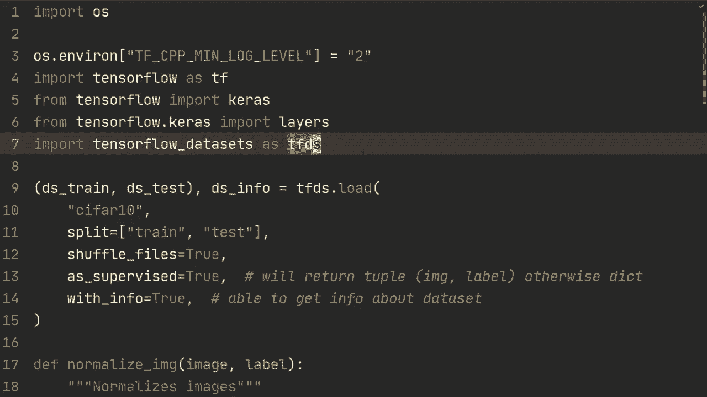

And so we're just doing pretty much the same thing as in that video。

 we're loading the Cypher 10 data set。

And then pretty so this is pretty much copied from the previous video we're doing some normalization of the image so we're divided by 255 and so we're mapping every image through this normalized image。

 we're doing cache shuffle， batch and then prefetch and then pretty much the same on the test set except we don't have cache and shuffle。

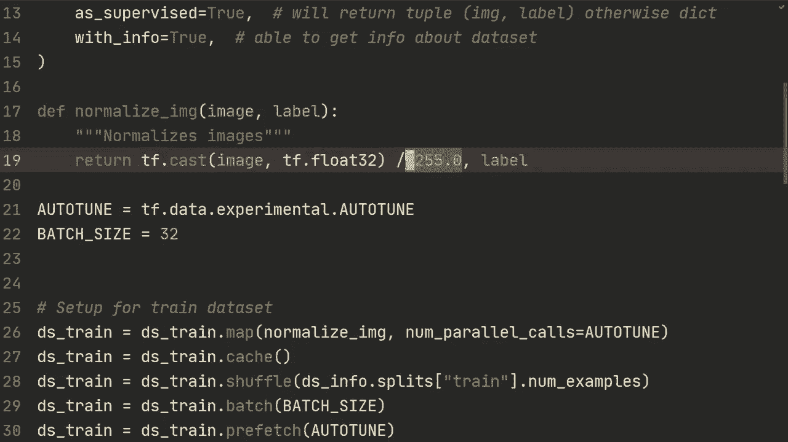

And then we have some model that is pretty simple。 We take 32 by 32 and three channels as input。

 and the first layer is just a。

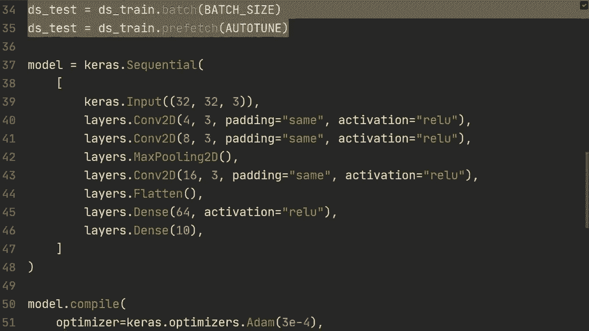

Yeah， so it's a very， very small model because this is just a focus on the date augmentation part。

 but essentially we have two comb layers， max pool， calm。

 flat and and then two dense layers at the end。

And then model compile and model fit for5 epochs， and then model and evaluate。

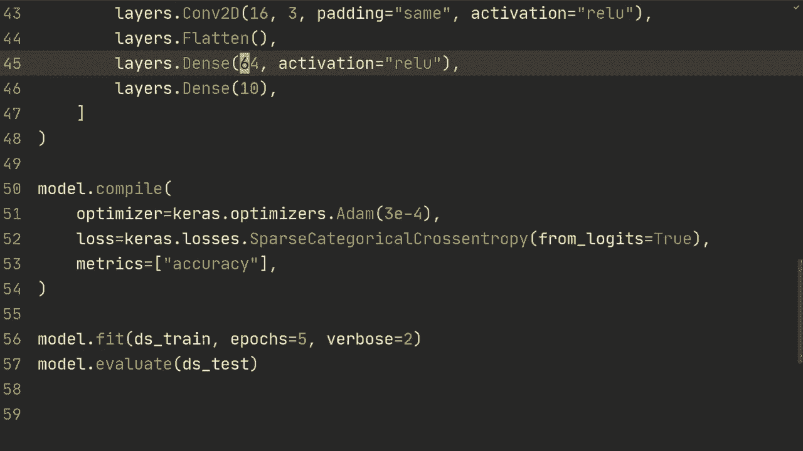

All right， so what I want to show you are two ways to do data augmentation。

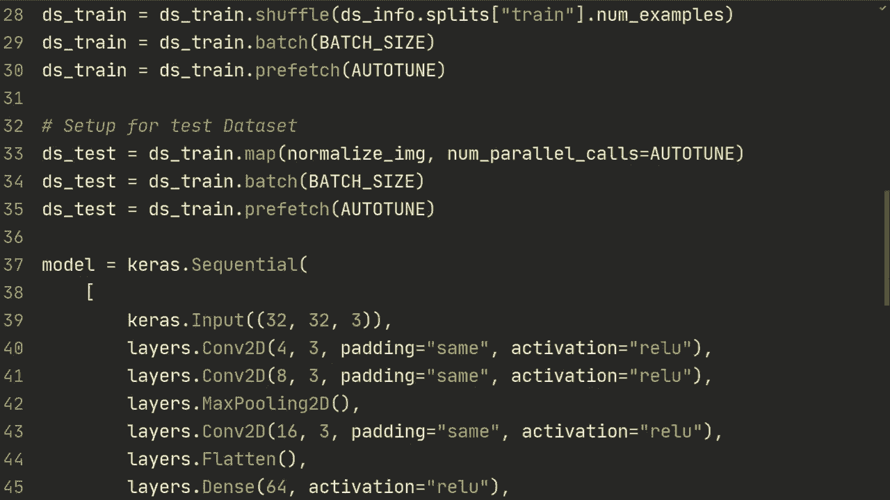

And so the first one of these assumes that you're working with a Tensorflow data set that is going be the case most of the time。

 either you're loading through Tensorflow datas or you're doing custom data loading for your custom data。

 which we haven't covered yet， but we will in future videos and so what we're going to do here is we're going to define another function。

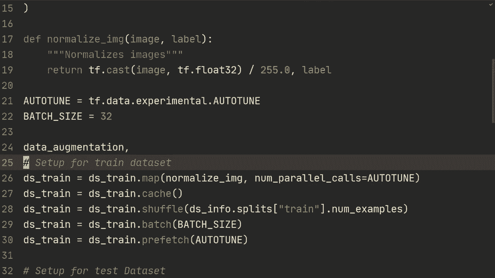

OhWe're going to find another function right here， define augment。

 and then we're going to send in image and label。

And there are a bunch of different Tensorflow functions that you can use for date augmentation and I and I will link to the documentation that you can go through all of them。

 I'm just going to show you sort of the structure of it and some basic ones。 And then， of course。

 you can add more， if you like or remove some of them。 But so let's say， first of all。

 we want to sort of resize the image。 That's a common thing。And in this case， you know。

 the images are already resized to 32 by 32， but maybe sometimes the image isn't exactly maybe not all of the images are exactly that size。

 so we might need to do some resizing。So what we're going to do is we're going to do new height equals new width。

And we're going to specify it as 32。 so we're not going to do any resizing because it's already done。

 but just how you would do it。

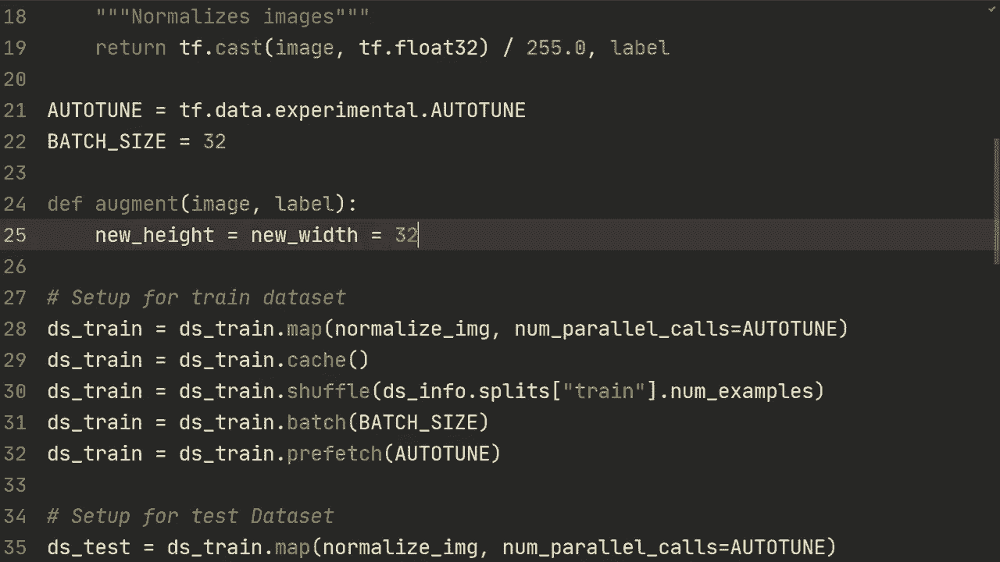

So image is then equal to T F dot image dot resize。 we're going to send in that image。

 and then we're going to specify the new height and the new width。

Alright， then let's say that we want to， I don't know。

 convert the image to grayscale so the channels now are three channels right。

 let's say we want to convert it to grayscale so that our model can do predictions on grayscale images as well as colored images。

But perhaps we don't want to do gray scale on all of the images， right。

 we we want to still have some color。 So with some probability， we want to convert it。

 Then you could do something like F TF dot random dot uniform。And you could specify the minve。

 say zero， the max value 1。Let's say if that is less than 0。1， which will happen in 10% of the cases。

 then what we're going to do is we're going to do Tf doim。 RGB to gray scale。

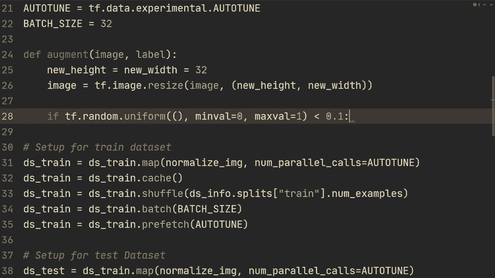

Of that image。Now one issue here is that since we're converting to grayscale。

 the out channel is just going to be one， but of course。

 our model in this case is going to expect an input channel of three。

 So one way to solve this is that。

Is that you can copy that one channel across the three so you can copy that one channel to become three channels except that all of those three will be identical。

 but that's just so that the model will actually work so you could do something like TF tile。

And then you could do 1，1，3。 So essentially here we're going to not copy this dimension。

 not copy this dimension here we're going to copy it three times。

 and this is the channel for the this is the dimension for the number of channels。

this might be a little bit tricky。 so if you don't completely understand it， that's okay。

 just make sure that you check out what this T of the tile does and and then just。Really。

 the point is that you can use if statements and stuff like that and not have a deterministic augmentation of your examples so you can introduce randomness into your data augmentation。

I guess one thing that's really important to say here is that I oftentimes see people talk about data augmentation like you're sort of expanding your data set so that if you have 100 images with this data augmentation。

 you're going to get 300 or something like that。And that's not really how data augmentation is done。

 normally how you do it is that you do it on the fly so that this is done sort of on the CPU in parallel while the GPU is training the model。

 So while it's training the current batch， it's fetching the next batch and it' doing the augmentation in real time on those images。

 And so to。So sort of you're effectively making your dataset set larger。

 but it's not really so for example， if you just take a look at this one where for each image we're with a 10% probability。

 we're making it grayscale， what is the effective like what is the effective data set size。

 when we've introduced this data augmentation， it's kind of tricky to say and especially if you introduce more more randomness。

 So let's say for example， we do image equals Tf image random。

Brightness of image and then specifies max delta in that in the range of how much it can change the brightness。

So what is the effective data set size after we introduce something like this when we introduce some random brightness to the image？

Well， I guess。InInfinite'ca it could could change the brightness of the model just slightly， just。

 just very， very slightly on a specific pixel。 And it can do this on every image。So I think that way。

Talking about the size of data set after documentation is a little bit tricky。

 and so just keep that in mind and。And the one more thing is that all of these are going to be done on each image and it's going to be done in sequence。

 So first， we're resizing， then we're doing the random RG I guess， yeah， random RGB to grayscale。

 Then we're doing the random brightness。 Then we could add more stuff。And again。

 I really encourage you to look out the documentation because there are tons of more。

 and you can also create your own sort of data augment。 In this case。

 we're just using their their functions， which is good enough for most cases。

 So we're just going to do TF image random contrast。We're going to send in the image。

We're going to specify some lower value and then some upper value and what exactly these functions are doing。

 I guess you can sort of print them and see what it does， but exactly what they do。

 I would read read what the documentation for these specific functions。 So this。

 I guess in this video we're learning how to use data augment。

 not really to implement it from scratch。

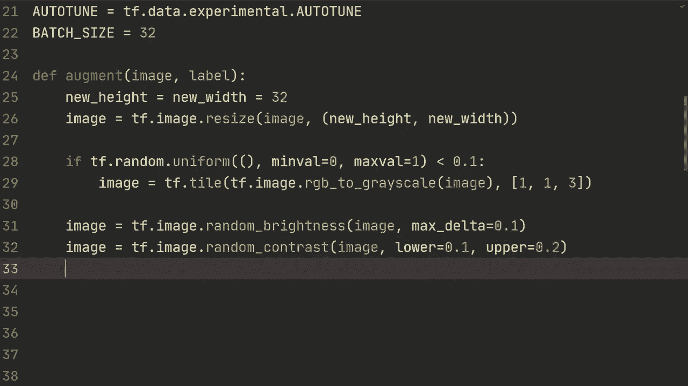

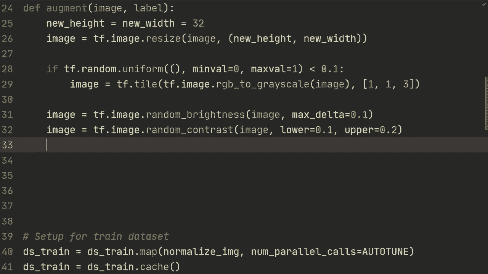

And so one more thing also is that you can a very common augment is you can flip the image vertically or horizontally。

Although I， I would be careful sort of。Depending on the dataset set you have so let's say you're using MNist。

 you wouldn't want to flip images horizontally， for example， because for example。

 if you vertically and horizontally flip a9 that would inherently change the digit of the image so you want to make sure here that the data augmentation you're doing isn't actually destroying the correct label for the image。

 so just be careful with with data augmentation， more data augmentation is not always better and you need to make sure that everything you do just still still maintain the correct label for every image。

嗯。But I mean， let's say you have pictures of of dogs or something。

 then if you horizontally flip a dog that that's still a dog。

 So or if you vertical vertically flip it， it's still a dog。 So in many cases it makes sense。

 just be careful with it。So then we're going to do image is TF that image that random flip left right of image。

And this is going to， in 50% of the cases， randomly flip， left and right。 I would wanted to sort of。

That you could choose the probability of flipping。I haven't found a function that can do that yet。

 I guess it's not too difficult to implement yourself， but it's available through Pythtorch。

 I think TensorFlow could do it as well and hopefully they do in the future。

And then you could also do image， TF image， random flip。Up down。Of image。

 I'm not going with 50% probability again， I'm not going to use it in this video， though。

And then at the end， we're just going return image comma label。 Allright， so now that we have our。

 our function here， what we're going to do is we're going map it。 So， for example。

 we're going do it after the shuffle here。 we can do the S train。

Equals thetrain dot map and then augment。So it's going to first normalize the image and I guess we could also specify non parallel calls since there's nothing inherently for each image this can be done in parallel。

 so that's why we do this non parallel calls。And。

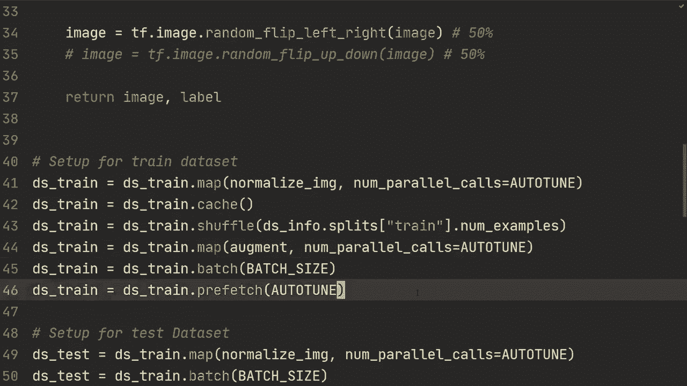

Yeah， so I think that's it。 That's really all we need to do to add。 So let's just run， first of all。

 to make sure that it actually works and so on。

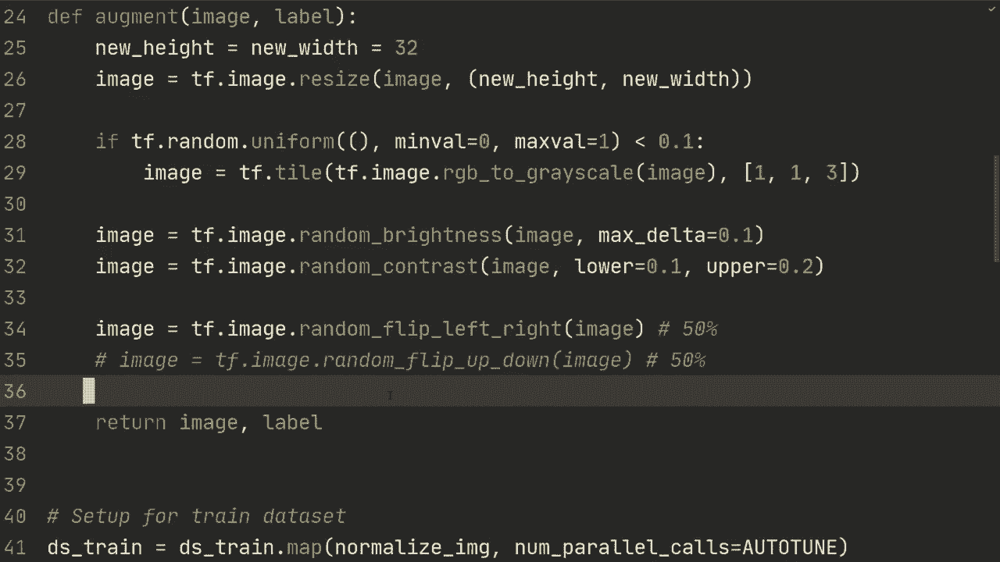

Alright， so it does seem to run。 And again， we're not looking for performance。

 although I would highly encourage you to sort of in previous videos we've trained on Cypher1on。

 I think we got， I don't know， like 78% on the test set or something like that and introducing data limitation。

 I think you can do a lot better。 And with some model modifications。

 I think you can do at least get it up to 90% so。That's one thing I highly encourage you to do。

 just play around with the code add data limitation and see if you can improve the accuracy and do let me know how it goes for you。

But so this is one way to do data augmentation。 I'm gonna show you one other way。

 And sort of this is the way that I think is recommended。 This is highly efficient。

 and it's done while your modellish training。 But another way that's common is that you could do。

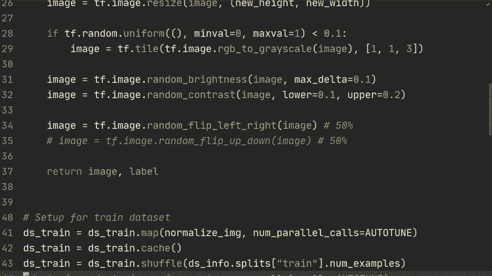

And this is for TensorF greater。Or equal to 2。3。0， which is the latest version as of right now。

 And so what we can do is we can do data augmentation， and we can do a sequential model。

 So essentially here。

We're we're going to add data augmentation as part of our model and I think there are pros and cons of this。

 I think it's more simple because it's just part of your model but I'm not entirely sure if that is actually done while the model is training so for example。

 for the data augmentation we did here， this is done in parallel while the model is still training on the current batch and this is done on the CPU at the same time so to speak。

And I think so you lose some performance doing it this way， but I think it's。I guess。

 more simple and。Anyways， we're gonna to do layers that experimental thatt pre processingces。 So。

 so it's in the experimental branch。 So as you can see it's this is still new。

 That's why it's only available in the in the latest model。

 And so we're gonna do prepro that resizing。 We're gonna specify height and width。And again。

 I'm going to link to the documentation of this experimentalal preprocess。

 there are a lot of different functions here。But you could do layer dot experimental。

 dot preprocessing， that random flip。And you can specify a mode and you can specify the mode to be horizontal and vertical or just vertical or just horizontal。

So to keep the same data augment we did previously， I'm just going to do horizontal flip。

Then we can also do something like layers that experimental， dot preproces， dot random contrast。

 and then we specify factor， let's say 0。1。And yeah， that's it。 So you can add more， of course。

 you can add a lot more and。

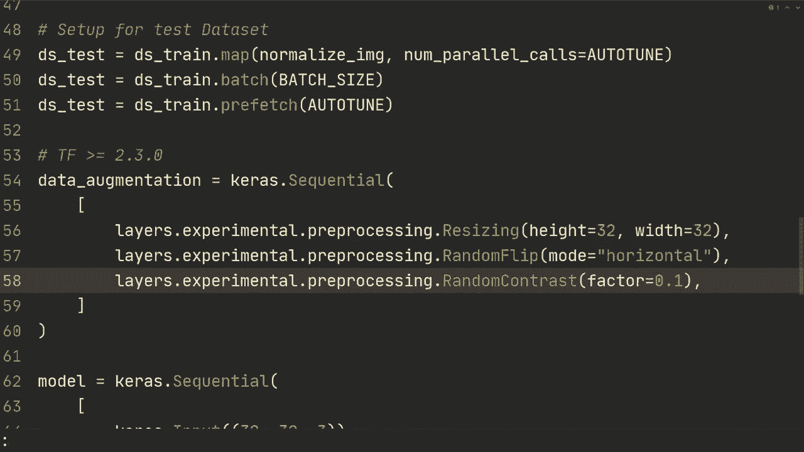

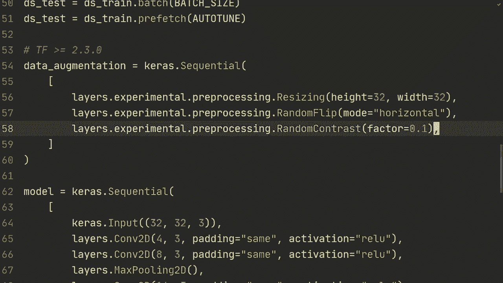

But I think that's fine just for now。 And then what we're going do is we're gonna add it at the top here。

 So we're gonna data augment right here。 So it's gonna。

runun through the data augmentation and then it's gonna be sent through the layers and so let's just run this and make sure that it works as usual。

 Well that was a blunder。 I accidentally stopped the recording and I think I spoke for about 10 minutes so I'll just try to remember what I said so I think so what you can see here that we have 41% after just one epoch and if you and again we don't care about the accuracy here。

 but if you would compare it to what we did previously I think we just had 26 or 28% after1 to2 epochs and I guess we were're using the same model right the only thing that difference is the data augmentation so previously we used some more data augmentation in that we had this random brightness and we also had this random gray scale and so。

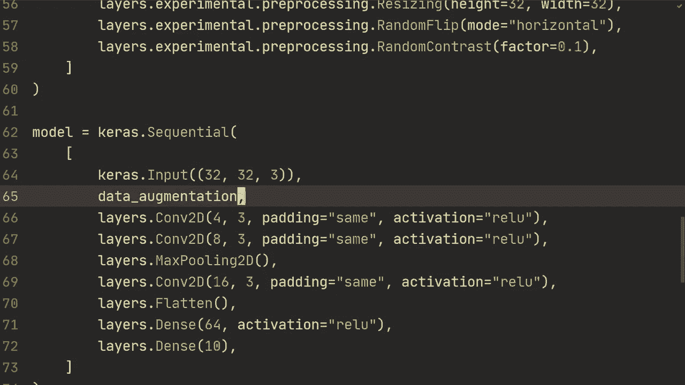

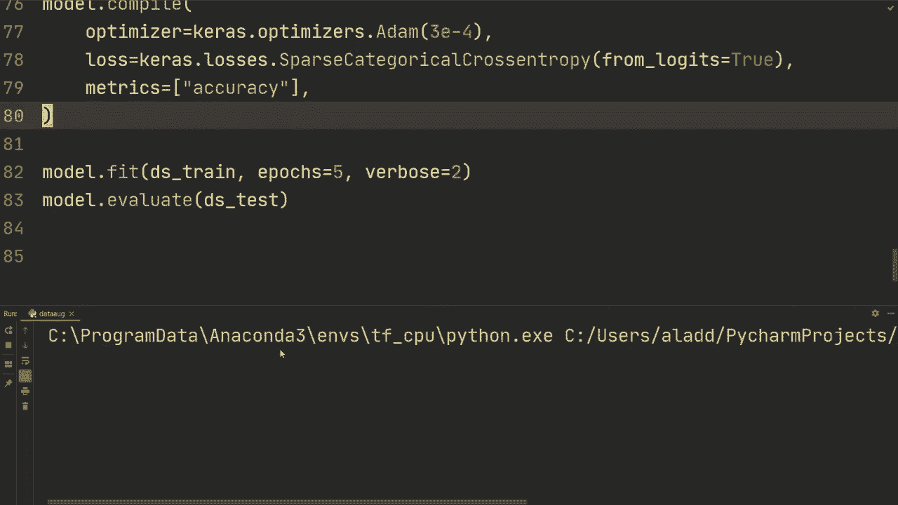

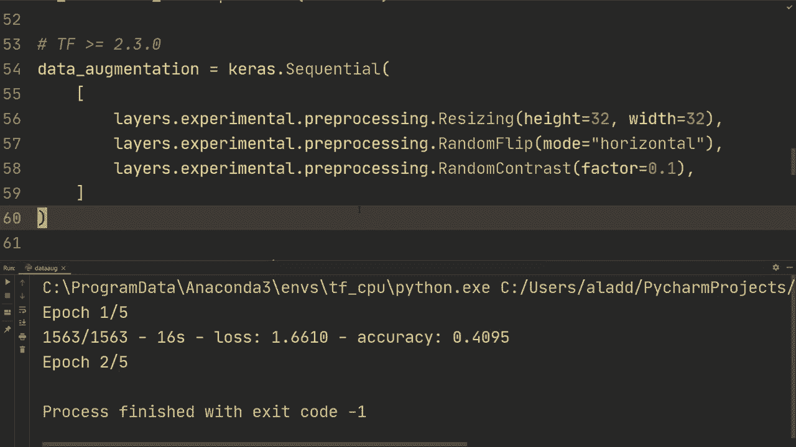

When we add this when we add more data augmentation。

 we're making it more difficult for the model to overfit to the training data because it's seeing such huge variety of images。

So in previous videos， we've talked about regularization in terms of L2 and dropout。

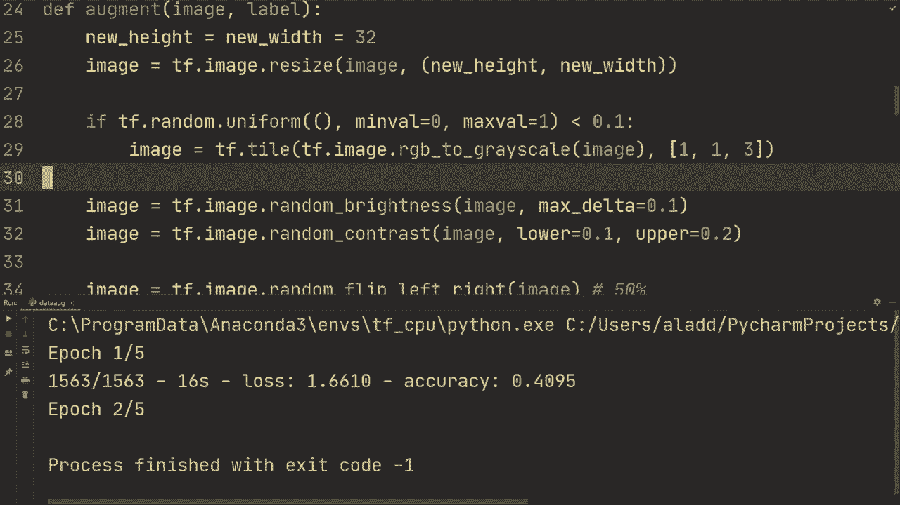

One really powerful method is data augmentation So essentially you know overfitting is adapting too much the training data right it's just one sort of interpretation of overfitting is that it essentially just memorize the training data and memorizing doesn't lead to generalized sort of generalized understanding and so sort of one thing you can do is that if you just think about from your own perspective。

 having more stuff to memorize makes it harder right if you have very few things to memorize it's very easy to just memorize them and it's the same thing for the network so if we're adding more stuff if we're adding more images it makes it harder to memorize them which reduces overfitting So in addition to these L2 and drop out highly they encourage you to try out data augmentation not only for expanding the data set so that the model improves sort the performance of the model is going。

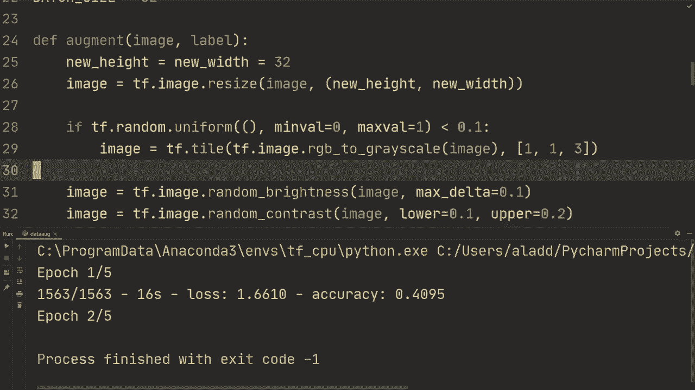

To improve as well because of having these more images to train on。

 but it's also going to reduce overfitting And so yeah。

 I think that's it If you have any questions then leave them in the comment section below Thank you so much for watching the video and I hope to see you in the next one。

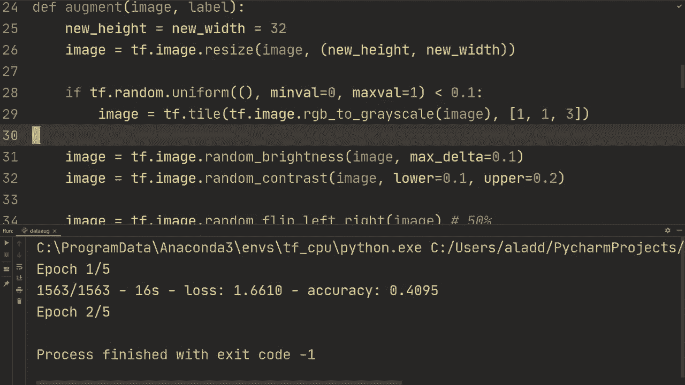