# 【双语字幕+资料下载】“当前最好的 TensorFlow 教程！”，看完就能自己动手做项目啦！＜实战教程系列＞ - P13：L13- 数据增强 - ShowMeAI - BV1em4y1U7ib

好的，大家，欢迎回来观看另一个视频。在这个视频中，我们将看看数据增强。因此我们这里有一些基本的 Tensorflow 和 Keras 导入，以及我们在之前的视频中查看的 Tensorflow 数据集作为 TFDS。

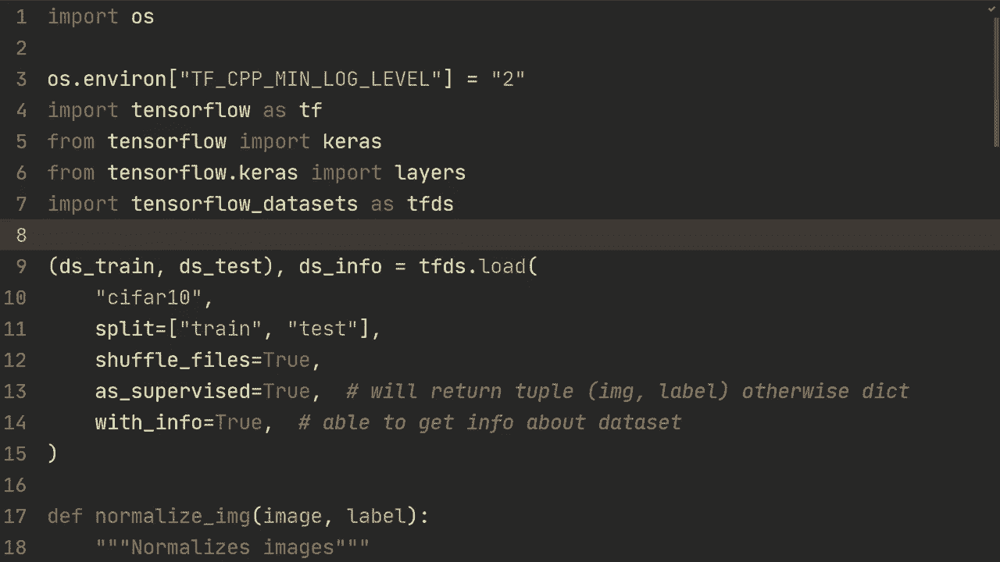

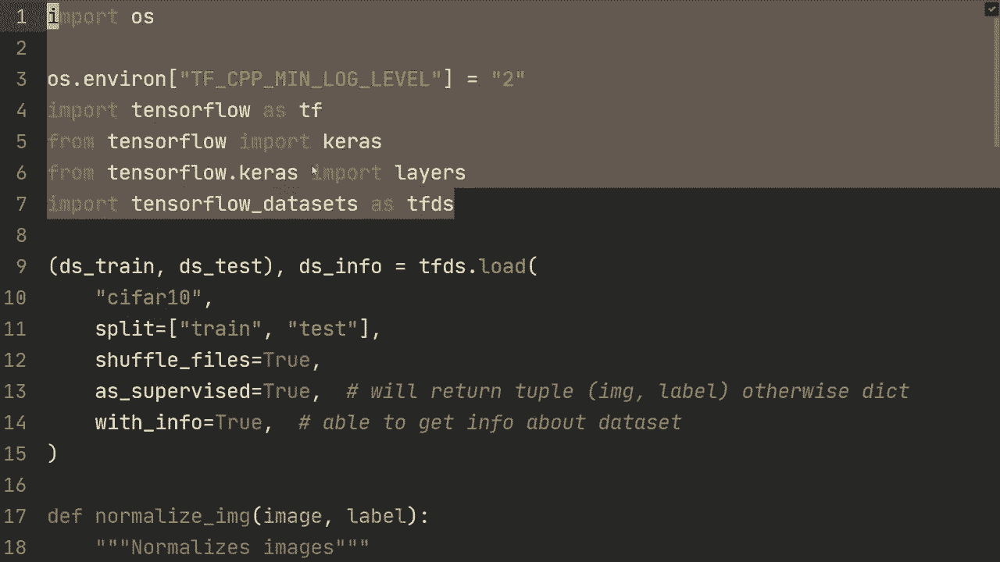

所以我们基本上做的和那个视频一样。我们正在加载 CIFAR-10 数据集。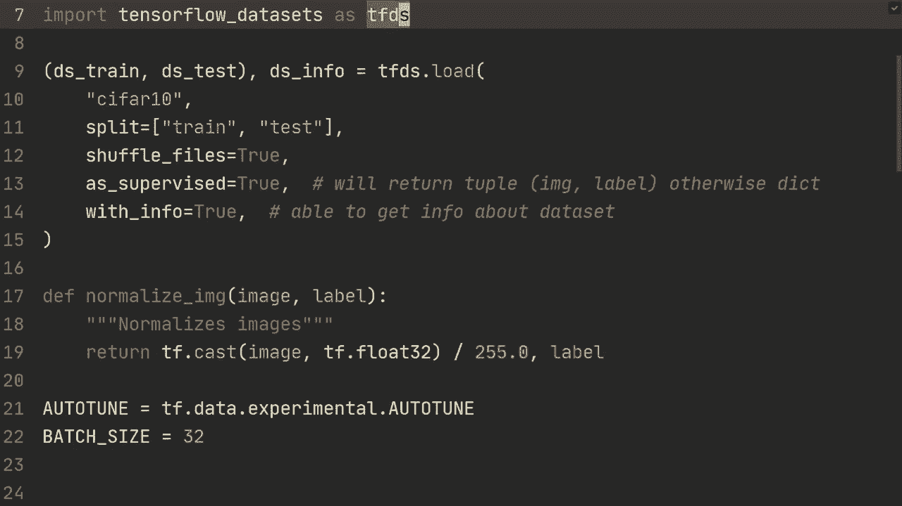

这部分基本上是从之前的视频中复制过来的，我们对图像进行一些归一化处理，因此我们用 255 来除，映射每个图像通过这个归一化的图像。我们进行缓存、洗牌、批处理，然后预取，测试集几乎相同，只是没有缓存和洗牌。

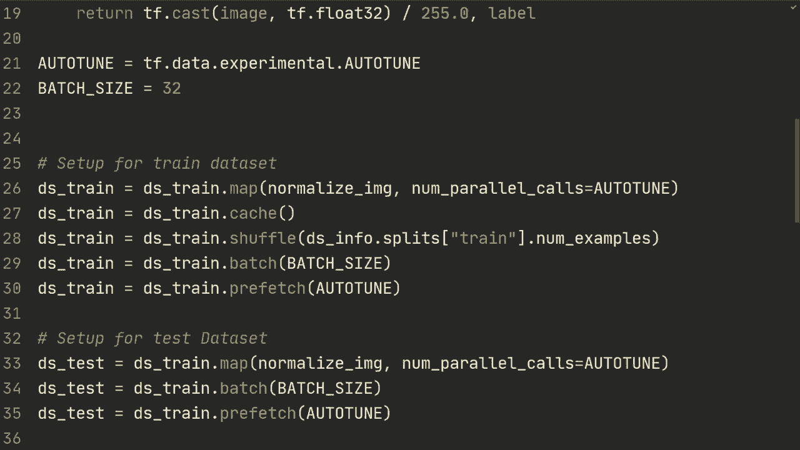

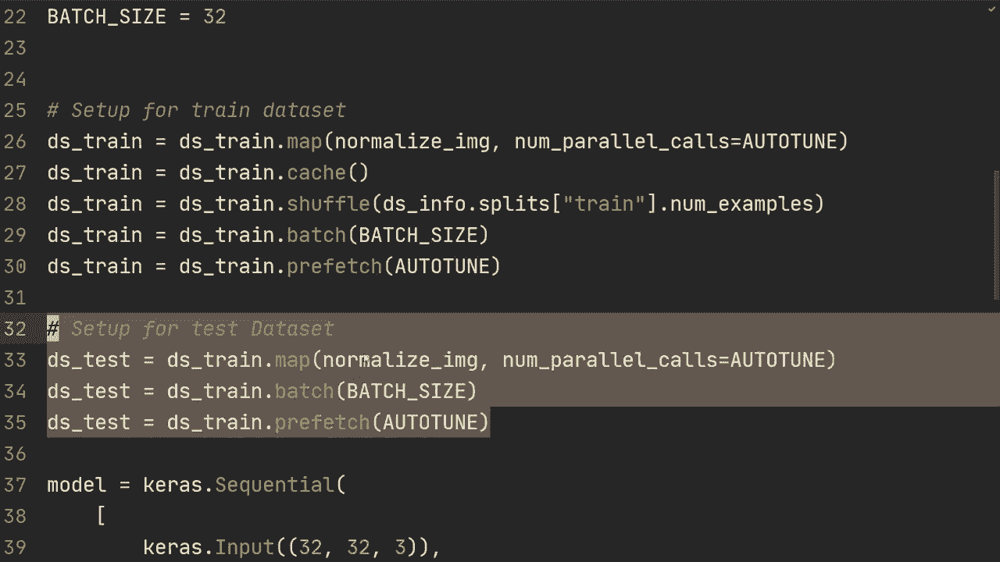

然后我们有一个相当简单的模型。我们输入 32x32 和三个通道，第一层就是一个。

是的，所以这是一个非常小的模型，因为这只是专注于数据增强部分。但基本上我们有两个组合层、最大池化、卷积、扁平化，然后最后有两个密集层。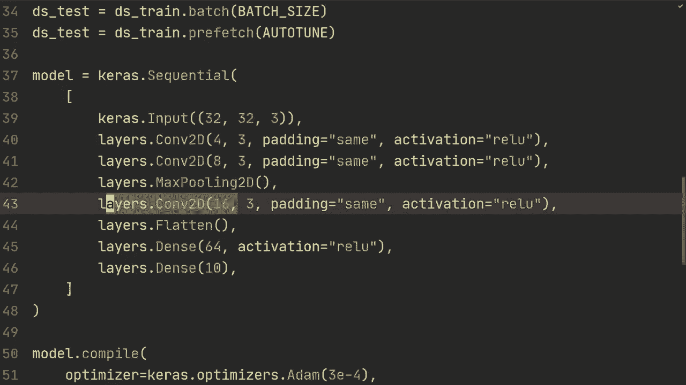

然后模型编译和模型拟合 5 个周期，然后模型评估。

好的，我想向你展示两种数据增强的方法。

首先，这里假设你正在使用一个 Tensorflow 数据集，这在大多数情况下都是如此。要么是通过 Tensorflow 数据加载，要么是为你的自定义数据进行自定义加载，这部分我们还未讨论，但未来的视频中会涉及。因此我们在这里要定义另一个函数。

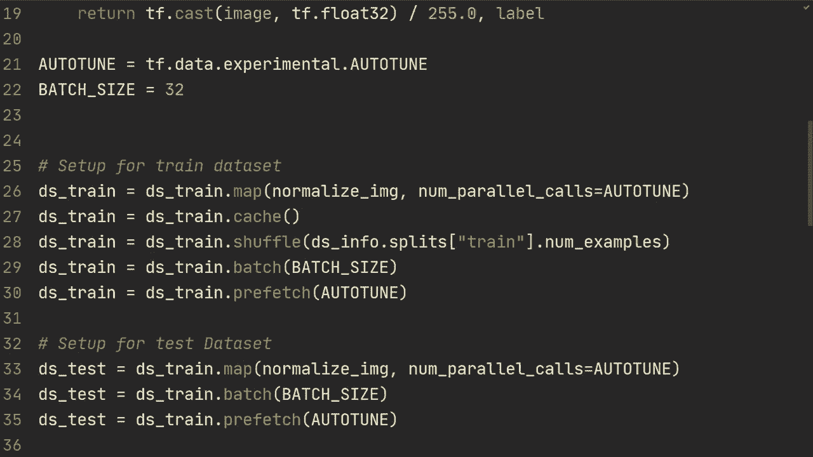

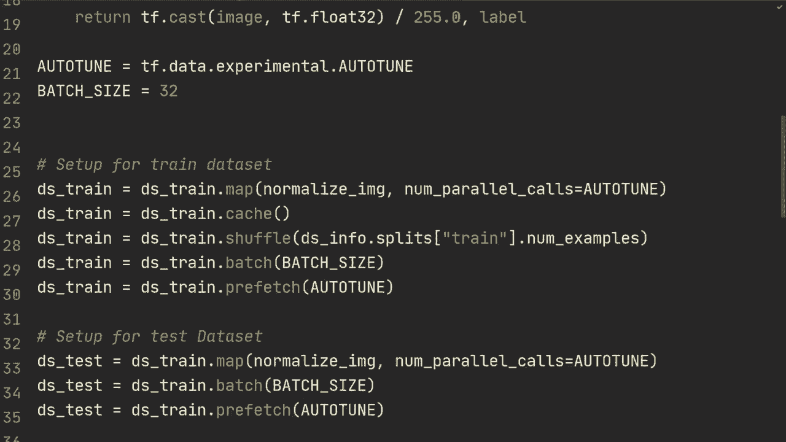

哦，我们将在这里找到另一个函数，定义 augment，然后我们将传入图像和标签。

有许多不同的 Tensorflow 函数可以用于数据增强，我会链接到你可以查看的文档。我将向你展示它的结构以及一些基本的内容。当然。

如果你愿意，可以添加更多，或者删除其中一些。但首先，我们想要对图像进行调整大小。这是一个常见的事情。在这种情况下，你知道。这些图像已经调整为32乘32，但也许有时图像不完全，可能不是所有的图像都正好是这个大小。因此我们可能需要进行一些调整。我们要做的是新的高度等于新的宽度。

我们将其指定为32。所以我们不需要进行任何调整，因为已经完成了。但这只是你应该如何做的。

所以图像等于T F dot image dot resize。我们将发送该图像。然后我们将指定新的高度和新的宽度。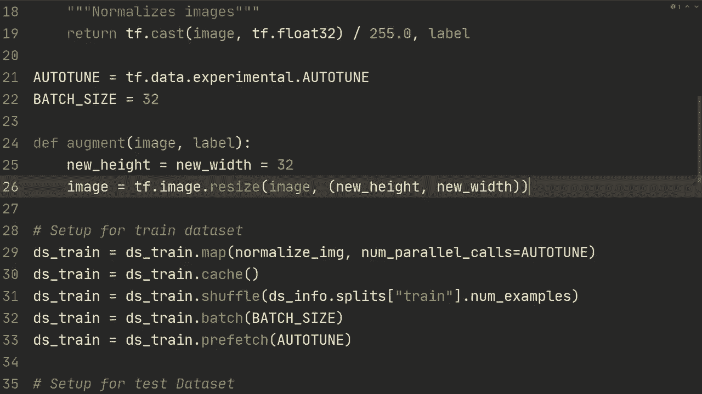

好吧，然后假设我们想要，我不知道。将图像转换为灰度，所以现在通道是三个通道。对吧。假设我们想将其转换为灰度，以便我们的模型能够对灰度图像和彩色图像进行预测。但也许我们不想对所有图像进行灰度处理，对吧。

我们希望仍然保留一些颜色。因此，在某种概率下，我们想要进行转换。然后你可以做一些像F TF dot random dot uniform的事情。你可以指定最小值，例如零，最大值1。假设如果小于0.1，这将在10%的情况下发生。然后我们要做的是进行Tf doim。RGB转灰度。

关于那张图像。现在一个问题是，由于我们正在转换为灰度，因此输出通道将只有一个，但当然。在这种情况下，我们的模型将期望输入通道为三个。因此，解决这个问题的一种方法是。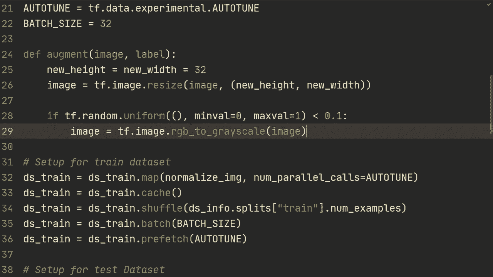

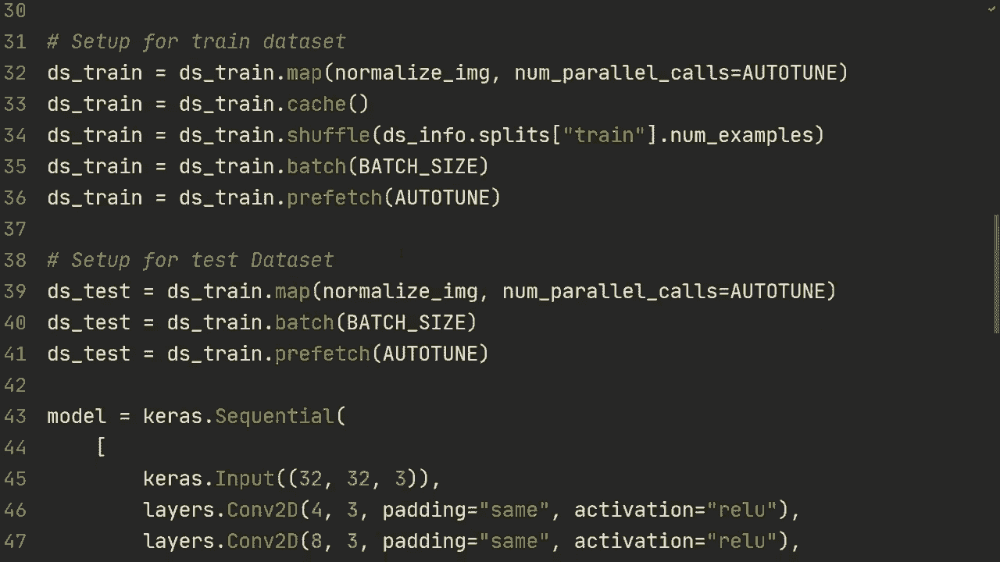

你可以将那一个通道复制到三个通道中，因此你可以复制那个通道，使其变成三个通道，尽管这三个通道都是相同的。但这样做是为了确保模型能够正常工作，因此你可以做一些类似于TF tile的事情。

然后你可以做1，1，3。所以在这里，我们将不复制这个维度。这里不复制这个维度，我们将复制三次。这是通道的维度，这是通道数的维度。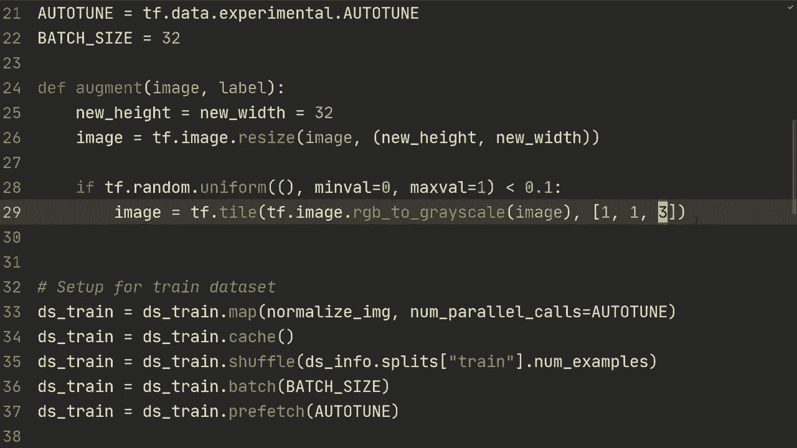

这可能有点棘手。所以如果你没有完全理解，也没关系。确保你了解这个瓦片的T是做什么的，然后就是。真的。关键是你可以使用if语句和其他类似的东西，而不需要对你的示例进行确定性的增强，因此你可以在数据增强中引入随机性。我想这里非常重要的一点是，我经常看到人们谈论数据增强，就好像你在扩展你的数据集一样，因此如果你有100张带有这种数据增强的图像。

你会得到大约 300 个这样的样本。这并不是数据增强的正常做法。通常的做法是实时进行增强，也就是说这在 CPU 上并行完成，而 GPU 正在训练模型。因此，在训练当前批次时，它会获取下一个批次，并且在这些图像上实时进行增强。所以，实际上你是在有效地扩大你的数据集。

但这并不完全如此，例如，如果你看看这张，对于每个图像我们以 10% 的概率将其转换为灰度，那么引入这种数据增强后的有效数据集大小是什么？这有点棘手，特别是如果你引入更多随机性。假设我们做图像等于 TF 图像随机。

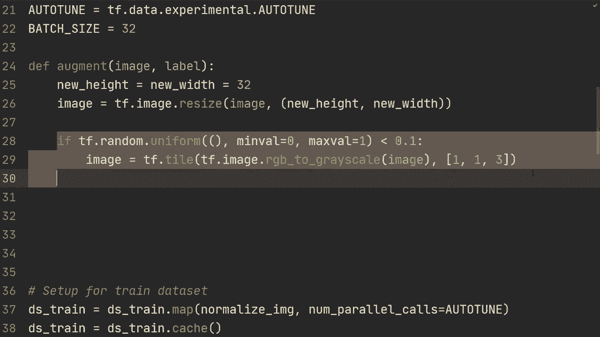

图像的亮度，然后指定最大变化量，这在其变化范围内。因此，当我们引入这样的随机亮度后，有效的数据集大小是什么？

我想，在 Infinite'ca 中，它可能会稍微改变模型的亮度，只有在特定像素上，变化非常微小。而且这可以在每个图像上进行。所以我认为这很重要。谈论数据集的大小在文档之后有点棘手，所以请记住这一点。另外一件事是，这些操作都将在每张图像上顺序完成。

首先，我们在调整大小，然后进行随机 RG，我想，没错，随机 RGB 转灰度。接着我们会做随机亮度。然后我们可以添加更多内容。再一次，我真的鼓励你查看文档，因为还有很多其他内容，你也可以创建自己的数据增强。在这种情况下。

我们只是使用他们的函数，这在大多数情况下已经足够了。我们将进行 TF 图像随机对比度。我们将输入图像，指定一些下限值和上限值，至于这些函数具体在做什么，我想你可以打印出来看看它们的作用，但具体的效果是什么。

我建议你阅读这些特定函数的文档。因此，我想在这个视频中我们学习如何使用数据增强，而不是从头开始实现它。

还有一件事是，你可以进行非常常见的增强，可以垂直或水平翻转图像。尽管我会小心一点。根据你拥有的数据集，例如使用MNIST，你不想水平翻转图像，因为例如，如果你垂直和水平翻转一个9，那会本质上改变图像的数字，所以你要确保你所做的数据增强并不会破坏图像的正确标签。

所以在数据增强上要小心，更多的数据增强并不总是更好，你需要确保你所做的一切仍然能保持每张图像的正确标签。嗯。不过，我的意思是，假设你有狗的图片或其他。

如果你水平翻转一只狗，它仍然是一只狗。如果你垂直翻转，它仍然是一只狗。因此在很多情况下，这是有意义的。只需小心一点。那么我们要做的是图像是TF，图像随机翻转左右。在50%的情况下，它将随机翻转左右。我想做一些。

你可以选择翻转的概率。我还没有找到可以做到这一点的函数。我想自己实现并不太难，但它可以通过Pytorch获得。我认为TensorFlow也能做到，希望他们未来能实现。而且你还可以进行图像处理，TF图像，随机翻转，上下翻转，图像。

我不打算再次使用50%的概率，这次视频中不会使用。最后，我们只是返回图像和标签。好的，现在我们有了我们的函数，我们要做的是映射它。所以，例如，我们将在这里洗牌后进行。

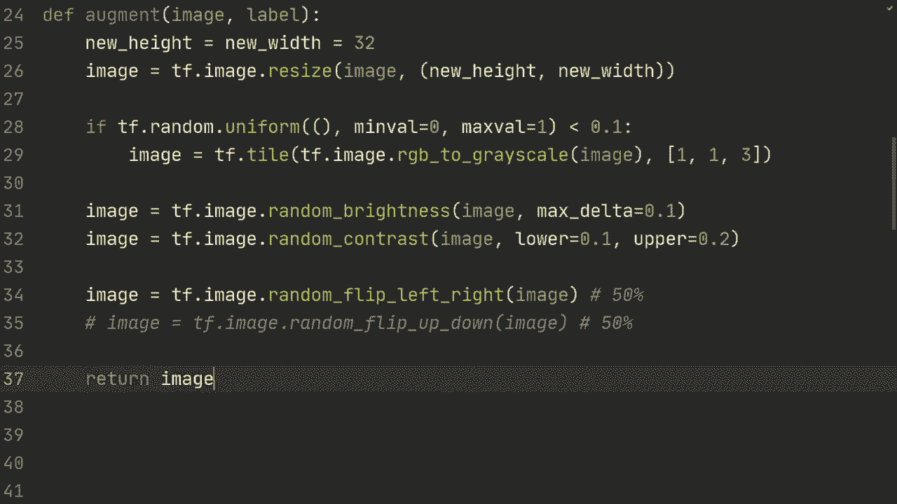

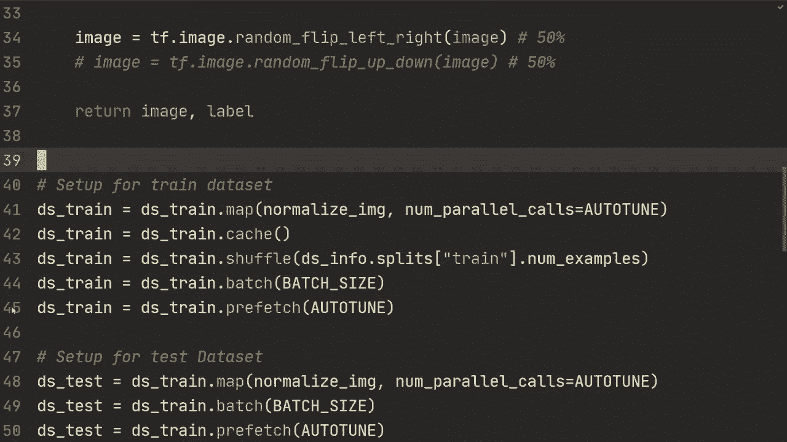

等于thetrain dot map，然后进行增强。所以它首先会对图像进行归一化，我想我们也可以指定非并行调用，因为每个图像本身并没有什么可以并行处理的，这就是为什么我们要进行非并行调用。

是的，我想这就是了。这就是我们需要添加的所有内容。所以我们先运行一下，以确保它实际上能工作，等等。

好吧，所以它似乎可以运行。再说一次，我们并不关注性能。虽然我强烈建议你在之前的视频中，我们在Cypher1on上进行了训练。我想我们在测试集上得到了78%左右，或者类似的结果，并引入数据限制。我认为你可以做得更好，并进行一些模型修改。

我认为你至少可以做到90%，所以这是我强烈建议你做的。玩一下代码，加上数据限制，看看是否能提高准确性，并告诉我你的进展。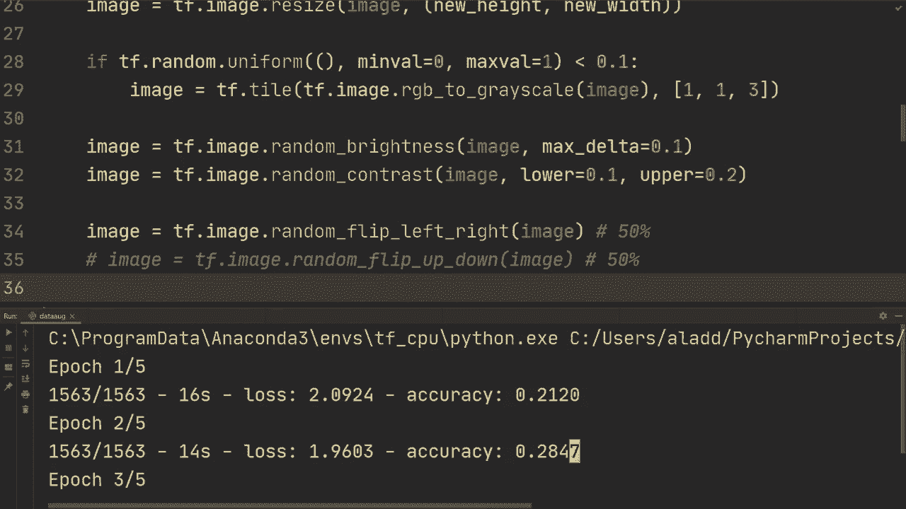

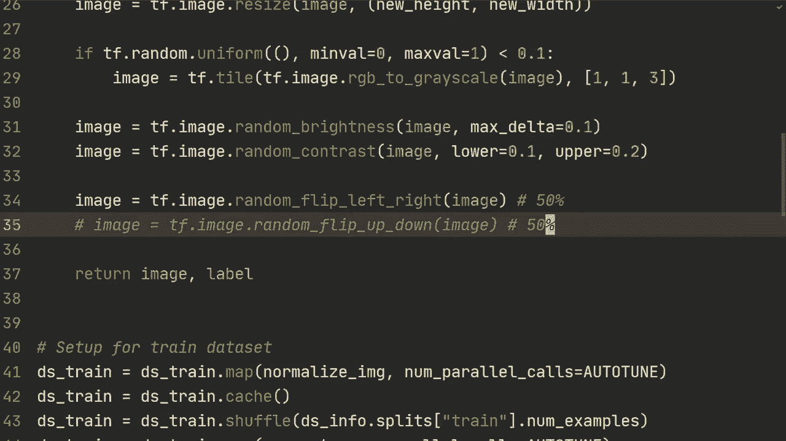

但这是进行数据增强的一种方法。我将向你展示另一种方法。我认为这是推荐的方式。这种方式效率很高，并且在模型训练时完成。但另一种常见的方法是你可以这样做。

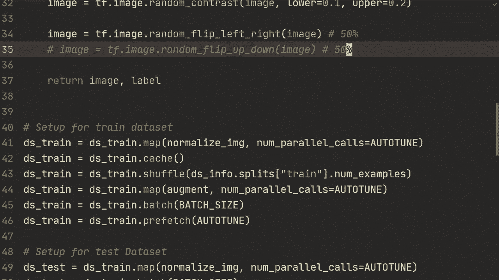

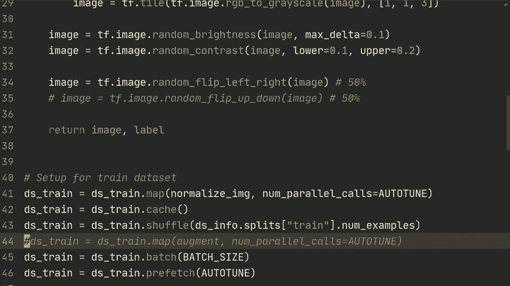

这是针对TensorFlow版本大于或等于2.3.0的，当前最新版本。所以我们可以进行数据增强，并可以构建一个顺序模型。因此在这里。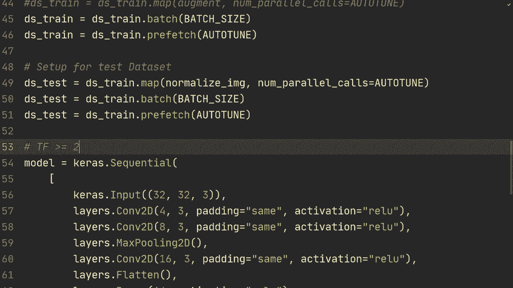

我们将把数据增强作为模型的一部分，我认为这有利有弊。我觉得这更简单，因为它只是模型的一部分，但我不太确定这是否是在模型训练时进行的，例如。

在这里进行的数据增强，是在模型仍然训练当前批次时并行进行的，同时在CPU上进行。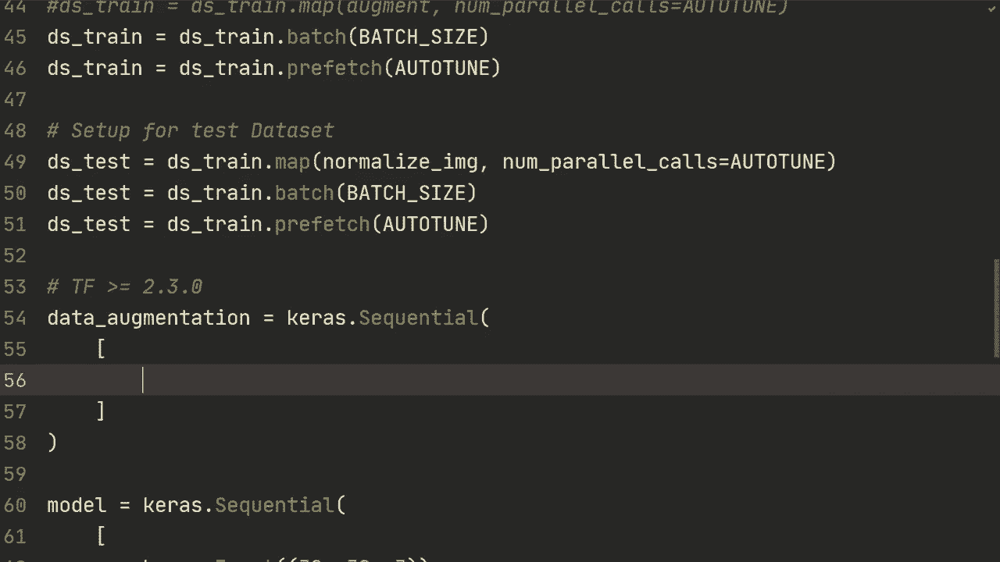

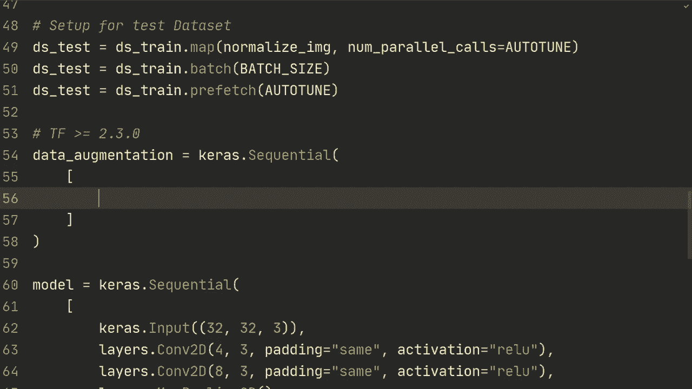

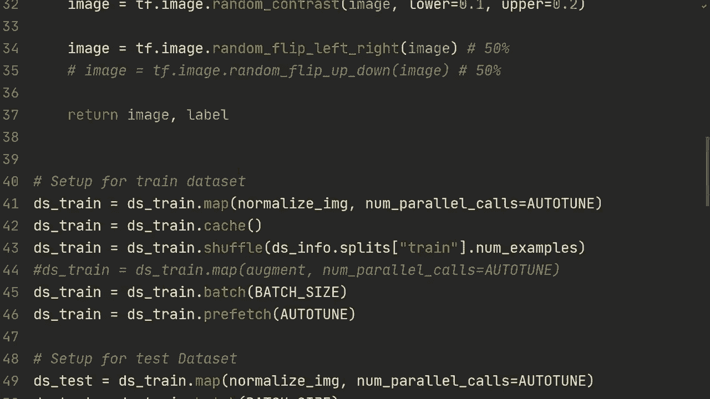

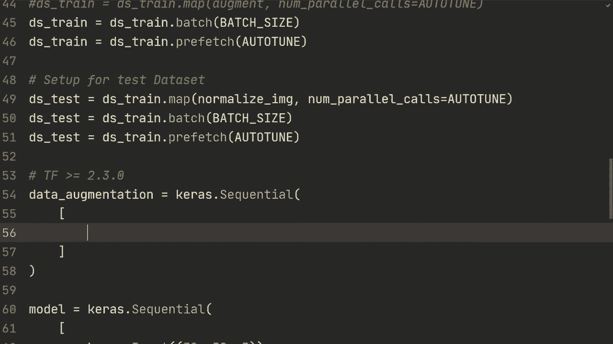

我认为这样做会损失一些性能，但我觉得这更简单。无论如何，我们将进行实验层的预处理。所以，正如你所看到的，这仍然是新的。这就是为什么它仅在最新模型中可用。

所以我们将进行预处理，调整大小。我们将指定高度和宽度。再一次，我将链接到这个实验性预处理的文档，这里有很多不同的函数。但你可以使用层.实验.预处理，进行随机翻转。你可以指定模式，可以设置为水平、垂直，或者仅垂直或仅水平。

为了保持之前的数据增强，我将进行水平翻转。然后我们还可以做一些像层.实验.预处理.随机对比度的操作，然后指定因子，比如0.1。没错，就是这样。当然，你可以添加更多，可以添加很多。

但我认为现在这样就很好。接下来我们要做的是把它加在这里的顶部。我们将在这里进行数据增强。因此，它将通过数据增强处理，然后发送到各层。所以让我们运行这个，确保一切正常。嗯，这真是个失误。我不小心停止了录制，我想我讲了大约10分钟，所以我会尽量回忆我说过的内容。你可以看到，我们在只经过一个epoch后达到了41%，而且我们并不在意准确率。

但如果你将其与我们之前的结果进行比较，我认为我们在1到2个epoch后只有26%或28%，而且我想我们使用的是同一个模型，对吧，唯一不同的就是数据增强，所以之前我们使用了一些更多的数据增强，比如随机亮度和随机灰度等。

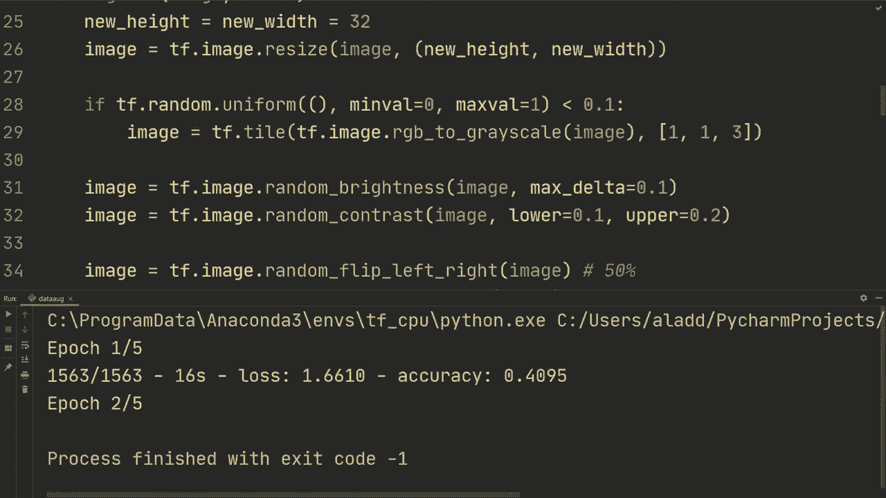

当我们添加更多的数据增强时，我们使模型更难过拟合训练数据，因为它看到了如此多样的图像。在之前的视频中，我们谈到了关于L2和dropout的正则化。

一种非常有效的方法是数据增强。因此，过拟合本质上是对训练数据过度适应，对过拟合的一种解释就是它基本上只是记忆训练数据，而记忆并不会导致一种通用的理解，所以你可以从自己的角度思考一下。

拥有更多的记忆内容使其更难，对吧？如果你要记忆的东西非常少，记忆起来就非常容易，网络也是同样的道理，因此如果我们添加更多内容、更多图像，就会使其更难以记忆，这样可以减少过拟合。此外，L2和dropout非常推荐你尝试数据增强，不仅是为了扩展数据集，以提高模型性能。

这样做也会因为有更多的图像进行训练而改善模型性能，但这也会减少过拟合。所以，是的，我想就这些。如果你有任何问题，请在评论区留言。非常感谢你观看这个视频，希望下次再见。

