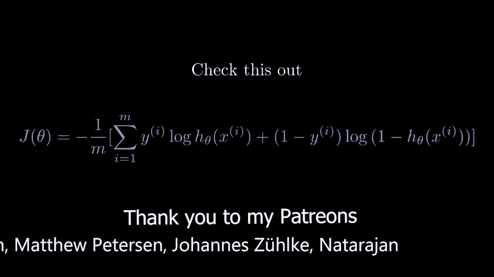
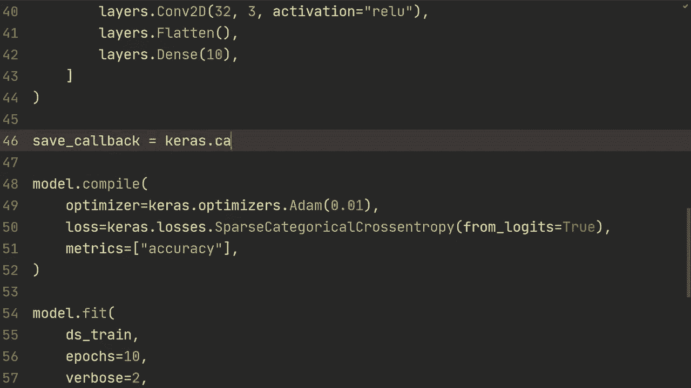
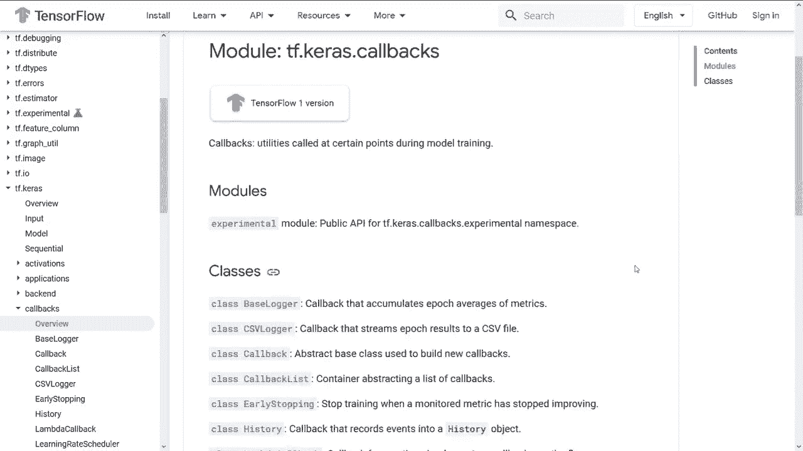
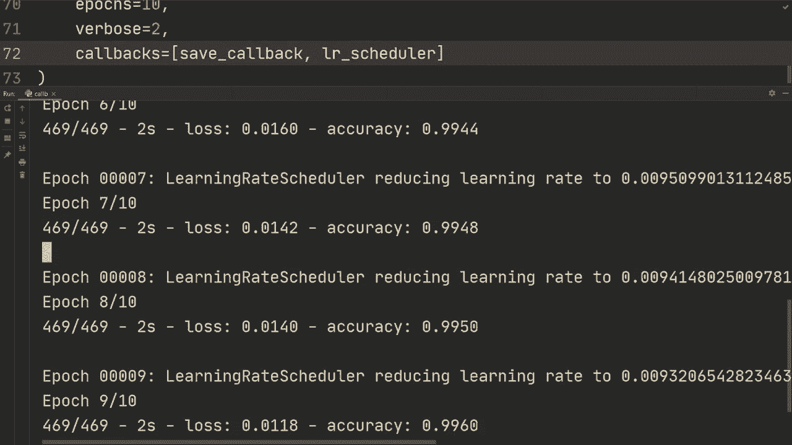
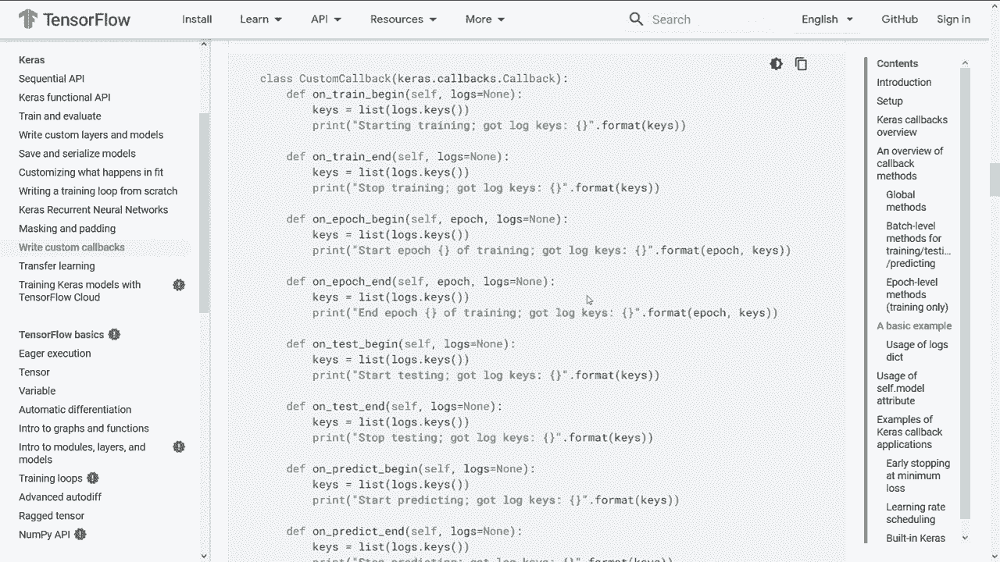
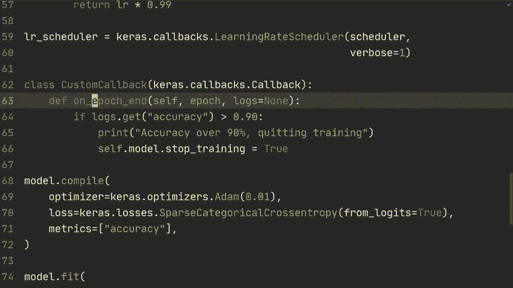

# 【双语字幕+资料下载】“当前最好的 TensorFlow 教程！”，看完就能自己动手做项目啦！＜实战教程系列＞ - P14：L14- 使用 Keras 进行回调并编写自定义回调 - ShowMeAI - BV1em4y1U7ib

大家好，欢迎回到 TensorFlow 数据教程。在这段视频中，我们将看看如何使用回调以及如何创建自定义回调。对于那些不熟悉回调的人，我最好解释一下这是什么，基本上，回调是自定义模型在训练或评估期间行为的一种方式，我认为在看到一些示例后，你会更清楚它的能力。但在深入之前，我们先快速浏览一下代码，这里的大部分内容或者说全部内容在之前的视频中都很熟悉，我们只是进行了导入，正在用 TensorFlow 数据加载 MS 数据集。

这只是为了避免 GPU 错误，所以我们正在加载 MS 数据集。我们通过在数据集上使用映射来规范化图像，缓存、打乱批次、预取。所有这些都来自 TensorFlow 数据教程，然后我们创建一个非常非常小的模型。只有一个卷积层和一个最终的全连接层。

我想我们应该在这里就有这样密集的层。然后没问题。然后你不应该看到这一部分，所以我现在就把它去掉。好吧。所以我们有模型编译，然后我们有模型拟合。这就是启动代码的样子。没问题。

我们想要做的第一件事是进行保存回调。我已经向你展示了如何保存和加载模型，但这通常是在训练完成后进行的。所以如果你训练 10 个回合，我已经向你展示了如何在模型拟合后保存它。

但假设你希望在训练过程中保存它。也许每个回合，或者你只想保存到目前为止的最佳模型，我会向你展示一个方法。这是回调的完美示例。所以，基本上。让我们在创建模型后、编译之前来做这个。

所以我们将使用保存回调，这是卡拉斯回调模型检查点，这是我们将要使用的。卡拉斯有很多不同的回调，我建议你查看所有相关的文档。这个也有很多参数可以传入，我只会用其中的一部分。首先，我们将指定一个文件路径，所以我们就叫它检查点。

然后我们将做仅保存权重，我们将设置为真。然后我们将监控准确率。然后我们还可以有一个参数，我们只保存最佳的，例如我们可以设置保存最佳仅为真或假，让我们设置为假，这样它实际上在每个epoch时都会保存，我也将向你展示自定义的，所以我们如何创建我们的自定义回调，并且你可以指定你想要保存的时间。

那么，当我们有这个保存回调时，我们将去我们的模型，拟合它，我们将做回调，然后我们将进行回调参数等于，然后是列表，我们将发送那个回调，在这种情况下是保存回调。

所以让我们从这里开始，运行一下，确保它能正常工作。

好吧，在那个文件中有一个包含模型权重的文件夹，所以它似乎可以工作，然后我将向你展示我们如何添加另一个回调，假设我们想要一个学习率调度器，所以我们可以将初始学习率设为0。

01，然后我们希望随着`epoC`的进展来改变学习率。那么我们可以这样做：假设我们做。

首先，我们将定义我们的调度器函数，所以我们将定义调度器，我们将传入`epoC`和学习率，然后我们可以做这样的事情：如果`epoC`小于2，那么我们将返回学习率，否则我们可以返回学习率乘以0。

99，所以本质上我们在每个`epoC`中降低1%，这取决于你决定这是一个好的调度器，我只是给你展示一个例子，你可以根据自己的需要实现它。然后我们将做学习调度器的回调来进行学习率调度。

我们将发送该函数，然后我们还会发送`verboos equals1`以便在学习率变化时获得打印语句。所以让我们重新运行一下，确保它可以正常工作。哦，是的，这是我一个很大的错误，我们还得发送它。所以在这里的回调中，我们只需添加一个逗号，然后添加那个。

学习率调度器，希望现在它可以正常工作。好吧，如你所见，它正在随着每个`epoC`降低学习率，这个幅度有点难以判断，但大约是1%。当然，你可以做更高级的调度器。好吧，TensorFlow关于编写自定义回调的官方教程非常不错，我会在下面的描述中链接它。这是我阅读过很多次以获取现在提供给你的信息的教程。

本质上，当你创建自己的自定义回调时，你可以自定义模型的行为，有很多不同的函数。例如，在训练开始时，你可以做一些事情，这取决于你选择做什么。但有很多不同的函数可以自定义行为，比如on train、on epoch begin、on epoch和on test begin等。

在测试结束时，在预测开始时，等等。所以让我们尝试构建自己的自定义回调。它会是一个相当简单的，但希望能说明它能做什么。我们将使用这些函数之一。我们将使用这个定义在epoch结束时。

尽管你可以使用不同的，并对此进行实验。我也将在描述中链接这个教程。好的。那么让我们回到代码。我要做的是创建。

类，然后我们称之为自定义回调。接着我们将从Kas回调继承。如我所说，我们将使用定义。在Epoch结束时，我们将传入epoch，然后设置logs。默认为none，但我们将接收日志，我会给你展示，以便我们可以打印。首先。

我们可以打印logs.dot keys。所以让我们打印一下，它将在每个epoch结束时打印。我做了和之前一样的错误，我们显然需要初始化并传入它。所以我们可以在这结束时做自定义回调，然后调用或初始化它，希望我们能看到想要的行为。好的，如你所见，这里有一个字典，你有损失、准确度和学习率。

我还想提到的是，当你有验证集和训练集时，这个损失和准确度将变成训练准确度、训练损失、验证准确度、验证损失等等。例如，我们来看一下。所以例如，在这里。当我们监控准确度时，如果你使用训练和验证集。

你需要指定监控哪个，因此在这种情况下，你可能监控验证准确度或类似的东西。只需提到它，以便如果你有训练和验证集，你需要确切指定你想在这里使用的内容。你可以使用print logs.dot keys获取这些，我们看到有损失、准确度和学习率。但我们将做的是，如果logs.dot get。

那么让我们先获得准确率，然后假设如果准确率是，我不知道，高于0.90%。 好吧，这样就很糟糕，但你明白我的意思。所以如果在这种情况下训练准确率超过90%，但当然，如我所说，如果你还有验证集，你可以做验证准确率。这样就可以了。

如果是这样的话，我们将打印出准确率超过90%并停止训练。然后我们可以让self.model.stop_training等于true。这只是自定义回调可以做的一个例子。再次提醒，教程中还有更多的例子和更详细的内容。

在官方教程中，你可以在自定义回调中使用所有这些不同的函数。但无论如何，让我们看看这是否有效。让我们运行这个。好吧，所以在只经过一个周期后得到了超过90%的准确率，因此在这里停止训练，当然。所以例如，除了在周期结束时检查，也许你想在批次之后检查。

所以当那一批次达到我们想要的准确率时，我们想要停止训练，你可以在批次上进行，但无论如何，这就是回调和如何编写一些非常简单的自定义回调的内容，非常感谢你观看这个视频，如果你有任何问题。

将它们留在下面，我希望在下一个视频中见到你。
