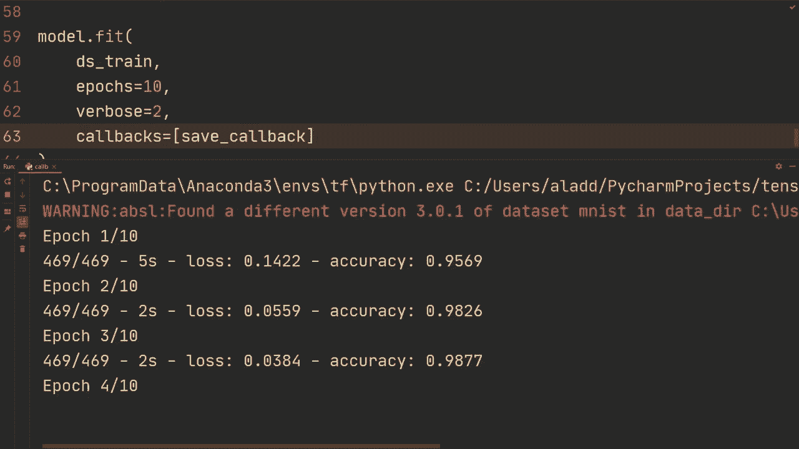
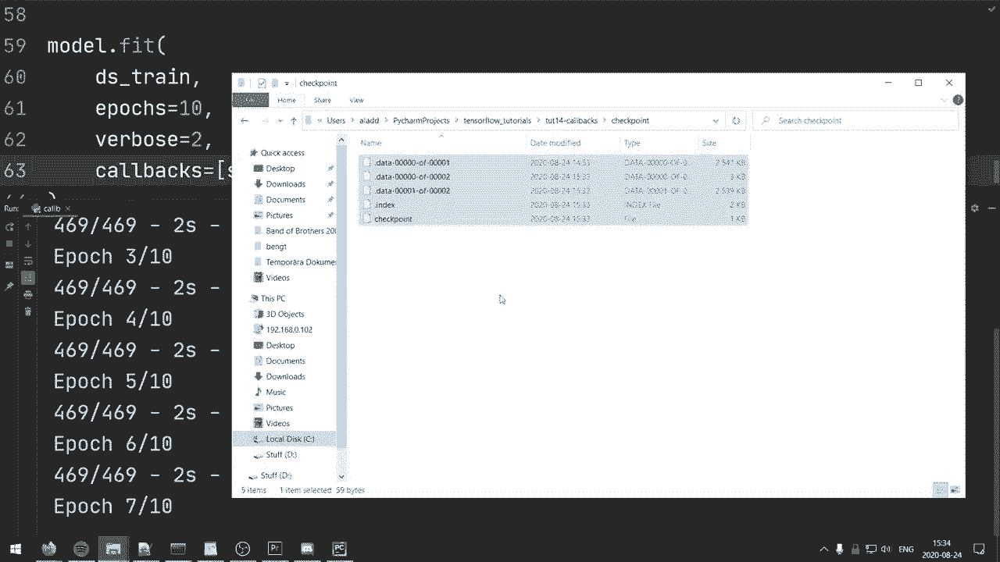

# 【双语字幕+资料下载】“当前最好的 TensorFlow 教程！”，看完就能自己动手做项目啦！＜实战教程系列＞ - P14：L14- 使用 Keras 进行回调并编写自定义回调 - ShowMeAI - BV1em4y1U7ib

What is going on guys welcome back from the Tensorflowlow tutorial So in this video we're gonna to take a look at how to use callbacks and also how to create custom callbacks and so for those of you who aren'tfa with callbacks I better explain what that is so basically callbacks are a way to customize the behavior of your model during either training or evaluation and I think it's going become more clear when you actually see some examples of what it's capable of but before we dig into that let's just quickly go through the code so most of this or all of this is familiar from previous videos we just have imports we're loading the Ms data set with Tensorflow datas。

And then this is just to avoid GPU errors and then so we're loading the Ms data set。

 we're normalizing the images by using map on the dataset， cache shuffle batch， prefetch。

 all from the Tensorflowlow data tutorial， then we're creating a very， very small model。

 just one comp layer and then one final dense layer。

 I guess we should just have layers that dense right here。And then all right。

 and then you shouldn't see this part， so I'll just remove this for now。Alright。

 so then we have model compile and then we have model that fit。

 So this is what the starter code looks like。 Allright。

 the first thing we want to do is let's do a save callback。

 So I've showed you how to save and load models， but it's done it's been done after a training so sort of if you're running for 10 epos then I've shown you how to save it after it's done training after this model that fit。

 but let's say you want to actually you know save it during training。

 perhaps every epo perhaps you only want to save sort of the the best model so far and I'll show you a way to do that。

 And this is a perfect example of what what a callback is。So， basically。

Let's do it after we create our let's do it here before the model compile。

 So we'll do save callback is Karas callback model checkpoint is the one we're going to use。

 And so Kas has a bunch of different callbacks and I recommend you to check out the documentation for for all of the ones。

 and then this one also has a bunch of arguments that we can send in I'm just going use some of the some of them。

 So first of all， we're gonna specify a file pad So we're just going call it checkpoint。

Then we're going to do save weight only， we're going to set that true。

And then we're going to do monitor， let's do sort of monitor the accuracy。And then let's also do。

So then we can also have an argument that we're only going save the best one so for example we could do save best only equals true or false let's set false so that it actually save it every epoch and I'm also going to show you custom so how do we create our custom callback and you could sort of specify whenever you want to save it al right。

 so what we do then when we have this save callback we're going go to our model that fit we're going to do callbacks and then we're going to so callback argument equals and then the list and we're going to do send in that callback so in this case save callback。

And so let's start with that and let's run it and make sure that it works。

Alright so in that file there's a folder with the weights of the model so it seems to work and then I'm going to show you sort of how we can add another callback and let's say we want to have a learning rate scheduler so we can have the initial learning rate of 0。

01 and then we want to change the learning rate as the epoC progresses So how we can do that is let's say we we do。

First of all we're going to do define our scheduler functions so we're going to define scheduler we're going to send in the epoC and learning rate and then we can do something like if the epoC is less than2。

 then we're just going to return the learning rate and otherwise we could do return learning rate times 0。

99 so essentially we're decreasing it by 1% every epoC and I mean this is for you to decide if that's a good scheduler I'm just showing you one example and and you can implement this the way that you want to。

And then we're going to do learning scheduler is cars。 callbacks do learning rate。Schedler。

 we're going to send in that function， and then we're also going to send in verboos equals1 just for getting print statements when it's changing the learning rate。

And so let's let's rerun it and make sure that it works。Oh yeah。

 so this was a big mistake on my part， we also gotta send it in。 so here for the callbacks。

 we're just going make a comma and then we're just going add that one so。

Learning rate scheduler and hopefully now it works。 Allright， so as you can see here。

 it's decreasing the learning rate every epoC and it's doing it by it's kind of hard to tell。

 but approximately 1% and and yeah so then you can of course do more advanced ones all right so this tutorial official tutorial by Tensorflow on writing custom callbacks is pretty good and I'm going to link it in description below as well。

 And this is the one I've read through a lot to get the information that I'm providing to you now。

 and so essentially when you're creating your own custom callbacks you have all of these different functions that you can customize the behavior of the model too。

 So for example， on training begin， you could do something you can I mean。

 it's sort of up to you to choose what to do。 but there are a bunch of different functions to where you can customize the behavior So ontrain and on epoC begin on epoC and on test begin and a bunch of different ones。

So on test end， on predict begin。And so on and so forth。

 So let's try to build our own custom callback。 It's gonna to be quite simple one。

 but hopefully it's going to illustrate what it can do。

 We're just going use use one of these functions。 We're going to use this one define on epoch end。

 although you can， you know， you can use different ones and experiment with this。

 And I'm also going link you this this tutorial in the description。 Al right。

 so let's go back to the code。 What I'm going to do is create。

Class， and then let's call it just custom callback。Then we're going to inherit from Kas。 callback。

callback。And then as I said， we're just going to use define on。Let's see on Epoch end。

 we're gonna send in epoch， and then we're gonna set logs。Equal none。As default。

 but we're going to get sent in logs sort of， I'm going to show you so we can do print。 First of all。

 we can do logs dot keys。So let's print that and it's going to print every every epoch at the end。

And I did the same mistake as previously， we obviously got to initialize this and send it in。

 so what we can do here is we can do see at the end of this we can do custom callback and then call it or initialize it rather and then hopefully we'll see the behavior that we want。

Al right， so as you can see here it has there's a dictionary and you have loss accuracy and learning rate。

 I also want to mention that when you're having a validation set and a training set。

 this loss in accuracy is going to become train accuracy， train loss， Val accuracy。

 v loss and so on so for example， let's see here。So for example， here。

 when we're monitoring the accuracy， if using sort of if you're using if you have both a training and a validation。

 you need to specify which one to monitor， so you might in this case monitor the valid accuracy or something like that。

 just mention it so that if you have a training and validation set you need to specify exactly the one that you want to use here。

So you can obtain those using this print logs dot keys and so as we saw we have loss accuracy and then learning rate。

 but so what we're going to do is we're going to do if logs dot get。

So let's get the accuracy and then let's say if the accuracy is， I don't know， above。O point。90%。

 all right that's that's awful but you get the point。

 So if it's above 90% in this case on the training accuracy， but of course， as I said。

 if you have validation set as well， you can do v accuracy。And then that's fine。So。

If that's the case， we're going to do print accuracy over 9090% quitting training。

 and then we can do self dot model lets stop。Training equals true。

And this is just one example of what you can do with custom callbacks。 And again。

 there are more sort of。And there are more lengthy ones in the tutorial。

 in the official tutorial where you can use all of these different functions on the custom callback。

 But anyways， let's see that this works and。Let's， let's run this。Alright。

 so it got accuracy over 90% over just one epoC so accuracy over 90% quitting training right there and of course。

 so for example， instead of doing on epoch and maybe you want to check after the batch。

 So exactly when that batch hits that accuracy we want to we want to quit so you could do on batch and but anyways that's it for callbacks and how to write some very simple custom callbacks Thank you so much for watching the video if you have any questions。

 leave them below and I hope to see you in the next video。

