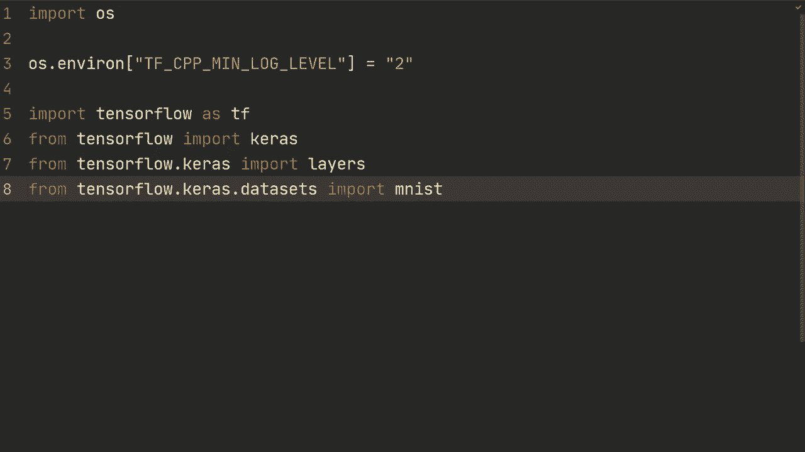
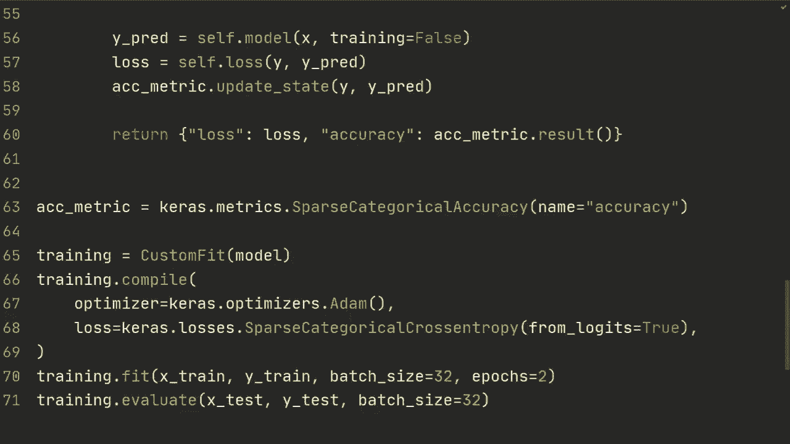

# 【双语字幕+资料下载】“当前最好的 TensorFlow 教程！”，看完就能自己动手做项目啦！＜实战教程系列＞ - P15：L15- 自定义模型与拟合 - ShowMeAI - BV1em4y1U7ib

Alrighty， what is going on guys。 Welcome back for another video In this video。 we're gonna to explore how to build more flexible training loops。 So far we've been using model that fit and if you can use model that fit that's great。 but sometimes you need more flexibility。 So in this video we will look at customizing model that fit。

 And then in the next video how we will look at how to build custom training loops from scratch。

All right， so first of all， here are just some basic imports， those are you've all seen those before。 and then we're just going to load the the Ms data set。So we're not going to do anything complicated。 I'm just going to show you the general structure and then that can be applied to many different problems。Alright， so we're going to xtrain y train， x test， y test， and we're just going to M load data。

 then we're going to do xtrain is xtrain dot reshape then we're just going to have。 I guess minus1 for all the examples and then 28281 and we're doing reshape here just to add this channel right here。And then as type converted to flow 32 and then normalize with dividing by 255。 So let let's copy this and let's go new line。And do X test。test， and then。Let's create our model。

 first of all， so as the model is equal to ks that sequential。Then we're going to do layer thatt input。And then the shape of the input is 28，281。Layers come to the 64，3 kernel size and I'm padding same so I'm just going through this quickly。 this is not really the most important part of the video。😔，So now that we have a model。

 we're going to create a class and we're going to call it custom fit。And we're going inherit from Kaosta model。 and then the first thing we're going to do is we're going to create an init function and all we're going to send in here is the model。 So we're going to first call super to inherit from Kaosta model。 So we're going to self and then in it。Then we're going to do set that model equal to model。

Then what we're going to do is we're going to define one training step and that's going to be used in a model dot fit right。 So our goal is basically。We want to do something like training is a custom custom， wait custom。 what the hell custom fit of that model。 we're gonna to send in that model。 Then we're going to do training dot fit and we're gonna to send in x train， Y train。

And then batch size and then number of vpos sort of as normal。 although this dot fit is going to be done in a custom way。 we're going to sort of define how we want that to be done。So I mean there are many use cases of this you where you need to do custom training loops and sort of you use model Efi when you can and when you can't you try to customize your model thatfi which is what we're doing in this video and then for that most flexibility you do the training loop from scratch but an example of when you actually need to do this is generative adversarial networks I'm not assuming you're familiar with that I'm just sort of saying there are many examples where。

This is useful。 Alright， so let's then do a train step。 we're going to send in data and then we're going that's going to be a twople of x and y。 so we're just going to do x and y is equal to data。Then what we're going to do is we're going to do with。TF gradient tape as tape。

And why we're doing this is because now we're going to do the for propagation and then the loss function。 and when we're doing it under that tape， it's going to record all of the operations that was done and then that will then be useful for calculating the gradients for back propagation。

So basically we're going to do y prediction is a self dot model。 We're going to send in x。 we're going to specify training is true， and then for this loss function。 we're going to do loss equals self dot compiled loss。 and then we're going to send in y and then y prediction。

 and this is going to be done in the compile So right here we're going to do training dot compile we're going to send in。And here we're going to send in optimizer is Kara's Oprs， Adamom。 then we're going to send in loss is Kara's losses， sparse， categorical cross entropy。 and from logic equals true。Then also we're going to do metrics is accuracy。

And so this is for the first one where we're doing the compile。 I'm also going to show you how to do a custom compile。But let's take that as we go。 so we're going to first now continue doing the train step when we have this compile。 and so this self dot compiled loss is using this sparse category across entropy from the training dot compile。

After that we basically want to get the gradients right， we've now done the for propagation。 this part is the for propagation， which we're doing with this gradient under this tape to record all of the operations。Then we're going to do training variables is a self dot trainable variables and these are all stored from this parent class。 this cars dot model， so we don't have to bother with that， then we want to get the gradient。

 we're going to do tape dot the gradient。And we're going to do loss and then training variables right。 so we're getting the gradient of the loss with respect to the training variables。 which is ultimately what we want to change。Then we're going to do a step， an optimizer step。 a gradient in descent step。 and we're going to do self dot optimizer dot apply。Gradients。

And then here we're going do zip gradients and then training variables。 And then we're going to do self that compiled metrics that update state y and then y prediction。 And this is this is going to be for the accuracy。 And then in the end， we're going to return。M dot name。And you'll see what it means so M dot name M dot result for M in self dot metrics allright。

 so we we're getting the MD dot name which is going to be the loss for example。 and then we're getting the result which is the current loss and then we're doing that for all of the metrics and that's going to be the loss and the accuracy in this case。And yeah， so I think that's it for just this first step。 and I think we should now be able to run this。And as you can see here， it does seem to work。

 and yeah so basically。So basically the next step now is that we want to do our own compile。 so what we're going to do right here is we're going to define compile。 we're going to send in the optimizer and we're going to send in the loss。And we're going to do super custom itself that compile。So yeah。

 and then we're going to do self that optimizer is equal to optimizer， Se that loss is equal to loss。And all we have to do then is we have basically the same thing right， training。tcomp。 except we're not going to send in a metric right here。 so we're just going to use the optimizer and the loss。And。

And that should also basically be it now we just have to change this right here to this compiled loss。 we're just going to do self that loss， it's which we've stored right here。So self dot loss and then let's see， yeah， and then we can still use self dot optimizer and let's just rerun it。And now， as you can see， we're not getting an accuracy。

 So we're going to have to keep track of a that metric by ourselvesse。 So what we can do is for example， we could。Created right here。 we could do。Accuracy metric is。Ca us that matrix that spae categorical accuracy。And let's just call it name。's see name equals。Accuracy。And then， in the。And then right here， inside of the compiled metric。

 what we're going to do is is accuracy metric that update state。 we're going to send in Y and then y prediction， and then we can remove this compiled metric。嗯。And yeah， so that should hopefully be it。 Let's see if we can run this。All right。 so now since we're keeping track of the accuracy by ourselves。

 what we're going to do here is we're going to write it explicitly。 so we're going to do loss is in this case， just loss。And then we're going to do accuracy。Is。Accury metric dot result。And hopefully now we should get the loss and the accuracy Yeah。 so this looks pretty familiar to what we did previously。

 except now we're doing the compile completely by ourselves。And then allright。 so now we got the compile， we got a train step what we normally do as well is in the end after training。 we're doing training that evaluate and then x test， Y test， and then we're specifying batch size。 let's say 32。One thing here is that this dot fit works on the train step and then evaluate works on a test step。

 so to make this work we actually need to define another function and we need to do test step although this one is going to be a little bit easier since well first of all we're going to unpack the data and then we're going to compute prediction so we're going to do by prediction is self。

t model X and then we're specifying the training is false。And what we're doing is this is if we're using batch norm or dropout。That has different behaviors during testing and training we're just telling the model this is now in testing。 so make sure that those modules that have different behaviors are set to test mode or evaluation mode。

Then we're going to compute the loss， which is sub loss of y prediction。And then we're going do accuracysymmetric do update state y y prediction。And in the end。 we're going to return a dictionary of loss， which is just going to be loss。 and then accuracy。We're doing acrosymmetric that result all right， so this is a very like it's very similar to the training step。

 although it's much more simplified and it's simplified because we're not doing a gradient descent update so we don't need to keep track of this tape of making sure that we have all the gradients and all of that stuff。And yeah， so let's run this for yeah two epochs and then let's do the evaluation。All right。

 so after this， we see that we get 93 up the  first0poC， 97 and then almost 98 on the test set。But yeah， so I mean what we want to establish here that this does seem to train and it's working so yeah that's how you create your own you know specifying the training step and a test step which overwrites how the training do fit and then training that evaluate is done so in this way you can build more complicated and complex models in the training steps but still have the flexibility of doing training dot fit and that means that you can still use the training do compile although in this last one we overwrote the。

The compile， but but you get the point in you can still use the their compile and the metrics and all of that stuff Yeah。 if you have any questions leave them in the comment section below thank you so much for watching the video and I hope to see you in the next one。

