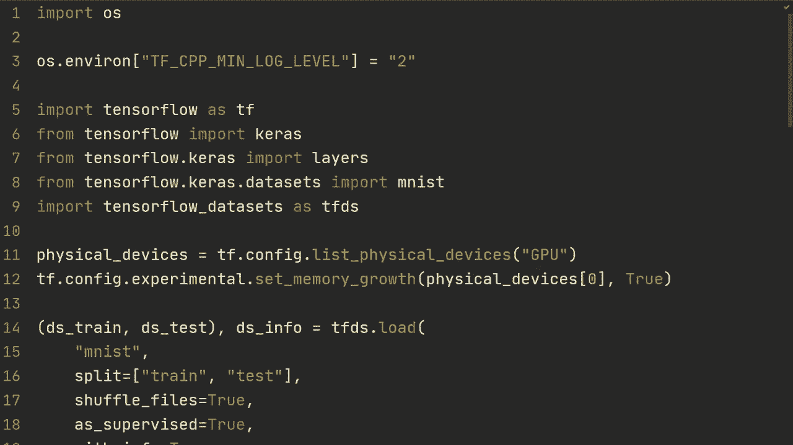
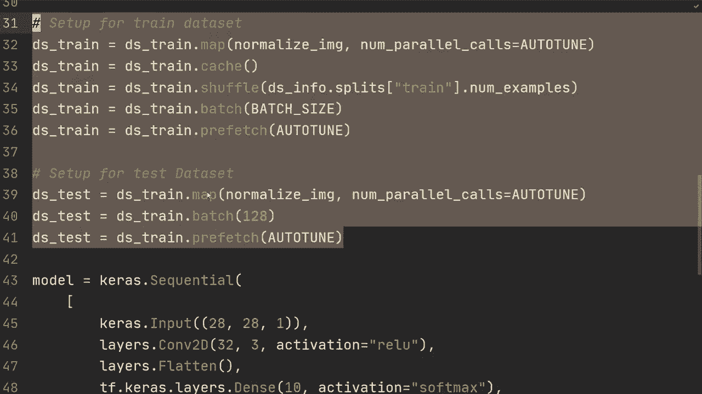
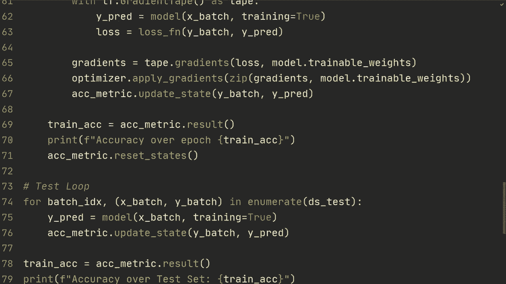

# 【双语字幕+资料下载】“当前最好的 TensorFlow 教程！”，看完就能自己动手做项目啦！＜实战教程系列＞ - P16：L16- 自定义训练循环 - ShowMeAI - BV1em4y1U7ib

What is going on guys hope you're doing freaking awesome in this video I'm going to show you how to do training loops from scratch。

So this means that we're no longer using model。fi， but rather we're doing everything by ourselves from scratch if you're familiar with coding and Pythtorch then this is going to be more how you're used to training networks but anyways let's get started and we aren't going to do anything complicated in this video in terms of what we're going to train on and the data and so on。

 the point is just to show you the general structure of how it looks like。

So the starter code right here is just some basic imports that you've seen in previous videos。

 we're going to use Tensorflowlow data sets， so if you haven't watched that video then it's going to be in the top right corner。

So we're loading the Ms data set right here so we have a training and the test set and then we're just so we have a function for normalizedized images and all of this is from that video just copy pasted and then we have some very very simple model right here。

 just some one convolutional layer and then one dense layer and let's do layers that dense here just like that and then so then let's get started and what we're going to do is that first of all we're gonna have some metric so let's do accuracy metric is a ks do metrics dot our。

Categorical accuracy。And then let's do first， let's do the training loop。

So the first thing we're going to do is we're going to train it for a number of epochs。

 so we're going to train it for epochs is5 in this case。

 So what we just do is we we write for epoch in range epochs。Or maybe we should call it。😔，Num epoch。

So nu epoch right there。😔，And then we could do print。Just。To print。

Slash n and then start of training epoch。And then， we could do。I we can do it like this epoch。

Now it's do F string。And so then we're going to iterate through all of the batches in our training。

 And so we're going to do for batch index and then。X batch comm a Y batch in enumerate。AD train。

Alright， so we're going to go through the strain for a number of epochs。

 So right here we're going to first of all， write the width Tf gradient tape。As tape。

 And this is for recording all of the operations that we're going to do in the forward propagation so that we can then do back propagation for the the model weights。

 So we're going to do Y prediction is model。X batch， and then specify training is true。

 Then we're going to do loss is loss function right that we specified over here。

And we're going to send in the y batch， the true labels， and then the y predictions。

 the one we just calculated for from forward propagation。All right。

 so then we have those under that tape， then we can do gradients our equal tape dot gradient。

And then we specify the loss and then model our trainable weights。

So we basically want the gradients of the loss with respect to trainable parameters。

Then or the trainable weights rather。 And then we're going to do optimizer。That apply gradients。

 We can do zip gradients， model the trainable weight。

And then we're going to do accuracy metric dot update state。Why batch and then why prediction。

Just so that we have a sense of what the accuracy was of that epoch。So at the end here。

 we're going to do training accuracy is equal to accuracy metric to result。

 and then we could print that so we could do accuracy over。Epoch， and then。We can just do。

Train accuracy like that。And then we could reset the accuracy metric so that it's going to be zeroed for the next epoch。

 So accuracysymmetric dot reset states。And that's it for the training loop。

 so that's that's how it would look like it's very similar to the last video where we went through how to customize model。

 fit， except now we're just removing the model that fit and we're just adding a loop here for the number of epochs that we want to train。

And then all we want to do is I guess。So test loop。

 so this is for the training and then we're going to want to have a test loop to evaluate our model。

And then we don't need to run it for a couple of epochs。 we could just run through the data set once。

 so we're going to do batch index and then X batch。

 Y batchge enumerate DSs test and I guess right now we're not using the batch index。

 but I mean you could So I guess you could just iterate through the DSs test as well there's no point of doing the enumerate。

 but sometimes you want the batch index。Anyways。We don't need to do gradient tape。

 We're not going to collect the gradients。 So we're just going to do y prediction in this model of X batch training equals true and then accuracysymmetric dot update。

State Y badge， and then Y prediction。Then in the end we could do train accuracy is accuracysymmetric dot result。

 right same as we did right here。And then we could， I guess we could print accuracy over test。Set。

Then we could just write training as here。And then in the end， we could again， reset it。

We don't have to do this though， since that's the last thing we're going to do。But anyways。

 that's how it looks like if you want a training loop and a test loop， of course you can also。

 I mean， you could put this right here in a function like define train or something。

 and then you could you know for epoking range of you could just call that function。

Train 1 epoch， maybe。And then run run it。So you know you could think of the structure of you could think of how you want to structure this。

 but this is the fundamentals of how you do a training loop。

 it's very simple we've done it in the most simple way that we can and of course if you're doing something more complicated like generative adversary networks or GANS。

 then it's going to look more complicated than this。

 but it's still going to be a fundamentally the same method and I think if you sort of understand this basic layout then and then when do more complicated things it's going to help you and understand it general structure。

All right， so first of all， we should run this and make sure that it works。And it doesn't。

 So it has no attribute gradients。 that's because we want to have a tap dot gradient。All right。

 and as we can see it makes sense it's training and this works。So yeah。Anyways。

 that's it for this video， hopefully you found this useful if you have any questions then leave them in the comment section below。

 I think I said thank you for watching but thank you for watching and I hope to see you in the next video。

