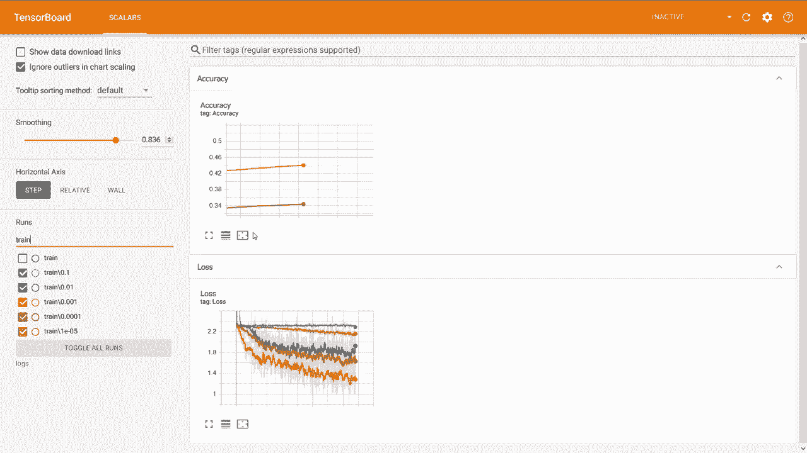
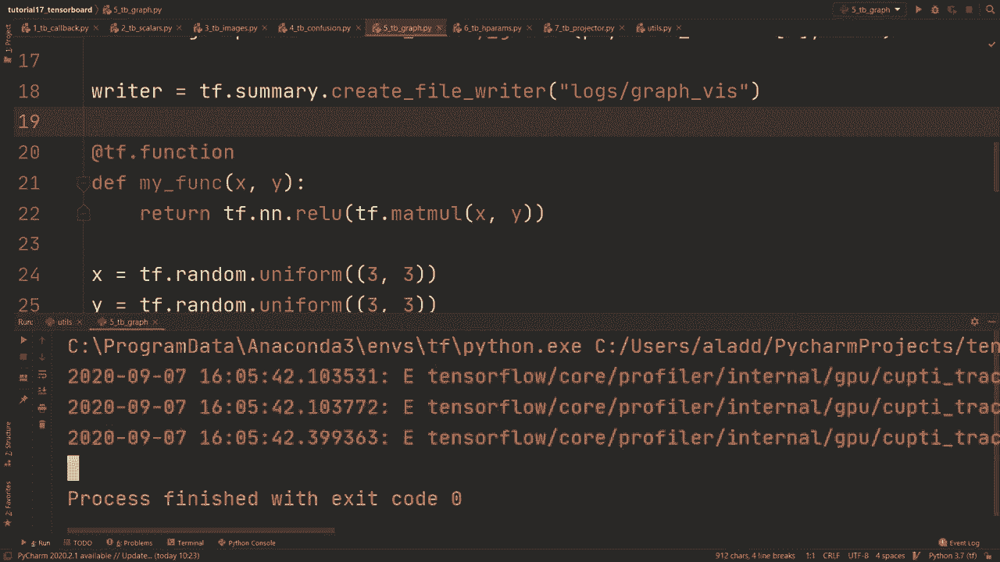

# 【双语字幕+资料下载】“当前最好的 TensorFlow 教程！”，看完就能自己动手做项目啦！＜实战教程系列＞ - P17：L17- 完整的 TensorBoard 指南 - ShowMeAI - BV1em4y1U7ib

The goal of this video is for you to get a thorough understanding of how to use Tensorboard to easier understand the bug and modify our models。This is a long video because there is so much to cover when it comes to Tensor board。 So let me first of all show you an overview of the things we're going to learn how to do in this tutorial。 We're going to start off learning about what is perhaps the most basic but also probably the most useful thing which is obtaining these accuracy and these loss plots。

 and in this example right here， you see the accuracy plot when training our model with varying learning rates。 and then we're going to move on and learn about how to visualize images So in this example here we're performed some minor data augmentation in turning a very few percentage of the images to grayscale and so visualizing these changes can be very useful to make sure that what we intend to happen is actually what is going on。

 So for example， here we have a horse that has been converted to a grayscale image Also we're going to see how to both create and。these confusion matrices to tensor board where we have the predicted label on the y axis and then we have the true label on the X axis in this way we can see what and where the model is misclassifying images。

 So for example， here we have that it correctly predicts airplane 65% of the time but in 7% of the time it's misclassifying a bird as an airplane Also we can see that it predicts cat correctly 40% of the time where the largest mistake happens when it misclassifies it as a dog in about 21% of the cases other useful things is that you can visualize the graph of our model so here we have a very。

 very simple model which takes in two inputs X and Y performs a matrix multiply and then send that through a re and that will be the output of the model。And so this can be useful if you're building more complicated or complex models like Resnets where you want to make sure that all of the skip connections are at the correct places。

 or if you just want to get a better understanding and see more visually how the model looks like other cool things that you can do with Tensor board is then you can visualize and see the distribution of the various parameters of your model so this can be useful to debug if you get error messages and you want to see exactly where in the model the error is occurring then these distribution plots can be useful to know which layer the default lies in but we also have a lot more things to look at so were for example going to do hyperparameter search using the Hpars API of Tensor board with this you can see what parameters to use for your model。

By seeing the different correlations between in this case the dropout。 the learning rate and then the number of units and then how that finally corresponds to the accuracy after a single epoC run so to easier understand this right here we can restrict our attention to only looking at what corresponds to the best acuracies and what we can see here is that the model preferably wants quite low dropout and then it wants a very high learning rate and also high number of units so in this case we're checking the accuracy on the training set so that's probably white wants very low levels of dropout and we are also going to learn how to use the projector tab of Tensor board which is pretty awesome visually and you can use different algorithms like the TSneE and then the PCA to get an understanding of how your model is learning to represent these images。

Projected down from a very high dimensional space to 3D where we can easily visualize them。 For example， here we are running it on the MNIS data set and we can， for example。 use the TS& algorithm and if we for example now search for I don't know zero then we can see that there are clusters of that zero right here and similarly if we would search for two。 we would see that there's a cluster over here of the number two and so this can be useful to understand how the model works and also how the model create its representation the Tensorflow profiler is also a very useful tool that allows you to see what is taking up the most amount of time and sort of what aspects you should aim to improve in your training so for example here we're given a summary of the different parts and how much time it takes out of our training So for example in this graph right here we can see that the input is taking。

Very big part of the time and so what they also do is give you some recommendations and they say that the program is highly input bound because about 84% of the total step time is waiting for input and so what we should try to focus on in this particular program is improving the efficiency of our input pipeline and there are also other parts of the profiler where you can see many different other parts as well。

 but more on that later now you have an idea of the different parts and areas of Tensor board that we're going to cover so let's get started。

Alright， so to make this video at least relatively well structured。 I've divided it into different files where if each file we're going to focus on one specific part of Tensor board。And for each of them I have a starter code and my thinking is that I'm going to go through this starter code which is based on code for many of the previous tutorials I've done。 so I'm going to go through it relatively quickly and then you can check out the previous videos and I'm going to refer to those to go into more depth in each of the different parts。

 but so we're going to base everything from this starter code and then we're just going to modify it or add some parts to write to Tensor board。So to start off with these are the basic imports that we're going to need and then this is what we've seen previously。

 we're going to add those two lines just to avoid any GPp errors。We're loading the Cypher 10 data set from Tensorflowlow datas。 we're normalizing those images by dividing by 255。 and then we have some data augmentation on those images we also then we do the mapping and the cache and then the batching and prefeting on those training and test set。

Although we're not shuffling on the test set。And then we have the class names right here。 and these are used later on in the projector tab to see the correct label for each respective image。Then we have the a model right here， very simple model using comb layers， two comb layers。 a max pullinging， a flatten and then two dense layers which they drop out in between。

And then right here we have some setup for custom training loops so we're getting the model first of all。 then we have the loss function， we have the optimizer at at in this case and then we have a accuracyysymmetric to keep track of the current accuracy。

And then we have these two train riders， which is what we're going to use to write to attentionure board and these are going to be train and for the test so for each of them we're going to keep track of a step for the train step and the test step。All right， and then we have custom loop。We we're going through for epoch in range of nu Epos and then for batching that in DS train and then so this is pretty basic。

 we're doing for propagation， backward propagation。 and then we're doing gradient into or an optimizer step right here。Then we're doing the same thing for the training set， although we're not doing back propagation。 we're just checking what the accuracy is。Al right， so for this first file。

 I'm actually going to do something that may look a little bit weird。 but we're going to remove a lot of this code。

So we're going to go just to here， I think and。

The idea here is that that starter code is what we're going to base pretty much every of those files you can see right here。 but this specific one we want to use callbacks and this is a more simple way where we're not using custom training loops so I want to show that first and so after we get the model we're just going to do model dot compile we're going to specify our optimizer in this case we're just going to use Adam。

And then we're going to specify the loss。 In this case， we're going to use sparse categorical。Cross entropy， and then from log， it equals true。We're also going to specify the metric。 which in this case is going to be the accuracy。Alright， and then we're going to do。Tensor board callback。So this is perhaps the most simple way to use Tensor board and I'm going to show you exactly what it does。

 but it's very convenient so all you have to do is you need to do cars。 callllbacks do Tensor board you got to specify a log directory where it's going to keep track of all the logs and so let's just do that let's call it TBb callback directory。And then we specify some histogram frequency and this is just， we're going to set that to one。 and that is for the distribution plots of the gradients and all of that stuff that I showed you previously。

Alright， so late lastly we're going to do the model that fit， so we're going to send in the DS train。 we're going to send the number of epochs， let's say I don't know a5。 then we're going to do validation data we're going to send in the test set actually I mean normally you would let's just for purposes let's just pretend the test set is the validation data I know this is very incorrect to do but so normally you would split the training data into a validation data and then send that in but that doesn't really matter for this purpose。

And then we're going to specify the callback， we're going to do Tensor board callback。And then we're going to specify verbos equals 2。Alright， so that's it。 let's run this and I'm going to show you then how it looks like in Tensor board。 But actually。 before we do that， I have to show you how you would actually run it。

So how you would run this is you would go to the folder where you have。Thats specific where you're running this specific script。 and then you're going to also have activated the environment that you have Tensorflow on。And then you would do rather tensor board， you would do log De。

 and then you would specify the one that you called right here， so TB callback directory。And if you run that。We're going to get back a URL， which is local hosts 6006 in this case。 and so if we go to that。

And we update it we'll get something that looks like this where we have the training and then the validation accuracy for each epoC and then we also have it for the loss function so as you can see which is perhaps a little bit strange have that the validation accuracy is actually higher but just keep in mind that we're using dropout and then we're also using quite I mean and we're also using some data augmentation which might make it more difficult for the model to overfit on the training data so just for example we're converting some of them to grayscale and of course that that could be quite more challenging so that's probably why normally you would see this in reverse that the training is higher than the validation。

Allright but as we can see right up on this tab right here we have four different ones。 so that's just for the scrs， that's just for the loss and the accuracy。 you also have the graph that sort of tells us how it looks like right we have our input。 two comb layers max pull flat and dense drop out and then another denses。

So you can inspect it right here， then we have the distributions that I showed you previously where you can see the gradients of all of the parameters。Or rather the distribution of the parameters。Alright。 so that's the most basic way to set up Tensor board using callbacks and what I'm going to move on to is show you how to do it from custom training loops and so that's what we'll be working with from now on。 but just know that most of the things that I'm going to show you you can also do using callbacks and using model that fit but using custom training loops allows us to have more flexibility makes a lot of things actually more simple to do。

So let's do full screen on this。And again， this is just the starter code that you saw previously and all that we're going to do is we're going to move down to the part where we have the custom training loops。And here we want to now add so that we're printing to Tensor board。 And so one idea could be that。

Either you're writing it to Tensor board for every batch and so you could do it here。 or you could do it right here after this， that would work。 but perhaps it would be cleaner a cleaner graph if you do it every epoC so what we could do is right here we're going to do with the train rider as default。Then we want to send in the loss and we also want to send in the the accuracy and just one thing right here is that we're going to send in the loss。

Just like this and this is actually just going to be the last loss of that batch so just a note you would probably want to send in the mean loss over that batch and so you would have a list of the losses and then you would take the mean of that and send that in but this works just to show how you can write a tensor board so we're going to send in the loss right there and then we're going to send in step and we can use the epoC as our step。

Then we're going to do the same thing， dot scalar。We're going to do it with let' see with accuracy。 so let me scroll down， we're going to do it with sending the accuracy and the accuracy are going to be stored in this accuracy metric dot result。And keep in mind here that that's reset in between the epochs。 and it's also reset in between the training and the testing。

 So this should be itated through the test set。All right。 and then we're going to add chsmetryduct result。We're going to specify the step again as epoch。 and then that's it。Now we've done it from the training we also want to do it for the test so what we could do here since we're going to do pretty much the same thing。 we could just copy that and paste that in and we've got to make sure that we're changing all of this stuff test writer step is still epoch step is still epoC and yeah so that should be it hopefully there are no mistakes in this right now。

So one thing to keep in mind here is that we're now using another。A log directory so here we're using logs and in logs we're storing two subfolders for the train and the test So let's run this first of all and again we're going to open up this tensor this Ananaconda prompt right again。

And we're going to use this， but we're going to specify the log gear to instead be just logs and then it's automatically going to find the training and the testing。 So if we run that and we then go to fire Firefox or your browser and go to Tboard to on that URL。

 local hosts 6006。

And I guess we just have to wait a little bit here because it's going write every epoch so allright。 so here we can now see the accuracy plot for example and also the last plot and that these are going to be very you know clear discrete steps because we're just recording it every epoch。

 but of course you could as I said， do it every batch and that would give you a much smoother graph。But what is perhaps so？What is perhaps a little bit odd here is that the test set has higher accuracy than the training and I would imagine that has to do with the augmentation I chose to do for example I made some of the RGB on the training to grayscale and that is of course going to make it a lot harder for the model to train on those so that's probably the reason why so that's what I pretty much wanted to show you on that you could also do more complicated or more complex things and you could for example use it for hyperparameter search you could do something like for learning rate in and then you could specify at learning rates you want something like this。

And。And let's just indent。

At one step。 And so what you could do then is。You could。sortrt of train a model for specific number of vpoOs with each respective learning rate and here I'm using a grid search just on those five different learning rate so let's do that we can do train step equals test step and we're just going to set that to zero every time。

And then we're going to do the train rid is T F dot summary dot create file writer。 And then we're going to do logs train。 But then we're also going to add。Let's see。 I're also going to add string of learning rate just to make sort of we can distinguish between the different runs。 So let's do that again and let's do the test writer。And here we're going to do test。

And then we need to get the model because we want to sort of refresh the we want to reset the weight for each time。 so we're going to do get model， then we're going to do optimizer is ks。 optimizeims。 Adam。So we're also， you know， we need to re initialitialize the optimizer with this specific learning rate。And then you could do it this way and you can write the test writer like this from some epochs。

 but do let's just do it for every batch， as I said。That might make for a smoother graph so what we're going to do here we're going to specify the train step rather than the epoch and then after here we're going to iterate up the train step by one and that's going to be sort of one discrete step in the plot and then we're going to do that for the test writer as well。

 so we got to change this to the test let's see。Test step。 and we've got to do it for all of these to make sure that we don't do anything wrong here。We're going to iterate up that by one as well。Al right。 so let's think is there anything else now we need to change。

 we could decrease the number of epochs just to make it faster。So let me run this and I'll show you what it looks like in Tensor board。

All right， so looking at the tensor board right here we and I've just separated out for the train so you could just write train right here and you can get all of the different ones and these correspond to different learning rates and you can also do some smoothing right here so you can get you know the loss just varies a lot from e for batch from batch to batch and so you could use some smoothing to make some better looking plots and then so for example。

 just in this case， if we compare we would have that the learning rates the initial learning rate should probably be between 0。001 and then 0。0001 between this。This orange and this red one right here。 And so that's it for sort of getting lost plot and accuracy plots and you can play around with that。 and you can that is very， very useful。 So let's move on to getting images So what we're going to start with right here is using just visualizing images and probably the first thing we're going to do here is we're going to add some data augmentation we're going to use matplot Lib and to plot it。

 they want values between0 and1 So we can matpl1。

Values， so what we can do is we can do image is T F clip。By value。Image and then clip value min is0 clip value max is 1 and so by the way。 if you're wondering why it would be under or over this0 and one range since we divide by 255 that should be the natural range but because of this data augmentation some pixel values can become lower or greater than1 so we just want to make sure at the end that they are actually between0 and 1 and that's going to be used later on but I'm going to show you y in just a moment。

So what we could do here is we could actually remove the training part so we could just do for batch like this and what we could do is we could iterate through for batch XY in enumerate DS train。And so what we're going to do first of all is we're going to create a figure and we're going to create an image grid。

 so we're going to send in x and Y to that and then class names so this right here is a function we're going to create in this u function right here。But we're going to create an image grid， and then we're going to do width ridr as default。 We're going to do Tfsmary。 image。And we're going to send in visualized images。And we're going to do plot to image， and we're going to send in the figure and then the step。

It's just equals to step。And so we could。In this case。 we're just going to just have a single writer and do it like this。And instead of using train step。 we're just going to call it step。Like this。 And then that's pretty much all we're going to do。 we're going iterate up step by one All right， so this is how it's going to look like in this file。

 but of course we need to create this image grid and we need to create this plot to image I just want to say first of all that there are easy ways to do this and what I'm doing here by we're going to create this image grid in this plot to image。I unnecessarily complicated， but it helps or rather。

 if you want it in a clean way so that you get it in a grid and you get it with the labels above it and so on。Then this is how you're going to want to do it there are easier ways to just plot the images。 but they don't look very nice and of course we want it to look nice。 so let's go to u and what we're going to first of all is I'm just going to copy in some imports that are going to be used in this file。

And the thing we're going to do first， so we had， let's see， we had the defined plot to image。And we're going to send in some figure。So let's to pass on that first of all。 and then we had another image rather another functions we had image grid， and we send in some data。 we send in some labels and we send in some class names。

And what I'm going to do is I'm going to copy in from TensorFlow official tutorials this plot to image。 so this is stolen from TensorFlow official guide， you can see the URL right here but essentially so it converts the mapplot lib plot specified by figure to a PNG image and returns it this applied figure is closed and inaccessible after this call so basically it's converting the mapplot lib plot into a PNG in memory and then it gets decoded to a tensor which can then be sent to the a tensor board so here we're using IO to save the plot in memory。

Then we're closing the figure preventing from being displayed directly inside the notebook。And then we're converting PNG buffer to TF image by image。 decocode PNG。And then lastly。 we're adding the batch dimension。So I mean I don't want to focus too much on this。 this is not really relevant I would say this is just some boiler play code just to make sure that it's in the right format。

 which is a tensor and then this image grid is what we're going to do first so we're going to create image grid which is going to create this matpllib figure then we're going to send it to this plot to image and that's going to then be sent to Tensor board。

So first of all， the data data should be in this format， so we should have batch size。 HW and then channels。 So what we could do first of all。 you see we could just assert data dot number of dimensions is4 what we're going to do is we're going to create a figure So figure is PLT dot figure of fig size and this is just Matpllib right that's the import。Right here importpl pipeline as PLT。So we're creating that with a fig size of 10 and 10 and this is in I think this is in inches so it can be a bit confusing。

 but I've tried out different values and this is just what looks nice so but anyways then number of images are going to be data shape0 I guess this is specific to sort of a specific batch size the fig size that we're using here and what I've tried for is batch 32 you can also use larger batch size and it's still going to look relatively okay what I'm doing here is that I'm creating the number of images to be data shape of0 which is you know a general format that's not specific to 32 then we're going to do size is。

Integer of N do seal of MP square root of nu images and why we're doing this is because we want a nice looking grid。 a square grid， so the size of the grid is going to be the square root of the number of images just sealed to the up1 integer value。And then what we're going to do is we're going to iterate for I in range of data。Shape of 0。So for each image in our data， we're going to create a subplot for that one。

 and we're going the size of the subplot is just going to be size。Size and size just for the number of images in total。 and the specific image right now is going to be specified by this index， which is i+1。And the title of this plot is going to be class names。

 labels of so the labels are the values of the index for that one。 and then we're doing class names of that index right there to get the name of it then we're going to do xt and we're just going to send in an empty list and we're going to do yt and we're going to do similar and then we're going to do plot grid equals or plot grid false。

And。Then we're going to do if data shape of three is one。 we're going to do plotted and we're going to do C map is PLT dot Cm dot binary just to get gray scale right。 So if gray scale。This is what we're going to do and if it's RGB。 we're just going to do plot I show of data of I。And then in the end。Right， let's see。 right there。

 we're gonna return the figure。And here we don't have to specify any CMap because RGB is by default。So this is a lot of Matlolib and I don't want to go into the specifics of that but you get the general picture right here。 even if you're not too familiar with Matplthlib I would think we're creating a figure and then we're creating a subplot which are going to be these specific training images and the size of it is size so row the number of rows is size and that is dependent on the number of images that we send in。

 so let's say we send in 16 images then the grid is going to be 4 by4 and each of those cells in that4 by4 grid is going to be an image from our training set。So now we have the image grid and then we have plot to image， so if we go back。This should most likely work now so we're doing first image grid then we're doing plot to image and here we are writing every single image in our batch。So that wouldn't really be necessary， perhaps you want to do it every epoch or something。

 but this could be useful just to check all of the the images， so let's run it。And let's see what it looks like。 Alright， and then right here we need to import it right。 so we need to do right here we need to do from us import plot to image and then image grid。And rerun it and hopefully it works。Al right， writer as the is not defined so。I think this should be。

😔，Wrier dot as default。

Alright so if we open up the tensor board now we get it in a nice format。 we get the labels printed above it and as you can see here this is a square grid so for example here it's six by6 and then these last ones aren't covered by any image and that's because we did that seal and round it upwards but I would say this looks pretty good this is how this is a nice way to visualize the images and then you can see the step right here for each of the batches one thing here is that if you scroll back just one you're going to see that it's actually six steps。

And。If you call when you in Ananaconda， you call Tensor board。 you have another argument you can send in， which is samples per plugin and that would specify how many images you want in this step slider right here so for example if you just specify it so if you specify that for example to 94。

 then that would mean that one slide step right here is for one batch rather than jumping you know in this case about 25 batches。So that's just one thing to keep in mind if you are wondering about that。But anyways。 that's how we can visualize images。

Now the next thing is we want to create this confusion matrix and this is also a little bit complicated。 but as you saw previously it's going to turn out pretty good so let's go through it step by step and again this is the starter code as usual how this is going to work is that normally you would create the confusion matrix by sending in all of the images at the same time with rather the outputs and the y labels at the same time and then that would create a confusion matrix but in this case we're creating it or rather we want to update it as we do it for every batch right let's say we have an enormous data set we can't send it in at the same time so what we're going do。

As we're going to create a confusion matrix。That is initially empty。 so we're going to do MP zeros and then length of class names。And then length of class names， right。 that's going to be the the the number of rows and the number of columns。And what we're going to do is we're going to update this throughout going through our batch。

 So we're going to go through here and we're going to do confusion is plus equals。A function get confusion matrix， and we're going to send in why， Y prediction。 and then the class names。And that's going to then add up to that confusion matrix。 and we might get some numerical roundup errors and so on。

 but at least this approximation is very good and it's going to be enough to get a good representation of what the model is learning。Then after that batch， we're going to do width train rider do as default。We're going to do Tf。summary。im。And we in we're going to specify the name， which is confusion matrix。Then we're going to do。App plot confusion matrix， and again this is going to be another function。

And we're going to send in confusion and we're going to divide by the batch index because we're going to get a confusion matrix here at every update that is going to be have its own probabilities between zero and 1。 but because this is a linear operator， then we can divide by the batch index。

And we will get an average of the probabilities for the entire epoC Of course。 you know you could get overflow by this since you you're essentially let's say you're adding one every single batch。 but to get overflow you would need to have an enormously large data set。You know even if you have 100，000 samples， having 100，000 is very far away from overflowing。

 so this is okay， just keep that in mind though and then we have class names。And then we're going to specify this step as the epoch。 so we're just plotting the confusion matrix every epoch because this can also be quite you know quite expensive all right。 and then we don't have to do it for the test set， but of course you can do it for the test set if you want。

 but I'm just going to remove this actually。Like this because we don't， that's not really needed。And we can save on some compute， So what we want to do now is we want to go to the u function and we want to create those two functions。Alright， so we're going to first to get confusion matrix。 We're going to send in y y labels。 we're going to send in Los， we're going to send in class names。

 So this right here are the correct labels。 This is just what the output from the model is。And these are the class names。let's pass on that just quickly and then we also want to do define plot confusion matrix and here we want to send it as input。 some confusion matrix and I'm just going to write CM we're also going to send in some class names so maybe first of all we want to actually create the confusion matrix and you know to not do this from scratch we're going to use SK learn to produce the confusion matrix。

 creating confusion matrix would be a separate video I guess。But we would do the predictions are the nuy arg max of logicits and then x is1。 So we're converting it to Numpy here as well。 So of going from nuy to Tensorflow is pretty seamless。 And so we just have to do nu argm directly and then。That will be the predictions。

 Then we're going to do the confusion matrix is SK learnarn dot matrix dot confusion matrix。And we're going to send in the y labels， we're going to send in the predictions。And then we're going to send in labels as NP a range of length of class names。 and this is essentially to make sure that we're getting a confusion matrix which is length of class names in both the rows and the columns because let's say we have a batch size of 32 we would not perhaps get one example from each class every and that would destroy our confusion matrix。

 so we're sending this in just to make sure that it's actually the size we want。And then we're just going to return the confusion matrix。Alright。 and then we want to do the plot confusion matrix and what we're going to do here is we're going to do size is the length of number of class names。We're going to create a figure， which is PLT dot figure， and then fig size is size， comma size。

We're going to do plot。 in show and we're going to do sending the confusion matrix。 we're going to do interpolation interpolation is nearest。And you can read documentation for what this is exactly doing。 I'm not entirely sure what the different interpolation algorithms are。

 but this seems to be a default one and then we're going to use CM is PLt。cm。bls。So this is just gonna make the。Sort of the color of it blue。 we're going to see exactly how it looks like later on， but then we're going to PL T back title。 We're going to specify the confusion matrix。And then the indices are going to be NPR range of length of class names。

All right。And then we're going to do plot do x ticks。 We're gonna to send in the indices。 That's how many。Sort of x values。 How many。How many ones we're going to have and then we can specify the names of them and we're going to do class names and then to have them look in a nice way and so that the texts don't overlap。

 we're going to specify a rotation to be 45 degrees。And then we're going to do ytics。 and we're going to do indices and then class names。Alright。 and then we want to make sure that we normalize， so we want to normalize confusion matrix。And how we do that is we do CM is NP dot around。We're going to do CMm type。Float。

And we're going to divide by seeing that sum x is 1。And we're going to domp donuax。 and we're going to specify the number of decimals。U。So this just to make sure that everything adds up to one。For the sort of the predictions for a specific one can only add up to one over all of the different labels。

So that's what we're doing there then we want to print or yeah。 so we want to have the text of the probability for that specific one。So we're going to first do threshold is CM dot max。 and we're going to divide it by  two and we're going to do something pretty cool with this。

 but you're going to see it in just a second。So we're going to go through for I in range of size。Then we're going to do 4 J in range of size， right。 we need to go through every row and then we need to go through every column and we're going to do first color is white if the CMI J is greater than the threshold Ls black。So if it's over some threshold， then we're going to make it white because then the background color of that cell is going to be relatively dark。

 so then we're going to make it white， otherwise if it's lower then it means it's relatively light cell or a light colored cell。 sort of a more white cell， then we're going to make the text black。And then we're going to do plot do text， We're going to specify the position as IJ。 and then we're going to send in the actual value， which is CMIj。

And we're going to do horizontal alignment。 We're going to do center just to center the text。And then we're going to do color equals color， and that is the thing we specified over here。Alright。 and then after that， we're going to do plot tight。Layout， and this is just to get some nice format。 And then we're going to do plot X label， and we're going do true label as the。X values。

 and then the plot that y label is the predicted。Predicted label。And similarly， as we did before。This is now a matlolib figure to get it nice to tensor board。 It needs to be converted to a tensor。 so we can reuse the plot to image so we can deploy plot to image of that figure。And then we can return CMm image。Alright， so now we can go back and hopefully this should now work。

 So if we run this now， this is not going to work actually right we need to import this stuff as well from Us import what was it called get confusion matrix and then plot confusion matrix and hopefully that will run now So let's see。

All right so as you can see it seems to be working。 of course we have only run it for a single epoOP now so our model is quite bad and this is represented of course in the values of the diagonal。 which is how much well the probability of it accurately classifying each specific class so in this case airplane about 50% and so on so I mean let's increase the number of epochs。 let's say to5 and rerun it and then you'll see as this improves over the epochs。

Alright， so as you can see， it's become better， the model is still pretty bad。 we're using a very small model。And so you can still see that it's not perfect， but anyways。 the visualization seems to work。

Let's now move on to doing a graph。This is going to be a guess。A little bit simpler。 So let's see here。 I'm actually not going to need anything of this。 so we're going to remove all of the data set stuff right here。We're going to remove all of it。So the thing we're actually going to do is we're going to do writer。 we're going do T F summary。

 create。File writer。We're going to specify logs， and then we're going to specify graph。Viz。 let's just call it that。And then we're going to just define some function。 my function is's going to take x and y's input， then she're going to turn Tf。nn。 Relu and then Tf。t mat Mole and then x and y。So it's just doing matrix multiply and then taking the re of that。

And we're going to do x is Tf random uniform shape 3 by 3， and y is just similarly Tf random uniform。Three by three as well。And then we'll have to create， we need to do add Tf dot function。So since Tenflow 2。0， eager mode is executed by default。But creating these graphs is actually not possible to do in eager mode so we need to make sure that it's run in a static graph。

 and so this at Tia function， makes sure that the function is converted and run in a static graph。And when that is done。Now we're going to do Tf that summary that trace on。 and we're going to do graph true profiler true。Then we're going to do out is my function of that x and y that we just send in。Then we're going do with writer as default。Default。We're going to do TF summary dot trace export。

 and we're going to do name， we're just going to call it function trace。😔。We're going to do step equals0 because we're just doing one and then profiler。Our directory。Is going to be。Logs， and then we can't do it in this way， so we need to do it like this。 just a weird thing。That we need to do and then graph visualization and let's see。

We also need to do it like this， if I recall correctly。And that should work now if you of course if you want to visualize a model this is still going to work so I mean if you have a model just to return a model of x here so just create your model here using Kaara sequential and so on and then just to return model of X and that should still work what Im want to do here is just show you a very minimal simple example but of course this this can be used in general so if we run this and then go to Tensor board or let's see that it's no error first of all yeah so we get some warnings here and I'm not really sure what to do about him I mean。

Sometimes in Tensorflow， you just get errors， but if stuff works。Like it should then。I don't know。I don't know what to do about this Anyways， we're just going to look at the graph and it's going to look no data set name train。 al right。

And then we have this x and Y matrix multiply Re， and then that's the output。Sometimes these graphs can look a little bit weird。 like I'm not sure why we have two identity right here。嗯。But yeah。So anyways。 you can see sort of the most relevant parts here that we're doing this and then re and personally I haven't used this too much but。

It can be useful， I'd imagine if you want to debug some very complex model。But anyways。 let's move back to thecode so we're going to want to do hyperparameters now and this is something that's very useful。 I would say if you want to do a hyperparameter search and you get it visualized very nicely so it looks very good。

And yeah， so we're going to again， just work from the start code and we're going to modify it。 And the thing we're going to modify now is。We're going to create sort of。A function。 and we're going to call it train model let。One epoch。And then we're going to send in something called H PRs and actually we need to import that。

 first of all， so what we need to import is from Tensorboard dot plugins。Plugins that H PR import API as H。 That's just for the H parameters API。 and we're going to import it as H。 And so let's move back down to that function。 and what we're going to do here。As。Let's say in our model right here we're gonna copy in that model and let's say we want to sort of play around with when it comes to the model。

 let's say we want to play around with this right here let's just call a number of units in the dense layer right here and of course you could imagine doing this for different values and then so on but I'm just going to use it that for this example and what I'm going to show you is how to get the Hpm from that and let's just say we want to play around with the dropout as well。

So wait， let's remove this and。Drop out of some drop rate。And。Then let's also say we want to play around with the learning rate。 So from this h parameterss。 we're going to get units， we're going to do H parameterss。 and then we're going to call it H nu units。We're going to get a drop rate and of course。

 we haven't defined these， but we're going to do it later on。 so we're going to get H dropout and then we're also going to get learning rate。And that is Kaos optimizeimrs。adom。<|OTHER|>The learning rate will be set to learning rate。 and we need to get the learning rate as well。And that is from H's H learning rate。Alright。

 so now that we have those， we want we have the the oh wait， that's on the learning rate optimizer。 that's the optimizer， and we're using the learning rate that we got from H primes。And then we're creating the model using this units in this drop rate。 Then we're going to actually create。One training epoch， and we're going to do it with this。

So we're going to copy that and put it over here。Says this functionalityity oh， not this one。This one， train model 1 epoch。 This is going to train it for one epoch so we can paste that and。That should be it。Then we're going to want to write to Tensor board， so write to TBb。We're going to do that by specifying their run directory。

 And since we're doing many different runs with different values of the learning rate and drop rate and so on。 we're gonna to first specify logs and then train and then we're going do。Plus string of units。Then we're going to do units， so this is just going to be an integer。 then we're going to be units and we're going to underscore underscore just to make it readable。

 then we're going to do string of drop rate。And then we're going to do drop out。Then we're going to do string of learning rate。😔，And then we're going to do。Learning rate。Allright so this might look a little bit weird， this is just not to get one line too long。 so this looks all right。We can easily read it。And then when we have the run directory。

 which is going to be different depending on the unit drop rate and the learning rate。 we're going to do w。T F dot summary， dot create file。Rer of that run directory。 we're going to do as default。So notice here that we're not using a train writer。 we're creating the file writer as we sort of write it and so that's going to be different for everyone。

And then we're going to do h parameters of h parameterss。And。We're going to do accuracy is accuracy metric dot result。 So this right here is just going to record the values that was used for this run。 and then we have the accuracy。 and then we have Tf summary do scalar。Accuracy。

 and then we're going to send in that accuracy， and we're just going to do step one。And then after that， we've got to do reset the states of thecsymmetric。All right， now we can。 I guess remove this get model because we created the model for everyone。Then we we。Don't have to have that。😔，We don't have to have the number of Vpo or yeah， we could。

We could have the number of epochs， but I'm actually going to just run it for a single epoch anyways。 so I'm going to remove that。Then we want to have the loss。 we want to have the optimizer we want to have the acrosymmetric。 and then we don't need those because we're writing it already using a new bright every time。

But then we're going to specify H nu units。We're going to do H。t H per Ram。AndWe'm going to do nu units。That's what we're going to call it。 then we're going to do Hp dot discrete。And we're going to send in 32， 64， 128。So what this means is that we're choosing the number of units in in that particular dense layer to be 32 64 or 128。

 So we're kind of using yeah， so we're kind of using a kind of a grid search here and if you are familiar with hyperparameter search you probably know that using a random search is much more is better。And I'm not going to explain why， but essentially using random search is better。Of course。

 what you would do here is that you would perhaps random sample the values first using from some maybe using random search and and then that's what you would put into these discrete values but anyways。 just for the illustration here I'm just using it in a very simple way。In discrete steps。

In a grid search manner， and then we're going to do H dropout， and we're going to do H dot H PRm。 we're going to send in dropout。We're going to do HB。t discrete and we're going to specify 0。1。O。2，0。3。And up five， so let's say we have those four values and then we have the HP learning rate。And let's do HB do H parameter。<|OTHER|>And it's called learning rate。And again。

 we're going to HP out discrete。嗯。And then1 e minus3，1 e minus5 and 1 e minus5， 4 and5。 So anyways。 what you can also do here is that there is something called H dot int interval and then I think it's real interval。And then you can sample from those。But。Yeah， I don't really see the point of those really。 I would just sample from them myself and then find the values and then put that in as discrete values。

So I think this this would work well in general as well。 but there might be some use case that I'm not really familiar with。So anyways， when we have those。We can change this right here， we're not going to use the normal training loop that we've used previously。 what we're rather going to do is we're going to do full learning rate in HP learning rate。

 domainin values。And we're going to do four units in H nu units that domain values。And also for rate in HP dropout。The domain values。In this way we're just iterating through the loan rate units and rate in these discrete values。Then。We're going to run it just for a single epoch。 but otherwise you would do you know for epoC in range of the number of epos right here。

But we're just going to do it for one。 so then we're going to do h parameters is equal to a dictionary。 and then we're going to specify H learning rate is equal to a learning rate。And what is wrong here？

😔，Yeah， it needs to be not equal to like this and then Hum units。And we're going to specify that as units。An HP dropout is just rate。Alright。 and then we're gonna call that function， which is train model 1 epoch of H per。 So actually。 one thing here is that you couldn't。 you wouldn't do for epoch here because that would。

Sort of reset this。 Yeah， what you have to do then is modify this。 So you would have to add one loop in here。 I would imagine， but。Anyways。 this works just to illustrate how you would do it for a single epoch with different hyperparameters。This might take a while to run， so I'm just going to run it and hopefully we don't get any errors as I say that。

Alright， so we get the H parameters right here and I'm going to just make this a little bit larger and you're going to see how it updates as it's getting more data points。All right， now we get all of these hyperparameter and that this might look a little bit confusing。

 So what you could do， see if I can do it， you can just specify sort of。Some the top ones。 the top accuracies and。In this case we can see that the top ones correspond to having high number of units right a larger model is always better basically with a learning rate of 0。

001 so the highest of the ones we chose and then preferably with the lowest level of dropout and again this is because we're doing it on the training set you would actually want to do it on the validation set to make sure that this is correct。But again， we just want to illustrate how this works in Tensor board。

So that's it for using the H parameters。 Now we want to move on to doing the projector and the projector is very cool and can be very useful so let's move to that file and is we actually don't need these things So I'm going to remove the model and I'm going to remove let's see pretty much everything here。

And we're not going need。Anything， really， we're going to need one batch， one X batch， one y batch。And we can do that by using next iter of the S strain。Then we're going to send that to some function。 which we're going to create plot to projector。We're going to send in X batch and we're going to send in X batch again。 I'm going to explain this in a second， and then we're going to send in Y batch。

 We're going to send in class names。We're also going to send in some log directory。 we're just going to call it。Proge like that projector。 And so why we're sending in exppat to times here is because。This function we're going to create is going to obviously take in some some data points， right。

 the images。And it's going to take in some labels but it's also going to take in some feature vector。 so normally you would have sent in your your images， your data。To your model and then out from that model， you would take some feature vector。 which might be in some arbitrary number of dimensions。

So then this projector is going to take in this feature vector and try to obtain a projection down to the images and see sort of what of the features and use one of these algorithms like TS&E or PCA to project it down and see what does our model sort of think are in similar groups depending on what the feature vector says。

And what we're going to do in this case is we're not going to send it into some model。 So what that means is we're going to use the images itself。 We're going to reshape the images。To just be one long feature vector with the pixel values for that image。 and that's going to be our feature vector。Again， as most of this stuff in this tutorial it's been for illustrating how to use Tensorboard so this is how to make it simpler for us。

 but normally this would be a feature vector so just to be U clear， you would feature vector。 you would do model of Xpat， you would get some feature vector and here you would call in with that feature vector。Now we're not going to do that， as I said， so all we need to do is create this plot to projector。And before I forget， let's do from U's import plot to projector。

And then we're going to go to these u functions again。And we're going to need two things。First of all， we're going to need something called a create sprite image and a sprite image is essentially that we're going to take the image。 the input or the X patch， the input X patch。And we're going to create a sprite image and a sprite image is that it's going to have one image with all of the images in that batch that we send in。 So let me see if I can bring up one example of that。

So a sprite image of emnist is going or this is fashion emnist。 So this right here。 this is a sprite image。 as you can see it's a sort of a collection of of many， many。 many different images inside that single one and。That's going to be useful to send to Tensor board so that we just have to send one image rather than many。 and so that's what we need to do first of all。And。I'm not going to do this。

 I'm just going to steal it and I'm going to copy paste it。 so this is stolen from this guy。 Andrew B。 Martin and。Yeah， you can read through this， we're just going to use it。 I'm going not going to focus on what this does。SoBut essentially， it creates this sprite image and。So basically it does some reshaping and some stuff and adds padding to get this image。

We're going to create this define plot to projector function and what we're going to send in is X。 that feature vector I was talking about， Y， class names。 and we're going to specify some log directory。As default。 let's just say default log trajectoryy and then let' see we're going to also get Me file。

And we're going to specify metadata。 TSv。All right， so this is going to make a lot more sense。For what we're going to use them for。So first of all。 we need to sort of make sure that the number of x dimensions is four。Because what we're going to do is we're going to assume it's of this form where we have the batch size。

 we have the height， the width， and then the channels。And one thing that can be super frustrating is that。You can't run this if youve already if you have a directory with this log directory already and so what we're going to do is we're going to do if OSpa is directory。 so if there is a directory in log direction that means that there's some old projector files there。

 so what we're going to do then is we're going to do shuttle。 remove3 and remove tree of that log directory。And then， we're gonna make their。Make that directory of that log directory。 So essentially， we're making it clean from scratch。 So we're gonna。Create a new， clean， fresh folder。Alright， then we're going to do。

I'm going to specify the Sprites file， and that's going to be OS path join of log directory。 and then we're just going to call it sprite sub PNG。And we're going to do sprite is create sprite of x。Of input the input data。 then we're going to do CM M V2， that inrite spites file。What the sprites file and then the sprite。

All right， then we want to generate the label names。So we're going to do that by doing labels is class names of y of I。 so each respective integer target value for each training example， so I is a training example。 then we're going to do for I in range of int of y shape of0。Like that。

Then we're going to write to that metadata TSV file and that's used for plotting in the labels in the projector。 so we're going to do open OS Pat join， log directory and that metadata met file。 that's what we called it， and then we're going to write to that one。And we're going to open it as F。So for label in labels， we're going to do Ft right。

We're going to do new line and we're going to do dot format label， all？

So we're just going to send in the label and then we're going to make a new line and that's just the structure tensor word wanted in。And now what I'm going to do is we're going to do the feature vector。 So we're going to do if feature vector dot n dimension is not equal to 2。 that would mean that it's not a feature vector so that would mean that， for example。

 like we are doing it， we're sending in exppat two times。 So if that is the case。 then we're going to do print。<|OTHER|>And we're going to do see note。Feature vector is not a form batch comma featured。And then we can do reshaping to try and get it to this form。And then what we're going to do is feature vector。Is equal to Tf do reshape。And then feature vector。

 and then。Feature vector dot shape0， and then minus-1。Allright， and then we're going to do。Feature vector is T F variable。 So we're just gonna convert it to a T F variable。And then we're going to do checkpoint is Tf train dot checkpoint of embedding equals feature vector。And then checkpoint dot save and then OS path showing log directory。

And then we're going to specify embeddings。ckKP。嗯。So we're basically saving that feature vector into the log directory and then embedding that CKPT thats what。Tenssor board wants to be called and then。We're going to set up a config that's going to be right that's going to write to to the projector。

 So we're going to config is projector dot projector config。Embbedding is config do embeddings add。And then we're going to do embedding dot tensor name， we're going to specify embedding。 and then we need to do this right here， we need to do dot attribute。 and then variable name variable value。And then we need to do embedding that met data path。

We need to do meta file。And。Yeah， if you feel this is a little bit clumsy， I mean。 the code is kind of。There's a lot of code to do this。I wouldn't focus too much on the specific code in Pythtor， for example this is done in one line。 literally one line， but in TensorFlow this is a little bit more difficult the embedding projector is usually done to project embeddings makes sense right。

When we're doing it for images， we need to do it in this。Very convoluted way。 but anyways this is how we do it， but if you find a better way than do comment。 but this is the best way that I've found so far。Then we're going to do embedding。 sprite。 image path， and then we're going to do sprite。p andng。 So we're just specifying the image path。

And then we're doing embedding thatt sp single image dimension extend。 And then we need to specify x shape of1 and then x shape of 2。 So we're specifying the。At the height and the width。And lastly， we got to do projector， visualize embedding。 and we're going to send in log directory， and then the config and thats。That's it。

 so now hopefully if there are no errors。This should run。

And this is not right。😔。

So the error is that we when we're normalizing the images， when we're creating these sprite images。 we need to make sure that we don't divide by 255 and。If we rerun it。We should hopefully obtain the correct pixel values now。

And as you can see here， we have the images and we can see right there that's a dog and then that's a boat or a ship。That's a horse， I think， and let's see what else。Yeah， anyways， and you can play around with this。 We have very few images here， right， So what you would probably want to do is you would change the batch size to something like 500。

And if we rerun it， this is quite quick， actually。

Alright， so what you need to do here， I think if you rerun it， you need to do。

Sort of a new one。 So if we rerun it now。

And then we open it again in Tensor board。

Sometimes this works， sometimes it doesn't。But now it works。 allright。 So now we get 500 images and then you could do， you know， use the T S and E PC A and this also。 I've tried to make it。

General， in the way that we could just replace this by Mist and we could just run it directly and then if we now check it。

All right。Yeah。Then of course we can't do this data augmentation。 so let's remove the data augmentation completely， but we can't convert something to gray scale that's already grayscale。 but other than that， I think this should be general in the way that we can just change that to Mist。 and then you would be able to project。

Any type that you like。

Al right， white wait， there's one more thing。 actually。 Yeah， so this is the last file of this one。 but。I want to show you the other thing too in a Tensorflowlow Pror。 so Tensorflow Pror is available since Tensorflowlow 2。2 and if you follow these tutorials you know that I'm using TensorFlow 2。

1 on the GPU and so I can't use it and it's actually necessary that you have a GPU to run。

So what I did is I did it in。

Google Collab， and this is following very closely to one of their official tutorials。But so essentially， I'm going to just step through this and perhaps you're watching this video。In the future when you can easily install TensorFlow 2。2 and above with Ananaconda。 and so you can probably do this and create just a new file。

 so you wouldn't have to do this on Google Collab， but this works just to illustrate。All right。 so first of all， we just have some import right here and then we got to do this Pip install Tensor board plugin profile。We're importing Tensorflow and here we're making sure that we're running on the GPU， as I said。 that's a requirement。And then TensorFlow， I think it works on the CPU， but for some functionality。

 there's a requirement that you do it on the GPU。So then we're doing tensor data sets。 we're importing MNIS， very similar to what you've。To what you have seen throughout this tutorial。Then we're normalizing the image， we're doing some map and then batch。 then we create some very simple model with a model compile。

And then we create some logs and they create these logs。 this is from Tensflowlow official tutorial using this daytime now。 which is kind of clever so that you would get a new file。 new log file every time you run it because the time has changed。So that's a pretty good way to avoid those errors instead of doing in the projector way of removing the folder if it exists。 then doing something like this could be easier， I think。All right。 so then we havesor tensor board callback and we're just creating that and all they're doing is doing this profile batch and they're doing it 500 to 520 and。So this is using it with Tensor board callbacks， but there are multiple ways you can do it if you have custom loops as well。

 I'm going to reference to that official tutorial in the description of this video if you want to check out more how you would do it。And then we're just doing model that fit and again using this tensor board to call back。

And then if we then do load extension of Tensor boards。 so we open up Tensor board and we run it with log de equal logs。Then we can get all of these different things， so we get an overview page。 and maybe I need to rerun this。I think so， so we're gonna。Factory reset runtime。

 and then we're going to run all。So then we can open up the profiler and what we'll get is we have some different tools here we have an overview page and to be honest I haven't looked into these in detail。 but I'll show you just an overview of what they do so this is the one that's perhaps the easiest to look at and the easiest to sort of understand here they give a summary of all the different parts so you can see the timing for all of the different components of the training。

 you can also see different things， the placement let's number of TF ops executed on the host and the device。 not really sure what the difference between host and devices here。So again。 I'm no expert in terms profiler， but maybe someone can comment what this difference is。But other things you can see here is like the device compute precision， if you're using  16 bit。

 how many percentage of the computation is done on 16 bit？And then。You can see some recommendations here and this graph is quite useful as well。 so you can see for example， the input is highly input bound， 85% is waiting for input。

So what we could do， for example， is now that we know that we could do dot dot cache。 what could we do else we could do non parallel calls is autotune。And we could do that for both。 so none。😔，Parallel calls is auto tune， and then we can do。Ado cache。And then we could also do dot pre fetch and we can do auto tuneune dot pre fetchch， pre fetchch。

And we could again send in auto tune。 and yeah， I guess I'll just。Rerun this again。So。Run time。 run all， and we'll see if there's any difference in the。In the output from the Tensorflowlow Pror。Oh by the way， this profile batch is between which batch and this says that you want to profile so right here we want to profile between the index batch of 500 two index batch of 520 so we're just doing the profile for 20 batches so if you do it for too many batches you could get out of memory errors so that's why they recommend doing just 20 or 10 batches and also not to put it in the initial batches rather just to do it in the middle of training because it could take some time to initialize things。

Alright， so let's again look at the profiler and see if there's any difference so right now we can see that your program is moderately input bound because 160% is waiting for input。 but that's a major improvement over the 85% that we just had。So let's see what more you have。

Actually， you know what， you can play around with this yourself and you can see。 and I'm also going to reference to a Tensor flow。Official tutorial worthy going into more depth on this Tensorflow profiler。But yeah， so for example here you can see sort of the matrix multiply that is taking up 25%。 the biggest chunk of the operation time， and then you have different things like trace viewer and that's you can get a very。

 very low level view of all of the operations done on the CPU and GP and you can see exactly what is taking up time。So this is a very， very cool tool， this is more of an introductory to that and just show you how to get it up and running and yeah so。That's it。 This is going to be a very long video。 I can see that。 and hopefully。This video is at least useful in understanding Tensor board。Yeah。

 thank you so much for watching the video and I hope to see you in the next one。