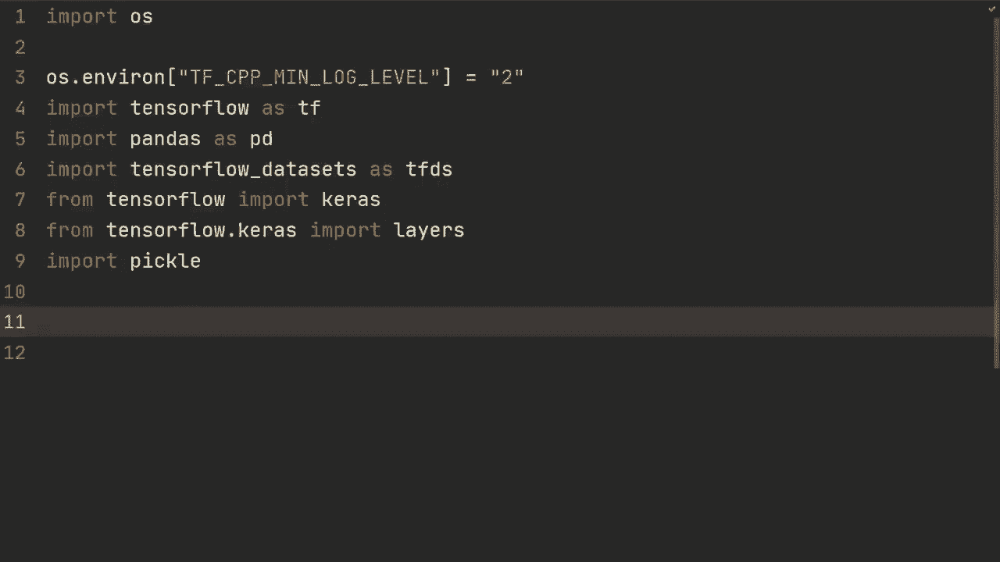
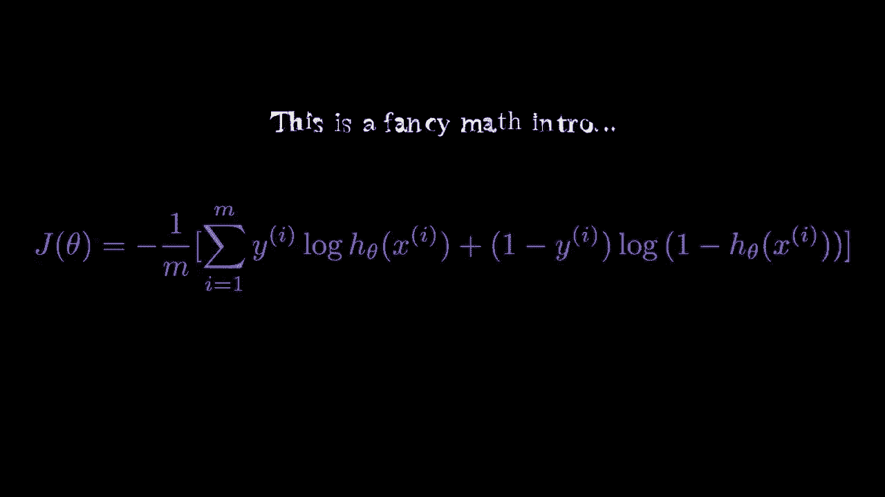
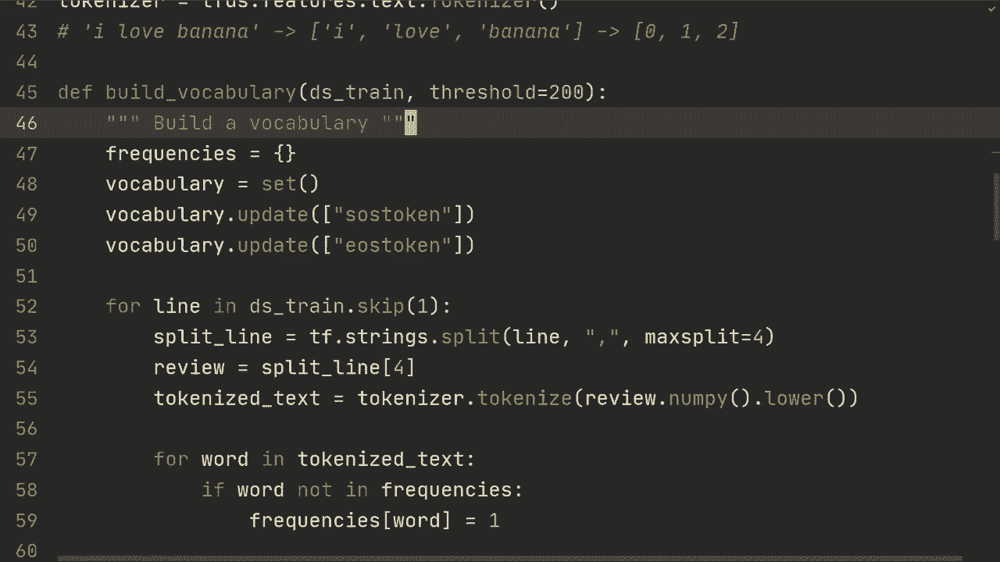
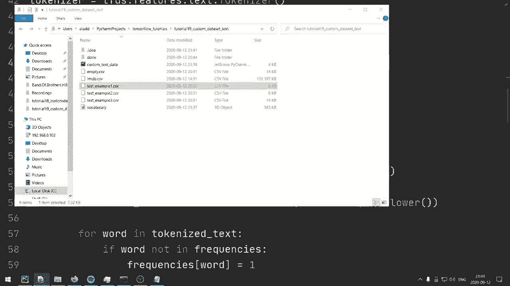
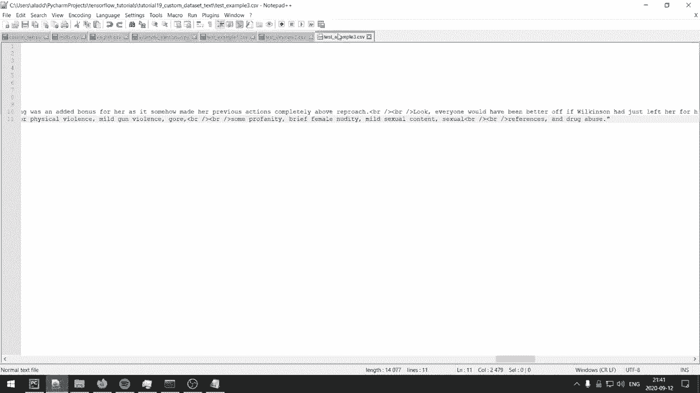
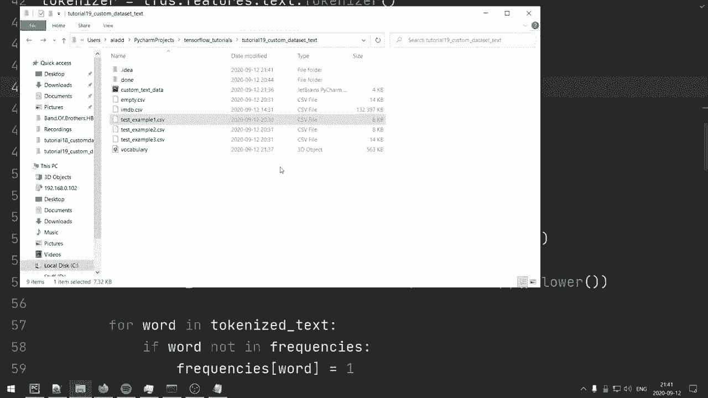
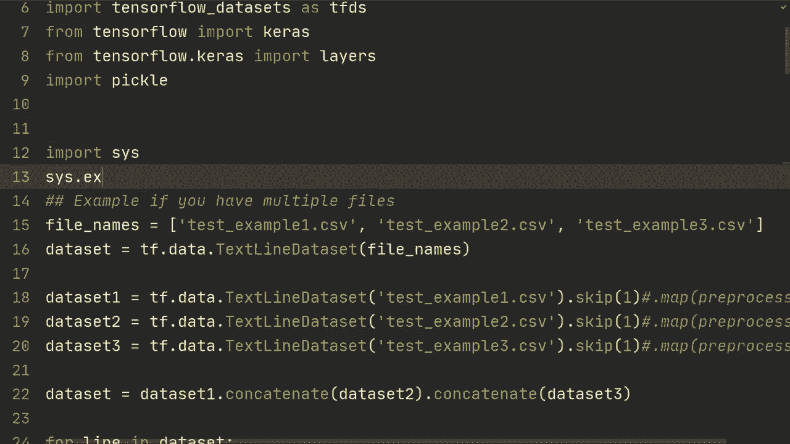
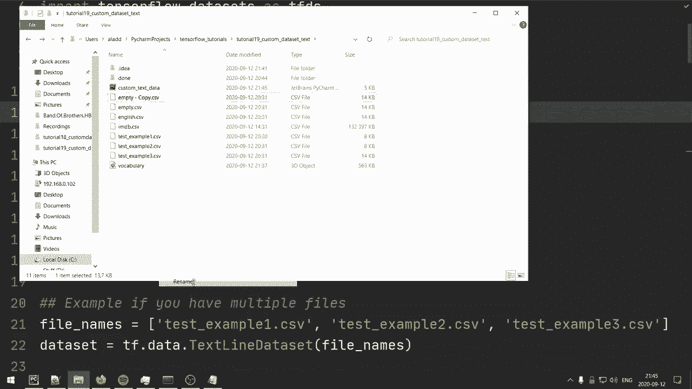
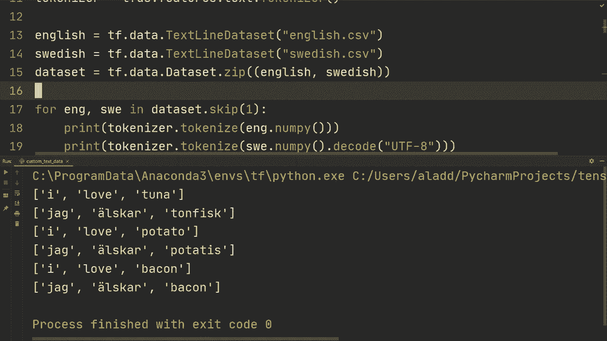

# 【双语字幕+资料下载】“当前最好的 TensorFlow 教程！”，看完就能自己动手做项目啦！＜实战教程系列＞ - P19：L19- 使用 TextLineDataset 自定义文本数据集 - ShowMeAI - BV1em4y1U7ib

What is going on， guys， Welcome back for another video。 So in this video。 we're gonna take a look at how we can use Tensorflow textline data to be able to load our own custom text dataset that we might be working with for our project。 So let me show you the dataset that we're mainly going work with in this video。 So this dataset by the way if you're familiar is a sentiment analysis data where we get a movie review and we're supposed to tell if the review is positive or negative。

 All right， so for example， in this case， we have once again， Mr。 Cosner has dragged out a movie for far longer than necessary， and then it goes on。 then we also have a column for the label if it's negative or a positive review And then we have。 if it belongs to the test set or the training set。

 one thing to keep in mind here is that this dataset actually has unsupervised reviews as well。 So that is one thing that we're gonna keep in mind when we're cleaning and filtering this dataset to be able to。

for So one thing I do want to say is that every data is going to be differently structured。 but I think that showing you how to deal with this data in particular。 using textline data is going to give you an understanding of dealing with text data that extends to many。 many different kinds of data I'm also at the end of the video going to show you a couple of ideas of what to do when dealing with dataset sets that aren't structured in a similar fashion as this one So let's get started。

Alright， so let's start with creating a text line data set。 So we're going to do Ds train is TF dot data do text line data set。And we're going to send in that emdb。csv file that we just took a look at。 and then as you saw this file right here is going to contain the example both from the training and the test set。

 so what we can do is we can create another one T test to be Tf data text line data set of imMDb。 cv。Oh IMDb do CSV and then end quotes So what we're going do here is for example， for the Ds train。 we're going to try to filter out all of the examples that that belongs to the test set and then the opposite for for the test that we're going to try to filter out all that belongs to the training set So before doing anything it might be good to just know that this works So we're going to do for line in DSs train and we're going to print line All right and if we do this it's going to print every line sequentially so what we might we might not want to do that。

So what we can do is we can do first of all dot skip1 this is going to skip the one that sort of the first row which describes the all of the columns and then we can do dot take and we're just going do dot take5 so that means that we're gonna just take five examples So let's look at and so let's run that and see how it looks like So as you can see we get the first example or index01 and then we get the the review right here。

 we get the test set and then we get that negative review So what we want here is this right here we want this and we can get it we can get that by doing printf dot string dot split that line and then we can do is separated by by a comma and's essentially going split the line by a comma and in this case it's actually going to split the review as well So what we could do。

To avoid that is if we could send in an argument right here to be max split equals 4。 So it's gonna split this one， this one， this one， this one。 and then it's going to split all the rest， which is the review just once。 So it's not gonna continue splitting the the review。 So we can rerun that and see how it looks like。

 And as we can see here now it's doing that on a single line。Alright， so what we want here。 first of all， is the test set， right， and that would be the the first index here。So the thing we're going to do is we're going to create a function and we're going to call it filter train。And we're going to send in one line。And the first thing we're going to do is we're going to split line and we're going to do TF string。

 start split the line， and we're going to split it by a comma。 And then we can send that send in that max split equals 4。So then we can first of all。 see what is the belonging of that particular example so we could call it data belonging。 so this is either going to be training or test set。So we're going to do that by split line index1。

But then we can also get the sentiment category， which is split line of index 2。 so this is either going to be positive negative or it's going to be unsupervised and we don't want the unsupervised ones to be in our data set and so we're going to filter based on these two right here and the data belonging can be train or test as we saw in the as we saw previously All right。

 so what we're going to do here is we're just going to return true。Let's see if we can do it like this。 return true。True， if。Data set belonging is equal to train。And if the sentiment category。Is not unsupervised All right。 then that's an example that we want to have in our Ds train。So then if it's not。

 we're going to return false。So what we can do here then is we can do dot filter and we can send it through this filter function。 which we you just called filter train。So if we would now do the same thing we're calling DSstrain again。 we can see right here that we're just obtaining the ones that belong to the training set and that's exactly what we want for the DSs train So what we want to do and now is we want to have an identical one for the the test set so we're just going to call it filter test and then the rest should be exactly the same except this should be test right there and then we're going to do the same thing on a test set filter and then we're gonna send it through filter test All right so one thing here is that you might actually want to do this beforehand so you might want to just split them into two different CSsv files so that you would have for example。

 trained CSsv and then test csv and in this way you're going to save on some compute by not having to filter the examples sort of when you're actually training the model but you might need to use this filter function for something else so it's good to。

Kknowow that it exists and how to use it。 So now that we've actually done that。 what we want to do is we want to let's see if we can make some kind of to do list。So we want to。 first of all， we want to create some kind of vocabulary right If we're gonna send this into our model。 we want to create a vocabulary。 first of all， and I've shown how to do this in a previous video in Tensorflow covering Tensorflow data。

 but I'm going to show it again because I think it's very valuable and could help you out。 So then when we've created the vocabulary。 we want to be able to to be able to numericalize your your text string。 sort of the text string to indices right and we're going to use token see if it's token text encoder。 I believe it's called let me check that。 Yeah， so it's called token text encoder that's going do that for us。

 And then lastly， we're going to use we want to pad de batches so we can send in。S in。To and R and N。 for example。Right， so that's sort of what we want to do now。 And to be able to create the vocabulary， we first want to have a tokenizer。 and there are a couple of different tokens。 The one I'm going to use is tokenizer at Tensorflow dataet。

 TFTS do features do text dot tokenizer。And we're going to create a function。 So we're going to call build vocabulary。 And so the tokenizer is going to split a sentence。 So let's say I have a sentence。 I love banana。 Then that's going split it into a list with I love。Banana， alright， And then that's gonna then be able to get tokenized。

Or rather sorry that's going to be able to be numericalized that's our step2 to something like the index。 the index for this particular word in our vocabulary so that's let's say we just have those three words maybe that would be 0。1 and 2 and then this is something that can be sent in to our R andN later on so for the building of the vocabulary we're going to send in some data and maybe DSs train we're going to send in DSs train we're going send in some threshold and we're going send in some threshold because we want if if this word occurs this many times then we want to include it in our data。

And in this case， we're going to choose， I don't know， let's say 200。 this is going to be dependent on data， but let's just choose 200 because it's a relatively large data set。And also there are different ways to build a vocabulary。 and you can imagine doing this in multiple ways， and I'm perhaps showing you a more simple one。

So first of all， what we're going to need is frequencies， which is going to be just a dictionary。Then we're going to do vocabulary， and we're going to do a set。And first of all。 we're going to do vocabulary dot update。And we're going to send in some start token all right start of sentence token and that's just what we call it in this example。 And then we have vocabulary dot update and we have end of sentence right so EOS for end of sentence and then token So we want to have those in our vocabulary and then we're going to do four line in DS train dot skip of one So we're going to skip the first row and we're going to do split line Tf string dot split line。

Coma and then max split equals 4。 Then we're going to obtain the text or the review。 and we're going to do that by split line of index 4。Then we're going to get the tokenized text。And to get it， we're going to do tokenizer dot tokenize of text。 and we need to convert it to numpy as well。 And then we're also going to do dot lower because if the letters or if the word is capitalized。

 then it doesn't really mean anything。 We're just going to make everything lowercase to reduce the number of words in our vocabulary。 then we're going to do four word。In tokenized text。We're going to do if we're not in this frequencies dictionary。We're going to add it。 so we're going to do frequencies of word。 we're going to set that to one。

But if it is in our vocabulary， so else we're going to do frequencies of word。 we're going to add one to that。Then we're gonna check if we've reached the threshold， right。 That's the one we sent to the top here。So， if frequencies。Of word。Is equal to some threshold。Then we're going to do vocabulary dot update and then tokenize text。Alright。

And then at the end of this， we're just going to return the vocabulary。It's quite a simple function。And we're just going to do that by sending in our DSs train。 So what we can do then is we can do vocabulary。Equals build vocabulary。So calling that function。 and we're just going to send in DSs train。Now， we might not want to do this every time because it might take a lot of。

 might take some time to compute this。 So what we can do then is we can do vocab file。 We can open vocabulary dot。O， PG， and then we can do。Right by。We're going to do pickle。 so we're going to use pickle。 that's why we imported it。 We're going to do pickle do dump vocabulary， and then vocab file。Alright， so this would。

Build vocabulary and save it to vocabulary dot O B G。 right， So then if we've created it。 maybe we want to have something for loading it so we could have。We can do by vocab file as。Open。Vocabababulary， that object。 and then our。RB for reading it。 and then vocabulary is pickle dot load that vocab file。Alright， in this case。

 let's just uncommon that。 first of all， So we're just gonna build a vocabulary and then we can save it if we want to run it at some other time。All right， so then we're going to create some encoder that can do the numericalizing。 which is converting the tokenized string to indices。So we do that by encoder is Tfds。features。text。 token text encoder。And first of all， we're going to send in the list of the vocabulary。

Then we're gonna specify some end of vocabulary token。 and we're gonna specify that to be the。Unknown。And those are going to be all the words that didn't。That wasn't inside of our data set of a frequency of at least 200。 Then we're going to do lowercase equals true。 and we're also going to set the tokenizer。

 which is just tokenizer in this case。 Allright， then we're going to define my encoder。And what we get here is we're gonna get some text tensor， and we're gonna get some label。 And the first thing we're gonna to do is encoded text is just， we're gonna use our encoder， right。 this token text encoder。canSo to numericalize this text tensor that we send in。

So we do that by encoder dot encode， and we do texttensor。 nuy。And then we're just going to return the encoded text comma label。All right。 now one thing we need to do in Tensorflow， which is a little bit unnecessarily complex， perhaps。 but we need to make sure that this Python function is a part of our computational graph。

So we need to define another function。 We're gonna call it encode。Map function。 And we're gonna send in a line right here and that's gonna be just the long line of of the sort of the label。 the review and all of that that we saw and printed before。 So the first thing we're gonna do a split line。 We're going do TF strings that split line comma separator and then max split equals 4 again。

 then we're gonna get the label string， that's going be the split line of index 2。 So I'm not going print the line again。 and just believe me this is index 2 of of that。 If we did the split that's going to be index 2。 So this is going to be negative or positive。And that is going to be that because we also removed all new ones that are unsupervised。

Then the review is going to be， and we're going to add a start token right here in the beginning。 we're going to add it with split line of of index 4。 So that's sort of the last one。 which is going to be a long sort of text string。And then we're going to， in the end。 also add end of sentence token。 Allright， so this is our review。

 and this is going to then be sent to this token text encoder。 which is going to be the do the tokenization。 It's going to do lowercase。 It's going to then map it to some numerical values。 and we can later send that into our model。So the label is going to be one。The label string is equal to positive。

 otherwise it's going to be zero for negative encoded text， comma label。Is going to be equals to Tf that pi function。And we're going to do my encoder the one be defined above。 the input is going to be the review and also the the label。Then we're going need to specify the output and the output in this case is going to be a T F in 64 and then T f into 32。

 So this is for the。The the sentence， the review and this is going to be for the label which is just going to be0 or1 then the encoded text dot set shape。 this is something we need to do for the computational graph we're going to set that to none in a list and we're going to set it to none because the review length can be varied a review could be just you know 500 characters or it could be 100 characters or then we're going do label dot set shape and we're just going to send in a list because it's only going to be one value then we're going to return the encoded text and we're going to return the label as well。

Alright， so now we're sort of to a point where we have defined everything that we need to process our data。 and we're just going to perform these mappings on the on the DS train and the DS test data set。So first of all， we're going to do autotune and you you're hopefully familiar with all of these steps right here from from a Tensorflow data set tutorial。 So we're going to do Tf data do experimental dot autotune。

We're going to do DSstrain equals DSstrain dot map。 and we're going to map it through that in map function。And we're gonna specify the number of parallel calls。 And this is just to for if we're。This is just going to do them in parallel and make for faster data loading。And then。

We can call dot cache as well， and this is going to cache some in memory to make it faster for the next one。So we need to do also a shuffle so that as you saw。 all of the examples are sort of negative and then positive， and we want to have randomized。 So the data set is 25000 in length for the training。 So we're gonna do shuffle 25000。

 Now perhaps 25000 is a bit much。 you could have done something like 5000。 but let's just。Do shuffle 2 about 5000 to make sure it's completely random。Then we need to batch this and remember all of the reviews can be different in length。 so we're going to need to do padding and we do that by doing padded batch。

Specifying the batch size 32。And then we specify padded shapes and on newer tenflow versions。 you don't need to do this。But for older ones， I think before 2。2 perhaps。 then you need to specify this。And we need， we're gonna specify none here because we don't know the review length。 and then we're gonna specify just an empty tuple。 And that's going to be for the the label because it's only going to be an integer。

 Okay， so now that we have that， we can do the same thing for the test set。 but we're not gonna need to map it and shuffle it。 so we can just do。This right here。 mapping it through the encode map function and then padded batch。32。 and again， setting the shapes。 which shouldn't been， you shouldn't have to do this。 but if you're using older versions。

 you might have to。 So I'm just including it here。 I'm gonna do this quickly。 and I'm gonna create a model。 We've actually done this exactly in the previous video。Alright。 so pretty quickly， we're just creating a very simple model。 and we're actually just doing the embedding， and then we're doing a global average pulling across those embeddings。

 the outputs from those embeddings。 and then we're just mapping that through a dense layer and then output node for one single one。 And then we're specifying a binary cross entropy because we just have two classes with the autumn atom optimizer。 Alright， so hopefully there are no errors And this should run。Alright， and it doesn't。 So let's see。 text。All right， so we actually got there pretty early in this build vocabulary function。

So let's see what we got from。 Yeah， so here wrote text do N。 we should have the review。So we want to convert that toump， we want to make a lowercase。 and then we want to tokenize the actual review。So hopefully let's see if that runs。Alright。 so pretty amazingly this actually ran so what we can see is that we got。

 let's see 97% after 15 e box in the training and then on the test set we got 88% but I mean it doesn't really matter what performance we had the important thing is that it actually works so one thing is that when building the vocabulary。 perhaps you could change it so that it just takes the I don't know。

 top 1000 words and then you wouldn't have to set this threshold and I think that should be pretty easy to implement as well and as I said in the beginning how this works is going to be different for every for every data set because this structure is going to be different so I want to give an example of also if you would have some kind of different structure so let's see I have I have a test example with three CSV files and it's actually let's see it's actually the exact same。

And bring it， it's also the IMDB data it's just that we have a few examples on one file。 we have a few examples on another file， and then we have another few examples on a third file So what you can do in that scenario if you have it split up into you know several CSV files。

 which might be very common in practice if you're working with large datasets。

Then let's do just， I import system and see that exit。 so it doesn't run the code below。 Then what you could do is you could specify the file names。 So in this case， that's。Test example1 that CSV test example2 that CSv， and then test example 3 do CSv。So what we could do is we could simply do data set is TF data text line。Data set of those file names。

 and it's going to work out all of it。 So it's gonna going to be like you had them all in one CSV file。 which is pretty amazing。 So that is one thing you can do。 We can just， to make sure that it works。 We can just print line。😊，And as you can see， it printed all of them， including the。The the first one right here。 and it's actually printing them for all of them。

 So maybe what you would want to do。Is remove this right here for those CSV files。But so that is one way that is quite convenient for the if you have multiple files。Now one thing is that you might want to do different preprocessing on all of those CSV files。 they might not be equally equally in structured like they were here and then what you could do is you could specify just data1 is TF data text line data set and then we could do test example one that CSV and then let's do skip one just for the first row but perhaps you would do something you know in general you would do dot map and then preprocess one if if you would have sort of different processing so let's just copy that。

For all of them。 So we're gonna do 2，3，2，3。And then to combine them when you've now processed them differently。 depending on the structure of those individual CSV file， you would do something like data is。Data set1 dot concatenate and then data set2 and then concatenate data set 3。 and in this way we now obtain the entire data set again。

 so if we do four line in data and then print that line，We get the entire data set。Which is including all of those three CSV file。 Alright， so that is if you would have。 So this would be example if you have multiple files。And again， let's do import this。This this start exit。

So let's say we had a kind of translation data set。So I'm actually going to create this our。 we're just going to do English and then we're going to do Swedish al right so here we have them we have English CSV and then we have Swedish CSV。 Alright， so let's do a language1 and let's just do I love tuna I love potato。

I love bacon。 Then we can do language， too。In Swedish。 So you wouldnt people both to understand its probably yeah， got what did we write tuna。Toun fik。 yog and scar Potis， yog and scar。Bacon， so now we have those three， right， so we have。

Just three examples in this case， but how we would load them。Is we can， first of all。We can specify some tokenizer， you know， as we did previously。Which would be TFDS do features do text tokenizer。Then we would do English is TF do data doc text line data set。And we would have that English do CSv。 and then for the Swedish。Wem would have TF data。

 text line data set， Swedish dot TSV。And then what you could do is you can do D， D S。Our data set is T of that data， that data set that zip。And then you can do English and then Swedish。So now we could do four English and Swedish in data set。 and then we can just skip the first row again。Then we could do something like print。

 tokenizer do tokenize。English dot Nai。And then we could do tokenizer do tokenize Swedish dot numpy。And then we need to also do decode to UTF 8 because we use special characters。 So special characters would be something like。This right here。So that's just we're why we're doing Decode UTF 8。But let's run that and just see how it looks like。

And then we can see that it's splitting those examples that we had。 which this is one pair， right。 This is the translation of this first one。And what you would do need to do then is you would need to do sort of。 first of all， you need a vocabulary。And then you would need for each language。Then you would need to do tokenize and miracleize words。

And so this is hopefully what I've shown you how to do so you would be relatively confident that you can be able to use those two。 and then we need to do padded batch to get batches。U and so on。 and then we also need to， you know。 create a model so create model。And。The model in this case is probably something like a sequence sequence model that might be a a bit too advanced for you to implement。 or it could even be a transformer network。And I haven't covered any of those because I think they're a little bit too advanced。

And is beyond this video。 So what we wanted to focus on in this video which hopefully has been as clear as I can make it is how you would load custom data sets for text。 using this textline dataset and hopefully I've also shown you some different ways depending on how your dataset is structured So I've said this before no data set is exactly the same。

 All the data is going to be differently structured。 So how you load it is going to depend on your dataset。 but hopefully you've learned some principles of sort of the general pattern of how you should load the data that you can apply to your own project。 So that's it for this video， hopefully you found the video useful Thank you so much for watching and I hope to see you in the next video。

