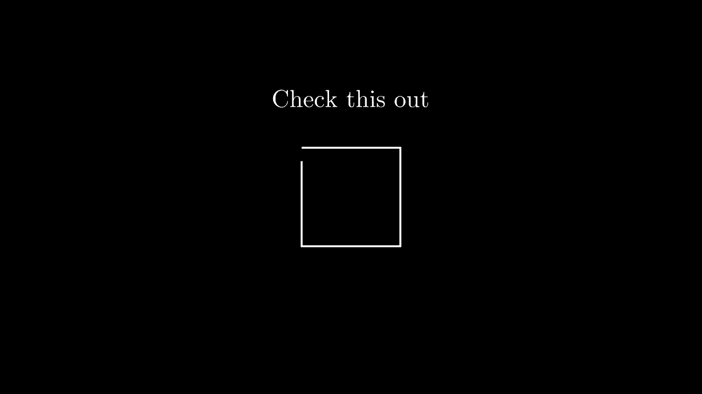
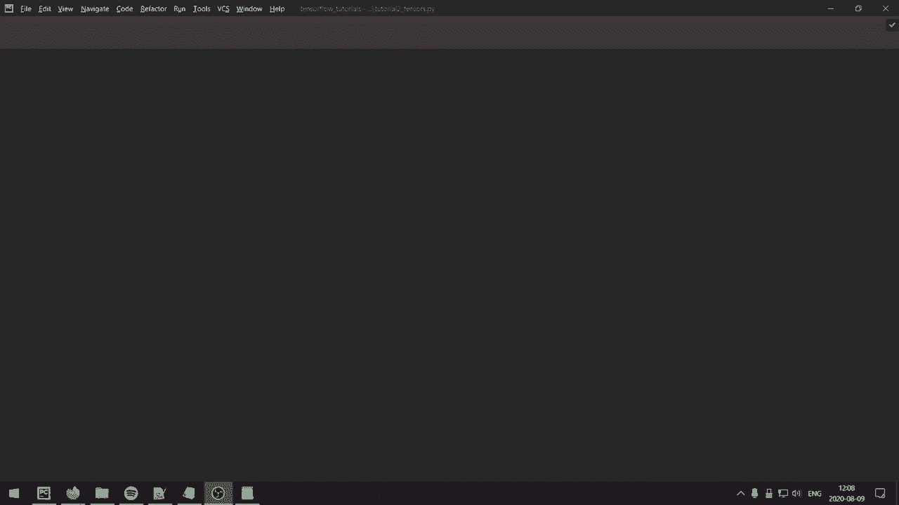

# 【双语字幕+资料下载】“当前最好的 TensorFlow 教程！”，看完就能自己动手做项目啦！＜实战教程系列＞ - P2：L2- 张量基础 - ShowMeAI - BV1em4y1U7ib

What is going on guys， hope you're doing awesome and welcome to tutorial number two。 where we learn about the basic Tensor operations， which is the fundamental building block of deep learning libraries。

Alright so let's start with what a tensor is and from a programming perspective essentially a tensor is a multidimensional array that has the ability to be run on the GPU and from a more mathematical perspective。 a tensor is a generalization of a scalar vector and matrix so for example a vector is a one dimensionmenal tensor and a matrix is a two dimensional tensor。

So with that said， let's dive in and try to learn some of the basic operations and how we can do them in TensorFlow We're going to start with importing Tensorflowlow as TF and one thing here is that if we just run this we're going to get these messages from Tensorflow basically saying that I dont know they successfully opened Kuta library and so on if you're running on the GPU and I find this a little bit annoying so I'm actually going。

Do import OS and then you can do OS do environment or envion or whatever。 however you pronounce that TF and then CPP min log level。And you can set this to a string equal to 2， so essentially what this will do it it it will still bring us error messages。 but these information will just be ignored so if we rerun this now we're just going to get nothing so anyways。

Let's sort of start with what we're going to go through so I'm going to have different parts。 essentially I'm going to start with initialization of tensors。 so different ways we can actually initialize them and then a more mathematical。Operations we can perform and then indexing of a tensor and then lastly reshaping a tensor。So。

Let's just start with how do we actually create a tensor in Tensorflow。 so how we can do that is we can do x equals Tf dot constant。Allright。 and we can just set some value here， let's do， I don't know， let's just do a scalar。 which is just a single number， so we're just going to set four and then let's print that。

So that's just like a tensor of a scalar value， it has no shape although and we can also see the D type in this case it's in 32 and if for example we would do 4。0 I think this would be flow 32 yeah so what we can also do is we can specify the shape so we can do shape let's say we want it to be1 comma 1 then if we now rerun that we would get something like 4 and then shape 11。

What you could also do is you can specify the D type。 so let's say we want to have flow 32。 you could do Tf dot flow 32。 and if we run that it would now be。A float 32 and I guess now it's a one by one matrix， which is just a scalar anyways。 but sometimes it can be important to specify the shapes when you're doing different operations on the tensors。

So let's say we want to create a more a matrix， so a two dimensional tensor。 we can do TF constant and we can do a list and then list inside that list so we could do something like 1。2，3 and then call another list456。And what this would do is it would create a two rows and then each row here has three columns。 so this would create a by2 by3 matrix， so if we print that we get two by three and similarly here you can also specify the shapes and so on。

Now you could also this is you know more of a manual initialization of the tensor。 you could also use other initialization methods like you could do x equals Tf dot1s and you could specify this shapes so you could do something like so a tuple in as the first argument and we could specify three comma 3 so if we print that we would get a3 by three dimensional。

rather a three by3 matrix， with just values of ones。And there are other operations like this。 you could do x equals。Tf dot zeros and then。I' two by three。 and then that would just be a two by3 matrix of zeros。And also。 there are some other ones like Tf dot I。 and you could do or rather I。 So this is。

InSo in linear algebra， you have I for the。Identity matrix。 and if you pronounce I， that is sort of。 it sounds like。I， so that's how you specify a。A identical matrix so that would be having ones on the diagonals and zero everywhere else。 So if we print that we get something that looks like that。 we have ones on the diagonal and similarly here you could also specify the D type and so on Now if you would have something from more from a distribution their Tenflow also has different ways to do that I'm just going to show you the I guess the more common ones。

So if we， for example， have。If we， for example want to have from a uniform distribution。 we could do x equals Tf。 randomdom。 normal and we can specify the shapes as the first input twople and let's say we just want a three by three matrix and then we could do and of course you could do more dimensions here right I'm just doing a matrix just for convenience。

And then we could do mean equals zero， standard deviation equals 1。 and so this would be from a normal distribution。And if we print that。 we would get probably most values between 0 and1。Yeah， I mean， yeah， minus one and one。And then。We can do so if we want it from a uniform distribution， we could do Tf random dot uniform。

 we could specify one comma 3， so a vector， and then we can specify the minimum value and the maximum value。 so let's say min value equals0 and then max value equals1。So these would have values between0 and 1。And it would look something like this。So those are really some you know some just some basic initialization methods TensorFlow has a lot more and actually one more I want to show is that you could do something similar to the Python range function so just TF doc range if you do Tf range of9 for example and we print that we would obtain a vector of a01 and then up to8 so noninclusive the 9 exactly the same as Python and if you want to specify more you could do a start equals let's say one and then limit equals。

I don't know， let's say 10。And then we could also specify the delta so delta in this case is step I'm not really sure what why they call it delta。 but it's the step so in between those values so let's say delta equals2 then we would start at one and then the next value would be a step of 2 and then so we would get1 and 3 so let's print that so we get135。

7 and 9 Allright so as we can see here we now created this and this is a vector of d type into 32 and you can specify the d type in this function but let's say you want to convert it into a specific type then what you could do is you could do Tf dot cast and you could send in the input vector and then you can specify the D type so for example let's say we want flow 64。

Which is quite uncommon in deep learning。All right， we need to print it as well。 so normally you would have F 32 or even F 16。So flow 64 is quite uncommon， but using cast。 that's really a way to convert between different types。 So for example， let's say we。We wanted float， we would do TF dot float as we did。

 and then we would just specify sort of which bit we want， so 1632，64。You could also do Tf。 int and you could have 8， 16， 34， 64。And then you also have Tf。 Bo for a Boolean making it into 0 and1， so those are just some ways to cast to different D types。All right， so let's move on to mathematical operations and。Let's just create two vectors first。

 let's do x equals Tf constant and then 1，2，3， and then let's do y equals Tf constant。Of 9，8 and 7。 so if we would add up the columns here， we would get 10， 10 and 10。Let's say we wanted to add those。We could do Z equals Tf。 add x and Y。And if we then print add that would element wise add each element。 so this would add one with 9，2 with8 and 3 with7 So if we run in printad we would get just 10。

10 and 10 Now you could also do Z equals X and then plus y that's an equivalent way of doing it and perhaps this is the most convenient way these are really equivalent so it doesn't matter which one you'd pick so I would probably pick the second one because that's easier and then if we wanted to do something like subtract them we could do TF dot subtract。

X and y and similarly you could also do z equals x minus y and those two are equivalent as well and let's say you wanted to so what this would do is it would elementwise subtract so it would subtract 1 with 9。2 with 8， 3 with 7。And if we wanted to instead do element wise division， so we would want to divide。

 let's say， one with9， two with 8 and 3 with 7， we could then do Z equals Tf dot divide and then x comma y。 and similarly we could also do x and then just a division。This would also do elementement wise division。And for element wise multiplication。 we could do T ft multiply x and y， but we could also do x and then just。Star or yeah。

 so x star y and then。Let's say we wanted to take a dot product。 so a dot product in this case would do1 times 9 plus2 times 8 plus3 times 7。 so it would add them up。Well it would elementwise so it would do an elementwise multiplication and then a summation can do Tf dot tensor dot and this is a bit more of an advanced function it can be used for more things but in this case we would do x and y and then specify the x's in this case one and if we now print that that would essentially do an elementwise multiplication of the elements and then a summation。

 so for example if we wanted to do this sort of by hand I guess we would do x times y and then we would do TF dot reduce sum and then we would specify the dimension of where we should add them so x is equals0。AndThen we could deprint Z。And in this way， we obtain the same result。

 and I'm not really sure why it's called reduce sum rather than just Tf dot sum， but yeah。And now let's say you want to do elementwise exponation。 you could do z equals x and then just similarly to Python。 you would do this and this would element wise multiply each element or rather elementwise exponentiate each element by5。

 and then we want to print Z。And then we get 132 into 243 which seems I guess accurate。 and then I want to show you how to do matrix multiplication， so if we specify， let's say。 TF random dot normal and then we do a 2 by 3 matrix and then y is Tf random normal and then3 by 4。We could do z equals Tf dot matrix multiply in mat Mole。And then specify just x and y。

 We can also do this a bit more convenient。 We could do Z equals x。 And then I'm really sure I pronounce this。 So x at the at symbol， I think x at y， and then we would。let's do print that on both of those， so before we run this。 I just want to add two lines at the top here。We're going to do physical devices。

 we're going to get our GPU， and then we're going to do Tf config experimental set memory growth of I just have one GPU。 so physical devices of zero and then set that to true， essentially this will make it so that。TenssorFlow will not allocate all of the memory on the GPU。 sometimes you can obtain these weird errors and if you do then add these two lines。

 but if you don't have a problem you shouldn't need to add those。 but anyways let's go back to printing this。So if we see now these are equivalent， right。 so you could do either MaMo or just using the add sign。All right。 so let's move on to indexing of a tensor。Let's say we do something like X TF constant and then。

 I don't know， just a vector with some values， 0，1，1，2，3，1，2，3。Something like that。 then we could do let's do print X and then we just do a colon like this and what this will do is it will print all the elements right so this is the same as printing X。

And then we get all the elements right there。 But let's say we just， we wanted to， I don't know。 Ex the first element。 So we wanted this part of the vector。 We could do print X and then one colon。 So this would。Print everything except the first the the zero the zero value and then。Let's say we also wanted to just have these two right here， 11， we could do let's see。

We could do print x1，3 and this would be noninclusive the third index， so0，1，2。3 this would not be inclusive the value of two here so we would just obtain this vector of two elements and let's also say that let's say we want all of the values so we want all of the values but we want to skip every other element so for example we want this value。

 we want to skip the next and we want this value， skip the next so on how we could do that is we could do colonco 2 and this would skip every other element we would obtain 01。32 and then I don't know let's say we wanted to print this in a reverse order we could do x and then colonco minus1 this would print it in the reverse order。

I'm just gonna。Comment that so it doesn't print all the time。 And I guess also let's say we just want to specify the indices so we want， I don't know。 this one and this one， so we want0 and2。 We could do something like indices equals TF constant。And then we could specify the indices for those values。 And then we could use， we could do。Sa。

Let's call it x in and then Tf dot gather。From x， from the tensor x。 we want to gather the specific indices0 and 3， so if we print x in， we would now obtain 0 and 2。 those values that we want to extract。All right， so this is just for a vector。 let's take more let's take a matrix， so let's do x equals T of constant。

And then let's do one and two。Three and four。5 and 6。 So this would be a three by two dimensional。Matrix， and then let's say we want to get just the the first row with all of the elements。 how we could do that is we could do x and then 0。We could also do this by doing x comma and then all all right。 so when we add multiple dimensions of our tensor， we separate the dimensions by a comma。

And similarly to how we did in a vector， we can specify the ones we want。 So let's say we just want to pick out the first two rows。 we could do x and then 0。Not inclusive the two， so we would just zero and one in this case。And then we could do comma and then all so if we print that we should now obtain that two by two matrix of one and 2 and3 and 4 all right so that's it for basic tensor indexing。

 let's remove those print statements and let's now move to some just basic reshaping so let's say we have x is Tf range of nine so we would have nine elements and we want to reshape this so to print X。Let's say we want to reshape this into a three by3 matrix。

Then we could do x equals Tf dot reshape x and then we specify the dimensions so let's do three by3 and let's print x now now we will obtain01012 as our first row and then3。4，5，6，7，8 as our last row and then let's say you want to sort of transpose this so we would have this as our first column instead of our first row how we could do that is we could do x equals Tf dot transpose x and then we could also specify perm for permutation and this works for multiple dimensions as well not just for two dimensions as we have here you could specify in this case0 rather one comma 0 so this would just swap the axis so if we now print x we then obtain this first row as our first column right and this second row is now our our second。

Our second row is now our second column right here。So that's it for the basics of Tensor operations。 thank you so much for watching the video and in the next video we will start with building some basic neural networks。