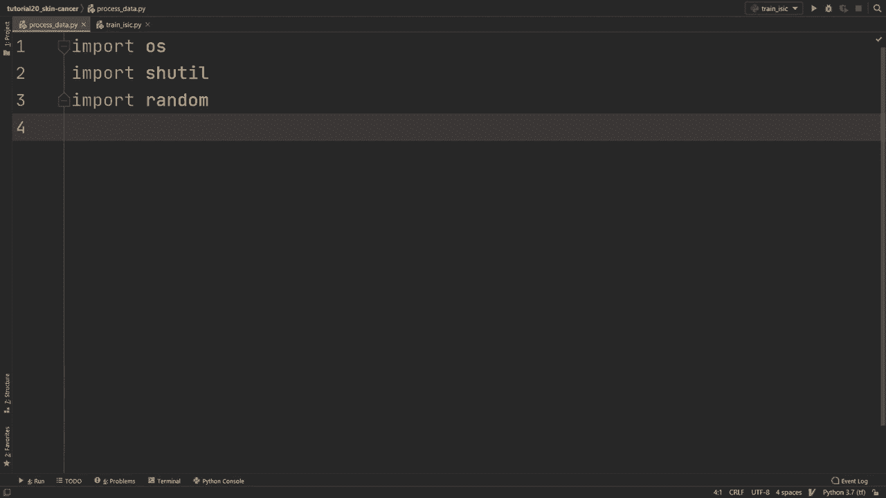
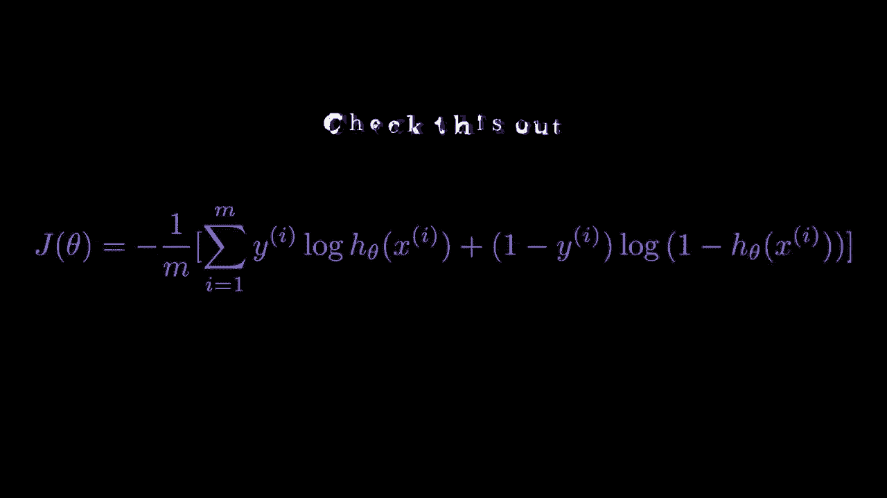
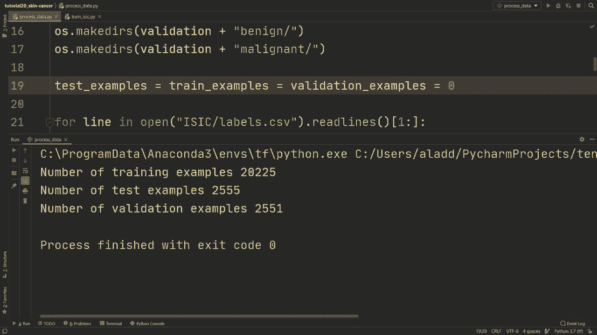
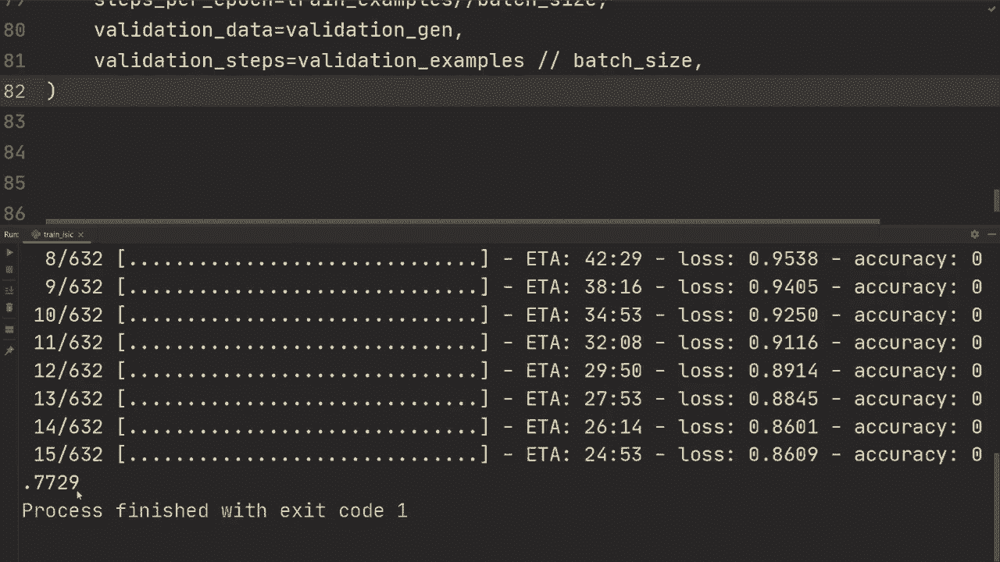

# 【双语字幕+资料下载】“当前最好的 TensorFlow 教程！”，看完就能自己动手做项目啦！＜实战教程系列＞ - P20：L20- 皮肤癌分类项目 - ShowMeAI - BV1em4y1U7ib

🎼Welcome to the final video in this tutorial series。 So in this video。 I want to go through a project example， which has been the goal since the start of these tutorials。 namely， that we build a solid foundation in Tensorflow so that we feel confident of starting our own project。 So in this project， we want to build a network that can classify if images of skin lesions are benign。

 meaning they are non harmful or if they're malignant and are actually cancer。 So as with any project， we will probably encounter some issues or problems along the way。 and we'll see ways of how to solve those。

So the first thing in any project is to obtain some data and after some googling。 I found a dataset set called the IIic data set。 So let me show you how to download it。 So we're going to search IIac training data。And we're just going to open up this link。 It's going to be in the video description as well。

And all we got to do is we got to enter our email address and after doing that we'll get sort of access to training data with the inputs as JpeEG images and then also a CSV file of entries of the age sex and the location of where the skin lesion was on that person。

 and also the ground roof if the actual lesion was millignant or benign。And then we have a test data。 so we have 25，000 images of those， and then we have a test data set of 8，200 images。 but those as you can see they don't have a ground truth label and that is because this IsIic is actually a challenge。 IsIac challenge is， what kind of accuracy do they get on these 8，200 images？So in this video。

 we're going to do it a little bit differently。 We're going to take just these 25000 images。 We're gonna split that into a test set and a training and a validation set。 And then we're gonna see what accuracy would get。 So on the actual challenge here。 we would probably get a little bit better performance since we would have a little bit more data But I think that's you know。

 this is。Good enough， you know， we have quite a lot of images anyways。 So to download them。 we're just gonna press the these three。 and in this case， you know， since we have so many images。 it's actually， you know，10 gigabytes。 it's gonna take a while to download。So after downloading them。 we get all of these three files and so we get one folder right here with sort of all of the images and then we have two CSV files。

 so we have the ground truth。And that looks like this。 So we have the image。 the file name of the image。 and then we get first the first column is if it's malignant or not。 so0 is for benign，1 is for malignant。 And then they also have some different categories for the actual。What type of skin lesion it is， but we're going to simplify this a little bit and we're actually just going to care about these two right here。

 so all we care about is is the skin lesion actually cancer or not。 not what type of skin lesion it is。And then right here we have the training metadata。 so if we open that we get the file name and then we get the age of that person and also where it is located and then the gender we're also going to in this video simplify it a little bit more and we're going to ignore this file completely so we're just going to get an image and not the additional information about the age。

 but if you want to improve the accuracy， I can only imagine that having this information would only improve the model。So I've just edited the file names and then the folder to images and then we have labels and then this additional information that we can remove since we're not going to use that So you know first of all what we have to do now is we have to create a training set。

 a test set and a validation set so we got to make some processing script that can take these images in a single folder and put them and you can do this in different ways but my idea is that we put them in for example。 a train folder and then in this train folder we have we create two additional folder one for benign and then one for malignant。

And then we we're going to place all the files that are benign for the training set in this folder and all the malignant in that one and from this we can use image data generator。 which we've seen in previous tutorials to load this in this case this custom image data set so let me remove this folder and we're going to create a script that does all of that for us。

Alright， so these are all the imports we're going to use for this。 and we're going to call this process data。So first of all。 one thing we're going to do is we're going to set a seed。 we're going to set it to one just so that we get the exact same split if we would run the script multiple times。

 then we're going to do random seed of this seed。And then we're going to specify the directory of the images。 So we're gonna to do directory is。I as I see， that's what I call the the folder where I put the image folder and all of that stuff。 So in Isaac that then in that folder there's going to be one images folder。And we're also going to specify the train， which is going to be。

 let's put it in a folder in data and it's going to be in a train subfold。 Then we're going to get a test and we're going to do data test。And then we're going to have a validation as well。 So we're going to put that in data validation and then。We're gonna， if those folders don't exist， we have to create them。

 So we're going to use OS make directories。 we're going to do train。 and then we're going to add benign and we're going to do one more。For train。 and then malignant。And then let's copy paste that and we're going to copy paste that and we're going to do that for the training and then the validation。I rather de testest set and then validation。 So test。Test。😔，And then validation。Validation All right。

 so now we should have all the folders that we need placed in a data folder and inside those we have three subfolders with train test and validation and inside those we have two additional for benign and malignant。One thing we're going to do now is we're going to count how many examples that we're going to put in each so we're going to test examples。

 equals train examples， equals validation examples， which are all initialized with zero。Then we're going to do four line in open， we're going to read that CSsv file labels。 CSsv right that contains if it's actually malignant or benign。Then we're going to do that read lines。And we're going to read from the first row beyond and to the end because we don't want the first。

 which is just information about the columns。Then we're going to split this line。 we're doing line dot split， and we're going to do it by comma because since it's CSV file。 it's comma separated。And we're going to get the image file。 which is going to be split line of the first index。Then if it's benign or malignant。

 that's going to be split line of index 1。Alright， so now when we're actually making the split we need to decide how many should the test set have and how many should the validation set have。 and in this case I'm going to place 80% on training and 10% on validation and then the rest 10% on the test set。

So we're going to get some random number and we're going to do random that random。 which is a uniform random number between 0 and 1。And we're going to check if the random number。Is less than 0。8， then we're going to set the location to be the training。And we're going to do training examples plus equals  one。Or if they random number。Is less than 0。9。

Right， it's gonna go to disk。 first of all， if it's less than0。8。 then we're just gonna check if it's less than 0。9， which essentially means that if it's between 0。8 and0。9。Then we're going to set it to the validation。And we're going to iterate up validation examples with one。And then otherwise。

 it's going to be between 0。9 and 1。 Then we're just going to set the location to be the test set。Yeah， so then we're going to iterate up test examples。By one。Alright。 so now we're going to do if int of float of benign or malignant and we got to do this because this right here is a 0。0， so we got to convert that first off float and then an integer I tried using just integer of that but it didn't work。

So then we're going to do if this is zero， we're going to use chatill。copy。 so I'm not going to actually move the files if you would if there would be some mistake。 so I'm just going to copy them and then you could remove the file if this works。So we're going to do Isaac images， and then we're going to do plus the image file and then plus。JPEG。

 that's the file format for the image。And then we're going to move it to location。Plus bin9。Plus。 image file plus， and then dot Jpeg。All right， so we're moving it from this location to this location where this location is dependent on this random number。

 so it's either in the train test or validation。Allright。 so the other scenario is if the and you could use Els here。 I'm just going to use Elsif integer of float of benign malignant is equal to one。Then we're gonna do shutter left copy。 and we're gonna do， I mean， we could copy paste this。

 And here it's gonna be pretty much exactly the same thing as it， except it's not gonna be benign。 It's gonna be malignant。And then in the end， we can do print。 can do an F string number of training examples because we counted those， right？

We can do training examples like that。 And then we could copy， paste that and。Just do it for the。For the validation and test set as well。So we can do a number of test examples is going to be test examples。A numberumb of validation examples is going to be validation examples。Alright。 so hopefully this script should work now， and I'm just gonna run it and we'll see what we get Alrighty。

 So now we， if I'm gonna pull up that folder， we'll see that there's a folder here called data。 and then inside that we have all of the splits。 and so for the test set we have benign or malignant and then we have all of the folders belonging to that one right there。

 Alright， so now we've actually process the data。 now we can move on to this train I I script。

And first of all， I've just copied in all of the imports not to waste time on that。 and we've used all of them in previous videos， but if you haven't， you can， of course。 you can just install them。Alright， so first of all， let's see we had all of the the examples。 So I'm gonna first write those out。 So training examples we have are 20225。

 We have test examples to be 2551 and then validation examples。 We use 2555。Then we have we're going to specify the image height。 which is going to be the image width and we're going to set that to 224。 so I think some of them are actually you know above 1000 pixels might even be larger than that。

 so we're going to resize all of them to be in that 224 times 224 pretty standard pixel height and width。Then we're going to specify batch size， we're going to specify 32。And then we need an actual model for this。 And you have many options here。 You can use Resnet。 You can use inceptionnet， you can use。Many， many different efficient nets。

 I'm gonna use one that it's a little bit weird。 I'm gonna use one that's called Nonet nacenet。 I'm I'm not really sure how pronounce it。 but anyways's I't I hadn't heard of this before。 it's just fun to try out new ones sometimes and I don't think this is the best。 I think you can use efficient net and it should be a lot better。 Alright。

 so how you load it is model equals kos dot sequential。 and we're gonna create all an entire model now。 So we're gonna do we're gonna use Tensorflow hub as we've seen previously。 we're gonna use hub dot k layer。And I'm just going to copy paste that link and so if we get it from this URL。 I'm going to copy paste I'm going to paste this in the video description as well。

 but so this gets the feature vector of that one and then we're going to do comma and we're going to do trainable equals true so we're going to train that one as well。Then we're going to do layers flatten and this is actually not needed。 I think it's already flattened， Yes， we can remove that line and then we're going to do layers that dense one and we're going to have activation to be sigmoid。And this is because we only have two classes。Alright。

 so normally you would perhaps use this pretrained and then you could add you know。 a couple of layers。 in this case， we're gonna train the entire thing with this pretrained and we're just gonna have a single dense layer。 So， you know， I'm not building the biggest model here and this nasnet is not really that big。 but it's gonna to work fine for demonstrating， you know we're still gonna get okay performance。

So then we're going to do train data generator， we're going to specify image data generator。 just as we've seen in previous videos， we're going to first do rescale to be one divided by 255。We're going to do a rotation range to specifying the data augmentation。 let's say 15 degrees。 You could perhaps do more here as well to get more data augmentation。

 but 15 seems like a good value and then zoom range we're going to do 095095 and this means it's going to zoom out randomly out5 degrees and then in5 degrees we're going to specify horizontal flip to be true and then vertical flip is equal to true because no matter how you either rotate or flipped image it's if it's a cancer cell it's still going to be a cancerous cell if you flip it vertically which is not the case for let's say an image digit of6 or9 for example。

 but in this case it works。 So we're going to do data format is channels。Last。We're gonna do validation split， and we're not gonna actually have a validation split。 So we're gonna do D type is T F flow 32。Then we're going to do validation data generator and we're going to do image data generator So by the way。 why we don't use a validation split here is because if we would do that。

 then this all of this data augmentation would be applied to the validation set as well。 which is not what we want， we want a validation set to resemble the test set and the test set won't have any data augmentation。So here we're just going to do rescale， which is one。1， divided by 55。 And then we're gonna do T F flow 32。And then we're going to do the same for the test data generator。

Image data generator of。Rescale is 1 divided by 255， and then D type is TF flow 32。All right。 so now we have the data generator specifying how to load image and then also or rather not specifying specifying what we should do when we got an image with a data augmentation。

Then we're going to do a train generator is train。Data generator do flow from directory。And here we specify data train， that's the folder right。And then target size is going to be equal to image。Height， image width。And is going to rescale if it's not indecise。Then we're going to do batch size is equal to batch size。

Color mode is going to be RGB， and I think it's RGB by default default as well。 and then we're going to do class mode is going to be binary。And then shuffle equals true。And then we're also going to set a Cd to this。Alright。 so let's copy this and we're going to use it for the the validation as well and the test set。

So copy paste that。Cpy paste that。 Then we're gonna do， let's see， validation validation generator。 is' going to be validation data generator。 And then we just gotta change this to validation。 but the rest should be exactly the same。 and then test generator。Test data generator。And then we change this to test right here。Alright， so now we have all of those。

 and we're going do model dot compile。 We're gonna specify let's compile。 We're gonna specify the optimizer。 and we're gonna use Kaas optimizers dot at。And we're going to specify the learning rate to be 3 e minus4。We're going to do loss is a car that lose that binary cross entropy。And then from Loit equals false。

Then metrics is just going to be in this case， it's just going to be we're just going to put accuracy。Alright so I just want to say a couple of words also on this how we're loading the data in this case we're using this image data generator。 but if you watched my custom data set for images， I showed you two ways of doing it if it's structured in this manner that we put it in and I think making it to a Tenorflow data set and and performing the data augmentation like that would be more efficient and。

If you want to improve the performance and how fast this runs and loads the data and so on。 I think using it doing it that way is faster。 but I think this is a little bit more convenient So I'm using it here but just know that you can definitely improve the performance of this and the reason why you can improve it is because you can do this this number of parallel calls of loading the data and you can do pre-fetching and and all of that stuff。

 All right so now that we have the model we're gonna to do model do fit we're gonna send the train generator we're gonna set epochs to I don't know let's just set it to one first of all。 then we're going do steps per epoch we're gonna do train examples。

Divided by batch size and integer division。 And then we're gonna do validation data。Is validation generator。Validation steps is validation examples。Divided by batch size。 Alright。 so let's just start with that and， and make sure that this runs。 And we're gonna improve this very soon。Al right， so I'm actually going stop the training right there。

 It's only ran for 15 batches， but so we get the accuracy and it's already 77%。 All right。 so if you hadn't thought about this， then what is good accuracy right if you normally if it's two classes that would be 50% over 50% is better than just guessing So that would mean that this is a very good model after just 15 batches。

 So that would work fine if you're using Mist or something where the classes are actually balanced but in this case we have very。 very imbalanced data So you know maybe less than 1% or 1% of cases are actually malignant and the vast majority。99% are benign cases。So accuracy in this case is going to be a very flawed metric。 And this is an example of a of a problem that you can encounter when doing a project。

 The initial thought of just using accuracy。um。We realize pretty quickly that this is a flawed one。

Alright， so for what we're going to do， we're going to introduce new metrics that we're going to use and I'm going to link to these two lectures by Andrew Ug where he explains why we can't use those metrics when we have skewed classes like in this case and then also what we can do instead which is using precision and recall So these are going to be in the description I recommend you watch them and it's going to make a lot more sense what we're going do next。

So we're gonna introduce these new metrics。 We're gonna do metrics is cars dot metrics。 and we can use， we can still use this binary accuracy。 We're gonna set name equals。Accuracy。 we're still going to use that， but it's not really important。 it's not not we can just as well remove this， it's not telling us much。

And then we can instead use precision， and we're just going to name it precision。And then we can use charismetric recall。Recall another metric。 which I'm not sure if he goes into in those two videos is a Karas metrics AU。 and I recommend that you just Google what those are。

 I'm not going go in depth and that would be a separate video。 So I'm just focusing on on how to use them in this video。So then we would set this metric right here。 We're gonna， let's see。We're just gonna set metrics。All。 so now we have these improved metrics。嗯。And then in the end。

 we could perhaps do you model that evaluate on the validation generator。And let's say verbose equals 2， so let's do that for this as well。 and then maybe we want to evaluate on the test generator as well。So I actually have a model that I've trained， I think I've trained for 50 epochs or so。

 so I'm going to load that one to save some time so we're going to do model equals Kras models that load model Isaac model it's in that directory So you know this right here is the exact model that I've used I've just trained it for a bit longer and we're going use this as as a part of our pretraining or whatever。

So then we can just keep this epoch equals one。Otherwise， we would have to train it。 you know for 50 ps or so。 And then we're going to get this。 this evaluate on the validation in the test generator。 One thing I'm also going to show you is how to plot a R O C curve because there's going to be a。

So a ROC curve is going to predict true positive rate versus false positive rate。 so there's going to be a trade off between those two。 and so we're going to plot a curve to exactly see how this trade off plays out。So I'm going to define plot R OC。 We're going to send in labels and then some data。

 Then we're going to do predictions is equal to model dot predict on that data。Then we're going to do false positive rate， true positive rate。 we're going to get that from RC curve from SK learn where all we're going to need to do is send in these labels and then the predictions for those labels。 and we're going to do PLT dot plot we're going to do 100 times false positive rate to get a percentage and then true positive rate as the Y axis。

 So x label in this case is going to be false positives。In present。Ploot y label is gonna be true。Positives。Again， in percent。Then we're just going to do PLT do show。so。What we need to send in here is the the actual labels， but we only have a generator。 so we're going to do test labels this Nier array and empty nuier array。

We're going to do number of batches equals 0， then we're going to do four， you know。 iterate through the test generator。So in test generator。Test labels is going to be NP dataend test labels2， and then we're going to append Y to test labels。So we' got to iterate upn batches plus equals1。 we're going to do if numb batches。

Is math that seal of test examples。Divide by batch size。So this is just to get all of the examples from the test set to a single nuier array。Then we're gonna break。 Allright。 So now we， we， you know。 we have the the test labels and then we have the data。 So what we can do。

 we can deploy plot R O C of test labels， and then we're consenting the test generator。And this is going to give us that R O C curve on a graph。So not only are we getting all of the metrics right here。 but we're also going to get a nice plot at the end。 And I think I I commented that model。 Yeah。

 so we're loading this model right here。But of course， if you want。 you can train this for a little bit。 and then you're just gonna save that model。 So what we're going to use to， to save it to make sure that we don't lose the model so far is we're gonna to go to this metrics right here and we're gonna do no。 wait it's in fit。 Yeah， so we're got to go here。Callbacks is equal to ks。Dot callllbacks。

 model checkpoint。And we're just gonna specify to Isaac model。So this is going to save the current model every epoch。So let's run this and hopefully everything should be working。Alright。 so here we get all of the values from that training epoch and as you can see we we've trained quite a lot and it's overfit on the training data。

 which means that we might benefit from introducing more regularization。But then we also get the validation accuracy， validation precision and so on。 and then we also get the plot， which looks like this。And one thing here is that as you can see。 we have this validation A U， which is about 86%。 And that means that that' that's the area under this curve。

 which is a common sort of。Which is a common metric that people oftentimes use。 So running and evaluated on the test set， we can see that we get a。A precision of about 6073%。 So what this means practically is that if you go to a doctor and he has a precision of 70%。 that means that。If he says you have cancer， he is correct in 73% of the cases。And then for recall。

 it means that if you go to his office and you have cancer。 he's going to tell you in 54% of the cases that you actually do have cancer。And then the AU see in this case， which is sort of a sumization metric， is about 87% on the test set。

Alright， so interestingly enough， this is also a kle challenge where the prize money is 300000。rather，$30，000 for the winner and this is exactly the data set that we just saw except that they're using the train data and then when they send in their model。

 it's tested on this unknown test data。And so we can see the leader board right here。 they have a score right here and the score here is actually what we calculated here for the Auc that's the score which is this right here area under receiver operating characteristic curve which is exactly what Tensorflow computes so what did we get。

 we got 0 about 87 and they have 95 So as you can see their model is a lot better and also I want to say that these results aren't necessarily comparable because we don't have the same test set and we haven't trained on exactly the same data。 we have actually trained on a subset of what they train on because they probably use the entire training data nonetheless it's very interesting to see sort of and compare at least as an approximation for how good our model is but we are very far away from winning that。

0000 but maybe you can train a bigger model， maybe you can do some more data augmentation and perhaps you can get the accuracy over 90% or something like that so that's it for this video hopefully're able to follow this this project example and I also hope that you've learned a lot from these Tensorflowlow tutorials and that you feel that you're ready now to start doing your own project and create stuff in TensorFlow。

So thank you so much for watching this video and these tutorial videos。I hope to see you in the future in another TensorFlow tutorial。