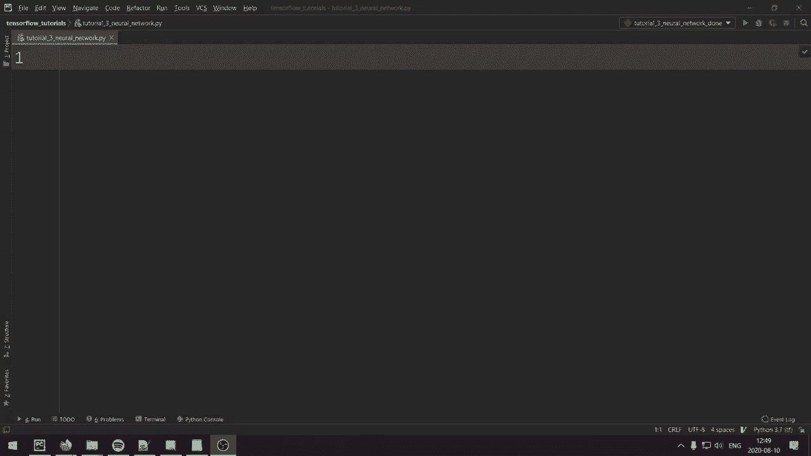
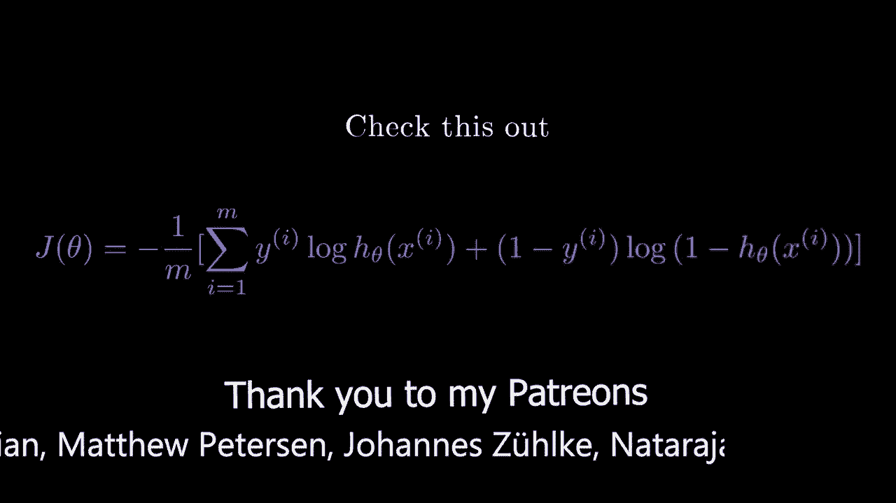
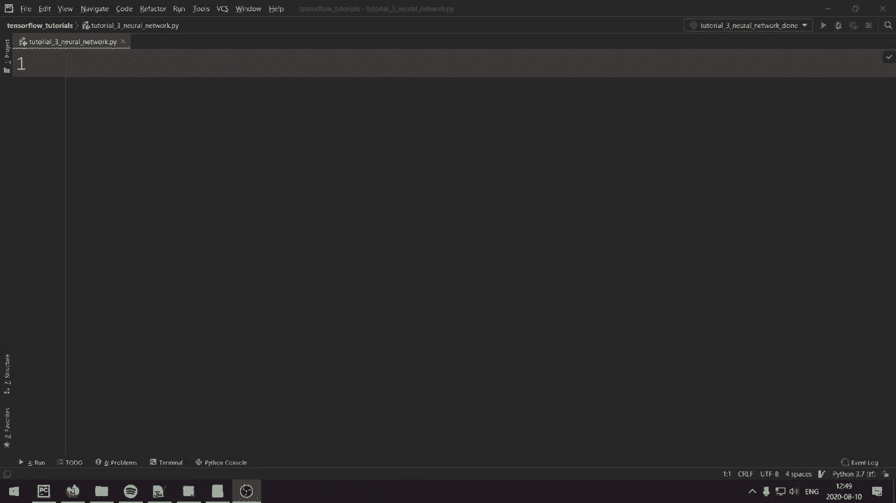
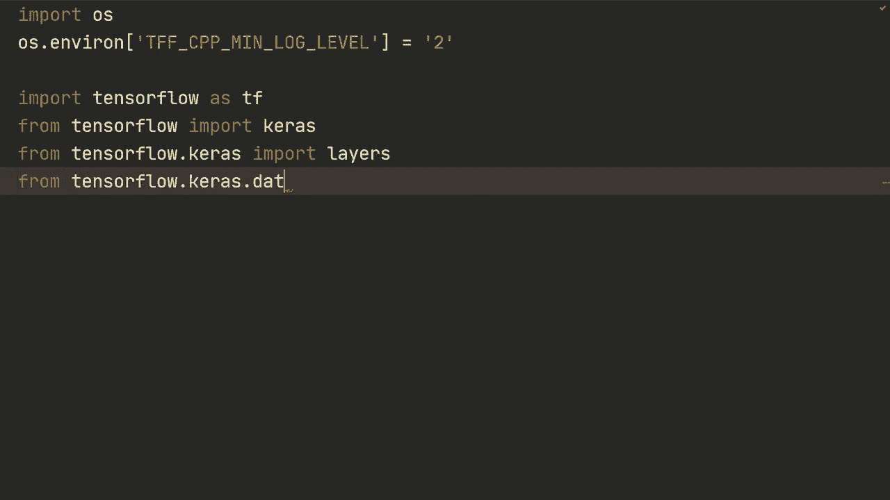
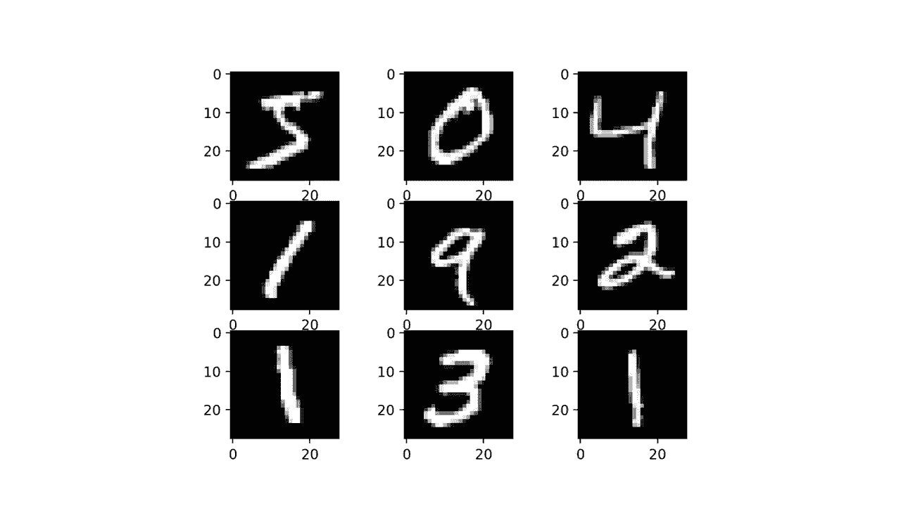

# 【双语字幕+资料下载】“当前最好的 TensorFlow 教程！”，看完就能自己动手做项目啦！＜实战教程系列＞ - P3：L3- 具有顺序和功能 API 的神经网络 - ShowMeAI - BV1em4y1U7ib

大家好吗，希望你们一切都好，欢迎回到教程 Nuummerro Tres。

现在我们要创建一个基本的神经网络，构建和训练神经网络有很多理论。你可以跟随这个视频构建神经网络，但当然我也希望你真正理解我们在做什么。因此，为了保持这些视频简洁明了，我将向你推荐不同的优秀资源，以便你能更深入地了解理论，我真的建议你首先这样做。我推荐的第一个资源是 31 个关于神经网络的系列视频，这些视频非常适合建立直觉和理解。如果你想要更深入的解释，我推荐安德鲁·吴的深度学习专业课程的第一和第二个课程的这些视频讲座，这三个播放列表都将在视频描述中列出。

让我们开始导入代码，我们将导入 Tensorflow，作为 TF，实际上在这之前我们要导入 OS。

然后我们要做的是 OS 并且做 Veron，我们将设置 TFF CPP min log level 等于 2，这样将忽略 Tensorflow 的信息消息，但我们仍然会收到错误消息等等，然后我们就可以继续。

从 TensorFlow 导入 KaRS，让我解释一下什么是 CARS。自 TensorFlow 2.0 以来，KaRS 已与 TensorFlow 集成，是官方的高级 API，本质上是构建神经网络和模型时的首选。因此，构建神经网络时，你将使用 CAS，具体而言，根据你在创建模型时所需的灵活性，你将使用 CAS 的不同 API，更具体地说，在这个视频中我们将查看 CAS 的顺序 API 和功能 API。

然后我们将从Tensorflow cares导入layers以导入我们今天将使用的数据集，我们将从Tensorflow ks data sets导入Mist。我们今天使用的数据集是Mist数据集，我会保持简短，因为我知道你们中很多人厌倦了听关于Mminist的事情，所以基本上它是数字的图像，范围从0到9，我们有60,000张训练图像和10,000张测试图像，图像是灰度的，所以它们只有一个通道，像素为28乘28，因此相对较小。如果你在GPU上运行时遇到任何问题，那么你应该尝试复制粘贴这两行代码，但如果没有问题，那么你就不需要复制它们了。另外，我注意到这里应该只有1f，所以Tf。

好吧，那么无论如何，让我们继续，现在让我们实际上开始加载我们的数据集，我们将加载训练数据集。所以我们将加载X train，然后是Y train作为标签，还有X test和Y test。我们只需执行emminist load data，然后打印X.dot.shape。还有。打印Y train的shape。我们有60,000张图像，它们都是28乘28的。现在。

这里有一件事，我们将把它们发送到神经网络。所以我们需要将它们展平，以便我们只有一列长的特征值。我们可以通过执行x train等于Xtrain.dot.reshape-1然后784来做到这一点。所以这里的-1意味着保持该维度上的任何值。在这种情况下是60。

000，然后放置，这将是28乘28。所以我们要将这两个维度展平。还有。现在当我们加载数据时，它们将是nuy数组，并且它们也将是float 64，所以我们可以做s type，然后是float 32，只是为了减少一些计算，然后我们还希望规范化这些值，使它们不再在0到255之间。

我们希望将它们归一化到0到1之间，以便更快的训练，所以我们将除以255，然后对xt x test执行相同的操作。所以x test。reshape-128乘28。然后，S type。Flolow 32，然后除以255。所以这些将是nuy数组，你可以做类似于xtrain等于Tf convert to tensor，然后你可以对Xtrain和ytrain等做类似操作。但实际上这将由Tensorflow内部完成。

所以如果它在nuy数组中，我们不需要太过担心。转换将自动发生，可以这么说。所以我们现在要做的第一件事实际上是创建一个模型。我们将创建一个基本的神经网络，并使用KRS的顺序API，你可以将顺序API视为非常方便，但灵活性不是很高，对吧。

非常方便，但灵活性不高。所以我所指的是，例如，它只允许一个输入映射到一个输出，这是一大限制。但是如果你有一个输入到一个输出，那么顺序模型正是你想要使用的。因此，我们创建这个的方式是使用model = ks.sequential。

然后我们将发送一个列表，这个列表将是层，因此我们要做的第一件事是做密集层。这是一个完全连接的层，假设我们想在网络的第一层中有512个节点，然后我们将设置激活，所以我们只需将激活设置为，然后我们将使用reL激活函数，然后你就可以将它们写成层，这样它将自动通过这些层发送，因此例如我们想要另一个层。

另一个完全连接的层，使用密集层，假设我们想要256个节点，然后激活设置为re，对于输出层，最后一层我们想要密集层，并且我们想要映射到10个节点，每个数字一个节点，并且在这一层我们不想要激活。

函数，因为这是我们的输出层。我们将在输出层使用softmax，但这将在损失函数内部完成。然后我们将执行model.compile，在这里我们基本上告诉Keras如何配置我们网络的训练部分，例如，我们将指定要使用的损失函数，我们将使用Keras损失的稀疏分类交叉熵。然后我们将有一个参数，设置from_logits = true，这是因为我们没有softmax激活，所以当我们设置from_logits = true时。

它将首先发送到softmax，然后将其映射到稀疏分类交叉熵，所以你可能对交叉熵损失比较熟悉，当它是稀疏分类时，意味着标签，所以ytrain标签只是对应正确标签的整数，例如，如果它是数字3。

然后该特定示例的y train将只是3，如果你去掉稀疏，所以你会使用分类交叉熵。那样你需要有独热编码。但在我们的情况下并不是这样。然后我们可以指定优化器，因此我们将使用Ks.optimizeims.adam，作为参数我们可以设置学习率，所以我们设置为0.001。

然后我们也可以指定指标。在我们的案例中，我们希望指标为准确率，以便CA在训练期间跟踪当前的运行准确率。然后在使用model.compile后，我们可以进行model.fit。所以你可以理解model.compile指定了网络配置。

关于损失函数、优化器等，然后在`model.fit`中我们实际上指定了网络的具体训练。我们想要传入`x_train`和`y_train`，然后指定要训练的批大小。

假设我们设定为32，然后设定我们想要训练5个周期。然后我们可以使用`verbose=True`，这样每个周期后就会打印结果。否则你会看到一个进度条，不过无论如何，在训练之后我们想要评估模型，所以我们将调用`model.evaluate`，并发送`x_test`、`y_test`和`batch_size=32`，然后`verbose`，因此这里不需要指定周期数。

我们只训练一个周期。所以如果我们现在运行它。仅运行`5b`批次，我们在训练集上得到约99%的准确率，在测试集上为98%，这还算不错。现在我想谈谈的就是如果我们首先指定输入，我们会使用`Keras.Input`并指定输入的形状。

在我们的情况下为28x28。然后我们可以调用`model.`，所以我们可以打印`model.summary`。好的，让我们在这里退出代码，我将执行`exit`，然后我们可以看到网络的一些信息。例如，我们的第一层有512个节点，参数有400,000个，接着我们可以看到256、130和130k，最后输出层有10个节点。

5k参数，如果我们移除这个输入，即`input_shape`，我们就无法打印`model.summary`，或者说我们可以打印`model.summary`，但必须在`model.fit`之后进行，也就是说在我们实际传入数据之后。使用这个`input_shape`可以让你获取关于模型本身的更多信息。

我们现在创建了模型，使用`Sequential`并指定了所有层，你也可以这样做：`model = Ks.Sequential`。然后可以逐层添加，例如，`model.add(Ks.Input)`，然后形状为784。接着我们可以`model.add`添加层。

所以我们做同样的网络，然后激活函数为`relu`。然后`model.add`添加层，节点数为256。激活为`relu`。最后一层，节点数为10。令人惊讶的是，你可以逐层添加，然后可以打印`model.summary`。进行这些模型摘要是一个更常见的调试工具。也许对这些非常简单的神经网络不适用，但当你构建更复杂的模型并想查看每一层时。

输入对于这些特定层的变化有多大。你可以做model.summary，然后添加一层，你可以再次做model.summary，依此类推。所以这里有两种使用顺序API的方法，正如我所说的，它非常方便，但不够灵活，因为我们只能将一个输入映射到一个输出。这并不意味着顺序API在任何方面都是糟糕的，如果你能使用顺序API，你应该这样做。所以这就是。

如果你无法使用它，你该怎么办，那时我们转向功能API。功能API更灵活。例如，我可以处理多个输入和多个输出。所以让我向你展示它是如何工作的。我们将首先指定输入，因此我们将执行该输入并设置形状为784。然后我们将做x等于。

层的密度为512，所以我们将构建完全相同的网络，然后可以进行激活等于relu，然后在你初始化这个层之后，你将用输入调用它。好的，在这种情况下是我们之前定义的那个，然后对于下一个层，我们将做x等于layers do1s到256激活等于relu，然后在这里我们将传入前一个层，所以在我们这里是x，然后对于输出，我们将做outputs等于layers do dens，然后我们将做10个节点，顺便说一句，为了换换口味，让我们进行激活等于softmax。

然后在那上面做X。现在，仅仅因为我们在这里使用了激活等于softmax。这从Loist来看是不正确的，因此我们必须将其更改为false。这也是默认的默认参数，所以我们也可以完全移除它。现在让我们重新运行这个，看看它是否有效。抱歉，我忘记了一行，这一点非常重要。

所以我们在这里看到的一个问题是准确性没有提高。如果你仔细想想，我们没有在这个模型上使用softmax，而这是我们最新定义的模型，因此你可以看到使用softmax是多么重要，但无论如何。

我们需要做的是model等于ks.model。然后我们需要指定input等于input。然后output等于output。好的，这就是我们需要做的所有事情。它将接受我们在这里定义的这些输入和输出并构建模型。现在如果我们运行这个，希望它能正常工作。

所以正如我们现在看到的，我们得到了与第一次运行模型非常相似的结果，大约98%，在测试集上也是大约98%。所以像往常一样，你也可以在这里打印模型的摘要，获取关于模型的信息。你还可以命名特定的层，比如我们可以做成类似“name equals first layer, name equals second layer”，然后如果你运行model.dot summary，我们将在这里看到第一个层，第一层密集层，因为这是我们命名的，它将被命名为“first layer”，然后是“second layer”。

现在我还想展示一些如何提取特定层输出的细节，这在调试时可能会很有用。所以这将适用于无论是使用顺序模型还是功能模型。我们就以顺序模型为例。所以我将设置退出条件，以便我们专注于这个模型。我们将重写这个模型，执行model equals kos.dot model，然后我们将输入设置为model.do input，然后输出。

我们将指定model.dot layers，然后如果我们执行-1，那将是输出，也就是最后一个层。所以如果我们举个例子执行-2，我们将得到那个层，然后需要指定dot output，因此我们可以执行类似于“feature equal model.dot predict”的操作，这里“model.dot predict”是用于我们发送的特定例子，因此在这种情况下，我们发送多个例子，实际上是所有60个。

不过无论如何，我们可以打印feature.dot shape，然后我们将获得60,000和256的形状，这就是你可以做到的一种方式。你还可以指定一个名字，比如“my layer”，然后可以执行model.dot get layer，指定“my layer”，然后点输出。如果我们运行这个，我们将得到完全相同的结果，只是根据那个特定层的名字来获取层。

你可以获取所有层的输出，可以通过“layer do output for layer in model.dot layers”来实现，这样我们就会得到所有的特征。例如，我们可以对特征进行循环，并打印feature.dot shape，所以如果我们运行这个，我们将获得所有层的输出，第一层、第二层和第三层的输出。因此，在调试时这可能会很有用。所以让我们实际去掉那些，以确保代码按我们最初编写的方式正常工作。

这里有几个建议，可以尝试代码并获得更多经验。首先，你可以尝试通过增加模型大小、延长训练时间等，看看能获得什么准确率。你应该能够在测试集上至少超过98.1%。

我的第二个建议是尝试使用不同的优化器，比如说尝试带动量的梯度下降、Adam和RMSProp。看看哪个能给你带来最佳结果。第三个问题是，如果你去掉数据的归一化，是否会有任何区别。这些是使用Keras创建神经网络的一些基础，利用顺序模型和函数式API。在未来的视频中，我将展示更复杂的函数式API示例。但在此之前，我们将学习如何构建卷积神经网络。所以谢谢你的观看，希望在下一个视频中再见到你。

