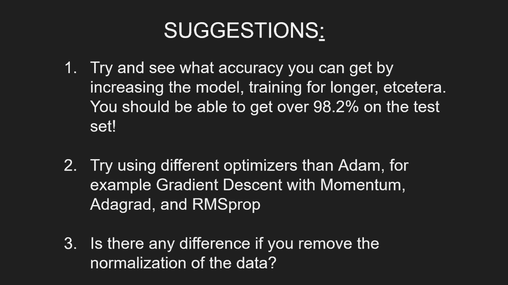

# 【双语字幕+资料下载】“当前最好的 TensorFlow 教程！”，看完就能自己动手做项目啦！＜实战教程系列＞ - P3：L3- 具有顺序和功能 API 的神经网络 - ShowMeAI - BV1em4y1U7ib

How's it going guys， hope you're doing awesome and welcome back to tutorial Nuummerro Tres。

So we're at the point where we're going to create a basic neural network now building and training neural nets has a lot of theory to it and you can follow this video and build a neural network but of course I also want you to truly understand what we're actually doing here So to keep these videos concise and to the point of learning TensorFlow I'm going to refer you to different really great resources where you can learn more about the theory and I really recommend doing that first the first resource I recommend is 31 brown neural network series and those videos are really great for building intuition and understanding and then if you want more depth and explanations I recommend these video lectures by Andrew g from course one and two of the deep learning specialization all of these three playlists are going to be in the video description so with that said。

 let's get started with the code we're going import Tensorflow as TF and before we do that actually we're going to import OS。

And then we're going to do OS do and Veron and we're going to do TFF CPP min log level and we're going to set that equal to2 and essentially this will ignore information information messages from Tensorflow but we will still get error messages and and so on then we're going。

From TensorFlow import Kas so let me just explain what CARS is since TensorFlow 2。0 KaRS is integrated with TensorFlow and is the official higher level API and is essentially the go to when we're building neural networks and models in TensorFlow so pretty much when building neural networks you will use CAS and then depending on sort of the flexibility that you need when creating your model you're going to use different APIs of CAS and more specifically in this video we're going to take a look at the sequential API of CAS and the functional API。

Then we're going to do from Tensorflow cares import layers to import the dataset we're going work with today we're going to do from Tensorflow ks data sets import Mist the data set we're working with today is the Mist data set and I'm going keep this short because I know many of you are sick and tired of hearing about Mminist so pretty much it's images of digits between0 and9 and we have 60000 training images and a test set of 10000 images the images are grayscale so they only have one channel and the pixels pixels are 28 by 28 so they are relatively small If you're run into any trouble running this on a GPU then you should try and copy paste these two line tray here but if you don't have any issue then you shouldn't have to copy them in Also I noticed that this here should just be 1 f so Tf。

Alright， so anyways， let's move on now and let's actually start with loading our data set so we're going to load the training data set。 so we're going to load X train and then Y train for the labels and also X test and Y test。And we do that by just emminist load data， and then let's print X dot shape。And also。 print Y train that shape。So we have 60，000 images where they are all 28 by 28。Now。

 one thing here is that we're going to send them to a neural network。 So we need to flatten them so that we only have one long column with those feature values。 So how we can do that is by doing x train equals to。Xtrain dot reshape-1 and then 784。 so this minus1 here means keep whatever the value is on that dimension。 So in this case 60。

000 and then put so this is going to be 28 times 28。 so we're going to flatten these two dimensions here。And also。Now when we're loading the data they're going to be nuy arrays and then they're also going to be float 64 so what we can do is we can do s type and then float 32 just to minimize some of the computation and then we also want to normalize the value so that they are rather than being between 0 and 255。

 we want to make them between 0 and 1 for faster training so we're going to divide by 255 and then we're going to do the same for the xt x test。 so x test。 reshape minus128 times 28。Then， S type。Flolow 32 and then divide by 255。So these are going to be nuy arrays， you could do something like xtrain equals Tf convert to tensor and then you could do Xtrain and similarly for ytrain etc。 but actually this is going to be done internally by Tensorflow。

 so if it's in nuy arrays we don't have to bother too much。 the conversion is just going to happen automatically so to speak。So the first thing we're going to do now is actually create a model。 so we're going to create a basic neural network and we're going to use the sequential API of KRS and how you can view the sequential API is that it's very convenient but not very flexible right。

Very convenient， not very flexible。 So what I mean by that is， for example。 it only allows you to have one input map to one output， right， That's a major limitation。 But if if if you have one input to one output， then sequential is exactly what you want to use。 So how we create this is we do model equals ks dot sequential。

And then we're gonna send in a list and that list is going be the layers so what we want to do first is we want to do layers。 denses so this is for a fully connected layer and let's say that we want to have 512 nodes in our first layer of the network and then we're going to set the activation so we just do activation equals then we're going to use the reL activation function and then you sort of write them just as the layers and then it's going to be automatically sent through those layers so for example we want another layer。

 another fully connected layer with the layer do denses and let's say we want 256 nodes in that one and then activation equals re and then for the sort of the output layer the last layer we want to have layer dens and we want to map it to 10 nodes right one node for each digit and on this one let we don't want an activation。

Function because this is our output layer。We're going to use softmax on the output layer。 but that is going to be done inside the loss function。 so then we're going to do model do compile and here we're essentially going to tell Karas how to configure the training part of our network so for example we're going to specify the loss function that we want to use so we're going to use Kaas losses。 spars categorical cross entropy。And then we're gonna have an argument that says from logicit equals true and this is because we do not have a softmax activation so when we do from logics equals true。

 it's going to send it in to a softmax first and then it's going map it to sparse categorical cross entropy so you're probably familiar with cross entropy loss when it's a sparse categorical it means that the labels so the ytrain labels are just an integer for that for the correct label so for example if it's a digit of threes if it's a digit of three。

 then the y train of that specific example will just be three if you remove the sparse so you would use categorical cross entropy。 then you would need to have one hot encodings。But that's not what we have in our case。And then we can specify the optimizer， so we're going to do Ks。 optimizeims。adom。 and then as argument we can send in the learning rate， so let's do 0。001。

And then we can sort of specify the metrics as well。 and in our case we want to have the metric to be accuracy so that CA keep tracks during training。 what is the running accuracy so far？Then after using model。compile， we can do model。fit。 so you could view it that model。compile specifies the network configurations。

 so what loss functions， what optimizes and so on， and then in model dofit we actually specify more of the concrete training of that network。We want to send in x train and y train， and then we want to specify the batch size that it's going to be trained on。

 So let's say 32。 and then let's say we want to train for5 epos。And then we can use verbos equals true so that it just prints after each epoch。 otherwise you would sort of get a progress bar， but anyways， then after we're training it。 we want to evaluate it so we're going to do model that evaluate and we're going to send in the x x test y test batch size equals 32 and then verbos right so we don't need to specify the epochs here。

 we're just going to train it for one epoch。So if we run this now。So just running it for 5b buck we get about 99% accuracy on the training set and 98% on the test set which is reasonably okay right so what I want to talk about now as we can do if we specify the input first of all so we do cares that input and we specify the shape of that input。

 so in our case 28 by 28。Then we can actually do model dot。 so we can do print model。Sprint model dot summary。And yeah let's exit the code here so I'm just gonna do C exit and then we can see sort of the network。 some information about the network so for example we have 512 nodes in our first layer we have 400。000 parameters there and then we can see 256 130 and 130k and then output we have 10 nodes with 2。

5k parameters， if we would， for example， if we would remove this input this carad input。 we wouldn't be able to print model that summary so we would or rather we could print model that summary but we would have to do it after the model that fit so after we've actually send something to the model so using this carad input lets you do model that summary and get more information about the model itself。

You could also so now we created the model where we did sequential and then we specified all of the layers。 where you could also do is you could do model equals Ks dot sequential。And then you could sort of add one layer at a time， so you could do model。 add kas input。 for example， and then shape 784。And then we could model dot add layers dot then。

 So let's do the same network and then activation equals relu。And then mod let add layer stands to 56。Actation re。And then the last layer， layers。Dance，10。Now what's amazing about this is that you can sort of do model add one layer and then you could do you know print model that summary So doing these model summary is a more is a common debugging tool So for example maybe not for these very simple neural networks but when you're building more complex models and you want to see sort of layer by layer。

 how much how much the input is changed for those specific layers。 you could do model that summary and then adding one more layer you could do model that summary again and so on。 So here are two different ways of using the sequential API and as I said it's a very convenient but not very flexible because of the fact that we can only map one input to one output this doesn't mean that the sequential API is bad in any way if you can use the sequential API you should right So this is sort of。

If you can't use it， what should you do then， and that's when we go to the functional API。The functional API。Is a bit more flexible。I can， for example handle multiple input and multiple outputs。 So let me show you how that works。 we're going to first specify the input。 so we're going to carry out that input and then shape 784。And then we are going to do x equals。

Layers do dens， 512 so we're going to build the exact same network and then we can do activation equals relu and then after you initialize this layer right here。 you're going to call it with the inputs Allright in this case sort of the previous one that we defined and then for the next layer we're just going to do x equals layers do1s to 56 activation equals relu and then here we're going to send in the previous layer so this would be x in our case and then for the outputs we're going to do outputs equals layers do dens and then we're going to do 10 nodes and yeah just to mix things up let's do activation equals softmax。

And then do X on that。Now， just because we used activation equals softmax here。 this from Loist will not be true， so we're going to have to change that to false。 which is also the the default default argument so we we could also just as well remove this entirely。 So let's rerun this now and see that it works。Allright so I'm sorry about that I forgot one one line here which is very essential。

 so one thing we saw here is that the accuracy didn't improve。 which if you think about it here we didn't use we didn't use Softmax on this model and this is the one that we latest defined so you could see sort of here how important using Softmax is but anyways。

What we need to do here is we need to do model equals ks dot model。 then we need to specify input equals input。And then output equals output。 Allright。 so that's all we have to do。 and it' it's going to take these inputs that we defined here and these outputs and build the model。 And now if we run this， this should hopefully work。

So as we see now we get something very similar to the first time we ran the model about 98% and about 98% on the test set。 so as usual you could also do printmod。 summary right here and sort of get information about the model。 one thing you could also do is you could name the specific layers so we could do something like name equals first layer name equals second layer and then if you run model dot summary we will see right here that that the first layer。 first dense layer， since that's the one we named it's going to be named first layer and then second layer。

Now I also want to show some details of how to extract specific layer outputs that might be useful when debugging and so on。 So this is gonna to work no matter if using the sequential the functional。 let's just do it for the sequential。 So I'm going to do cit exit criteria here just so that we're focusing on this model right here。 So what we're going do is we're going to overrite this model and we're going do model equals kos dot model then we're going to do input and input equals model do input and then outputs。

 we're going to specify model dot layers and then if we do minus1。 that's going to be the output right that's going be the last one。 So if we do minus-2 for example。 we're going to get the layer for that and then we need to specify dot output so then we could do something like。Like feature equal model dot predict so model that predict is for for a specific one that we send in so let's do xtrain in this case we're sending in multiple examples actually all 60。

000 but anyways we can do print feature dot shape and then we would obtain all 60。000 and then 256 for that specific layer so that's one way you could do it what you could also do is you could specify。 you could give it a name like my layer and then you could do here you could do model dot get layer and then you could specify my layer and then dot output so if we would run that we would get the exact same we are just getting the layer based on the name of that specific layer also。

You could get all of them so you could do layer do output for layer in model dot layers and in this way we would get all the features so for example we could do four feature in features and then print feature dot shape so if we run that we would now obtain the output from all of the layers so we would get the first layer the second layer and then the third layer so this might be useful sometimes when you're debugging and so on yeah so let's remove those actually so that the code is actually working as we wrote it from the beginning。

Here are a couple of suggestions to play with the code and to get some more experience so the first is that you can try and see what accuracy you can get by increasing the model size training for model training for longer etc。 and you should be able to get over 98。1% at least on the test set。

And my second suggestion is try using different optimizers than at for example。 try griding descent with momentum， addgrad and RMS Pro。 which do which one gives you the best results and then thirdly is there any difference if you remove the normalization of the data so those were some of the basics of creating neural network with Ki using the sequential and the functional API in future videos I'm going to show more complex examples of the functional API but before we do that we're going to learn how to do convolutional neural networks in the next video so with that said thank you so much for watching and I hope to see you in the next video。

