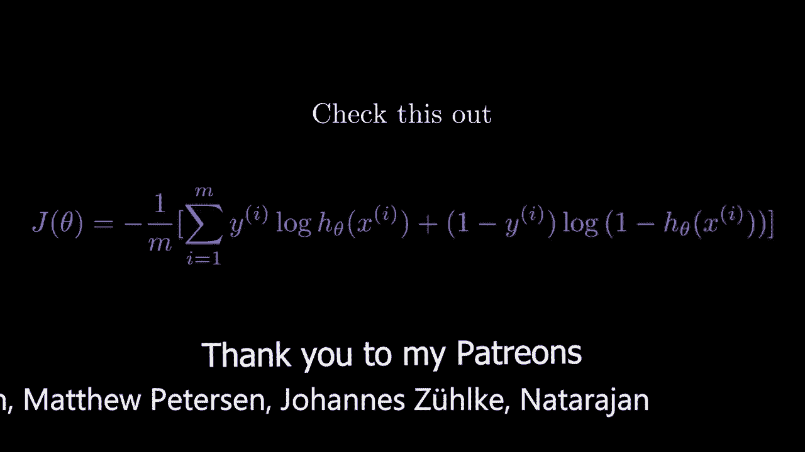
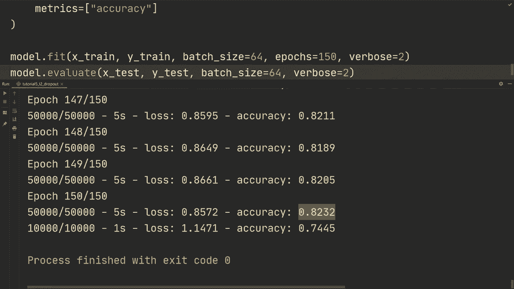

# 【双语字幕+资料下载】“当前最好的 TensorFlow 教程！”，看完就能自己动手做项目啦！＜实战教程系列＞ - P5：L5- 使用 L2 和 Dropout 添加正则化 - ShowMeAI - BV1em4y1U7ib

大家好，欢迎回来观看另一个Tensorflow教程，在上一个视频中，我们构建了一个简单的卷积神经网络，当我们训练它时，我们发现训练准确率和测试准确率之间存在相当大的差距，当出现这种情况时，我们定义模型对训练数据过拟合。现在我们称减少过拟合的方法为正则化，有多种正则化方法，简单提一下，你可以减少模型容量以避免过拟合，或者添加L2正则化、dropout、早停或数据增强。如果你不熟悉这些术语，请确保观看我之前提到的理论先修视频，我们将在这一系列教程的最后探索所有这些正则化方法，但在这个视频中我只想向你展示如何将L2正则化和dropout添加到我们的模型中。

所以在这个视频中，我们将保持简单，其他方法在我看来最好放在单独的视频中，以保持视频更加简洁。我们要做的第一件事是从Tensorflow导入层，但我们还将添加正则化器。

然后当我们向下滚动到我们的模型时，我们首先添加L正则化，你需要为每一层单独添加它，因此为了简单起见，我们也将做padding等于same，然后我们需要执行kernel regularizer。

正则化器.dot L2。然后我们将设置该特定层的去正则化权重。因此我们将其设置为0.01。然后我们必须对所有层执行此操作。因此在这一层。我们也将做padding等于same，仅为简单起见。我们将执行kernel regularizer等于regularizer L2 0.01。然后我们只需要一个更多的步骤。

所以我们将要进行操作。同样在这里。添加等于相同。列常规正则化器等于正则化器做L20。01。然后我们也将其添加到这里的全连接层。我们将添加dropout，但我们也会添加正则化。因此我们将使用两者。设置相同的权重。

然后在这些层之间，我们将设置一个dropout层。所以让我们做layers.dot.dropout。然后设置一个值为0.5，这样它将丢弃这层和那层之间的0.5连接。然后让我们通过它运行x。因此现在我们已经添加了L2和dropout。我还想提到的是，我们添加了批量归一化，批量归一化的目的是更好地规范化数据，以实现更快的训练等等。

但是它也有一个正则化的效果，因此批量规范也可以看作是一种正则化形式，所以现在我们使用的确实是三种方法：L2、dropout和批量规范。使用像dropout这样的正则化时，训练时间会更长，因为我们在每个批次之间丢弃了许多连接。所以我们在这里做的是，不是训练100次，而是实际上要运行150次。

然后让我们看看得到的测试精度如何，以及这是否比上一次训练有所改进。好的，所以在150个周期后，我们得到的训练精度为82%，测试集约为74.5%。所以看起来我们确实需要训练超过150个周期，但至少在这里我们可以看到，在上一个视频中，我们有大约93%的训练精度和72%的测试集，在这种情况下，它们之间的差距要小得多，范围明显减少。我认为如果我们再训练更久，会有更好的效果。

差距会变大，但不同之处在于我们已经看到对测试集的泛化能力更好，即使训练精度低了很多。最后一个视频的名字，不过无论如何，这个视频相对简单快捷，仅展示了如何添加L2和dropout正则化，我们将在未来的视频中探索更多添加正则化的方法。

