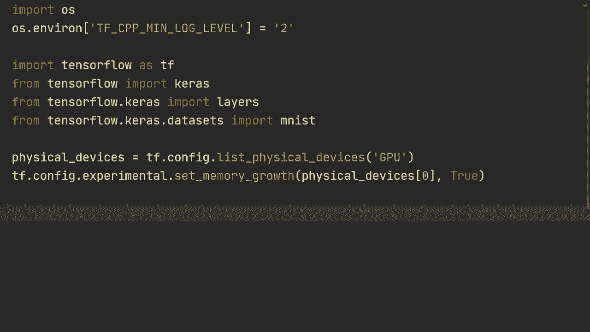
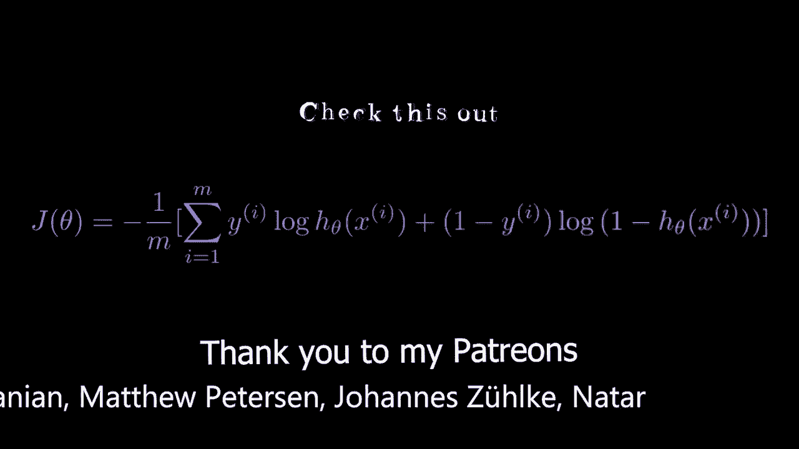
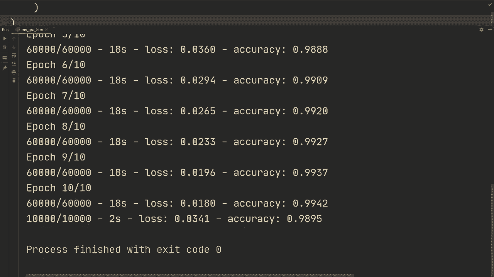

# 【双语字幕+资料下载】“当前最好的 TensorFlow 教程！”，看完就能自己动手做项目啦！＜实战教程系列＞ - P6：L6- RNN、GRU、LSTM 和双向性 - ShowMeAI - BV1em4y1U7ib

What is going on guys hope you're doing awesome， roll that intro and then let's do some RNN and shit。

Alright， so I got the usual imports that we normally have。

 This is for ignoring the Tensorflow messages that can be quite annoying。

 although we'll still get error messages and then Tensorflowlow Kas layers to construct our layers and then the emminis data set and then this is just so that the if you have any trouble running on a GPU these two lines will most likely help you。

 Allright， so let's let's start with what we actually want to do。

 we're going to start with loading our data so we're going to do Xtrain。Y train and then X test。

 Y test。Is equal to Ms dot load data， then we're going to do xtrain equals xtrain as type float 32。

 Currently it's float 64 just to save on own computation， we're going to convert it。

 and then we're going to normalize by dividing by 255， So it's in between 0 and 1。

And let's do the same for the the test set。 So flow 32， divided by 255。

 So what we're doing here is that we have。We have an image of 28 by 28 pixels and how this is going to work when we're going to send it in to an RN or a GRU or an LSTM。

 we're going to do all three of those， but we're essentially going to view for each time step you're going to sort of unroll one row of the image at a time So for a particular time step let's say the first time step It's going to take the first row of the image and send that in and then for the second time step it's going to take the second row and send that in and just to be clear you wouldn't use sequence models to handle images。

 It's not the best model for it， you would use a commnet that we covered two videos ago but。

It works to use RNN。 and as we'll see， will'll get reasonable performance。

 although this is more to illustrate how you would actually。

Implement an R N and a GR U and LSTM in Tensorflow。 and the data set is not the optimal one。

 but we're just picking in a simple one to illustrate this example。 Al right， so with that said。

 let's actually do our model， we're going to do kos dot sequential。

We're going to do model that add and then specify the input。 in this case。

 we're going to specify none and then 28。So what we're specifying none here is because we dont have to have a specific number of time step right so we have 28 pixels in each time step and then in this case we actually have 28 time step but we don't have to specify that dimension。

And then we're going to do model。 add and then layers simple Rn。 So that's just for a basic Rn。

 and then let's say 512 nodes。And then as an additional argument we can do return sequences equals true so that it's returning the output from each time step and in that way we can stack multiple RnN layers on top of each other so the output from this RnN is going to be 512 nodes and then return sequences it's going to output 512 for each time step in this case we're going to have 28 time steps and then we can also do activation we can set it to Relu。

And then we can add another one， we can demand let add layers simple R n， and let's do 512 again。

 and we're going to set activation equals Relu。And then for the output layer we're going to do model add layers。

 dense and we're going to have 10 output nodes， so you would notice here that we're not doing return sequences on this second simple Rnn so here for the output we don't have return sequences equals true。

 meaning that it's going to pass every time step and then at the last the last output of this simple Rnn here。

 we're going to take a layer dense on top of that one and we're going to have 10 output nodes。

Let's do print model summary first so as we can see here on the model summary for this first Rnn we're gonna to have none none and then 512 so we're going have 512 output node and then we're going have for each time step here and the reason that we have none and none is that we have the first one for the batches or one of these are for the batches and one of them are for the hidden states I think this one is for the batches this one is for the hidden states and then at the second one we're not having return sequences equals true so we only have none for the batches and then we have 512 nodes from sort of the last hidden state when it's past all of the input and then at the end we just have a layer on top of that one So all that's left now is for us to do model do compile and we're going to specify a loss function and ks do losses sparse category。

croros entropy then we're going to set from logics equals true because we do not have a softmax on our dense layer at the end and then optimizer。

 we're going to Kas do optimizers do atom。And let's set the learning rate to 0。001。And then metrics。

 we're just going keep track of the accuracy。 All that's left now is for us to do model that's fit on the training set。

And then specifying the batch size， let's say 64。 and then let's run for 10pos。

And verbo equals2 just for printing every epoch。 And then at the end。

 we want to do an evaluation on our test set。 So we're going to send an X test and then the labels Y test。

We're also going to specify the batch size 64， and then again verboos equals。Equals 2。Alright。

 so let's run that and see if this works。Alright， so after 10 epos we got 98% on on the training set and almost 98% on the test set as well。

 I just want to say here that we used an activation REL。

 the default when training recurrent networks is that you use 10h。

 so I don't know if that would work better in this case， but anyways。Just wanted to mention that。

 So if you wouldn't specify an activation function。

 it would default B 10h when when building these recurrent nets。

 So also one thing here is that it took a little bit longer than I thought to run this so let's just use 256 for our next models what we want to do now is pretty much the same thing but we want to build a GRU instead and all we got to do to do that is we just got us change this this simple Rn to a GRU and that's pretty much that's all you have to do so if we now rerun that we can see what it gets and I guess this is not really a fair comparison but GRU should perform better than simple Rnns although now we're using half of the units and then we're using 10h instead of RElu but the point is not really to compare the to just see that it works and and show you how to use simple Rnn GRU and then。

LSTM， which is quite simple as well， we're just going to change this to an LSTM， but anyways。

 then I also want to show you how to do a bidirectional layer。Alright， so after 10pos we had 99。

5% on the training and we get close to 99% on the test set。

 which is quite good actually it's two layered GRus with 256 units I mean to get that is pretty decent actually so let's now change this to an LSTM and see if it's an improvement so。

LSTMs and GRUs are equivalent in terms of performance。

 I think LSTMs are a little bit better than GRUs， but let's see if that's the case on this data set。

Alright， so it seems that we get pretty much the identical performance。

 LSTMs were a little bit better， perhaps on the test head， but pretty much the same。

 So what we want to do now is we want to add instead of using just a one directionional LSTM。

 We want to use a bidirectional and it's pretty easy to add that as well。

 we're just going do layers do bidirectional and let's do it like this。 and then like this。

 So we're just gonna add layers bidirectional and then we're gonna send in that LSTM layer。

 And let's do that for the second one。OrRather， let's do。Alright。

 so let's let's first do Mo print a model that summary and just see how it looks like。Alright。

 so I'm not going to let this train。 So what we get here is as you can see since we added this layer bidirectional。

 we're going to get 512 nodes instead of this 256。 So what it's doing here is we're specifying the number of nodes for each hidden for each of its computation for each hidden state in the LSTM to be 256 nodes。

 but since we add this bidirectional we're going have one going forward and one going backwards So this is going get doubled in the amount of nodes as we see here。

 So what we can do then is for the second one we can do also a layers that bidirectional and then。

We can add that。😔，Right there and that's also going to have 512 nodes。

 So let's run that and see if the bidirectional is any better than the one direction just having one direction on the LSTM。

After 10 epos， we see that the performance is about the same as just using one direction so the bidirectional didn't really help and。

And I'm not really sure why that is maybe it just needs more training or it just doesn't help that much。

For this particular dataset， but in general using bidirectional as more of a default is a good option。

 but anyways that was the basics of how to do a simple RN a GRU LTM and then also how to add bidirectality and in this scenario we use the MNIS dataset so we made it very easy for ourselves when using the Ms data and when training on more complex data you need to think about more things such as padding the data and masking the data for each batch and we're going to cover that in future videos when we're going to load more complex data and loading more custom data。

 So with that said thank you for watching and I hope to see you in the next video。

