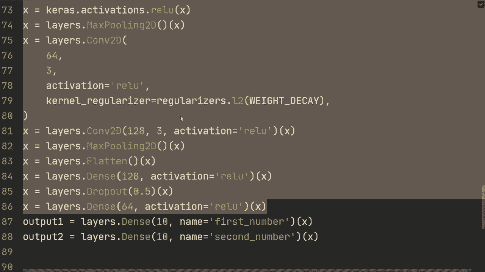
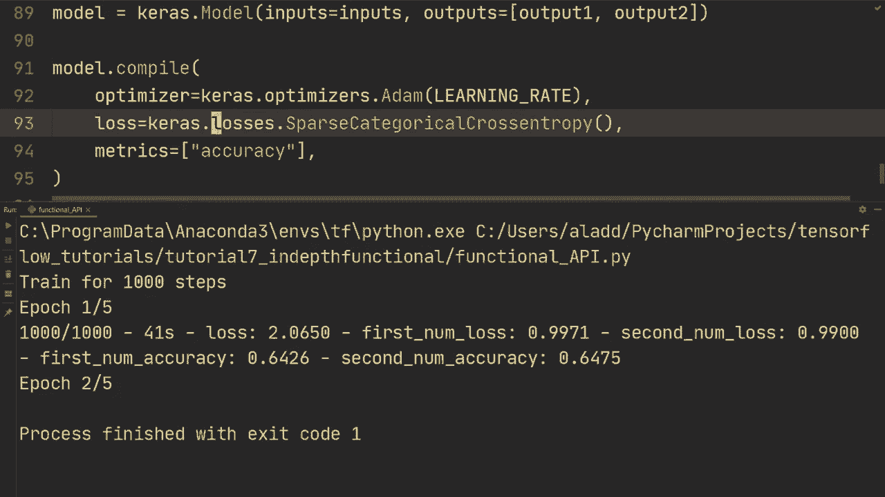

# 【双语字幕+资料下载】“当前最好的 TensorFlow 教程！”，看完就能自己动手做项目啦！＜实战教程系列＞ - P7：L7- 函数式 API 的更深入示例 - ShowMeAI - BV1em4y1U7ib

What's going on guys， hope you're doing awesome and welcome back for another Tensorflowlow tutorial so I feel a little bit bad because so far we've been using both the sequential and the functional API but really for the examples that I've given that really wouldn't be a point to use the functional API so I want to give you a more real example where you can't actually use just a sequential API and so we're taking another look at MNist but with a little twist we now have two MIS digits per example for example here we have the digit zero and one。

And I'm going have a link in the description for you to download this so that you can also follow along with the video。

 but anyways we're not gonna to actually focus on on the custom data。

 so loading the actual data that's going to be for a future separate video for now I just want to give you a little bit more an actual example for when the functional API becomes useful so let's get to the code and what we have right here is just the basic imports that we've been using so we also have one more which is pandas and this is going to be used to load the data set so you can just do Conda install pandas I believe and then you'll have this and so as I said we're not gonna to focus on the actual data loading part meaning I'm going to copy paste and stuff here and I don't like copy pasting stuff but we're not going to focus on on that part in this video so you can also there's going to be a link in the description where you can copy paste this code as well。

I'm just going to paste that and basically right here this is for loading the actual data all right so we're using pandas to read from a CSV file and then we're using Tf do data and again I'm going to cover this in a separate video to actually load the data So what I do want to focus on is that now we have two target values for each example meaning we can't use the sequential because remember sequential can only map one input to one output but now we actually have two outputs so we're going to build a model and remember we have to use the functional now so we're going to do start with Ks。

 input we're going to specify the input shape and in this case they are 64 by 64 pixels and then they are one channel just because they are grayscale and then we're going to do a comm layer comm 2D and we're going to specify filters let's say 32 we're going specify the current。

Size let's say3 just for keeping it simple。 and then yeah。

 I guess we can do padding equals same and then we're going to also do regularization。

 So let's actually go to the top here and I also want to specify just some hyperparameter。

 so let's do hyperparameters。And let's specify the batch size。

Let's do 64 and let's specify weight decay to be 0。001。

 so for L2 normalization that we did two videos ago， I believe。

 and then let's specify the learning rate 0。001。Alright， so let's go back now to our model。

 So we're going to do kernel regularizer。 I'm going to T cart。Actually， we can。

 we can also import that。 So let's do layers。Input regulars。And then， go back。😔。

And then regularizers dot L2， and then of weight decay。All right。

And then we got a of inputs right there。Now let's do a batch layer。

 So layers batch normalization of X。 So so far nothing is new， right， we've done all of this before。

 And there's not that much different， but I just wanted to give you sort of a more in depth example where you would actually use this。

 So the difference is going to be when when we get to the output。But anyways。

 then let's you do kas that activation， thatt re。Of x， then let's do another comm to D。to the。Of。

 I don't know， let's say。64，3， and then kernel regularizer equal regulars dot L2。Of weight decay。

And then let's also send in the input X on that。 and again。

 we're going to do just a batch normalization， send in x， and then Kaos activations that relu。Of x。

And let's do a max pooling right here。So。I don't know。 Let's do another comlay。Com to the。

Let's just specify 64，3。Then let's just do relu。 So no bathroom here and then kernel regularizer。

Caras just regulars that L2 of weight。Okay。And then。Yeah， we can do one more so come to。

To D 128 filters now， so let's double it，3 activation equals Relu， then just send in x。

And then we can do one max max pooling and then。Let's flatten it。

 and then let's now get to the output。So what we're going to do is we're going to do one dense layer。

 so layer den， it's do 128 nodes。And let's set it activation equals value on that and sending next。

And。Let's also add some regularization so let's do layers drop out 0。5 and then send in X。And then。

Yeah， we can actually do one more layer then so let's do layer down 64 activation equals rather of x。

 And now we get to the actual。 So now we get to the actual output。 So what we want to do now。

 let's do output one and let's do a dense layer。You going do 10 nodes， and then。Let's call it。

 let's give it a name。 So it's our first number。And then we're going to send in x， and then output 2。

 we're going to do layer den of 10 name。Second number。 and then we're gonna send in x。

 So as you can see here we we're using the input X to map to two different outputs right so this would essentially give two different branches of this thing right here and this is when things like the functional API becomes useful right just these two lines right here because we so the sequential is nice。

 it's very simple， it's very compact but it can't do things like this and that's。

That's this narrow when we actually have to use the functional and you could also combine them。

 So for example you could， you could do this right here in in a sequential and then you could just do these two on the functional。

 So you could you can also combine the two。 but anyways。

 I'm just gonna so this is just for two outputs and then I'm gonna do model。

modelel was cares that model input equals input outputs is now a list and we're going to do output 1。

 outputs 2。And then when we do model that。😔，Compile。We're going to set the optimizer。

 let's do optimizers do Adam。And let's set learning rate here。

And then we're going to specify the loss。 and then the loss is actually going to be two losses。

 So we're going to do losses， sparse。 We're going to use sparse categorical。Pross entropy。

 and then from large， it equals true。Or actually， let's remove that this time。 So let's do。

We can specify here activation equals softftmax。Like that。

 So that then we don't need to do from Loit。So activation softmax。

And then we're going to do one more loss function。And I think there's a way to make this more compact。

 I haven't actually tried it， but I think that if you would just specify this。

 that would be for both。 but you could try that out。

 So the safe way is just to write them all up So we're going to use spars。Categorical cross entropy。

For both。And then we want to keep track of metrics equals。Accuracy。

And now as usual we're going to do model do fit in this case。

 we're just going to send in train data and batch size and everything is taking care inside this data loading part which I haven't covered again。

 but we don't care too much about that then let's do epoch 5 both equals2 and then model dot evaluate。

Evaluate on the on the test data set。And then verbose equals2。And yeah。

 so let's run this and let's see what kind of accuracy we get when we're training on this multi digigit Mist if we do not get the errors。

 so we。Cars has no attribute。😔，Activation， so we' got to do activations， I believe。

 so let's find that error， let's see。Activations。Go back。😔，There we go activations。

 So activations right there。 And let's hope there's nowhere probably。There's going be more。All right。

 so I've probably forgot to send it in right here。😔，Are there any more errors， let's see。

I cannot find anymore， so let's run it again。Alright， outputs  one is outputs once。 Yeah。

 we can do outputs。 So I call it output。Like that。Now， please work。 got them。

 No data provided for first。Number。Alright， so after a very long time， I think I found the error。

 So the error was no data provided for first number。

 knee data for each key in first number and second number。 Alright， and surprisingly。

 I have no idea why， but if I just remove。This so that it says first nu and second nu。

 then if I rerun it。It actually starts training without an error and。I have no idea， actually。

 why that is。 If you know， then， please do comment becauseuse I'm very surprised by that。

 Probably one of the weirdest errors I've had。After five entire epochs we have 96。

3% on the training on both pretty much both of the digits and that's a little bit interesting to see that when it start to recognize one of the digits it also starts to recognize the other one so they improve pretty much on equal level and then so if you would train this for longer I would suspect that you would improve this quite a bit but then on the test set anyways。

 we get about 90% but then on the second value would get 83 so I guess on the test set might be more difficult to recognize the second number but anyways one thing I also wanted to check is that what if we remove and we just have a single loss function it would be nice if this would then extend to both of them so let's try and see if that works and that does seem to work all right so that's it for this video and taking a deep。

look at the Fun API with a more real example， thank you so much for watching the video and I hope to see you in the next one。

