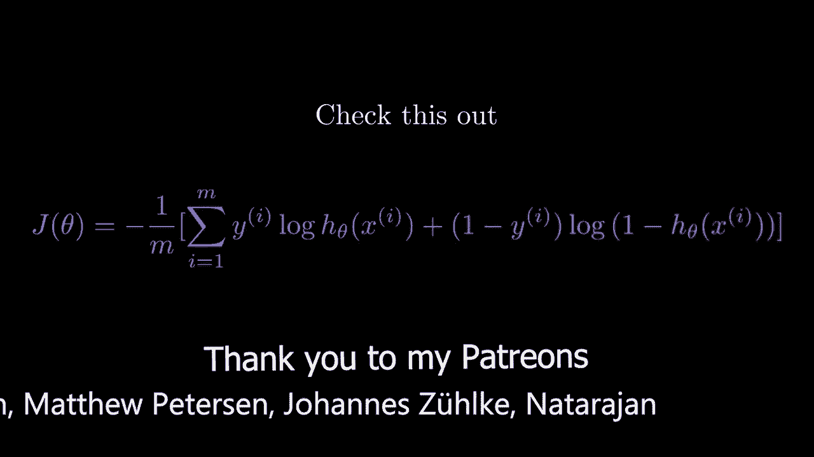
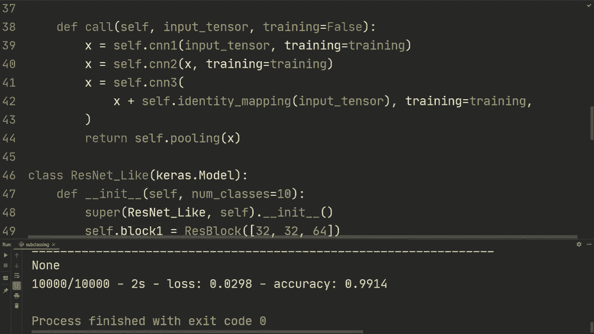

# 【双语字幕+资料下载】“当前最好的 TensorFlow 教程！”，看完就能自己动手做项目啦！＜实战教程系列＞ - P8：L8- 使用 Keras 进行模型子类化 - ShowMeAI - BV1em4y1U7ib

What is going on guys。 Hope you're doing awesome and welcome back in this video。 We're going to take the next step in building our models and we're going to learn about model subclassing。 which is a incredibly flexible way to build models and so so far we've touched on the sequential API that has very little flexibility but it's very convenient and then we also saw examples on the functional API for more flexibility in building our models and in this video we're going to use the subclassing which has the most amount of flexibility So I'm just going copy in all of the imports and stuff like that so we have seen all of this before so that we don't waste too much time on this So OS and for ignoring information messages from Tensorflow Keas layers to build our model Ms the data and these two lines will help you out if you running into an issues on running on the GPU and then we have these three lines right here that are just going to load the dataset。

We're loading MNist and then we're doing a reshape right here。 we're only doing the reshape to add this dimension here for the number of channels。 and then we're converting it to F 32 and we're dividing by 255 to normalize the data。Alright so all of this is something that you've seen before what we want to do now is is well first to sort of motivate what we're going to do is we've seen the example that we have a convolutional network and then mapping it to or running it through batch norm and then running it to rather right this is a common structure right that we we've used multiple times and let's say you would do this and you would write that code times 10 now that would be a lot of code to write so what we can do is we can actually create a class for this kind of block so let's do that and let's do class CNN block。

And we're going to inherit from layers thatt layer。And what this is going to do is it's going to keep track of everything under hood for doing back propagation and all of that stuff。And then。We're just going to create an init function and we're going to specify the number of out channels and then let's say the kernel size。So if you're familiar with Pytorch subclassing is using Kra subclassing is essentially exactly the same as creating Pytorch models。

 so we create our in function first and we have information about how we want to build this block and we're going to do super to run the parent。Parent class layer that layer， and then we're going to do CNNM block self。In it。And we're going to create our comb layer。 So Seph。 co is layers Com2 D。And we're and we're going to specify the out channels and then the kernel sides。

And then let's do padding equals the same。And then for the batch room。 we're just going to do layers dot batch normalization。And then we're just going to do a call method。 so we're going to do call input tensor， and then we're going to specify training。 and let's just set it to default as training to default false。

So this is we're specifying training here because we're using batch norm。 how batch norm works is different when it's in training mode or evaluation mode but anyways。 we have a call method right here and。The call method， if you're used Pytorch。 is essentially the forward method。But anyway here。

 so we're initializing the modules we're going to use in this case comm 2 D and batchor and then in the call method we're taking some input tensor and we're going to run it through those layers so we're going to do x equals self。com of input tens， then we're going to do self。baor of x。

 and then we're going to specify training equals training and then we're going to do x equals Tf。nn。 Relu。Of x。So we're doing comm batch numberrlu， and then we're going to return X。That's the structure that we saw right here。Although now we can reuse it multiple times from this class。 so for example， we could do something like。Our model is Kra dot sequential。

And we're going to do CNN block and let's say we have 32 out channels。CNN blocklock 64 out channels。CNM block 128 and then layers flatten。And then layers1s 10 nodes。 Allright， so I mean。 if you would write this code right here， just for this block， it would be multiple lines。 three lines， right， it would be for theumbmber， the batch norm and the the Relu which would be quite annoying would just take up unnecessary space and not be as concise So this is one way we can do it and we could we could also specify now so we could do model dot compile。

 we can do optimizer equals ks do optimizes do atom and we could do loss equals ks losses spars。Pateorical cross entropy， then from logicits equals true。Metrics， we're gonna use accuracy as metric。 and then we could do model that fit。On our x train， y train。Bch size，64 epochs。I don't know，3。 and then verbose equals。2， and then let's also do model dot evaluate x test， y test。

 batch size or 64 where both equals 2。 and then let's run that。So after 3 bucks。 we get 99% training and then 98。75 on the test set。So what's pretty amazing as well in creating these blocks and doing these call methods is that it kind of feels like first of all it's pretty much like Pytors if you're used to that but if you're used to Nmpy it kind of feels like you're you're using Nmpy but I've also heard that it kind of feels like objectoriented Nmpy and I would agree with that because it feels very intuitive we can do things like print X dot shape and we can run that and then it would each time this is called it would then print the shape of x at that point and so this CNN block is run multiple times depending on the channels right so first we had 32 then 64 and then 128 and then it's rerun again so 32 6428 which makes debugging incredibly simple。

 it makes it so that you can just print the shapes wherever you feel like printing it。But anyways。 let let's now make something more complicated or I guess more a bigger model。 So we're gonna to do class something called Resblock so this is be we're going to build something similar to Resnet and hopefully at the end of this video you can sort of view it from the perspective that what if we use the functional or just sequential API to reconstruct something similar as we're doing in this video and hopefully you'll feel that it would be very。

 very difficult or take a lot of space and not to be as compact as we're doing it in this video So if you're not familiar with Resnet。 there's a video in the description that you can watch so you're more familiar we're not going to reconstruct Resnet but we're going to do something similar to Resnet So anyways we're going to do layer dot layer again。

And then we're going to do in it。And then let's do， we're gonna sending channels。 Alright。 so let's do that one res block。 And first of all， we got it called the。Super in it。 And then let's say that the res block is gonna have three of these。 these CNN blocks that we created。 Alright， so we could do something like we could send in channels right here And let's say it's default。

 I du't know，32。6428， something like that。 And then we're gonna do。Or actually。 let's not initialize them。 Let's just say we have channels。 It's going to be a list of three values。 and we're going to create three CNN blocks。 So let's do self CNNN 1 is CNN block。 and we're going to do channels。Channels0 and then kernel size 3。

 and we don't actually have to specify that。 So remember， we use the keyword argument here。 and we set it to3 so we can just keep it like that and then self dot CNN N 2。 We're going do another block。 and let's use channels 1。And then self CNN3。 we're going to do CNN block。Channels2。And then we could do something like pooling。

Layers dot max oing 2 d。😔，And then so。We're going to run three of these blocks where each block is a CNN。 a batchor and then Relu， and then we're going to run a max pool to sort of have the input size in the height and the width。And then we're going to use the an identity mapping similar to Resnets with these skip connections。 so what we're going to do there。Is that we got to do an identity mapping so that there it has the same number of channels。

 So remember we're not doing so we're using same convolution so the height and the width wont won't change。 but the channels might。 So we need to do a identity mapping what we're going to do layers come to D。 We're just going specify channels 1。And then we're going to do kernel size 3。 adding equals the same。And then for the call， so if this is a little bit。

 this doesn't feel super clear right now， don't worry， I'm going to explain it again。 but we're going to do the calm method， we're going to do an inputtensor and we're going to specify training to be false as default。And then we're going to do x is self。 CNNnn1， the input we're going to send the input tensor through the first CNNn block。And then we're going to do training equals training。 We're going to do cells that CNN 2 of x。

 then again， specify training。And then we're going to run it through the last one， all right。 and for this one， we're going to do x， but we're also going to add this identity mapping。We're gonna do input。tenensor and then we're gonna specify training equals training。 So what we're doing here is that we're using these skip connections right here。

 but for this one it has passed through this CNNnn2 and changing the number of channels that it was originally to the number of channels that we send in through this list So this integer channels of index1 so that's all we're doing here running it through the CNN block first second block and then to match number of channels so that we can actually do this addition。

 we're first running the input tensor through an identity mapping and then we're adding that to x。 All right so when editing this I actually see that there's a mistake here So for the identity mapping we use the kernel size of three which shouldn't be the case that then we're actually doing a comp layer but we just want to do in identity mapping。

 changing the number of channels as output So what you would do here is you would actually change this kernel size to one and in this way the only thing that it would actually do is。Is it sort of doing identity mapping and changing the number of channels。 And then at the end。

 let's just do this pooling of X and let's return that So return self pooling of x。Alright。 so so far we have had， let's remove that。 We're not going to use that again。 So so far we've done the CNNM block。 we've done this res block。 and then let's do the。 let's do the final sort of the model， right？ So we're gonna do class resnet。

Let's called resonant like and then now for the parent method we're going to use ks do model All right so this is for the layers。 we're going to use layers。 layer meaning we're not going to use that as our final model so when we're inheriting from ks。 model it has the functionality that layers that layer has。 but it also has some additional functionality so for example we have builtin training evaluation so that we can use what we're familiar with in a model do fit modelevaluate model。

pre so those are available if you inherit from ks do model but not if you do layers layer and you also have other properties so that you can do for example model layers checking all of the layers in the model model summary and you can also do things like serialization and then saving your model we're going to cover that in another video though but。

Just know that CAs that model has additional functionality that layer that layer doesn't have。 and you should use CAs that model on your final model and hopefully that makes sense。So what we're going to do here， we're going to define in it。 and here we're going to specify the number of classes， so let's say 10。

 and then we're going to first， let's see we're going to call super of Resnet like。And then， self。 and then。In it。 And then we're going to do self the block1 is going to be res block。OfLet's see。 So this is something you can play around with， let's just say 32， 32， 64。And then block two。 let's do rest block。128，128 to 56。And then， block 3。😔，Res blocklock128256512。

 So we're just specifying the channels for each of the the CNN CNN CNN blocks in this res block and so you can sort of see that we're scaling this and making this bigger and bigger and it might become difficult to sort of understand what we're doing but if you just step through it step by step we first created the CNN block just using combat re because we want to reuse it for different numbers of channels then we built this res block that it uses these these blocks multiple times and also a pooling layer together with this identity mapping and then we're just using that block in the resnet like model and then at the end we're going to do self dot pool we're going to do layers global average pooling 2D and you can read about this but this is essentially gonna average。

Pull the height and the width。 Then we're just going to do a， for example， you could replace a flat。 So instead of doing this， you could do。Layers。 flatten if you feel more comfortable with that if you so we're using it sort of in the same functionality that we want to flatten it or to downscale the heighten the width and then send it through a last classification layer。

 so that's what we're going to do now we're going to do self dot classifier layers dense and then of number of classes。And so now what's all that's left is to do the call， so we're going to do input tensor。 we're going to do training， set it test default false。And then。We're going to do Se to block one of input tensor。 We're going to specify training。

And from my understanding specifying training here that's going to be done inside this model that fit or model evaluateval we're also going to show in future videos how to do custom training loops and so on。 but I think this is done internally in model that fit if we just specify training right here that's going to send the argument depending on for example here we're training so that would set training to true and then when for the evaluation it would then set model to false or rather training to false。

And then。We're going to do block 2 of x， again specify training。We're going to do Se to block 3 of x。 again， specify training。And then at the end， we're going to do self dot pool of x。 And then we're going to do x is。Or actually just return self dot classifier of x。And what would probably help now is doing。Model that summary。So after the model that fit here。

 let's do print model dot summary。Right there。 And let's just run it for single epoch。 First of all。 Alright， yeah， we need to also specify our model。 So we gotta do model equals res。Ne。Like。 and then we can do classes equals 10， and now we can hopefully run that。Alright。 so we can see after one Epo， we have 97% on the training。

 And then here we can see the the sort of the。The layers of our model and we can see we have a re block。 res block， Res block， and then average pulling， and then thens what's kind of annoying here is that we have multiple output shapes and this is usually the case when you're doing subclassing。

But I found one workaround。 I'm not sure if this is the best way to do it。 but just for now you can use this so we can do model self。We're going to do x carriess that input shape specify。 And then let's do 28，28，28，1。AndThen return。 ks dot model inputs equals x， and then outputs equals self dot call of x。

And so what this is going to do is it's going to overwrite the model call and then we could do something like model model。 model， call that and then do dot summary and in this way we're actually going to get the output shapes So I'm just going to let this run and then we'll see what it looks like。

Alright so what we can see now is that the output shapes are actually included we have none for the number of batches。 28281 for the input image after the first re block it's 64 number of channels and then it's 14 by 14 so it's included  one max pooling and then we're max pulling again where max pulling one more time and then that's run through an average pooling so as you can see here as you can see here we have in this case 512 channels and then we have heightened width of3 by 3 we're essentially averaging all of those3 by3512 into a single 512 and then we're running that through a single dense layer and total number parameters are 3 million which is I guess much larger than what we've done but not relatively to other models this is still pretty small but so hopefully you can see that if you would have built this model right this is a huge。

And we can't even see so from the model summary we can't actually see all of the layers right we're just seeing these blocks but these blocks。 so each block has multiple of these CNN blocks right all of these resonant blocks as multiple so this model is pretty large if you would plot it and if you would use this I mean use the sequential API I don't you can't even use the sequential API I think but it would be。

It would be a lot more annoying to build this。 And so hopefully this is a something that illustrates。Why doing subclassing can be very good and you also have a lot of flexibility that you can pretty much build your models as you want and you can also you can print everything during the call and that's very intuitive。

 I really feel the subclassing is a great way to build your models and in the next video we're also going to show how to do these custom layers using this subclassing so that for example。 let's say we're now using these this dense layer right how would you actually go about building a dense layer by yourself and stuff like that So that's what we're going to do in next video I thought just for fun。

 we could run this for a little bit longer and we could see what kind of accuracy we can actually get with this the largest model we've built in these tutorials so far So let's run this and this is gonna to take a while but it's going to go pretty fast for you So yeah I'm going let it run and I'm gonna to wait until it's done。

Al right so after about 20 epochs we get 99。84% on the training then 99。14 on the test set I think if you train this for just a little bit longer so that you get this up to 99 when I trained it previously I actually got 99。4% on a test set but then I trained for a couple of more epos and then what I think you could also do is add regularization and the model would improve but nonetheless I think this video really demonstrates the power of subclassing and hopefully you think subclassing is awesome after this video thank you so much for watching this video and I hope to see you in the next one。

