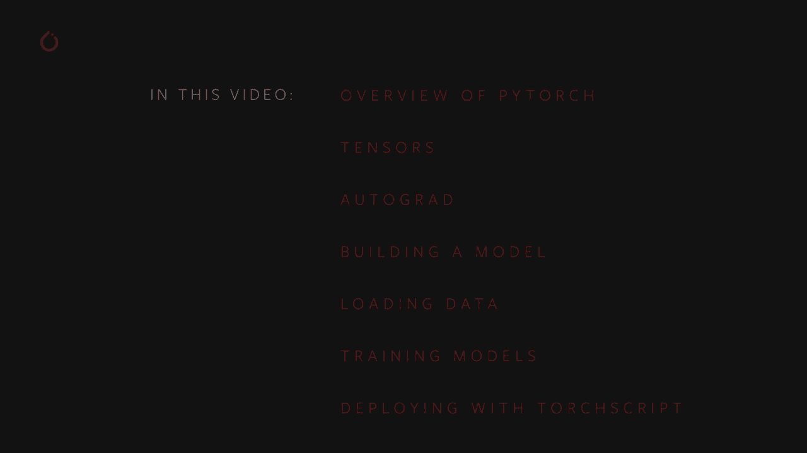
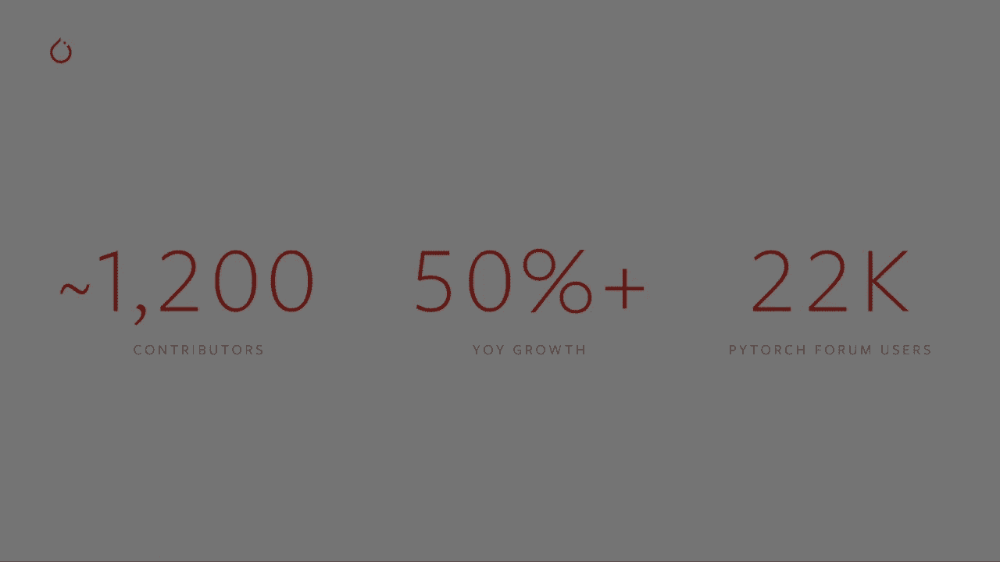
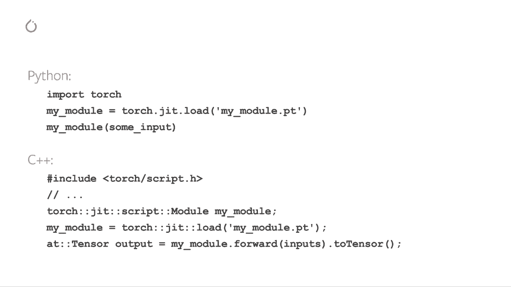

# 【双语字幕+资料下载】140分钟入门 PyTorch，官方教程手把手教你训练第一个深度学习模型！＜官方教程系列＞ - P1：L1- PyTorch 简介 - ShowMeAI - BV19L4y1t7tu

Hello， my name is Brad Heinz。 I'm a partner engineer working with the Piytorrch team at Facebook。In this video， I'll be giving you an introduction to Pytorrch， its features。 key concepts and associated tools and libraries。 This overview assumes that you are new to doing machine learning with Pytorrch。

In this video， we're going to cover an overview of Pytorr and related projects。Tenssors。 which are the core data abstraction of Ptorrch。Autograd。 which tries the eager mode computation that makes rapid iteration in your model possible。We'll talk about building a model with Ptorrch modules。

We'll talk about how to load your data efficiently to train your model。We'll demonstrate a basic training loop。And finally， we'll talk about deployment with Torchscript。

Before we get started， you'll want to install Pytorrch and torch visions so you can follow along with the demos and exercises。 If you haven't installed the latest version of Pytorrch yet， visit Pytorrch dot org。The front page has an installed wizard shown here。There are two important things to note here。 First。 coupa drivers are not available for the Mac。 Therefore。

 GP PU acceleration is not going to be available by a pietorch on the Mac。Second。 if you're working on a Linux or Windows machine with one or more NviIdia couda compatible GPUs attached。 make sure the version of couta tool kit you installed matches the couda drivers on your machine。

So what is Pytorch？

Pytorch。org。Tells us that Pytorch is an open source machine learning framework that accelerates the path from research prototyping to production deployment。Let's unpack that。First。Pytorchches software for machine learning。 It contains a full toolkit for building and deploying M L applications。 including deep learning primitives， such as neural network layer types。

 activation functions and gradient based optimizers。 It has hardware acceleration on Nvidia GPus。 and it has associated libraries for computer vision。 text and natural language and audio applications。Torchssion。 the Pytorrch Library for Computer vision applications。

 also includes pre trained models and packaged data sets that you can use to train your own models。Pytorch is built to enable fast iteration on your M L models and applications。 You can work in regular idiomatic Python。 There is no new domain specific language to learn to build your computation graph with autograd。 Pytorch's automatic differentiation engine， the backward passover your model is done with a single function call and done correctly。

 no matter which path through the code a computation took。 offering you unparalleled flexibility in model design。Pytorch has the tooling to work at enterprise scale with tools like Torchcr。 which is a way to create serializable and optimizable models from your Pytorrch code， Torchserv。

 Pytorrch's model serving solution and multiple options for quantizing your model for performance。And finally， Pytorrch is free in open source software。 free to use and open to contributions from the community。

Its open source nature fosters a rich ecosystem of community projects as well。 supporting use cases from satochastic processes to graph based neural networks。

The Pyetorrch community is large and growing， with over 1200 contributors to the project from around the world and over 50% cent year on year growth in research paper citations。

Petorrch is in use at top tier companies like these and provides the foundations for projects like Alan N LP。 the Open source Research Library for deep learninging with Natural Language， Fast AI。 which simplifies training fast and accurate neural nets using best modern practices。Classy vision and end to end framework for image and video classification and cap。

 an open source extensible library that helps you understand and interpret your model's behavior。Now that you've been introduced to Pytorrch， let's look under the hood。 Tensors will be at the center of everything you do in P torch。 Your models， inputs。 outputs and learning weights are all in the form of tensors。

Now， if Tensor is not a part of your normal mathematical vocabulary。 just know that in this context。 we're talking about a multidisional array， but with a lot of extra bells and whistles。Pietorrch tensors come bundled with over 300 mathematical and logical operations that can be performed on them。Though you access tensors through a Python API， the computation actually happens in compiled C++ code optimized for CPUU and GPU。

Let's look at some typical tensor manipulations in Pytorrch。

The first thing we'll need to do is import pi torch with the import torch call。Then we'll go ahead and create our first tensor here。 I'm going to take create a two dimensional tensor with five rows and three columns and fill it with zeros。 I'm going to query it for the data type of those zeros。

And here you can see I got my requested matrix of 15 zeros， and the data is 32 B floating point。 By default， pi torch creates all tensors as 32 bit floating point。What if you wanted integers instead， you can always override the default。Here in the next cell。 I create a tensor full of ones。 I request that they be 16 B integers and note that when I print it without being asked。

 Pytorrch tells me that these are 16 B integers because it's not the default that might not be what I expect。It's common to initialize learning weights randomly。 often with a specific seed for the random number generators that you can reproduce your results on subsequent runs here。 we demonstrate。Seeding the pytorch random mirror generator with a specific number。

Generating a random tensor。Generating a second random tensor。 which we expect to be different from the first reseing the random number generator with the same input。And then finally， creating another random tensor， which we expect to match the first since it was the first thing created after seeding the R G。And sure enough， those are the results we get。First tensor and the third tensor do match。

 and the second one does not。Arithmetic with Pytorch tensors is intuitive。 Tensors of similar shapes may be added， multiplied， et cetera。 and operations between a scalar and a tensor will distribute over all the cells of the tensor。 So let's look at a couple of examples。First， I'm just going to create a tensor full of ones。

Then I'm going to create another tensor full of ones。 but I'm going to multiply it by a scalar 2。 And what's going to happen is all of those ones are going to become twos。 The multiplication is distributed over every element of the tensor。Then I'll add the two tensors。 I can do this because they're of the same shape。The operation happens element wise between the two of them。

 And we get out now a tensor full of threes。 When I query that tensor for its shape。 it's the same shape as the two input tensors from the addition operation。Finally。 I create two random tensors of different shapes and attempt to add them。 I get a runtime error because there is no clean way to do element wise arithmetic operations between two tensors of different shapes。

Here is a small sample of the mathematical operations available on Pytorch tensors。 I'm going to create a random tensor and adjust it so its values are between -1 and 1。I can take the absolute value of it and see all the values turn positive。I can take the inverse sign of it because values be are between minus1 and 1 and get an angle back。

I can do linear algebra operations like taking the determinant or doing singular value decomposition。And there are statistical and aggregate operations as well。Means and standard deviations and minimums and maximumims， et cetera。There's a good deal more to know about the power of Pytorch tensors。

 including how to set them up for parallel computation on GPU。 We'll be going into more depth in another video。

As an introduction to autorad， Pytorrchs automated differentiation engine。 Let's consider the basic mechanics of a single training pass。For this example。 we'll use a simple recurrent neural network or RN。We start with four tensors， X， the input H。 the hidden state of the R N N that gives it its memory and two sets of learning weights。

1 each for the input and the hidden state。Next， we multiply the weights by their respective tensors。In M here stands for Nature's multiplication。After that。 we add the outputs of the two matrix multiplications。And pass the result through an activation function here， Hybolic tangent。And finally。

 we compute the loss for this output。 The loss is the difference between the correct output and the actual prediction of our model。So we've taken a training input， run it through a model， gotten an output and determined the loss。This is the point in the training loop， where we have to compute the derivatives of that loss with respect to every parameter of the model and use the gradients over learning weights to decide how to adjust those weights in a way that reduces the loss。

Even for a small model like this， that's a bunch of parameters and a lot of derivatives to compute。But here's the good news。 You can do it in one line of code。Each tensor generated by this computation knows how it came to be。 For example。 I to H carries metadata indicating that it came from the matrix multiplication of W X and X。

 And so it continues down the rest of the graph。This history tracking enables the backward method to rapidly calculate the gradients your model needs for learning。This history tracking is one of the things that enables flexibility and rapid iteration in your models。

 Even in a complex model with decision branches and loops。 the computation history will track the particular path through the model that a particular input took and compute the backward derivatives correctly。In a later video， we'll show you how to do more tricks with autograd。 like using the autograd profiler and taking second derivatives and how to turn off autograd when you don't need it。

We've talked so far about tensors and automatic differentiation and some of the ways they interact with your Pytorrch model。 But what does that model look like in code。Let's build and run a simple one to get a feel for it。First， we're going to import pie torch。We're also going to import torchsha Nn。 which contains the neural network layers that we're going to compose into our model。

 as well as the parent class of the model itself。 And we're going to import torchta Nn do functional to give us activation functions and max pullinging functions that we'll use to connect the layers。So here we have a diagram of Linenette 5。 It's one of the earliest convolutional neural networks and one of the drivers of the explosion and deep learning。

 It was built to read small images of handwritten numbers。 The eddenist data set and correctly classify which digit was represented in the image。Here's the abridged version of how it works。 Layer C 1 is a convolutional layer。 meaning that it scans the input image for features it learn during training。

It outputs a map of where it saw each each of its learned features in this image。 This activation map is down sampled in layer S 2。Layer C 3 is another convolutional layer。 This time scanning C1's activation map for combinations of features。 It also puts out an activation map describing the spatial locations of these feature combinations。

 which is down sampled in layer S 4。Finally， the fully connected layers of the end at 5 F 6 and output are a classifier that takes the final activation map and classifies it into one of 10 bins representing the 10 digits。So how do we express this simple neural network in code？Looking over this code。

 you should be able to spot some structural similarities with a diagram above。This demonstrates the structure of a typical pi torch model。 It inherits from torrssha and N dot module。And modules may be nested。 In fact。 even the co2 D and linear layers here are subclasss of Torta and end dot module。

Every model will have an in it where it constructs the layers that it will compose into its computation graph。And loads any data artifacts it might need。 For example， an NLP model might load a vocabulary。A model will have a forward function。 This is where the actual computation happens。 and input is passed through the network layers in various functions to generate an output。

 a prediction。Other than that， you can build out your model class like any other Python class。 adding whatever properties and methods you need to support your model's computation。So let's instanttantiate this。And run an input through it。So there are a few important things happening here。 We're creating an instance of limit。

We are printing the object。 now a sub of Tortra and in a module。Will report the layers it has created and their shapes and parameters。 This can provide a handy overview of a model if you want to get the gist of its processing。Below that， we created dummy input representing a 32 by 32 image with one color channel。Normally。

 you would load an image tile and convert it to a tensor of this shape。You may have noticed an extra dimension to our tensor。 This is the batch dimension。Pytorrch models assume they are working on batches of data。 For example。 a batch of 16 of our image tiles would have the shape 16 by 1 by 32 by 32。

Since we're only using one image， we create a batch of one with shape 1 by one by 32 by 32。We ask the model for an inference by calling it like a function， net input。The output of this call represents the model's confidence that the input represents a particular digit。Since this instance of the model hasn't been trained。

 we shouldn't expect to see any signal in the output。Looking at the shape of the output。 we can see that it also has a batch dimension， the size of which should always match the input batch dimension。 Had we passed in an input batch of 16 instances， output would have a shape of 16 by 10。You've seen how a model is built and how to give it a batch of input and examine the output。

 The model didn't do much， though， because it hasn't been trained yet for that。 We'll need to feed it a bunch of data。In order to train our model。 we're going to need a way to feed it data in bulk。 This is where the Ptorrch data set and data load classes come into play。Let's see them in action。

So here I'm declaring Matpllib in line because we'll be rendering some images in the notebook book。 I'm importing pitorrch。 I'm also importing torch vision and torch vision transforms。 These are going to give us our data sets and some transforms that we need to apply to the images。To make them digestible by our pieytorrch model。So the first thing we need to do is transform our incoming images into a pi torch tensor。

Here we specify two transformations for our input Transs to Tensor takes images loaded by the pillow library。And converts them into Py toch tensors。 transformers dot normalize。 adjust the values of the tensor so that their average is 0， and their standard deviation is 0。5。 Most activation functions had their strongest radiance around the0 point。

 So centering our data there can speed learning。There are many more transforms available。 including cropping， centering， rotation， reflection。 and most of the other things you might do to an image。Next。 we're going to create an instance of the Car 10 data set。

 This is a set of 32 by 32 color image tiles representing 10 classes of objects。6 of animals and four vehicles。When you're on this all above。 it may take a minute or two for this the data set to finish downloading for you。 so be aware of that。So this is an example of creating a data set in Pytorrch。

 downloadable data sets like Siffer 10 above are subclasses of Torch， Us data data set。Data set classes in pitorrch include the downloadable dataset sets in torchvision。 Torch text and torch audio， as well as utility data set classes such as Torchvision datasets do image folder。 which will read a folder of labeled images。 You can also create your own subclasses of data set。

When we instantiate our data set， we need to tell it a few things。The file system path where we want the data to go， whether or not we're using this set for training。 because most data sets will be split between training and test subsets。Whether we would like to download the data set if we haven't already and the transformations that we want to apply to the images。

Once you have your data set ready， you can give it to the data loader。Now a data set subclass wraps access to the data and is specialized the type of the data is serving。The data loader knows nothing about the data， but organizes the input tensors served by the data set into batches with the parameters you specify In the example above。 we've asked a data loader to give us batches of four images from train set。Randomizing their order。

With shuffle equals true。 And we told to spin up two workers to load data from disk。 It's good practice to visualize the batches your data loader serves。Rning the cells should show you a strip of four images and you should see a correct label for each one。And so here are our four images which do in fact look like a cat， a deer in two trucks。

We've looked under the hood at tensors and autograd。 and we've seen how pi torch models are constructed and how to efficiently feed them datatum。It's time to put all the pieces together and see how a model gets trained。So here we are back in our notebook， you'll see the imports here。

 all of these should look familiar from earlier in the video except for Torchdot Opum。 which I'll be talking about soon。The first thing we'll need is training and test data sets。 So if you haven't already run the cell below and make sure the data set is downloaded。 you may take a minute if you haven't done so already。

We'll run our check on the output from the data loader。And again。 we should see a strip of four images， a plain， plain， plain ship。 That looks correct。 Sorry。 data letter is good。This is the model we'll train。 Now。 this model looks familiar It's because it's a variant of Lyette。

 which we discussed earlier in this video， but it's adapted to take three color images。The final ingredients we need are a loss function， and an optimizer。The loss function。 as discussed earlier in this video， is a measure of how far from our ideal output the model's prediction was。 Cross entropy loss is a typical loss function for classification models like ours。

The optimizer is what drives the learning。Here， we've created an optimizer that implements stochastic gradient descent。 one of the more straightforward optimization algorithms。 Besides parameters of the algorithm。 like the learning rate and momentum。 we also pass in net dot parameters。 which is a collection of all the learning weights in the model， which is what the optimizer adjusts。

Finally， all this is assembled into the training loop。Go ahead and run this cell。 as it'll take a couple of minutes to execute。So here we're only doing two training epics。 as you can see from line 1， that is two complete passes over the training data set。Each pass has an inner loop that iterates over the training data。

 serving batches of transformed images in their correct labels。Zing the gradients in line 9 is a very important step。 When you run a batch。 gradients are accumulated over that batch。 And if we don't reset the gradients for every batch。 they will keep accumulating and provide incorrect values， and learning will stop。In line 12。

 we ask the model for its actual prediction on the batch。In the following line， line 13。 we compute the loss。 The difference between the outputs and the labels。In line 14。 we do our backward pass and calculate the gradients that will direct the learning。In line 15。 the optimizer performs one learning step。It uses the gradients from the backward call to nudge the learning weights in the direction it thinks will reduce the loss。

So the remainder of the loop just does some light reporting on the epic number and how many training instances have been completed。What the collective losses is over the training epic。So note that the loss is monotonomically descended。 indicating that our model is continuing to improve its performance in the training data set。

As a final step， we should check that the model is actually doing general learning and not simply memorizing a data set。 This is called overfitting and will often indicate that either your data set is too small and doesn't have enough examples or that your model is too large that it's overspecified。

For modeling the data。You're treatinging it。So our training was done。嗯。So anyways， the way we。Check for overfitting and guard against it is to test the model on data it hasn't trained on。 that's where we have a test data set。So here I'm just going to run the test data through。 we'll get in accuracy measure out。55% Okay， so that's not exactly the state of the art。

 but it's much better than the 10% we'd expect to see from a random output。

This demonstrates that some general learning did happen in the model。Now。 when you go to the trouble of building and training a non trivial model is usually because you want to use it for something。 You need to connect it to a system that feeds its inputs and processes the model's predictions。If you're keen on optimizing performance， you may want to do this without a dependency on the Python interpreter。

 The good news is that Pytorrch accommodates you with torch script。😊，Torchscript is a static。 high performance subset of Python。 When you convert a model to torchscript。 the dynamic and pythonic nature of your model is fully preserved。 Control flow is preserved when convert to torchscript。

 and you can still use convenient Python data structures， like lists and dictionaries。Looking at the code on the right， you'll see a py torch model defined in Python。Below that。 in instance of the model is created， and then we'll call torch dot dot script my module。That one line of code is all it takes to convert your Python model to torchscript。

 The serialized version of this gets saved in the final line。 and it contains all the information about your model's computation graph and its learning weights。The torch grip rendering of the model is shown at the right。Torch script is meant to be consumed by the piytorrch just in time compiler or Jit。

 The Jit seeks runtime optimizations such as operation reordering and layer fusion to maximize your model's performance on CPU or GP hardware。

So how do you load and execute a torch script model。 You start by loading the serialized package with a torch shott Jet dot load。 and then you can call it just like any other model。What's more， you can do this in Python or。You can load it into the Pytorrch C plus plus runtime to remove the interpreted language dependency。

In subsequent videos we'll go into more detail about Torch script， best practices for deployment。 and will cover Torch Ser P Torch's model serving solution。

So that's our lightning， fast overview of Pyetorrch。 The models and data sets we used here were quite simple。 But Pytorrchches used in production at large enterprises for powerful real world use cases。 like translating between human languages， describing the content of video scenes or generating realistic human voices in the videos to follow will' give you access to that power will go deeper on all the topics covered here with more complex use cases like the ones you'll see in the real world。

😊，Thank you for your time and attention。 And I hope to see you around the Pytorrch Fors。