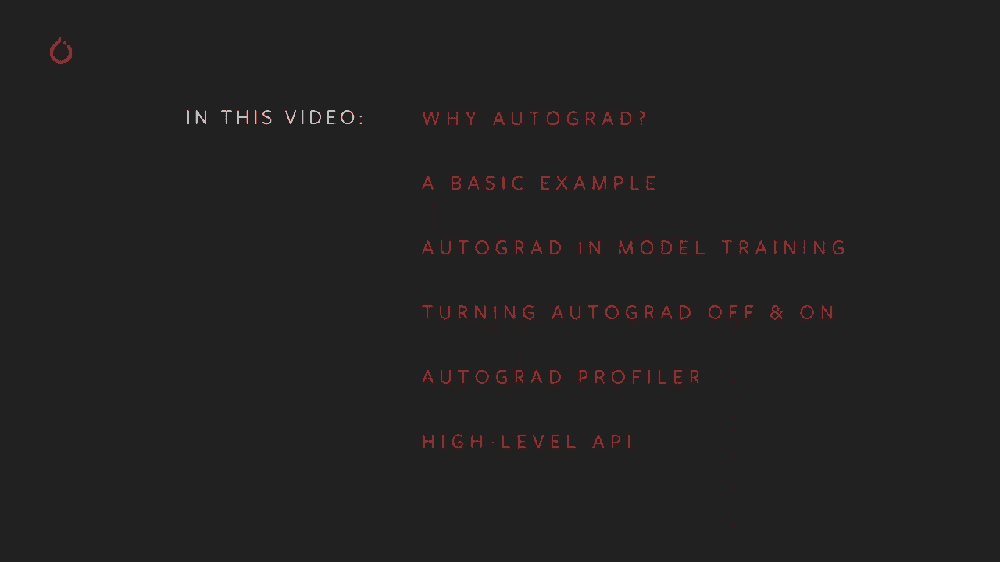

# 【双语字幕+资料下载】140分钟入门 PyTorch，官方教程手把手教你训练第一个深度学习模型！＜官方教程系列＞ - P3：L3- Autograd的基础知识 - ShowMeAI - BV19L4y1t7tu

Hi， and welcome back to the Pytorrch trainingin video series。 In this video。 we're going to cover autograph。 just Pytorrch's toolning for rapidly and dynamically computing the gradients that drive back propagation based learning in your machine learning model。

😊，In particular， we're going to go over what Autograd does for you。And why it makes Piytorrch so flexible and powerful for machine learning。We'll walk through a basic code example to you feel for what autograta is doing under the hood。Then we'll see autograd's role in a training loop。After that。

 we'll talk about why and how to turn the autograd feature off and on for a particular tensor or a particular context。We'll see the autograd profiler in action， and we'll look at the autograrad high level API that was released with Pytor 1。5。

The autograd feature of Pytorrch is a large part of what makes Piytorrch a fast and flexible framework for building deep learning projects。It does this by easing the computation of the partial derivatives。 also called gradients that drive back propagation based learning。I'm not going to belabor the math here， although if you'd like a refresher。

 go ahead and download the notebook and follow along in detail。The important concept here is that when we're training our model， we compute a loss function。 which tells us how far our model's prediction is from the ideal。We then need to find the partial derivatives of the loss function with respect to the model's learning weights。

 These derivatives tell us in what direction we have to adjust the weights in order to minimize the loss。 This involves the iterative application of the chain rule of differential calculus over every path through the computation。Autograd makes this computation faster by tracing your computation at runtime。Every output tensor from your model's computation carries with it a history of the operations that LED to it。

 This history allows the rapid computation of derivatives over the graph。All the way back to your model's learning weights。In addition。 because this history is gathered at runtime， you'll get the correct derivatives。 even if your model has a dynamic structure with decision branches and loops。

 This offers a lot of flexibility over tools that depend on analysis of a static computation rack。Let's have a look at a simple example of autograd in action。First。 we'll import pie torch and matte plot lib so we can graph some stuff。Next。 we'll make a one dimensional tensor holding a bunch of values between0 and 2 pi。

 and we'll add the requires grad equals true flat。Note that when we print A。 pitorrch lets us know that A wants gradients computed on any calculation it's involved in。Now we'll perform a computation here we'll just take the sign of all the values in A and we'll graph that and that looks right。If you notice the calls that attach here， I'll be covering those later in the section on turning autograd on and off。

So printing a tensor be。We see that Pytorrch tells us it has a grad function。 This means that B came from a computation where at least one of the inputs required the calculation of gradients。 The grad function tells us that B came from the s operation。Let's perform a couple of more steps。 we'll double be and add one to it and we do this， we see that the output tensors again contain information about the operations that generated them into the grad function property。

By default， Autograd expects the final function in a gradient computation to be single value。This is the case when we're computing the derivatives over learning weights。 The loss function has a single scalar value for its output。It doesn't strictly have to be a single value， but we'll go over that in a minute。

Here we'll just sum the elements of the tensor and call that the final output for this computation。We can actually use the grad function property of any output or intermediate tensor to walk back to the beginning of the computational history using the grad functions's next functions property。

Here you can see that D knows it came from an addition operation。 which knows it came from a multiplication operation， so I'm back to A。A does not have a gridd function， it is an input or leaf node of this computation graph。 and so represents the target variables for which we want to compute the gradients。

So we've looked a little at the history tracking， but how do we actually compute gradients？

That's easy， just call the backward method on the output Tensor like so。Looking back over the computation， we have a sine， the derivative of which is cosine。We have the multiplication by two， which should add a factor of two to our gradient。In the addition。 which should not change the derivative at all。Graphing the grad property on A， we see that， in fact。

 the compute gradients are twice the cosine。Be aware that gradients are only computed for inputs or leaf nodes of the computation。 intermediate tensors will not have gradients attached after the back pass。So we peeked into the hood at how autograd。Computes gradients in a simple case。Next。 we'll examine this role in the training loop of a Ptorrch model。

To see how autograd works in your training， let's build a small model and watch how it changes over a single training batch。We'll define and instantiate a model and create some standard in tensors for the training。 input and ideal output。You may have seen that we did not specify requires bright equals true for the model's layers within a subclass of Torch。 NN dot module， the gradient tracking is managed for you。If we look at the layers of the model。

 you can see the randomly initialized weights and that they have no gradients computed yet。You might have noticed there's a grad function on the weights I sampled。 There's no grad function on the weights themselves because they're a leaf node of the computation graph。But the slice operation counts as a differentiable operation。

 So my little slice of the weights is a grad function indicating that it came from the slice。So let's see how this changes after one training batch。For a loss function。 we'll use the square of the Euclidean distance between our prediction and our ideal output。We'll also set up a basic optimizer using stochastic gradient descent。

Note that we initialize the optimizer with the model's learning weights of parameters。 The optimizer is responsible for adjusting the weights。So what happens when we call lost do backward？We can see that the weights have not changed。 but that we do have gradients computed。 Again， these gradients guide the optimizer in determining how to adjust the weights to minimize the loss score。

In order to actually update the weights， we have to call optimizer。t step。And we can see that the rates have changed。This is how learning happens in your pie torch models。There's one more important step in the process。After you call optimizer。step。 you need to call optimizer。0rograd。If you don't， the gradients will accumulate over every training batch。

For example， if we run a training batch five times without calling a zero grad。You can see the gradients turn up mostly with much larger magnitudes because they were accumulated over each batch。And you can see the calling the zero grad resets the gradients。If your model' is not learning or training is giving you strange results。

 the very first thing you should check is whether you're calling zero grad after each training step。Sometimes you'll want to control whether gradients get tracked for a calculation。 There are multiple ways to do this， depending on the situation。 The easiest is just to set the acquire grad flag directly， like so。

And we can see that B1 has a grad function， but B2 does not because we turned off history tracking in A prior to computing B2。If you only need autograd turned off temporarily， you can use the Torch。 Norad Con Manager。When we run this cell。We can see that history is tracked for all computations。 except the one in the nograd context。 Nograd can also be used as a function or method decorator。

 causing history tracking to be turned off for computations inside the decorated function。It's a corresponding context manager， Torchdot and Agrad。For turning autograd on in a local context。 it may also be used as a decorator。Finally， you may have a tensor tracking history。 but you need a copy that doesn't。In this case， the Tensor object has a detached method which creates a copy of the tensor that is detached from the computation history。

We did this above when we grabbed some of our tensors。 Ma Totlib expects a nuy array。 but the implicit tensor to nuy array conversion is not enabled for tensorors tracking history。 Once we make our attached copy， we're good to go。There's one more important note about autogra mechanics。 You have to be careful about using in place operations on Tensor's track gradients。

 Doing so may destroy information you need to correctly do your backward pass later。 In fact。 Pytorch will even give you a runtime error。If you try to perform an in place operation on an input tensor that requires gradients。Autograd tracks every step of your tensor computation。 combiningbining that information with time measurements would be useful for profiling gradient tract computations。

 and in fact， this feature is part of autograd。The next code cell。Shows basic usage of the profiler。The autograd profiler can also group results by code blocks or input shape and can export results for other tracing tools the late documentation has full details。

Pytororch 1。5 saw the introduction of the Autograd High level API。Which exposes some of the core operations underlying autograd。In order to explain this best。 I'm going to go into some more mathematical depth on what autograrad is doing under the hood。So say you have a function with n inputs and M outputs， what' say y equals a function of x。

The complete set of partial derivatives of the outputs with respect to the inputs is a matrix called the Jacobian。Now， if you have a second function， which we'll call L。 which equals G of y that takes an n dimensional input。That is the same dimensionality as the output of our first function and return to scalar output。

You can express its gradients with respect to Y is a column vector。It's really just a one column Jacob。To tie this back to what we've been talking about。 imagine the first function as your pitorrch model with potentially many inputs and many learning weights and many outputs。 and the second function as a loss function with the model's output as input and the loss value as the scalar output。

If we multiply the first functions to Cobian by the gradient of the second function and apply the chain rule。 we get another column vector。This column vector represents the partial derivatives of the second function with respect to the inputs of the first function。

Or in the case of our machine learning model。The partial derivative of loss with respect to learning weights。Tchto autograd is an engine for computing these vector Jacobian products。 This is how we accumulate the gradients over the learning weights during the backward pass。For this reason， the backward call can also take an optional vector input。

The vector represents a set of gradients over the output tensor。 which are multiplied by the Jacobian of the autograd trace tensor that precedes it。Let's try a specific example with a small vector。If we tried to call Y dot backward now。 we'd get a runtime error and a message that gradientians can only be implicitly computed for scalar outputs。

For a multidimensional output， Autora expectses to provide the gradients for those three outputs that it can multiply into the Jacobia。Most of the output gradients here are all related to the powers of the two。 which we'd expect from the repeated doubling operation in the previous cell。There's an API on Autograd that gives you direct access to important differential matrix and vector operations。

 in particular， it allows you to calculate the Jacobian and Hesher matrices of a particular function for particular inputs。The Hesians like the Jacoban， but expresses all partial secondary。Let's take the Jacobian of a single function and evaluate it for two single element inputs。And if you look closely， the first output should equal2 times e to the x since the derivative of e to the x is the exponential itself。

And the second value should be three。Now you can， of course， do this with higher order tensors。Here we've computed Jacobbian have that same adding function with a different set of inputs。There's also a function to directly compute the vector Jacobcoium product if you provide the vector。Autograd's JVP method does the same matrix multiplication as VJP with the operarans reversed。

 the VHP and HVVP methods do the same for the vector Hesian project。For more information。 including important performance notes， see the documentation for the new Autograd Funal API。

