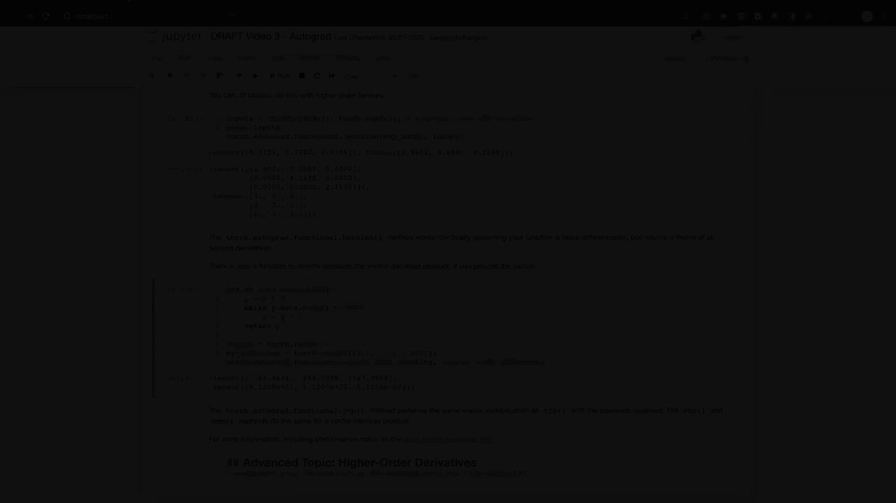

# 【双语字幕+资料下载】140分钟入门PyTorch，官方教程手把手教你训练第一个深度学习模型！＜官方教程系列＞ - P3：L3- Autograd的基础知识 - ShowMeAI - BV19L4y1t7tu

嗨，欢迎回到PyTorch训练视频系列。在这个视频中，我们将讨论autograd，即PyTorch用于快速动态计算驱动基于反向传播学习的梯度的工具。

😊，特别是，我们将讨论Autograd为你做了什么，以及它为何使PyTorch在机器学习中如此灵活和强大。我们将通过一个基本的代码示例来了解autograd在背后做了什么。然后，我们将看到autograd在训练循环中的作用。之后。

我们将讨论为什么以及如何在特定张量或特定上下文中打开或关闭autograd功能。我们将看到autograd分析器的实际应用，并查看与PyTorch 1.5一起发布的autograd高级API！

PyTorch的autograd功能是使PyTorch成为一个快速灵活的深度学习项目构建框架的重要组成部分。它通过简化部分导数的计算（也称为驱动反向传播学习的梯度）来实现这一点。我不会在这里详细讨论数学，尽管如果你想要复习一下的话。

请下载笔记本，并详细跟随。这里的重要概念是，当我们训练模型时，我们计算损失函数，它告诉我们模型的预测与理想情况相差多远。然后，我们需要找到损失函数相对于模型学习权重的偏导数。

这些导数告诉我们需要在哪个方向上调整权重，以最小化损失。这涉及在计算的每个路径上迭代应用微积分的链式法则。Autograd通过在运行时跟踪计算，使这个过程更快。来自模型计算的每个输出张量都携带着导致其产生的操作历史。

这个历史允许在图上快速计算导数，直到模型的学习权重。此外，由于这个历史是在运行时收集的，即使模型具有动态结构、决策分支和循环，你也能获得正确的导数。

这为依赖于静态计算图分析的工具提供了很大的灵活性。让我们来看一个autograd实际应用的简单示例。首先，我们将导入PyTorch和Matplotlib，以便可以绘制一些图形。接下来，我们将创建一个一维张量，存储从0到2π之间的一些值。

我们将添加 requires_grad=True 标志。请注意，当我们打印 A 时，Pytorrch 让我们知道 A 希望在任何参与的计算中计算梯度。现在我们将在这里执行一个计算，我们将取 A 中所有值的正弦，并将其图形化，这看起来是正确的。如果你注意到这里的调用，我将在稍后的部分中讨论如何打开和关闭 autograd。

所以打印一个张量是很简单的。我们看到 Pytorrch 告诉我们它有一个 grad 函数。这意味着 B 来自一个计算，其中至少有一个输入需要计算梯度。grad 函数告诉我们 B 来自 s 操作。让我们再进行几步。我们将对 B 进行加倍并加一，当我们这样做时，我们看到输出张量再次包含生成它们的操作的信息到 grad 函数属性中。

默认情况下，Autograd 期望梯度计算中的最终函数是单个值。这种情况发生在我们计算学习权重的导数时。损失函数的输出是单个标量值。它并不严格需要是单个值，但我们稍后会对此进行讨论。

在这里我们将简单地对张量的元素求和，并将其称为该计算的最终输出。我们实际上可以使用任何输出或中间张量的 grad 函数属性，向回走到计算历史的开头，利用 grad 函数的 next 函数属性。

在这里你可以看到，D 知道它来自一个加法操作，而 B 知道它来自一个乘法操作，所以我又回到了 A。A 没有 grad 函数，它是这个计算图的输入或叶节点，因此表示我们希望计算梯度的目标变量。

我们已经稍微看了一下历史追踪，但我们实际上是如何计算梯度的？

这很简单，只需对输出张量调用 backward 方法。回顾计算，我们有一个正弦函数，其导数是余弦。我们有乘以二的操作，这应该给我们的梯度加上一个二的因子。在加法中，这不应该改变导数。对 A 的 grad 属性进行图形化，我们看到，实际上。

计算出的梯度是余弦的两倍。请注意，梯度仅为计算的输入或叶节点计算。中间张量在反向传递后将不会附带梯度。因此，我们窥探了 autograd 如何在一个简单的案例中计算梯度。接下来，我们将检查其在 Ptorrch 模型训练循环中的作用。

要了解自动求导在训练中的工作原理，让我们构建一个小模型，并观察它在单个训练批次中的变化。我们将定义并实例化一个模型，并为训练创建一些标准输入张量和理想输出。你可能已经注意到，我们没有在Torch的NN模块子类中指定`requires_grad=True`，梯度跟踪会为你管理。如果我们查看模型的层。

你可以看到随机初始化的权重，且它们尚未计算出梯度。你可能注意到，权重上有一个`grad`函数。我采样的权重上没有`grad`函数，因为它们是计算图的叶节点。但切片操作算作一个可微操作。

因此，我的小权重切片上有一个`grad`函数，表示它来自切片。那么，让我们看看在一个训练批次后这如何变化。对于损失函数，我们将使用预测值与理想输出之间的欧几里得距离的平方。我们还将使用随机梯度下降设置一个基本优化器。

请注意，我们使用模型的学习权重初始化优化器。优化器负责调整权重。那么，当我们调用`loss.backward()`时会发生什么呢？我们可以看到权重没有变化，但确实计算出了梯度。这些梯度指导优化器确定如何调整权重以最小化损失评分。

为了实际更新权重，我们必须调用`optimizer.step()`。我们可以看到权重发生了变化。这就是你在PyTorch模型中学习的方式。这个过程中还有一步重要的步骤。在调用`optimizer.step()`后，你需要调用`optimizer.zero_grad()`。如果不这样做，梯度将会在每个训练批次中累积。

例如，如果我们在不调用`zero_grad`的情况下运行一个训练批次五次，你会发现梯度的幅度变得更大，因为它们是在每个批次中累积的。你可以看到调用`zero_grad`会重置梯度。如果你的模型没有学习或训练给出奇怪的结果。

你应该检查的第一件事是你是否在每个训练步骤后调用了`zero_grad`。有时你可能想控制某个计算的梯度跟踪。有多种方法可以做到这一点，具体取决于情况。最简单的方法就是直接设置`requires_grad`标志，如此。

我们可以看到B1有一个`grad`函数，但B2没有，因为我们在计算B2之前关闭了历史跟踪。如果你只需要暂时关闭自动求导，可以使用Torch的`no_grad`上下文管理器。当我们运行这个单元时，我们可以看到所有计算的历史都会被跟踪，除了在`no_grad`上下文中的那一个。`no_grad`也可以用作函数或方法的装饰器。

这会导致在装饰函数内部的计算中关闭历史跟踪。它是一个相应的上下文管理器，Torchdot和Agrad。用于在局部上下文中打开autograd。它也可以用作装饰器。最后，你可能有一个跟踪历史的张量，但你需要一个不跟踪历史的副本。在这种情况下，Tensor对象具有一个detach方法，可以创建一个与计算历史分离的张量副本。

当我们获取一些张量时，我们在上面做了这一点。Matplotlib期望一个nuy数组，但对跟踪历史的张量，隐式张量到nuy数组的转换并未启用。一旦我们制作了附加副本，就可以继续进行。关于autograd机制还有一个重要的注意事项。你必须小心对跟踪梯度的张量使用就地操作。

这样做可能会破坏你在稍后正确进行反向传播所需的信息。实际上，如果你尝试对需要梯度的输入张量执行就地操作，PyTorch甚至会给出运行时错误。Autograd会跟踪你张量计算的每一步，将这些信息与时间测量结合起来，对于分析梯度跟踪计算是非常有用的。

实际上，这一特性是autograd的一部分。下一个代码单元展示了分析器的基本用法。autograd分析器还可以按代码块或输入形状分组结果，并可以为其他追踪工具导出结果，最新的文档提供了详细信息。

PyTorch 1.5引入了Autograd高层API，暴露了autograd背后的核心操作。为了最好地解释这一点，我将深入一些数学内容，说明autograd在幕后做了什么。所以假设你有一个具有n个输入和M个输出的函数，设y等于x的一个函数。

关于输入的输出的完整偏导数集合是一个称为雅可比矩阵的矩阵。现在，如果你有一个第二个函数，我们称之为L，它等于G(y)，并且接受一个n维输入。这与第一个函数的输出维度相同，并返回标量输出。

你可以将其梯度表示为关于Y的列向量。它实际上只是一个单列的雅可比矩阵。将这一点与我们之前讨论的内容联系起来，想象第一个函数是你的PyTorch模型，可能有许多输入、许多学习权重和许多输出，而第二个函数是一个损失函数，以模型的输出作为输入，以损失值作为标量输出。

如果我们将第一个函数的输出乘以第二个函数的梯度并应用链式法则，我们会得到另一个列向量。这个列向量表示第二个函数相对于第一个函数输入的偏导数。

或者在我们的机器学习模型的情况下。损失对学习权重的偏导数。Tchto autograd 是一个用于计算这些向量雅可比乘积的引擎。这就是我们在反向传播过程中如何累积学习权重的梯度。因此，反向调用也可以接受一个可选的向量输入。

向量表示输出张量上的一组梯度，这些梯度与其之前的 autograd 跟踪张量的雅可比相乘。让我们尝试一个带小向量的具体示例。如果我们现在尝试调用 Y dot 反向传播，会遇到运行时错误，并收到一个消息，指明梯度只能针对标量输出隐式计算。

对于多维输出，Autora 期望提供这三个输出的梯度，以便它可以乘入雅可比。这里的大部分输出梯度都与二的幂相关，这是我们从上一个单元的重复加倍操作中所期待的。Autograd 上有一个 API，可以直接访问重要的微分矩阵和向量操作。

特别是，它允许你为特定输入计算特定函数的雅可比和海森矩阵。海森矩阵像雅可比，但表示所有的偏二次导数。让我们取一个单一函数的雅可比，并为两个单元素输入进行评估。如果你仔细观察，第一个输出应该等于 2 乘以 e 的 x 次方，因为 e 的 x 次方的导数就是它自身。

而第二个值应该是三。当然，你可以使用更高阶的张量。在这里，我们计算了具有不同输入集的相同加法函数的雅可比。还有一个函数可以直接计算向量雅可比乘积，如果你提供向量的话。Autograd 的 JVP 方法执行与 VJP 相同的矩阵乘法，但操作数是反向的。

VHP 和 HVVP 方法对向量海森投影也执行相同的操作。有关更多信息，包括重要的性能说明，请参阅新的 Autograd Funal API 文档。

