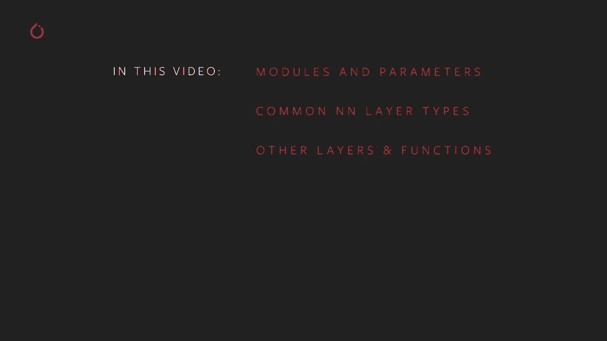
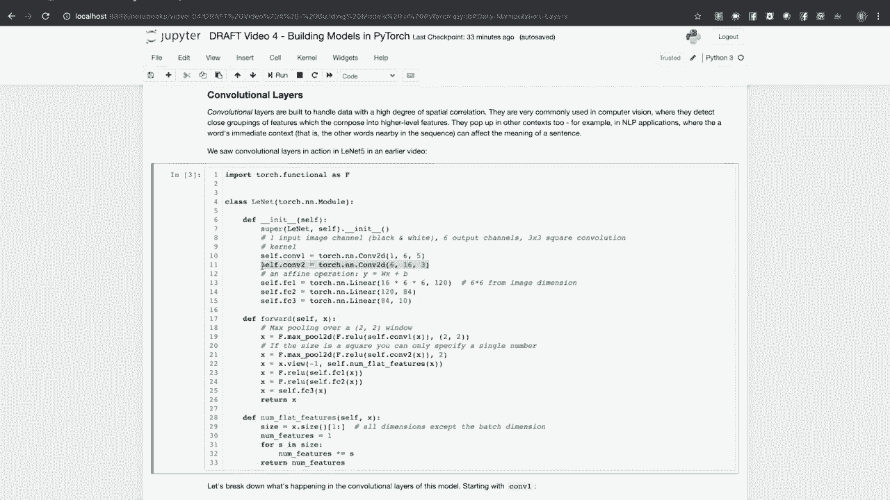
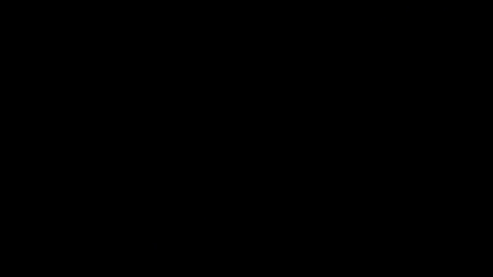

# 【双语字幕+资料下载】140分钟入门 PyTorch，官方教程手把手教你训练第一个深度学习模型！＜官方教程系列＞ - P4：L4- 使用 PyTorch 构建模型 - ShowMeAI - BV19L4y1t7tu

Hi and welcome to the next video in the Pytorrch Training series on building models with Pytorrch。Specifically in this video， we're going to discuss the module and parameter classes in P Torch。 which encapsulate your machine learning models and learning weights respectively and how they work together。Common neural network layer types， including linear， convolutional。

 recurrent and transformer networks。Other layers and functions such as batch norming。 dropout and activation functions and loss functions。

Model building in Pytorrch is centered around two classes in the Torchdo N N module。 The module class and the parameter class。The module class encapsulates models and model components。 such as neural network layers。 The parameter class is a subclass of torch dot tensor that represents learning weights。Moduuleles and parameters work together when a parameter is assigned as an attribute of a module。

The parameter object gets registered with that module。If you register an instance of a module subclass as an attribute of a module。 the contained module's parameters are also registered as parameters of the owning class。This might be simpler with an example。 Let's have a look at this small model。

It has two fully connected neural network layers， an activation function in between them and a softm at the end。This modelddle shows the common structure of a pi torch model。 First。 note that it's a sub class of torchsha and in dot module。There is an init method that defines the structure of the model。

 the layers and functions that make it up。There's also a forward method。 which composes those layers and functions into the actual computation。When we create an instance of this model and print it。We see that not only does it know its own layers and the attributes there are assigned to。

 but also the order in which we registered them。We print out just one of the layers。We get a description of just that layer。Our tiny model and our linear layers are all subclasses of Torchsha and N dot module。 so we can access their parameters through the parameters method。Here。We've printed out。The learning parameters for the whole model and port only the linear2 layer note that the tensors。

 making up linear 2's parameters are the same as the last parameters of the whole model。 The model registers parameters of sub modules it owns recursively。This is important because the model has to pass all of these parameters to the optimizer during training。Next， let's take a look at some of the layer types available in Pytorrch。

Pytorrch has classes encapsulating the common layer types used in modern machine learning models。The most basic type is the fully connected or linear layer， which we saw in the example above。 This is a layer where every input influences every output， hence calling it fully connected。And that influence is to a degree determined by the layer's weights。

If a layer has M inputs and N outputs， its weights will be an M by N matrix。As a simple example。 here is a tiny linear layer that takes it three element input and yields a two element output。And there's a random three element vector we'll use as input。Passing this input gives us a two element output vector。

If you go ahead and do the matrix multiplication of x times the weights。 and then you add the two biases， you should get the output Y。Also。 note that when we print the parameters， it lets us know that they require gradients。 That is that they're tracking computation history so we can compute gradients for learning。

Pararameter is a subclass of torchdot tensor， but this default behavior of setting autog to true is different from what the tensor class does。Linear layers are widely used in deep learning models。 One common place you'll see them is at the end of classifier models with the last layer or last few layers will be linear layers。Convolutional layers are meant to address data that is strongly correlated in space。

They're common in computer vision models where they can be used to detect close clusters of interesting features and compose them into larger features or recognized objects。 They come up in other contexts， too， such as N LP applications。 Often。 the intent of a word is influenced by the words near it。In an earlier video。 we had to look at Lynette 5。 Let's take a closer look at how this computation is structured。

Lette 5 is meant to take in black and white，32 by 32 pixel image tiles of handwritten numbers and classify them。 according to which diit is represented。Looking。At the first convolutional layer in the model。We can see his arguments are 1，6 and 5。 The first argument is the number of input channels For us。 that's going to be one because a black and white image only has one channel of data。

The second argument 6 is the number of features we want this layer to learn。So it can recognize up to six different arrangements of pixels。In and the input。And finally。 the five is the size of the convolution kernel。You can think of this like a window like it scanned over the input。 collecting features inside this5 pixel window。 The output of this convolutional layer is an activation map that is a spatial map of where it found certain features。

The second convolutional layer。Is similar， it takes the first layers in output as input。So that's why its first argument is6， we recognize six features in the first conve。And we take those as our six input channels to the next convolutional layer。This layer。 we're asking to learn 16 different features， which it makes by composing the features from the first layer。

And we're only using a three element window。For the convolution card。After the second convolution layer has composed its features into a higher level activation map。 we pass the output to a set of linear layers that act as a classifier， with the final layer。 having 10 outputs representing the probabilities that the input represents one of the 10 digits。

Pytorch has convolutional neural network layers for1，2 and three dimensional inputs。 There are more optional arguments that you can look up in the documentation。 such as stride length and padding。

The current neural networks are neural networks designed for use with sequential data。 such as a string of words in a natural language sentence。 or a string of real time measurements from an instrument。And R and N does this by keeping a hidden state。 This acts as a sort of memory for what its seems so far in the sequence。

The internal structure of an R N N layer or its variance。 the long short term memory or LSTM and the gated recurrent unit or G R U。Is pretty complex and outside the scope of this video。 but we can show you what it looks like in action with this long。 short term memory based part of speech tagger。The constructor has four arguments。It has the size of the input vocabulary that is the size of the entire inventory of words it's meant to recognize。Each of these words is represented as the index of a one hot vector in a vocab size dimensional space。The tag set size is the number of tags。That you want the model to recognize an output。

Embbedding dim is the size of the embedding space for the vocabulary。 and embedding maps of vocabulary down to a lower dimensional space where words with similar meanings are close together in that space。And hidden dim is the size of the LSTM's memory。The input will be a sentence with words represented as indices of one hot vectors。 The embedding layer will map these down to the embedding dim dimensional space。

And the LSTM takes a sequence of embeddings and iterates over it。Yielding an output vector of length hidden den。The final linear layer acts as a classifier applying log softmax to the output。 and the final layer converts the output into a normalized set of estimated probabilities that a given word maps to a given part of speech tag。If you'd like to see this network in action， there's a tutorial on it on Pytor。org。

Transformers are multipopoous neural networks， but we see them very often these days in natural language applications following the success of BERT。 which is a transformable model。Now a discussion of transformer architecture which is kind of complex。 is outside the scope of this video， but know that Pytorrch has a transformer class that allows you to define the overall parameters of a transformer model。That is the number of encoder and decoder layers， the number of attention heads。

 dropout in activation functions， etc。You can even using the pi torch transformer class。 build the BRT model from this single class with the right parameters。Pytorch also has classes to encapsulate the individual components of a transformer。 such as the encoder and decoder and the layers that make them up。

There are non learning layer types that perform important functions in models。One example is max pooling and it's twin min pullinging。These functions reduce a tensor by combining cells together and assigning the maximum value of those input cells to the output cell。This is one of those things that's probably easier explained by example。So if you look closely here。

 we have a 6 by6 matrix， which we use max pool to reduce to a 4 by four matrix。The4 by four matrix。 the four elements of it， each one contains the maximum value of a3 by three quadrant from the input。Normalization layers recententer and normalize the output of one layer before feeding it to another。Centering and scaling intermediate tensors inside your computation has a number of beneficial effects。

 such as letting you use higher learning rates without problems of vanishing and exploding gradients。Running a cell above， you've added a large scaling factor and an offset to a random input tensor。You should see that the input tensors mean is somewhere in the neighborhood of 15。After we run it through the normalization layer， you can see that the values are all smaller and grouped around 0。

 In fact， the mean of this should be very smaller。This is good because a lot of activation functions。 which we'll discuss in a little bit， have their strongest gradients near zero。But they sometimes suffer from vanishing or exploding gradient for inputs that drive them far away from0。Keeping the data centered around the area's steepest gradient means that learning will tend to happen faster and converge faster。

 and higher learning rates will be feasible for your training。Drop out layers are a tool for encouraging sparse representations in your model that is pushing it to do inference with less data。Drop out layers work by randomly setting parts of the input tensor to 0 During training。 Drop out layers are always turned off for inference。

This forces the model to learn how to do inference against masked or reduced debt input data。So as an example。If I take a random input tensor and I pass it through a dropout layer。Twice。 you should see that。I get the same to put Tensor back with some random elements。

Set to zero。

Drop out layers， Heba model learns sparse representations by pushing it to do inference with less input data。Drop out white layer's work by randomly setting parts of the input tensor to zero during training。Dropout layers are always turned off for inference。This forces the models to learn against a masked or reduced data set。So as an example。

 I'll create a random input tensor。And pass it through a dropout layer， and I'll do it twice。And you'll see that there are some zeros， and there are some values。 but the values are always identical。 It's randomly setting the zeros throughout the tensor。You can use the optional P argument to set the probability here， we send it to 40%， the default is 0。

5。The final ingredients we need to build our models are activation functions and loss functions。 Activation functions are part of what make deep learning impossible。 If you recall the linear layer example earlier， it was just a simple matrix multiplication to take an input vector and get an output vector。And if we stack many such layers together， no matter how many layers we do。

 we can always reduce that to a single matrix multiplication。 which means that we can only ever simulate linear equations。With our machine learning model。This is where activation functions come in by inserting a nonlinear activation function between layers。We developed the ability to simulate nonlinear equations。

Tsia N dot module offers all the major activation functions。 including the rectified linear unit in many variants， hyperbolic tangent， hard hyperbolic tangent。 sigmoid， etc ce。It includes other functions such as Sockms that are most useful at the output stage of a model。Py torch has a variety of common loss functions， including mean squared error。

 which same as the L2 norm and cross entrytropy loss and negative likelihood loss。 which are useful for classifiers and others。