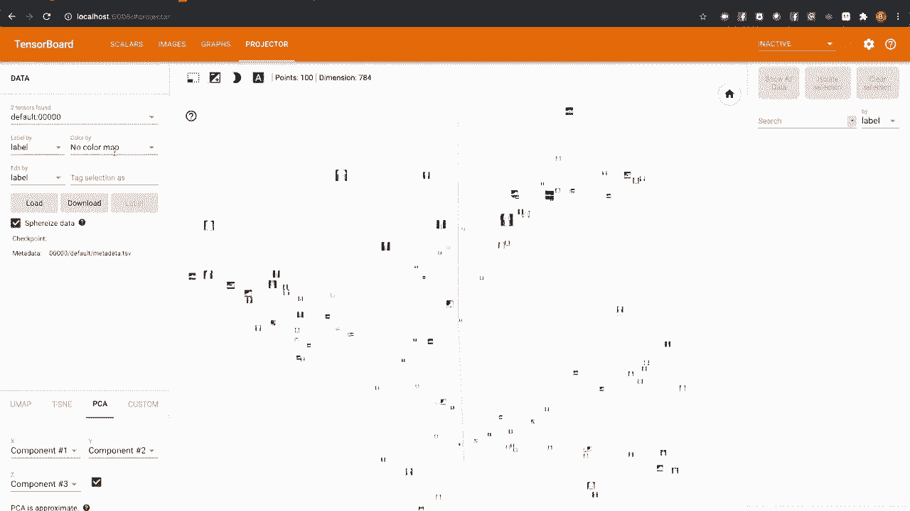

# 【双语字幕+资料下载】140分钟入门 PyTorch，官方教程手把手教你训练第一个深度学习模型！＜官方教程系列＞ - P5：L5- PyTorch TensorBoard 支持 - ShowMeAI - BV19L4y1t7tu

If you haven't already， you'll need to set up a Python environment with the latest versions of Pytorrch and tensor board。The commands on screen show how to do that for Conda and Pip will also be using map plotlib to manipulate images。Once you have the dependencies installed， you can run the companion notebook for this video in the environment you set up。

For this model， we're going to be training a simple neural network to recognize different articles of clothing。 We'll visualize data elements directly。 track the success of the training process。 We'll use Tensor board to look under the hood at the model itself。And will do a more advanced visualization of the data set as a whole and its internal relationships for a data set。

 will use fashion emminist。This is a set of small image tiles that depict various garments classified by the type of garment depicted。For a model， we'll use a version of Linenette 5 tweet to accommodate the fashion Mnes data set。

We'll start by importing the libraries we need and the summary writer class from Torchdo Util's do Tenser board。This is the class wrapping the tensor board support in Pytorrch and will be your primary interface for interacting with Tensor board。It's good practice to visualize your training data prior to feeding it to your model。 especially with computer vision tasks。Let's set up our data set。

 We'll use Torch visionion to download training and validation splits of the data set。 We'll talk more about validation shortly， and we'll also set up data loaders for each of the data set splits and define the classes against which we're classifying。Let's visualize a few instances of the data set。We'll use an iterator to pull out a few instances of the data and create a map plotlib helper function to batch them together in a grid。Let's show them in the notebook。So how do we add this to Tensor board？

It's a one liner to write the data to the log directory。Note that we also called flush on our summary writer object。 This makes sure that everything we've logged through the writer has been written to disk。

Now， let's switch to a terminal and start tensor board。

We'll copy the URL that the Ten award command line gave us and look at the images tab。Note here that the image we've added has a header containing the label we applied when we save the image to the Tensor board log directory。Next， we'll use Tensor board to help assess our training process。We'll graph the accumulated training loss for regular time steps and compare it to the loss measured against a validation data set。

 For background， here's a brief aside on what we're doing and why。If you took a math class。 it's likely that you'd be given homework problem sets to solve after a number of homework sets。 you'd be given an exam。The exam problems would be similar in nature。 but different in their specifics to the homework problems you've seen already。

 This is intended to make sure you learn the content of the class and not just memorize the homework problems。Similarly， we can use a validation data set。 that is a portion of the total data set not used for training to see whether our model is learning generally or whether it's overfitted to the training data akin to memorizing the training instances instead of modeling the general function we're trying to optimize the model for。

Let's set up a training loop with validation checks and graph the results。Here we have a training loop。 You can see that at the top of the code。 we declared a variable to accumulate the measured loss of the model's predictions。 which will report every thousand training steps。Well also be doing a separate loss check against the validation data set。

For tracking and comparing two different quantities， we'll use the add Scrs call on summary writer。 which allows us to add a dictionary containing multiple scalar values。 each with distinct tags that get their own line on the graph。Let's run the hell and see what that looks like。Switching over to Tensor board and looking at the Scrs tab。

 we can see that our loss is decreasing monotonically over the training run。 This is a nice reassurance that the training is working。😊。But are we overfitting looking at them graph， we can see that the validation and training curves are converging nicely。Next， let's use Tensor board to better understand our model and how data flows through it。To do this。

 we'll use the add graph method on our summary letter。This method takes as arguments。 the model and a sample input that will be used to trace data flow through the model。Will run the cell and switch over to tensor board。And going to the graphs tab。 we can see a very simple graph showing the model with inputs going in one side and outputs submitted from the other。

Of course， we'll want more detail in this， and we can get it by double clicking on the model node in the graph。 And here we can see a graph containing all of our layers and arrows indicating how data flows through them。 Note that because the model uses the same max pool object twice。 the second convolutional layer appears to be embedded in a loop。But as you can see from the code。

The flow is more linear than that。We've already used Tensor board to display visualizations of instances of our data。 But what about the whole data set。An embedding is a mapping of instances from a higher dimensional space to a lower dimension 1。This is a common technique in N LP。 If you have a 10000 word vocabulary represented by one hot vectors。 Your words are unit vectors in a 10000 dimensional space。

If you train an embedding layer that maps these vectors to a lower dimensional space。 relationships can emerge。 For example， the new vectors for words like good。 excellent and fabulous will tend to be clustered in that lower dimensional space。In our case。 our 28 by 28 image tiles can be thought of as 784 dimensional vectors。

We can use the summary writers's add embedding method to project this down to an interactive 3D visualization。Here's a bit of code to select a random sample of our data， label it， and project it。Note that。 as always， we use the flush method to ensure that all our data is written to disk。

Switching over to tensorboard。

We can see on the projector tab， a 3D visualization of our new embedding。

Zoomed out， we can see some large structures， some arcs within the 3D space。 zooming in on some of these structures。 We can see that some of these arcs have clustered similar carbon types。Zoom in on your own sample of the data and see if you can identify patterns in how different types of garments are clustered in this 3 D projection。

For more information on Py Torch's Tensor boards support。You can visit the Pytorrch documentation at Pytorch。org for full documentation of torch。utils。tensorboard summaryumarywriter。The Pitorrch tutorials section at Piytorch。 org has tutorials on using Tensorboard。And the Tensorboard documentation， of course。

 has more detail about Tensor board itself。 If you want a deeper view of what the summary writer is doing under the hood。