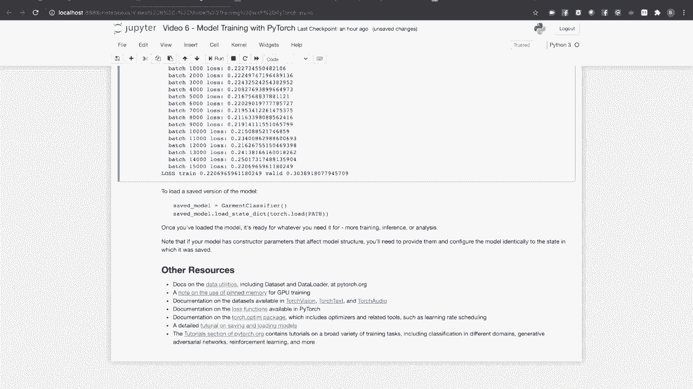

# 【双语字幕+资料下载】140分钟入门 PyTorch，官方教程手把手教你训练第一个深度学习模型！＜官方教程系列＞ - P6：L6- 使用 PyTorch 进行训练 - ShowMeAI - BV19L4y1t7tu

欢迎回到 Pyetorrch 培训视频系列。本视频讲解的是 Pytorrch 中模型训练的基本原理。在之前的视频中，我们讨论了使用 Torchdot 和 N 模块的神经网络层和功能构建模型。自动梯度计算的机制是基于梯度的模型训练的核心。

并使用 Tensor board 可视化训练进度和其他活动。在本视频中，我们将为你的工具库添加一些新工具。我们将熟悉数据集和数据加载器的抽象，以及它们如何简化在训练循环中向模型提供数据的过程。

我们将讨论特定的损失函数及其使用时机。我们将查看实现算法以根据损失函数的结果调整模型权重的 Ptorch 优化器。最后，我们将把所有这些结合在一起，看到一个完整的 Pi Torch 训练循环的实际运行。

在 Pytorrch 中高效的数据处理是通过两个主要类实现的，即数据集和数据加载器。数据集负责从你的数据中访问和处理单个实例。在 Pytorch 领域的 API 中有许多可用的数据集，你可以使用提供的子类或自己子类化数据集父类来创建自己的数据集。

数据加载器从数据集中提取数据实例，既可以自动提取，也可以使用你定义的采样器。它将数据收集成批并返回以供训练循环使用。数据加载器可以与各种数据集一起使用，无论它们包含何种类型的数据。

Py Torch 领域的 API，Torch Viion、Torch text 和 Torch audio 提供了一系列开放的标记数据集，你可能会发现这些数据集对你自己的训练目的很有用。Torch fission 包含广泛的用于分类、目标检测和目标分割的标记数据集。它还包含便利类，如图像文件夹和数据集文件夹。

这使你能够轻松地从图像或文件系统中其他可访问的数据创建数据集。有关这些类的更多详细信息，请参阅文档。Torch textext 提供了用于各种分类、翻译和分析任务的标记数据集。Torch audioud 提供了用于转录和音乐类型检测的标记数据集。

大多数情况下，你会知道数据集的大小，并能够访问任意单个实例。在这种情况下，创建数据集非常简单，只需子类化 torch U 的数据集，并重写两个方法。Len 方法返回数据集中的项目数量，get item 方法通过键访问数据实例。如果键是顺序整数索引，你的数据集子类将与默认的数据加载器配置一起工作。

如果你有其他类型的键，如字符串或文件路径，你需要使用自定义采样器类设置数据加载器以访问数据集的实例。有关此高级技术的更多详细信息，请查看文档。如果你在运行时不知道数据集的大小，例如。

如果你使用实时流数据作为输入，你需要子类化 Torch UTil 的数据可迭代数据集。为此，你需要重写可迭代数据集父类的内部方法。请注意，处理多个工作线程请求可迭代数据集的数据实例时，你需要做一些额外工作。

文档中有示例代码演示这一点。当你创建自己的数据集时，通常希望将其拆分为训练、验证和最终测试模型的子集。torch U 的数据随机拆分函数允许你这样做。创建数据加载器时，唯一必需的构造函数参数是数据集。

你在数据加载器上设置的最常见可选参数是批次大小、随机打乱和 Numb workers。批次大小设置训练批次中的实例数量。确定最佳批次大小是本视频讨论之外的主题。你会常见到这个值是 4 或 16 的倍数，但针对你的训练任务的最佳大小将依赖于你的处理器架构。

可用内存及其对训练收敛的影响。打乱将通过索引排列随机化实例的顺序。将其设置为 true 以便训练，以便模型的训练不依赖于数据的顺序或特定批次的配置。对于验证、模型测试和推理，可以将此标志留为默认的 false。

Numb workers 设置并行线程的数量，拉取数据实例。理想的工作线程数量可以通过经验确定，这将取决于你本地机器的细节以及单个数据实例的访问时间。其他数据加载器配置参数，包括自定义采样器类，将适用于索引方式不是顺序整数的更高级的情况。

并且时间戳对于由实时数据流支持的可迭代数据集尤其重要。与往常一样，请查看文档以获取更多详细信息。如果你在训练过程中需要将数据批次转移到 GPU。

推荐使用固定内存缓冲区来实现。这意味着你张量底层的内存缓冲区位于页面锁定内存中，这使得主机到 GPU 的数据传输更快。关于这一重要最佳实践的说明链接自本视频附带的交互式笔记本。数据加载器类通过在创建数据加载器时将其固定内存设置为 true，使得这一过程变得简单。

在本视频中，我们将使用Fashion MNIST数据集，其中包含每个标记为10个类别之一的服装图像。此单元中的代码将创建单独的训练和验证数据分割的数据集对象，并下载图像和标签（如果需要）。接下来，它将创建适当配置的数据加载器。

现在我们不再打乱验证集。我们还将定义要训练的类别标签，并报告数据集的大小。请注意，下载数据集可能需要几分钟，具体取决于您的网络连接，但您只需执行一次。我们将遵循可视化数据加载器输出的做法，以确保它符合我们的预期。

确实，这里是我们的图片和标签。那么让我们继续。这个例子的模型是Linenette 5图像分类器的一个变体，如果你看过本系列之前的视频，它应该很熟悉。它包含卷积层，用于从图像中提取和组合特征，以及一组全连接层用于执行分类。PyTorch包括一系列适合多种任务的常用损失函数。

这些包括均方误差损失等函数，适用于回归任务。回调似然散度用于比较连续概率分布。二元交叉熵用于二分类，多类分类任务使用交叉熵损失。所有损失函数比较模型的输出与某些标签或期望值集。

在这个视频中的分类任务中，我们将使用交叉熵损失。我们将以无参数的方式调用它的构造函数，但这个特定的损失函数可以配置为重新缩放单个类别的权重。在计算损失时忽略某些类别等。请查看文档以获取详细信息。在这里显示的单元中，我们将创建我们的损失函数。

创建一些输出和期望值的Uat值，并对它们运行损失函数。

请注意，损失函数将返回整个批次的单个值。PyTorch优化器执行基于损失函数的反向梯度更新学习权重的任务。

关于反向梯度计算的更多信息，请参见本系列之前的相关视频。PyTorch提供多种优化算法，包括随机梯度下降、Adam、LBFGS等，以及用于进一步优化的工具，如学习率调度。优化算法的全部范围超出了本视频的范围。

但我们将讨论一些大多数 PyTorch 优化器共有的特性。第一个共性是所有优化器必须使用模型参数进行初始化。最好的方法是调用模型对象上的参数方法，如此处所示。这些是每个优化器所需的，因为这些是训练过程中会被更新的权重。

这提出了一个使用 PyTorch 优化器时的重要点：确保你的模型参数存储在正确的设备上。如果你在 GPU 上进行训练，你必须在初始化优化器之前将模型参数移动到 GPU 内存中。如果不这样做，你将不会看到损失随时间减少，因为优化器将更新错误副本的模型参数。

大多数基于梯度的优化器将具有以下参数的某种组合。一个学习率决定了优化器所采取的步骤大小。一个动量值使得优化器在最近几个时间步骤中朝着改进最显著的方向采取稍微更大的步骤。可以提供一个权重衰减值，以鼓励权重正则化并避免过拟合。

其他参数通常是特定于算法的系数或权重。对于我们的例子，我们将使用简单的随机梯度下降，并指定学习率和动量值。请注意，这些被称为超参数的参数的最佳值很难提前确定，通常通过网格搜索或类似的方法来找到。超参数优化是我们将在后面的课程中讨论的主题。

如果你正在使用与此视频配套的互动笔记，请花时间尝试不同的参数值，以查看它们对训练过程的影响。你也可以尝试不同的优化器，以查看哪个能给你最佳的准确率或最快的收敛速度。

现在我们拥有所需的所有部分：一个模型，一个装在数据加载器中的数据集，一个损失函数，以及一个优化器。我们准备好进行训练。与此同时，我们将使用 TensorBoard 可视化我们的训练进展。以下是执行一个完整训练周期的函数，即对训练数据的一次完整遍历。

在这个函数中，枚举由训练数据加载器提供的数据批次。批次的大小是我们在初始化数据加载器时指定的，在我们的例子中是 4。对于每个批次，我们提取输入张量和标签。接下来，我们将学习梯度归零。我们告诉模型为输入批次提供一组预测。

我们计算损失，即预测值与期望值之间的差异，并通过反向调用计算损失函数对学习权重的反向梯度。我们告诉优化器进行一步调整，基于刚计算的梯度来调整学习权重。最后，我们汇总运行损失。每千个批次，我们记录每个批次的平均损失。

我们还将这个值报告到Tensor Board以进行图形化。这个函数返回最后一千个批次的平均损失以供验证。接下来，我们将循环多个周期。对于每个周期，我们将模型设置为训练模式。也就是开启计算跟踪，以便我们可以计算反向梯度。

我们将训练一个周期，并记录每个批次报告的平均损失。我们将模型设置为推断模式。也就是关闭计算跟踪，因为下面的验证步骤不需要。我们进行推断并计算验证数据集的损失，并计算每个批次的平均损失。我们报告训练和验证的平均损失。

直接打印和记录到Tensor Board。如果这个验证损失是我们为该模型看到的最佳结果，我们将模型状态保存到文件中。让我们运行这个并观察单个周期。我们将启动Tensor Board，查看它的报告。正如我们所希望的那样，损失单调减少。让我们再观察几个周期。

看起来训练和验证损失正在发散。我们在图中看到这一点。让我们继续，使其达到一个圆整的10个周期。从打印的统计信息看，训练损失略高于0.2，但训练和验证损失仍然发散。这在视觉上也得到了验证。

所以看来我们的模型在最佳准确性上收敛了。至少在这些超参数下，但我们似乎对训练数据过拟合。这可能表明我们的模型在数据集复杂性上过度指定，或者数据集不够大，无法推断出模型试图模拟的通用函数。无论如何，跟踪统计、进行一致的验证和视觉跟踪输出使我们能够识别出一个需要调查的问题。

我们还将表现最佳的模型参数保存到文件中以便进一步检查。值得花时间尝试模型和优化器参数的变化，以观察像这样相对简单的案例中的训练结果变化。

注意收敛时间、模型准确性与验证集性能的变化。

模型训练和训练过程的优化是深奥的话题，Pytorch.org的文档包含了从Pitorrch模型训练中获得的大量有用信息。Pytorch.org的教程部分提供了关于广泛训练主题的信息，包括迁移学习和微调等训练技术，以利用现有训练的网络。

训练生成对抗网络、强化学习和Torchdot分布式Pytorch框架，以便在数据集或模型规模需要在集群计算机上进行训练时使用。Pytorch文档包含了我们在本视频中覆盖的工具的完整细节及更多内容。

训练优化器和相关工具的完整细节，例如学习调度器。可用损失函数的完整细节，数据集和数据加载类的信息，包括制作自定义数据集类的指导。Torrsdot分布式及分布式R PCC框架的文档。

以及Torch Vi、Torch text和torch audio中可用数据集的完整信息。

