# 【双语字幕+资料下载】1小时掌握Python正则表达式的所有技巧！这些实用技巧可以极大加速你的查找过程~＜技能提升系列＞ - P1：Regular Expressions in Python - FULL COURSE (1 HOUR) - Programming Tutorial - ShowMeAI - BV1UL4y1474A

Hey， guys， welcome to a new Python tutorial Today， I want to show you how we can work with regular expressions in Python。

 Regular expressions or short R E or rex is a powerful method that is used to search for matching text patterns„ÄÇ

 For example， typical patterns that can be extracted from large text files with regular expressions or emails or domain names。

😊，So at the end of this tutorial， you will be able to understand what this regular expression here does。

And theres a lot to cover in this tutorial„ÄÇ Don't be overwhelmed„ÄÇ

 I promise that once you have understood the concepts， it's not so hard any more。

 and it can simplify and speed up your search tasks a lot„ÄÇ

 So if you watch the whole tutorial and you will be able to understand any pattern that you want to look up„ÄÇ

So now let me quickly show you what we will cover in this video„ÄÇ

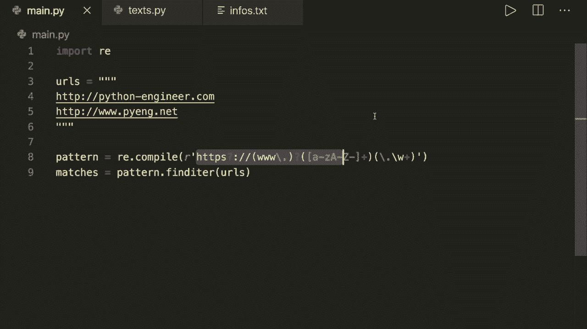

So， of course， we will see how we work with the R module in Python。

 Then I will show you what methods we have to search for matches„ÄÇ what we can do with a match object„ÄÇ

 Then we will talk about matter characters and more special sequences that can be used in patterns„ÄÇ

 Then we talk about sets， quantifiers， Con。 And then grouping， then modifications。

 So how we can modify strings with Rs。 And at the end， I show you some different compilation flags。

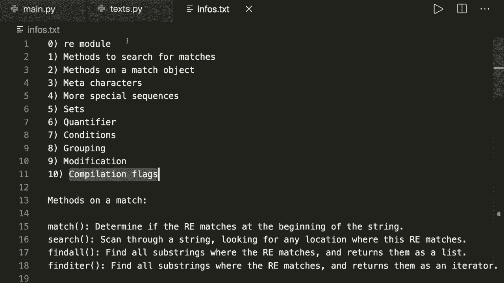

So let's start。 So as I already said， Python has a built in module that is called R E。

 which we can use to work with regular expressions„ÄÇ So we have to import R R„ÄÇ

 And then we can start working with regular expressions„ÄÇ

 So let me show you a very simple example first。 So let's say， here I have some test strings already。

 So let me copy and paste this here„ÄÇ So this is our test strings„ÄÇ

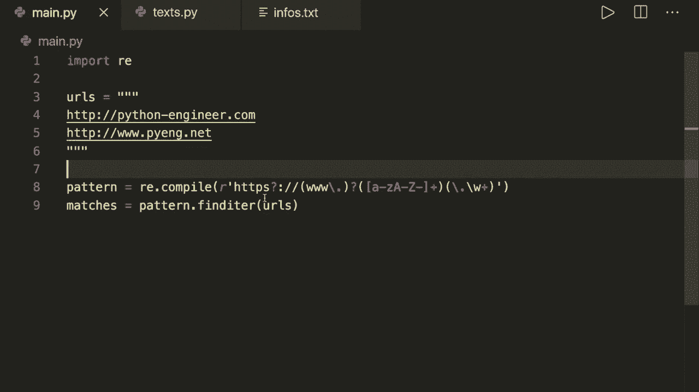

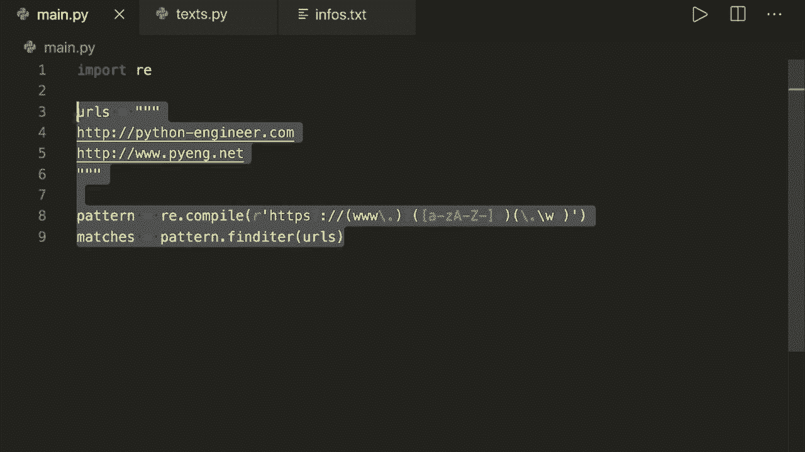

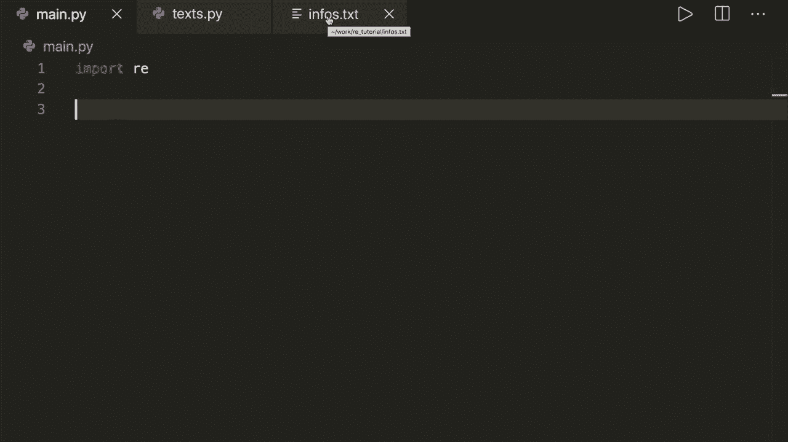

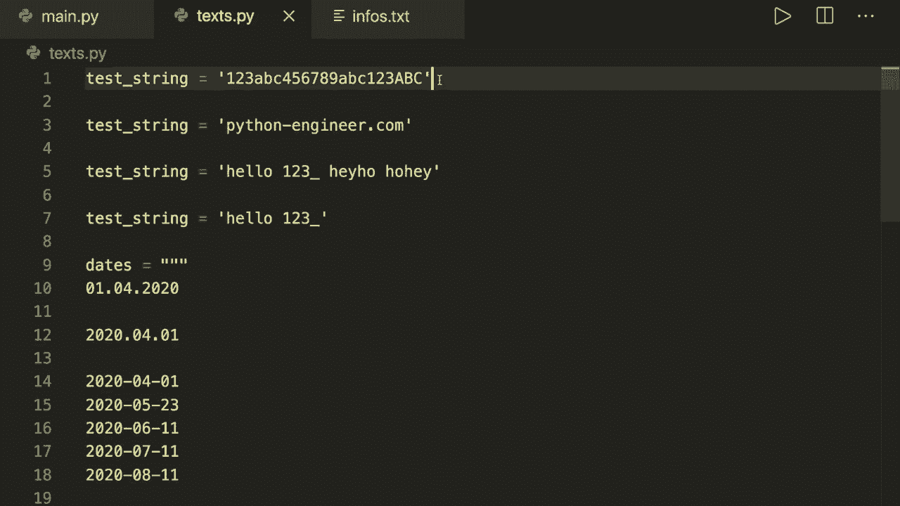

And now， let's say， for example， we want to search for the pattern ABC。

 So we see we have this three times here„ÄÇ And now let's say we want to look for ABC„ÄÇ

 and we create a pattern„ÄÇ So let's say pattern equals„ÄÇ

 and then we use the R E module and the compile method„ÄÇ And then here we say R„ÄÇ

 and then the string ABC„ÄÇ So I we'll explain what R means in a second„ÄÇ

 And then we can use this pattern to find matches„ÄÇ So we say matches equals pattern dot find iter„ÄÇ

 And then we want to find the matches from the test string„ÄÇ

 And now this will be a object that we can iterate over„ÄÇ So we can say for matches in matches„ÄÇ

 And then we simply„ÄÇ

Print the match„ÄÇSo now let's run this„ÄÇ And then we see we have two matches„ÄÇ

 So this is a match object。 and we can see more details。 So， for example， we can see the span。

 So this is the start and the end position。 So this is 3，4 and 5。😊，And this is our match， ABC。

 and a second match at position 12„ÄÇ So this is position or index 12 in our string„ÄÇ

So we see that we have two matches here„ÄÇ and what we also see here that our regular expression is k sensitive„ÄÇ

 So it doesn't include the„ÄÇUppercase ABC into our matches„ÄÇ So this is one thing that we must know„ÄÇ

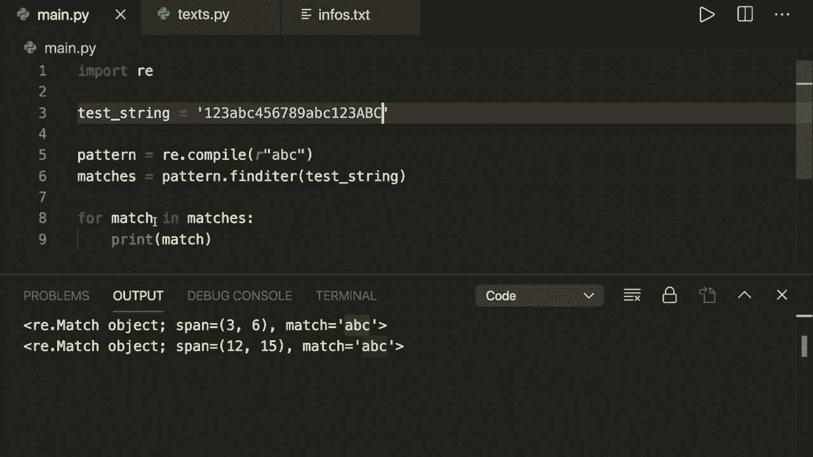

So one thing that I want to mention here is that instead of compiling our pattern explicitly„ÄÇ

 we can use the find It method directly on the R E module„ÄÇ

 So we could also just write that our matches equals R E dot find Iter„ÄÇ

 And then we want to look for our， let's say， string R ABC， And then from our test string。😊。

So you can use it directly on the R E module。 And then we will， if we run this。

 we will see that we get the same results„ÄÇ So there is not much„ÄÇ

Of a difference here„ÄÇ But I prefer to do it this way to explicitly compile the pattern and bind it to this object here„ÄÇ

 So this improves readability and is also a little bit more flexible„ÄÇSo I prefer it this way„ÄÇ

 but you should know that you can use both ways„ÄÇ

And now let's talk about the why I'm using this R here briefly„ÄÇ

 So this means that this is a raw string。So， for example。

 if I have a string A and this includes some special characters like a tap„ÄÇ

 So a backslash T that this is a tap or a back slash N for new line„ÄÇ And then I have a string„ÄÇ

 So now if I print this„ÄÇ Then you will see that we have the tap here at the beginning„ÄÇ

 So it didn't print the backslash T„ÄÇ And in a pattern„ÄÇ

 I usually want to look for the actual characters in my pattern„ÄÇ So then I can write an R here„ÄÇ

 And then this means that this is a raw string„ÄÇ So Python will print this the same way as it is specified here„ÄÇ

😊，And yeah， so I recommend to always use a raw string for your patent。

 You can use just a normal string， but remember that you should use a raw string。

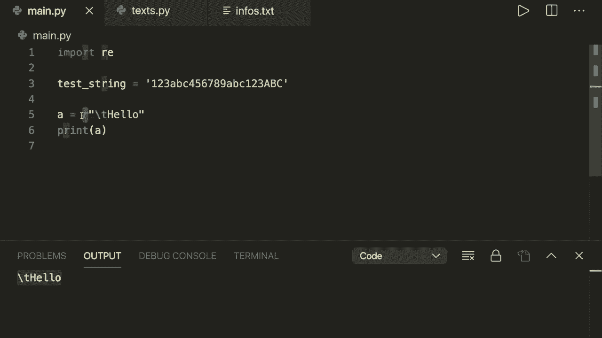

And yeah， so this is a short example how a regular expression is used。

 So typically we come up with our pattern， then we compile it。

 and then we use the pattern to find our matches„ÄÇ And I will show you the different methods that we have on the matches now„ÄÇ

 So now let's go over the methods to search for matches„ÄÇ So we already have seen the find iter„ÄÇ

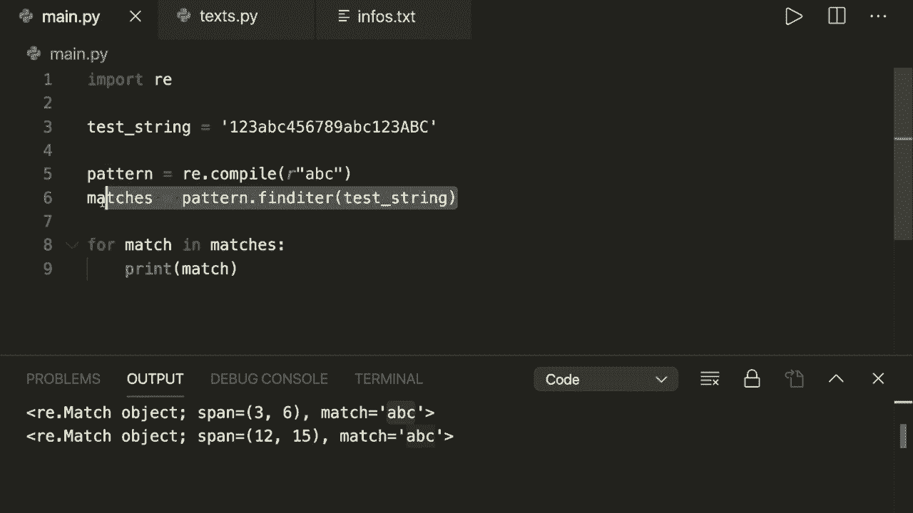

methodethod and this will give us a match object„ÄÇ and I will show you what we can do with a match object in a second„ÄÇ

 So now let's talk about the other methods„ÄÇ So there are three other methods„ÄÇ

 So we can use the dot match method„ÄÇ So here dot match„ÄÇ Then we have search„ÄÇ

 and then we also have find all。 So。😊，Now， let's look about the find all method first。

 So if we can say pattern dot find all， then we will simply get the string。 So if you see here。

 I'm printing the whole match object。 So now if I want just a string， then I can use find all。

 and now if I run this， then it will just print the two strings that I'm looking for。

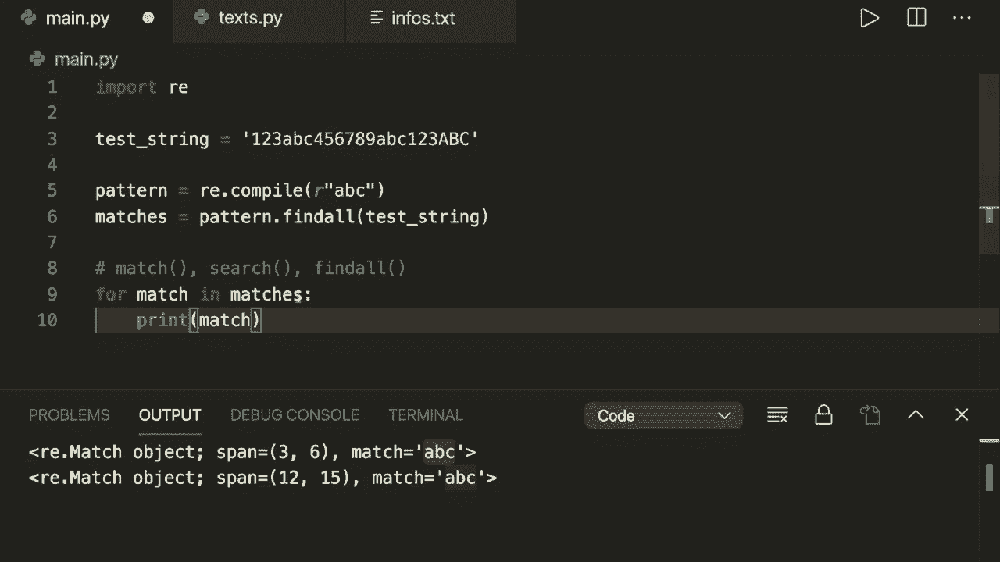

So this is defined find all methods。Now， the match method determines if the expression matches at the beginning of the string。

 So this will only return one match„ÄÇ So here I can say match equals pattern and then match„ÄÇAnd now„ÄÇ

 if I print the match， So let's print。The match and run this。

 Then we will see this is none because the match looks only for patterns at the beginning of our string„ÄÇ

 So ABC is not at the beginning。 So now if I use 1，2，3 as a pattern。

 then we will see this is at the beginning， So this will return one match。

 And we also have the pattern here again。 But again， the match does only return the first。

Match if it is at the beginning of the string„ÄÇAnd now we also have the search method„ÄÇ

 so the search method scans through the string and looks for any location where the RE matches„ÄÇ

So if you use， for example， let's look for the match ABC again。

 Then we will see this will return none because ABC has to be at the beginning„ÄÇ

 And now if we use the search method， then it will find the match object again。

 And it will simply return the first match。 So we have search， match， find all and find iter。

 And this is my preferred method。 So from now on， I will only use this one。

And then we also have some function that can be used to modify an object„ÄÇ

 So we also have split and s„ÄÇ So I will come to them later„ÄÇ

So now let's continue using the find iter method„ÄÇ and let's have a look at what we can do with the match object„ÄÇ

 So again， let's say our matches equals pattern。 and then find iter。

 and then let's iterate over this„ÄÇ So for match in matches„ÄÇ and then we want to print the match„ÄÇ

Then„ÄÇ

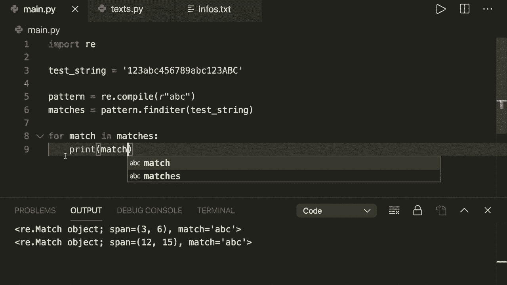

Again， we see we have the whole match object here， and we can use four different methods on this so we can use the group method。

 We can use the start and the end method。And we can get the spam， so。Let's start with the span。

 So this will give me the„ÄÇStart and the stop index where this pattern is located„ÄÇ

 So let's print the match dot span„ÄÇ So then we simply get this as a tuple here„ÄÇSo„ÄÇWe get 3 and 6„ÄÇ

 So this is a tuer， and we can also get the。Just the start and the end right away by saying print match dot start and。

Print match dot。And。Oh， sorry。 Here is I dot match dot start。

So then we get the start in the stop index„ÄÇ And now let's talk about the group method„ÄÇ So now„ÄÇ

 if we call match dot group， then we will get or print the。Actual string of the match。

 And we can also give this group method arguments to find the group 0 or  one and or 2„ÄÇ

 And we will talk about this grouping later„ÄÇ But for now on„ÄÇ

 if you just want the string then from the match， then just call match dot group or group 0。

 So this is the same。😊，And yes， these are the four different methods that we can use on a match object。

And now let's come to the meta characters„ÄÇ So in regular expressions„ÄÇ

 there are these me characters that have a special meaning„ÄÇ

 So these are all the me characters we must know„ÄÇ And you don't have to know them by heart„ÄÇ

 So I recommend that you keep a cheatee sheet somewhere with all this stuff„ÄÇ

 And I will also provide a cheat sheet on my website„ÄÇ

 So you can check it out on Python minuseng dot com„ÄÇ And this is all you need to know„ÄÇüòä„ÄÇ

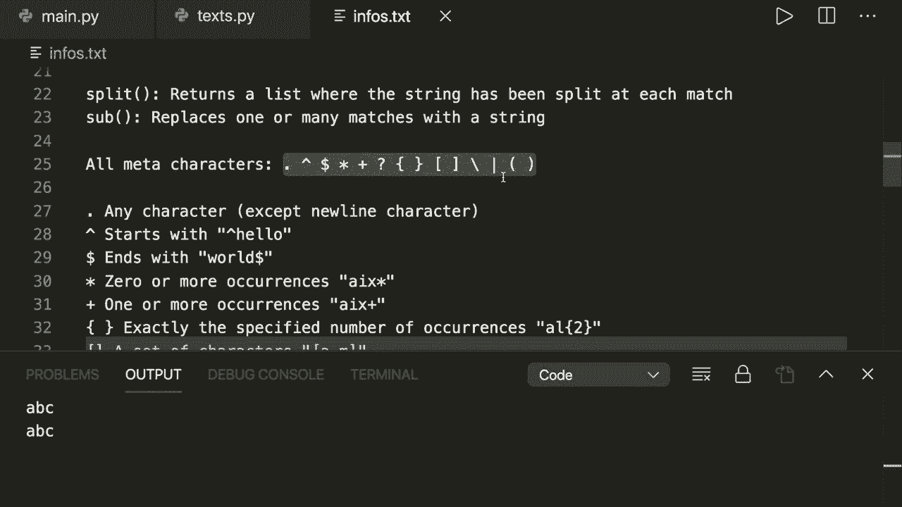

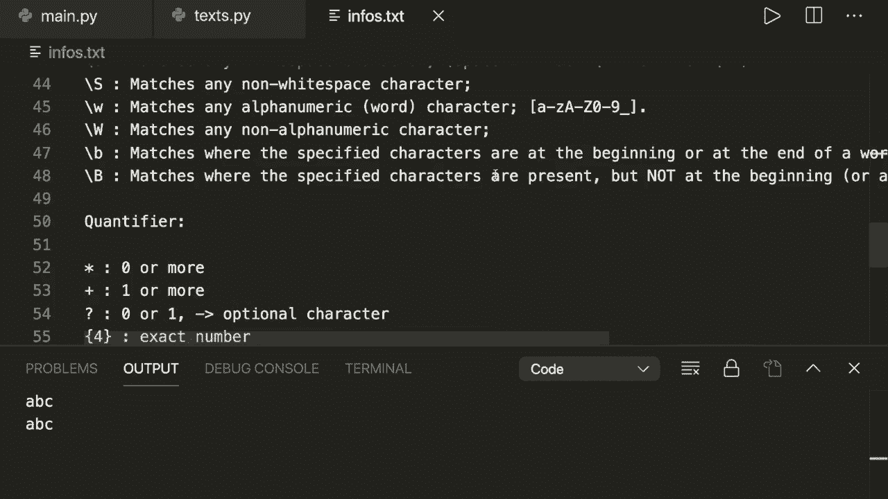

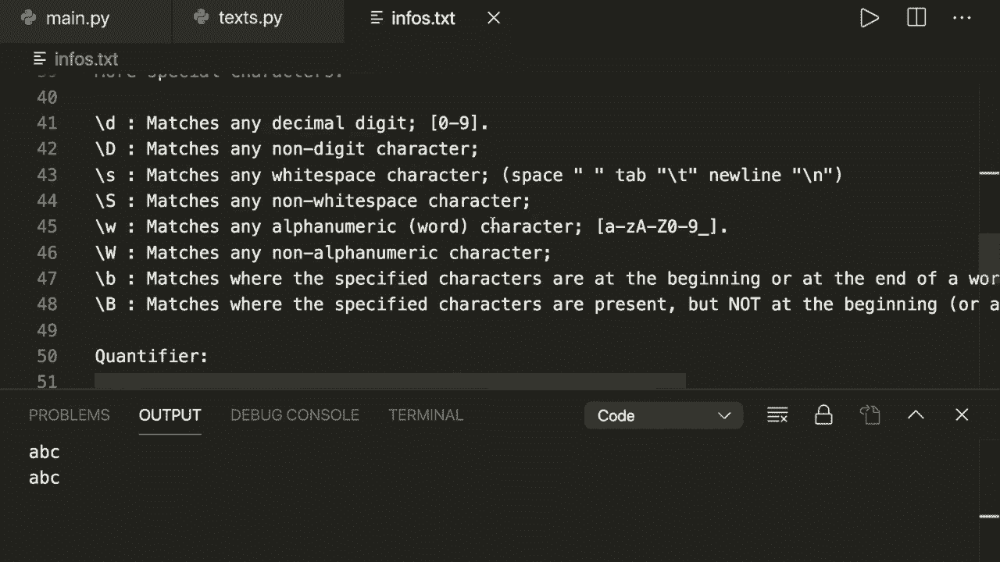

So now let's talk about these me characters one by one„ÄÇ

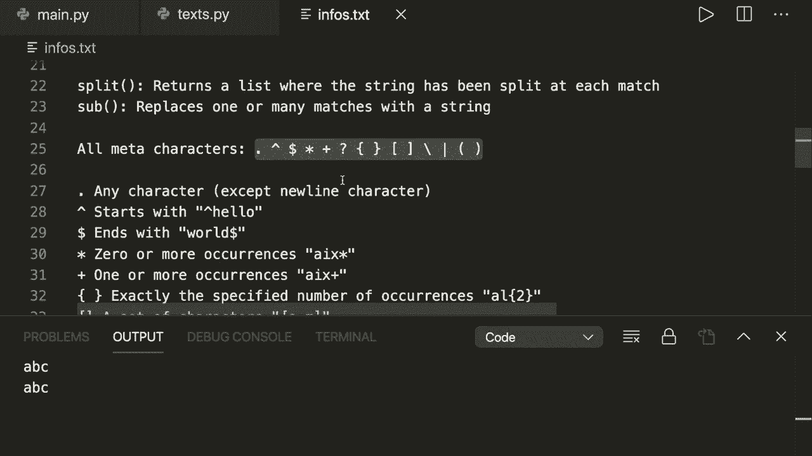

And then I will show you what this means„ÄÇ So the first one is the dot„ÄÇ

 So the dot means that we want to look for any character„ÄÇ

 So any character except a new line character， then the carrot means that we want to look for a pattern that starts with that starts with the pattern we are looking for。

 So that starts with a string。 hello， for example， then the dollar sign is the opposite。

 if we want to look for a string at the end of our text„ÄÇ

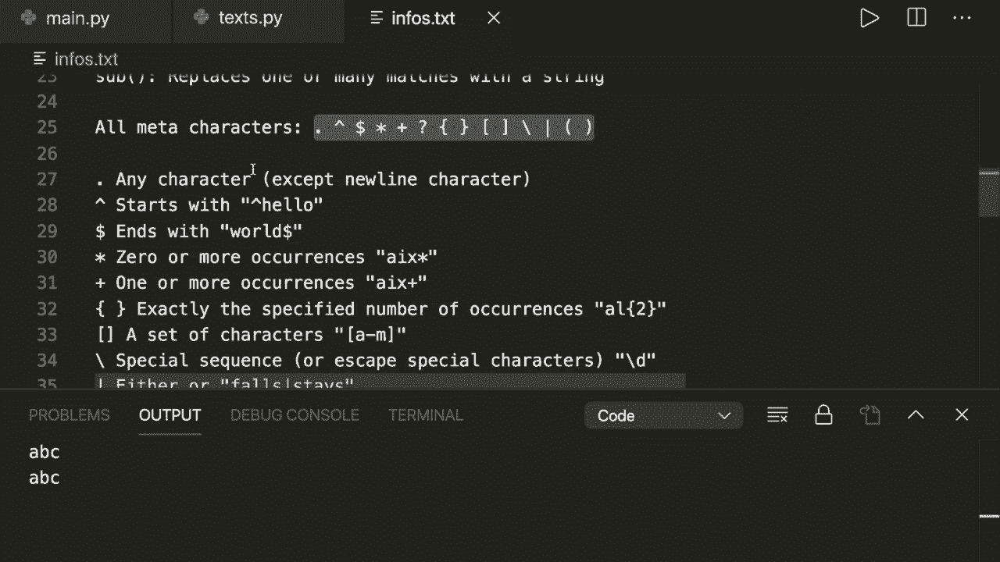

Then we have some quantifiers。 So the asterisk， the plus and square brackets。

 and I will talk about them later in more detail„ÄÇ

Then we have the set operator， which I will also cover later。Then we have conditions。

And grouping with parentheses。 So I will also talk about this later。 And， of course， we have to look。

 we have the back slash。 So with the backlash， we can get more special sequences or we can escape character。

 So， for example， if we actually want to search for the dot。

 Then we have to escape this in our pattern„ÄÇ

So now let's talk about the first three and show you some examples„ÄÇ

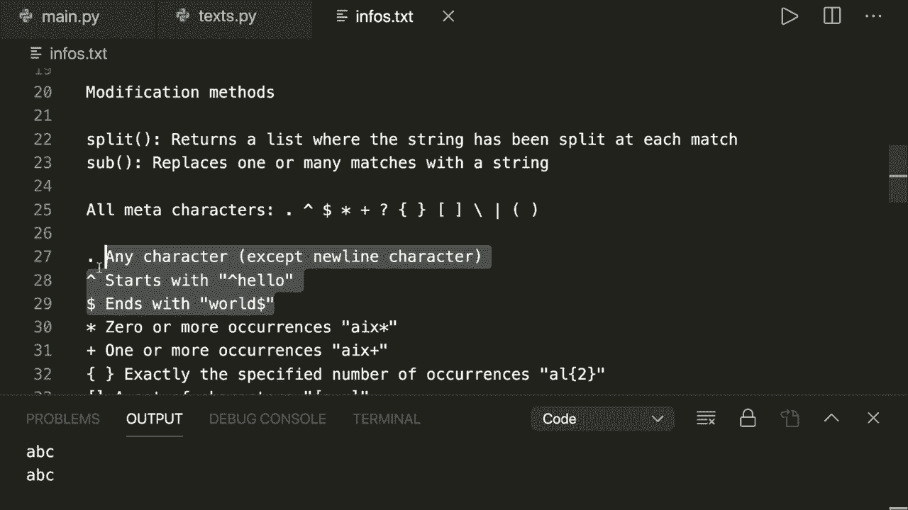

And then later， we will cover the other meta characters in more detail。 So now， first。

 let's say we want to look for the dot and then print all the matches„ÄÇ Then we see we get all„ÄÇ

All the characters in our string， because the dots is looking for any character， except new line。

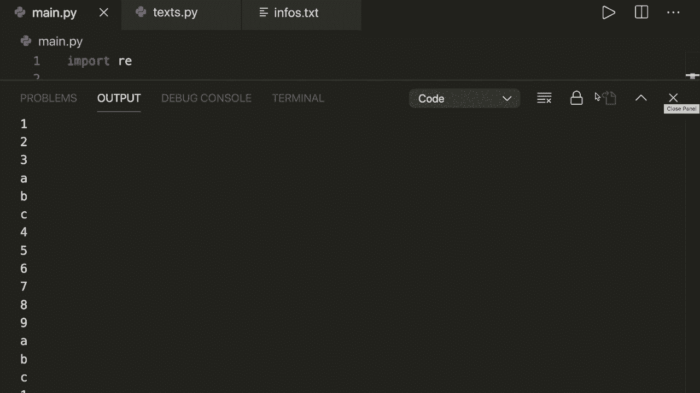

So， this is the dot。And now， let's say we have a dot here at the end。

 And we actually want to get this dot„ÄÇ So then we escape it with a back slash„ÄÇ And now„ÄÇ

 if we run this， then we just get the dot。 So now let's print the whole match object。

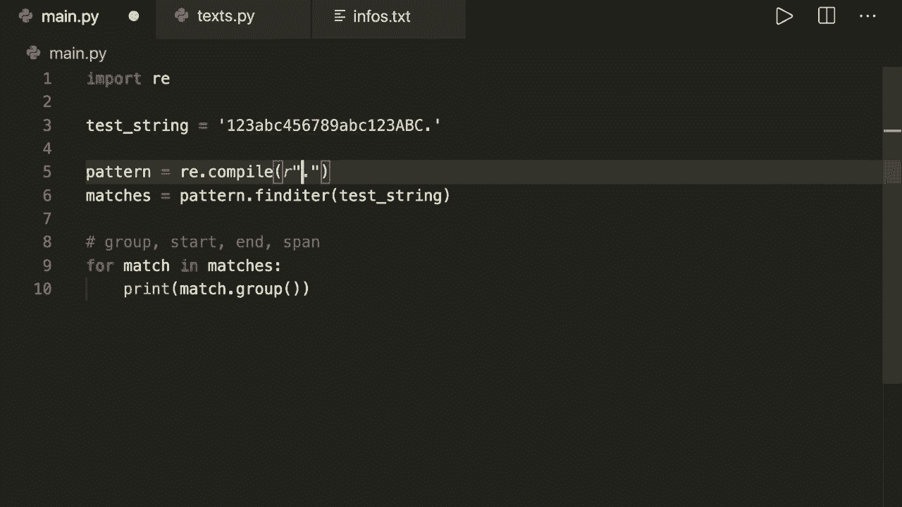

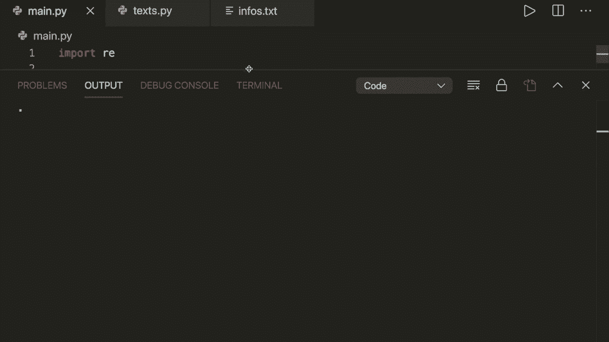

Then we get the dot， and we see that it is at this position。 So this is the dots。

 And then let's have a look at the carrot„ÄÇ So this is the carrot„ÄÇ

 So let's say we want to look for  one to 3„ÄÇ if it starts with this„ÄÇAnd then we get one match object„ÄÇ

 And for example， now， if we look for ABC， then it will return nothing because it's not at the beginning。

 And the opposite， if we want to have a look， if we want to look if this is at the end。

 So then we can say dollar here„ÄÇ And now if we run this„ÄÇ and this will find nothing because again„ÄÇ

 sorry， we have the。AndCo on here。This will find nothing because， as I said， it is case sensitive。

 Now， if I am looking for upper case， ABC and dollar at the end。

So then it found the match at the end„ÄÇ

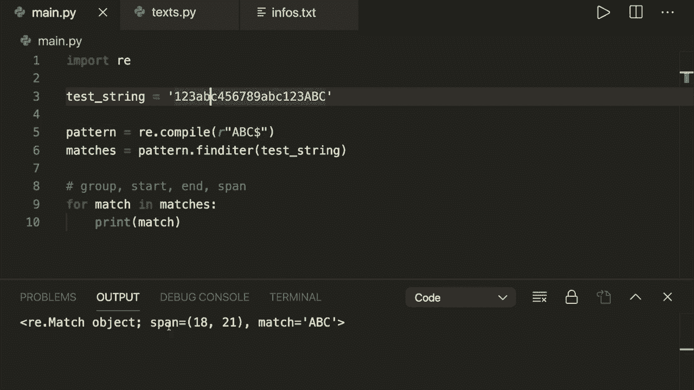

Alright， so now we will talk about the other meta charactersers later。

 And now let's look at some more special characters„ÄÇ

 So there are more special characters that start with a backlash„ÄÇ

 So there is the back backlash and small D， this looks for any ditchit。 So0 until 9。

 Then there is the capital backlash capital D„ÄÇ So this matches any nonditchit character„ÄÇ

 Then there is backslash small S。 This matches any white space character， For example。

 space tap or new line„ÄÇ Then we have backslash capital is S„ÄÇ

 this matches any nonwhitespace character。 So for all these patterns， all these special characters。

 the capital pattern is kind of the opposite of the small character here„ÄÇüòä„ÄÇ

So then we have backlashlash small W„ÄÇ This matches any word character„ÄÇ

 So we have characters from a to C„ÄÇ We also have all the capital characters„ÄÇ

 and also ditches and the underscore„ÄÇThen the capital Ws the opposites of any non word character„ÄÇ

 non alpha numeric character。Then， we have the。Back slash B。

 So this matches where the specified characters are at the beginning or at the end of a word„ÄÇ

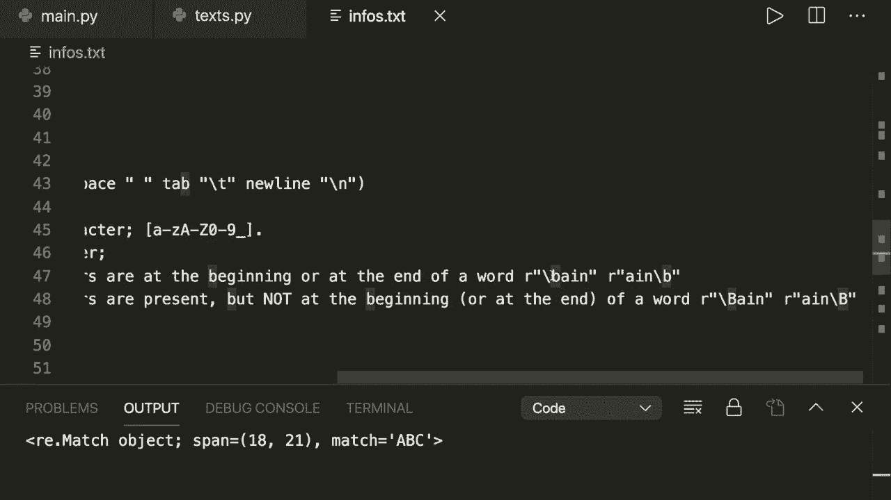

And again， we have the opposite。 So where this is not at the beginning。

 So let's have a look at them in detail„ÄÇ

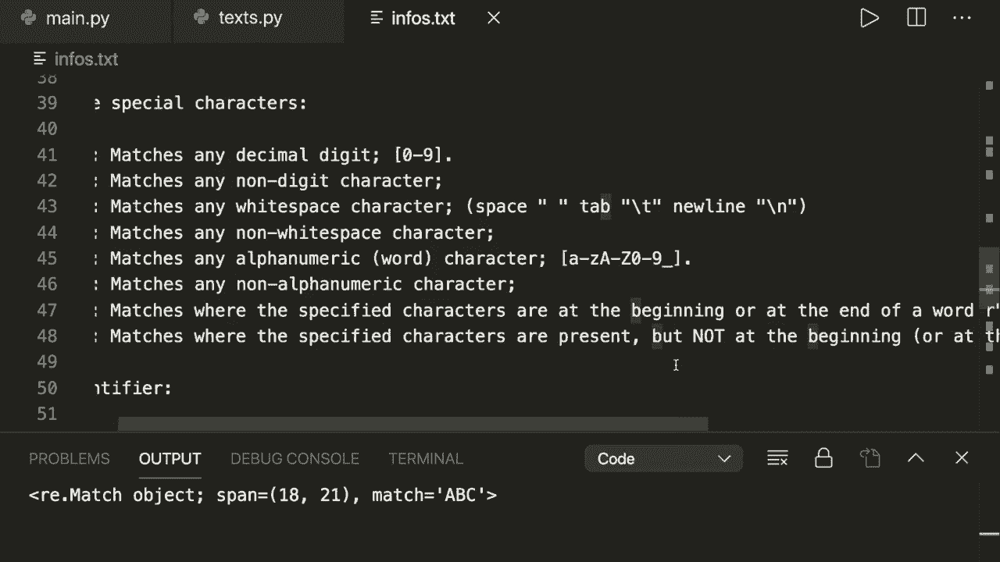

So let's use another test string here。 So let's， for example， use this one。

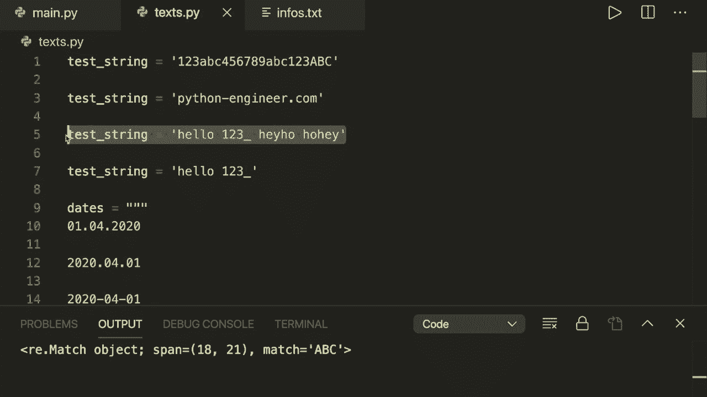

And now， if we want to look for any ditchit here， we can simply say we want to look for back slash D。

 And now if you run this， then we will see we have three matches， the dts 1，2， and 3， Now。

 if we use the opposites So capital D's or any non ditchit„ÄÇ

 then it will find all the characters except 1，2， and 3。

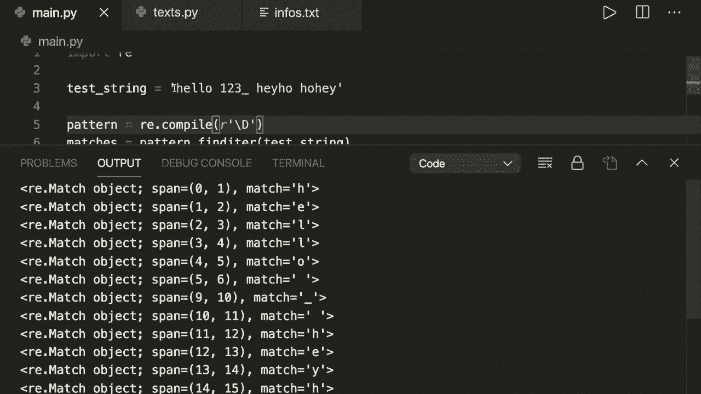

Then let's have a look at the white space„ÄÇ So backslash S finds any white space character„ÄÇ

 So here we see we have a space here， a space here and a space here。 And then again， the opposite。

 any non white space character is any other character。😊，So this is the S special character。Then。

 let's have a look at„ÄÇ

the„ÄÇW character„ÄÇ So any alphanumeric character„ÄÇ So if I put in a W here„ÄÇ

 then it finds all the word characters„ÄÇ

And again， the opposite capital D， This will just find the spaces in this example。

 And now let's have a look at the„ÄÇ

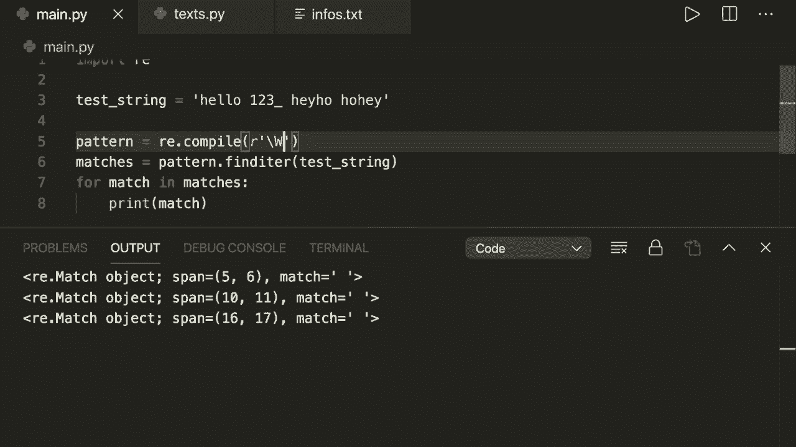

back slash。B， so now if I am looking for hello， then it will find it because it is at the beginning of a block。

And a block is not only the beginning of a string， but the beginning。

Of any block that follows a white space character。 So， for example， if we look for。Hey。Then。

 it will also find there。嗯。Hey， but it will only find this pattern and not this one。

 because it's looking for matches that are at the beginning of a block„ÄÇSo for example„ÄÇ

 if we put this。Before a space， then it will find。Then it will find this pattern or this match， too。

And again， the opposite。 Now， if we are looking for this and we put。Oh， he here again。

Then it will find this hay， because it is not at the beginning of a block where this is at the beginning of a block。

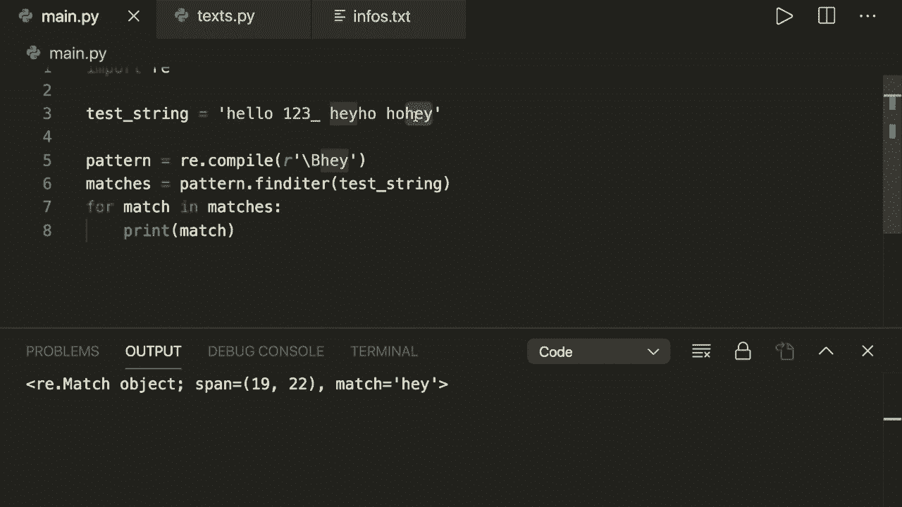

So these are the special sequence， special characters that we should know。

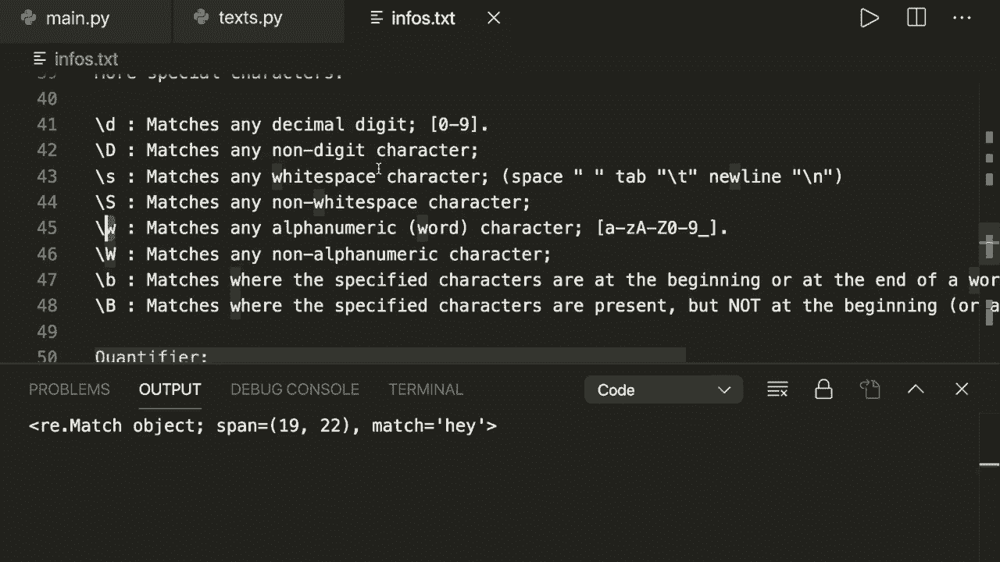

And now， let's continue with sets。

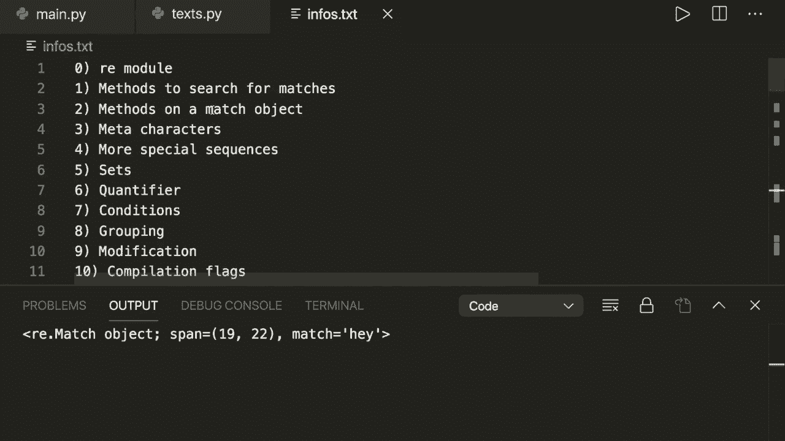

So we can use square brackets to look for sets„ÄÇ And let me show you what this means„ÄÇ

 So let's say we only have this string now。 But now， let's say we only want to look for。

And nonnumeric characters。 So only for these ones， then we can use a set for this。

 So a set is a pattern between square brackets„ÄÇ And now here in this set„ÄÇ

 we can use multiple multiple characters that we want to look up„ÄÇ For example„ÄÇ

 we want to look for a L and a O。And now， if we run this， then it will find all these characters。

And you must be careful here because it doesn't look for L O„ÄÇ

 but for any single character that we put into this set„ÄÇAnd we can also specify ranges here„ÄÇ we can„ÄÇ

 instead of， let's say， we also want to have the H and the E。 Then it will find any。

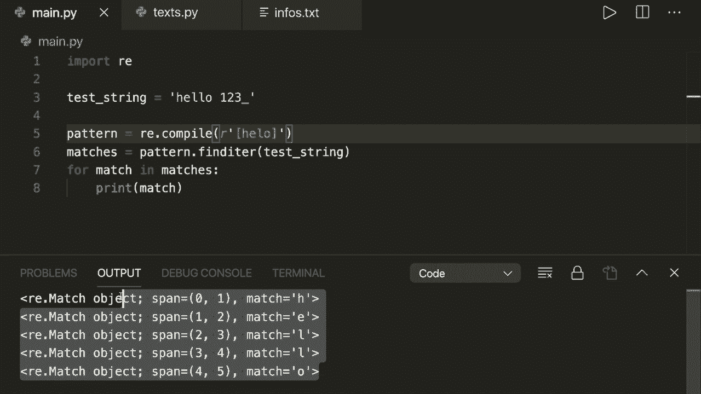

Character here。That is not a number。And also， not the backlash not the underscore。

 So we can also specify a range here„ÄÇ And this is a very typical„ÄÇ

 very common example and regular expressions to use a dash C„ÄÇ So A to C„ÄÇ So all the„ÄÇ

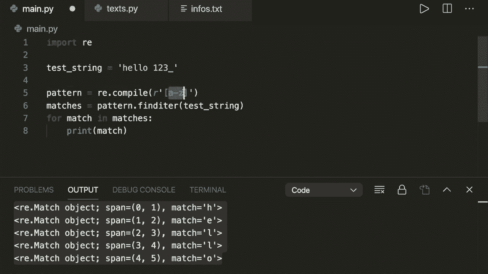

Lower case characters„ÄÇ Now if you run this„ÄÇSometimes it's not saving this file automatically„ÄÇ So now„ÄÇ

 if you run this， then we see that we will find。

All the„ÄÇ

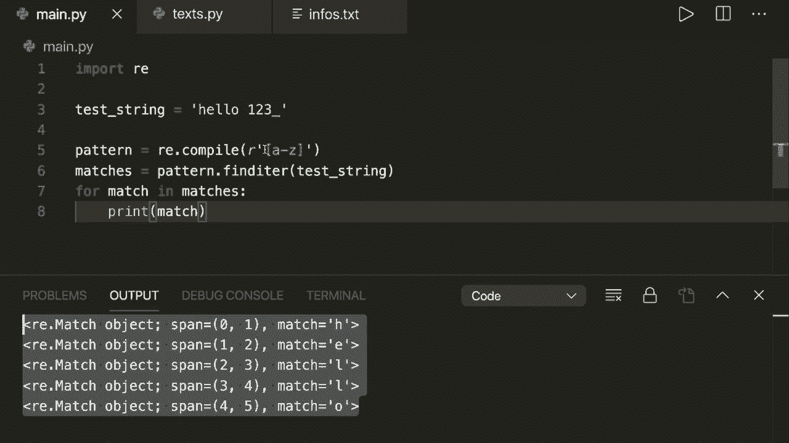

Letters here„ÄÇ And we can also look for dits„ÄÇ So let's say we want only the ditits 2 and 3„ÄÇ And again„ÄÇ

 here， we can have a range。 So we can say 1 to 9。 So this is， or let's say0 to 9。

 And this will find all the ditches„ÄÇ So this is the same as using back slash D to find a ditit„ÄÇ

And so， yeah， so if you want to specify a。Range， then the the dash can be used to。

 to declare to define the range„ÄÇ And now if you use it after a range„ÄÇ

 then it's looking for the actual dash„ÄÇ So now if you also want to look up a dash„ÄÇ

 then we can find it here。 And if you put it between two things， then it is a range。

 So be careful here„ÄÇAnd we can also„ÄÇRight our different range is back to back„ÄÇ So for example„ÄÇ

 if you have„ÄÇHello here in upper case letters„ÄÇ And first of all„ÄÇ

 let's say we only want the lower case letters„ÄÇ And then we also want to have all the uppercase characters from A to C„ÄÇ

 Then we can write this back to back so we can say small， A to C or a dash C， then capital a dash C。

 Then this will also include all the uppercase characters„ÄÇ And again„ÄÇ

 we can use back to back and also include numbers„ÄÇ

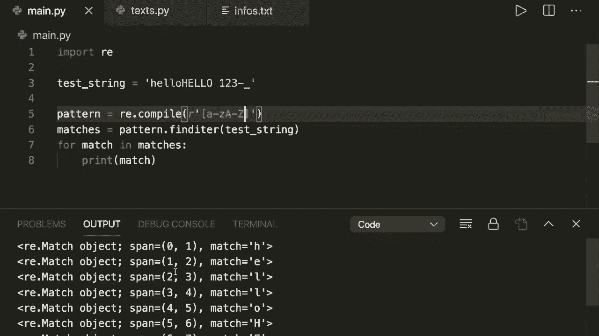

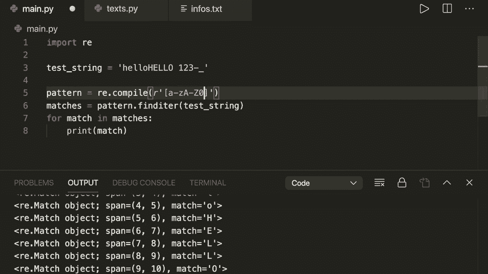

So， yeah。 then it also finds the numbers here。 So the ditits。 So， yeah。

 so this is how we can use sets with this brackets„ÄÇ

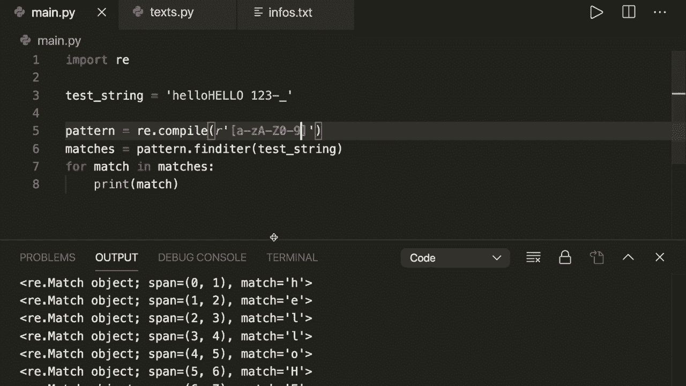

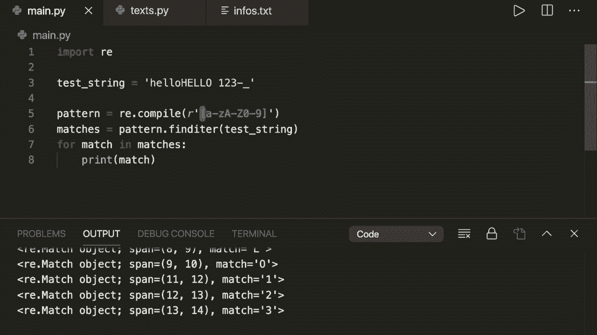

And now let's talk about quantifier。 So we have these quantifier， the meta characters。

 So we have a an asterisk„ÄÇ So a the the multiplication sign„ÄÇ This means0 or more„ÄÇ

 Then we have the plus this means one or more„ÄÇ Then we have the question mark„ÄÇ So this means0 or one„ÄÇ

 And this means， or this can be used when we want to look for an optional character。

 So it may be there， but it may also be not there。

Then if we want to look for a specific exact number， we can use curly braces。

 and then a number here will look for the exact number„ÄÇ

And then we can also specify a range with minimum and maximum„ÄÇ

 So if we put two numbers between the curly braces， then it's looking for a range。

Okay， so let's have a look at them in detail。 So let's say we have a string。 let's say hello。

 underscore 1，2，3。 And now let's say we want to have or we want to find diits。 And remember。

 we can do this with with backlashlash D„ÄÇ and then it will find all the digits„ÄÇ

 and let's say we want to look if we have0 or more„ÄÇ So then we use an asterisk„ÄÇ

 And then it will also find all the other characters here„ÄÇ because here there is no diitchit„ÄÇ

 but it was looking for0 or more。 and in this case， our match is just an empty string。😊。

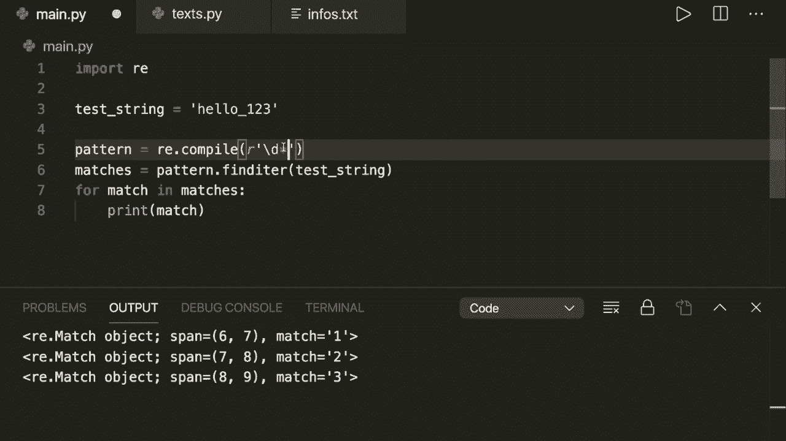

And then again， an empty string， empty string， empty string。 And then here we have diitchits。

 and then it will combine them into one match。 So now， if we just use the。

And use it without a quantifier„ÄÇ Then it puts any every single ditchit S one match„ÄÇ

 And if we want to look for0 or more， we can use this with an asterisk。 And now in this case。

 a plus is better„ÄÇ So we want to look for one or more„ÄÇ And then we will see it has only one match„ÄÇ

 and it combined all the ditits into one match„ÄÇ Then let's say we want to look for a diitchit that has an underscore in front of it„ÄÇ

 So let's say we want to look for underscore and then the diitchit„ÄÇ then it will find the one„ÄÇ

 And but now let's say we don't know if there is an underscore or not„ÄÇ

 So now if the string looks like this。 And then if we run it， then it doesn't find a string， a match。

 And then we can say that the underscore is„ÄÇ

Optional by using the question mark。 And now if we run it， it finds all the matches。

Because it doesn't has an underscore。 And now， if we do it like this。

 then it will find the same matches because it can also have an underscore here„ÄÇ

So this is the question mark。And now let's talk about specific ranges or or a specific number of， of。

Characters， so now if you want to look for three ditits。

 then we can see a dititchit and then curly race and then 3„ÄÇ Then it will find our match„ÄÇ

 So now if we are looking for four of the ditits and runners， then we don't have a match。

 and we can also use a range here„ÄÇ So this can be can be between one and 3„ÄÇ

 and then it will also find the match。😊，So these are the quantifiers。 Now。

 let's stop for a second with all the concepts and just make or just do an example„ÄÇ

 So let me copy this„ÄÇ

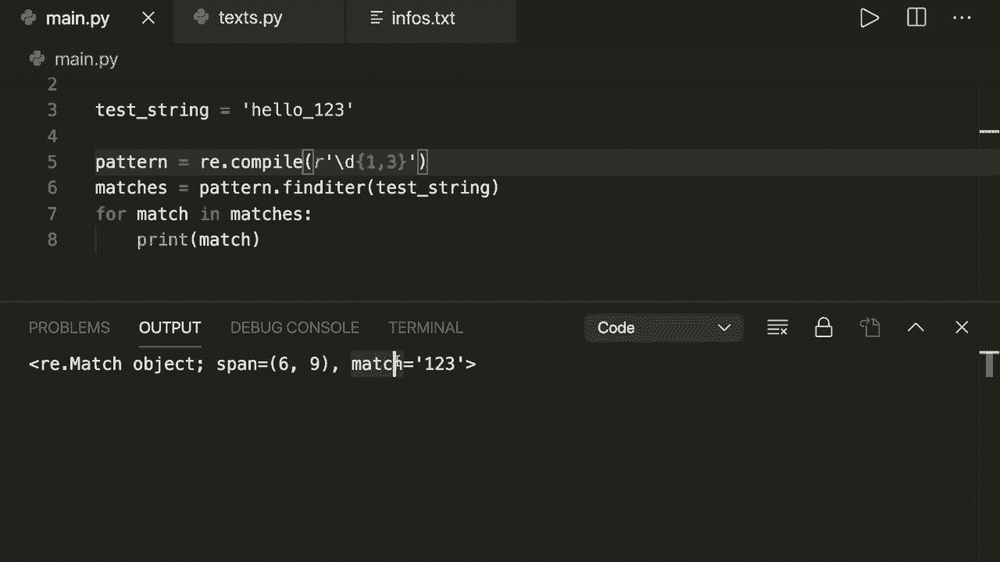

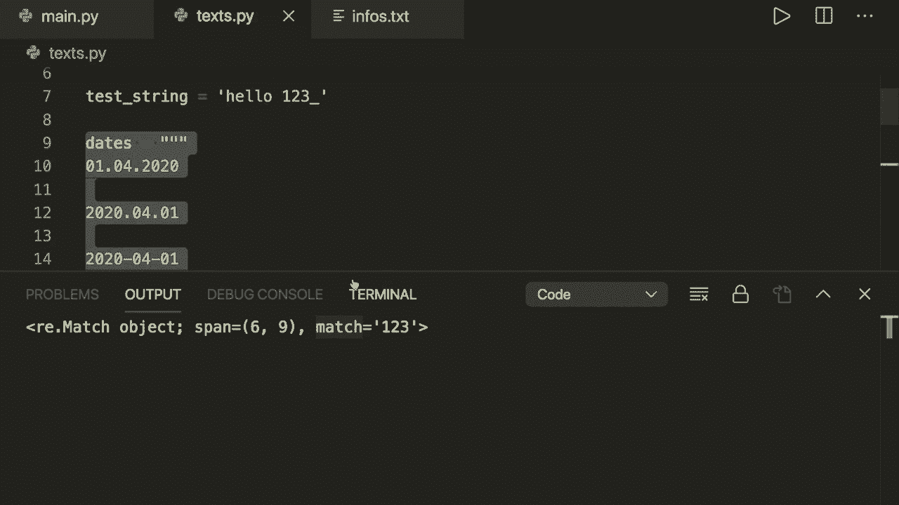

String here„ÄÇ And now let's use some of the concepts that we already know„ÄÇ

So let's say our string is now the date string„ÄÇ So this is dates in different formats„ÄÇ So„ÄÇ

 for example， here， we have the day then the month and then the year。

 and this is separated by a colon„ÄÇ Then here it its the year first„ÄÇ then a colon„ÄÇ

 Then here we have year month and day separated by a dash„ÄÇ Then here by a s„ÄÇ

 and also by an underscore„ÄÇ

And now， let's say， we only want to extract。The dates with this format so year， month and day。

 and only with a dash in between， so。

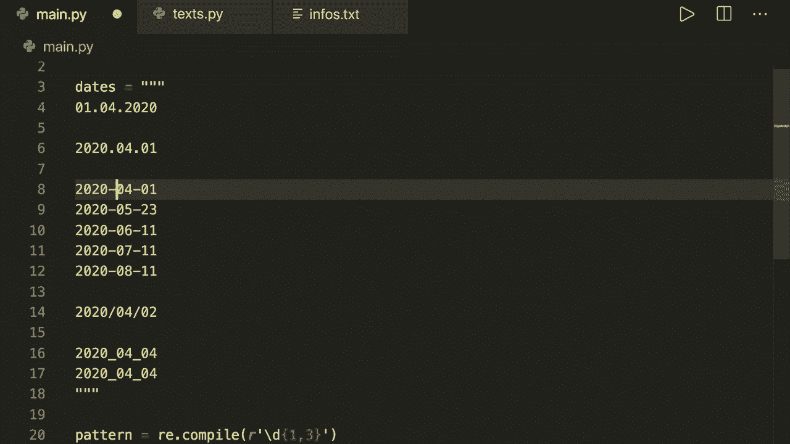

Let's do this so„ÄÇThe first thing we can do is now here is to look for„ÄÇ

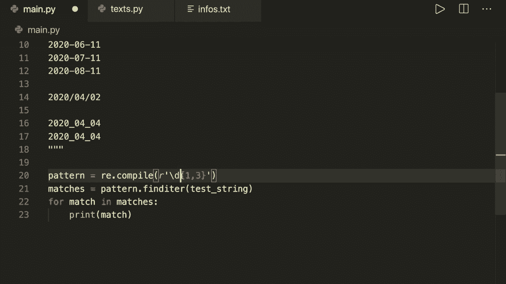

This patterns of 4，2。 and again， two ditits。 So we can write this up。 So backlash D， backlash D。

 back slash D。 And then let's say， first of all。

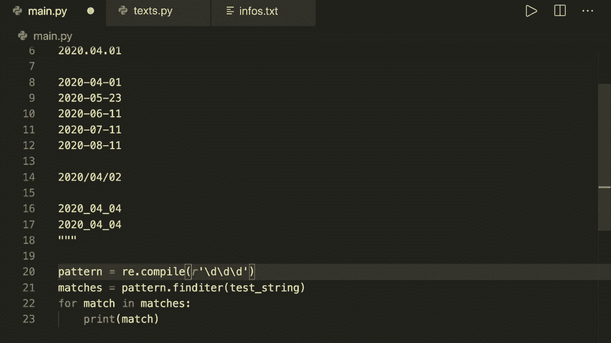

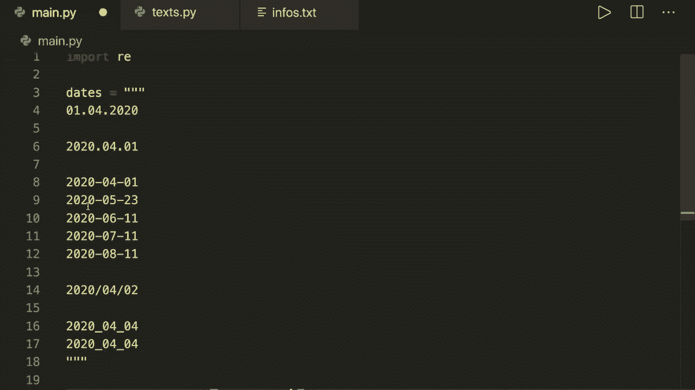

We want to look for any character between。 So remember， the point is a meta character。

 So this is looking。 if we have a look at this here， this is looking for any character。

 except new line„ÄÇ

Then we have two diits。 So backlashlash D， Then again， we can have any character and then D and。

Back slash D。 So， for example， if our string has also some text in it。 and now if we run this。

Now， it's called dates， the string。 Now， if we run this， then it will find all the。

嗯。All the statess with， with the numbers。 but only in this format。 So 4，2，2。 So， for example。

 it didn't put the text here， the hello text in here。

 and it didn't put this date in here because it has a different format„ÄÇ

So， now。This is our first try。 and now what we can do here is， for example。

 the next thing we want to do is to find only these in this format„ÄÇ So now let's have a look at„ÄÇ

 So let's exchange the dot by a dash„ÄÇ So this is looking for an actual dash„ÄÇ

 And then we have only the dates in this format„ÄÇ

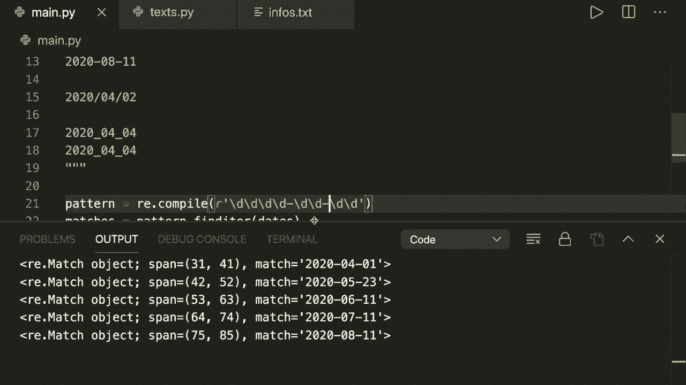

So 4，2 and two numbers separated by a dash。 And let's say we this may also be a valid date。

 So we can also looking for a slash as an separator here so then we can use a set„ÄÇSo remember„ÄÇ

 a set is defined in square bracketets， and then we can define the characters that may be at this position。

 So， for example， we have a dash and we have also or may have a slash。 And again。

 here we are using a set„ÄÇ So then we have dash slash„ÄÇAnd are closing our set„ÄÇ And now„ÄÇ

 if we run this again， then we see。

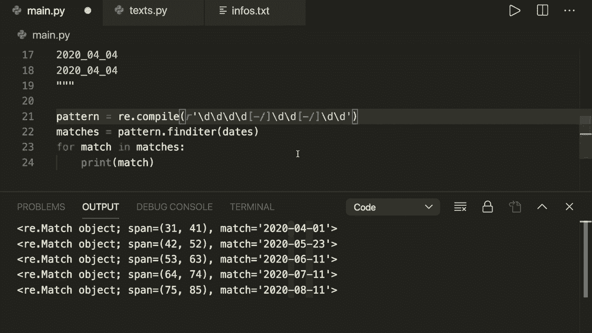

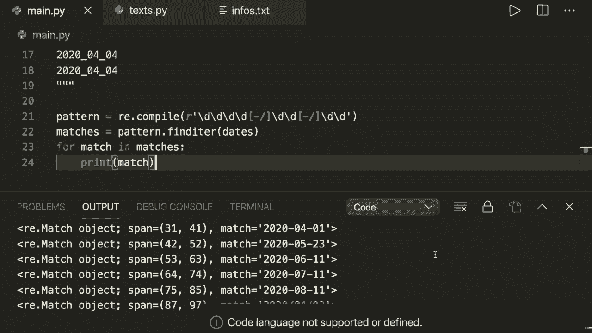

3， we see that this is also included in the matches。 And now， let's say， for example。

 we are looking only for dates in May or June。 So how do we do that， So the month here。

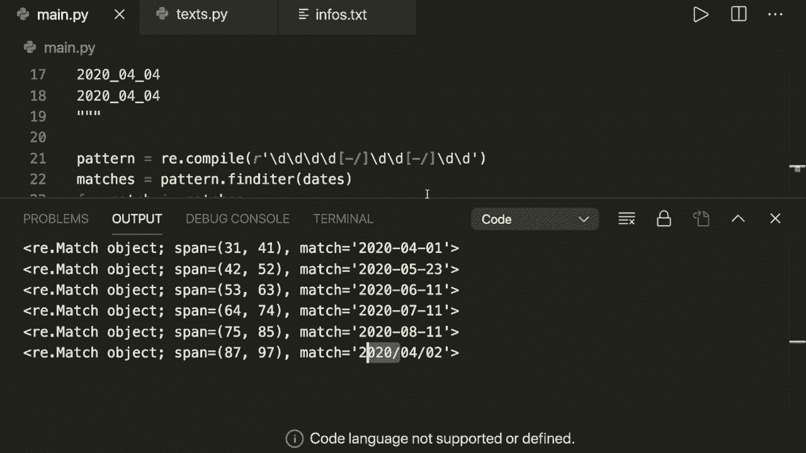

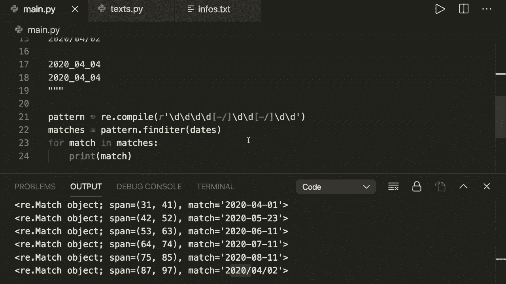

So what we do here is now， this is not。

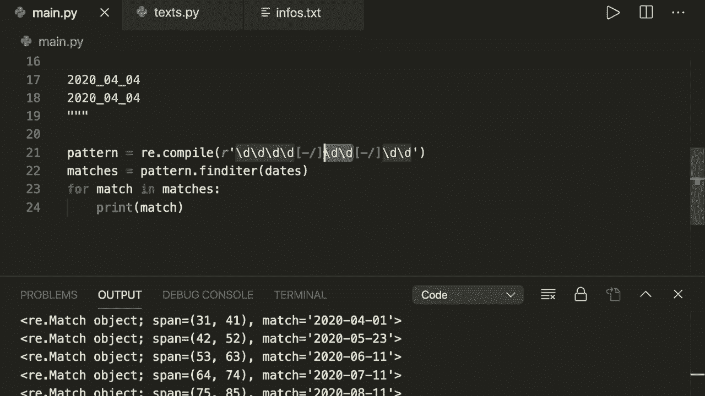

Any diitchit„ÄÇ So here we are only looking for month„ÄÇ

0，5 and 0，6。 So we always have a0 here， and then we can again use a set。

 And here we can use let's say only 5 and 6„ÄÇ And now if we run this„ÄÇ

 and we only have the dates in May or June。 And remember， we can also use a range here。

 So let's say we want to have May， June and July。 then we can say 5 to 7。

And then we have all the dates from May to July„ÄÇAnd now let's use a quantifier here„ÄÇ

 So instead of writing for D's here， backslash D， we can say D and then curly braces and use the quantifier for。

 So we want to have exactly four ditits here„ÄÇ And here we want to have exactly two diits„ÄÇ

So then we can do it like this„ÄÇ So this finds all the dates in„ÄÇAnd May June or July in this format„ÄÇ

 So this is one typical example， how regular expressions are useful。

And yeah， so now let's continue。 So we already covered a lot here。

 So let's talk about conditions next， so。

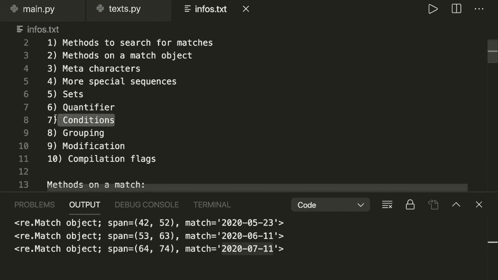

Let me copy another string and to another example。 So here I have another string with some names， so。

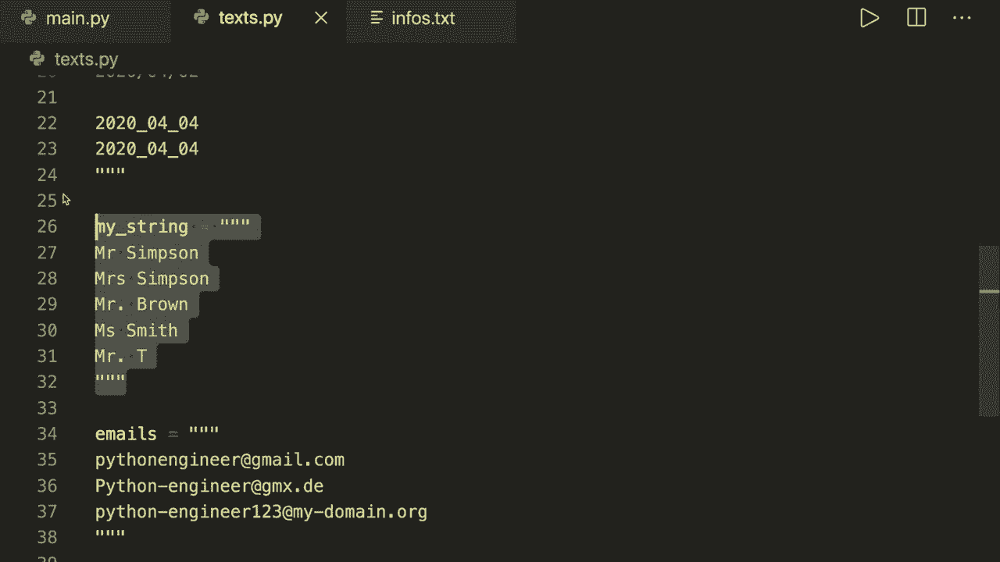

Let me copy and paste this year„ÄÇ This is my new string„ÄÇ So here we have a Mr„ÄÇ Simpson„ÄÇ

 a Mrus Simpson， a Mr。 Brown， a Miss Smith and a Mr。 T。

 And sometimes we have a dot between Mr and sometimes not。And now， let's just extract all the。

Different names here。 So， for example， there is some more in our file。 So， for example。

 we have hellello world„ÄÇ

1，2，3。Date。嗯。And now we only， we want to extract only the names， and we want to have the whole name。

 So let's build up our pattern here。So let's look for Mr first。 So first， we want to look for a Mr。

 So M„ÄÇ And then we have a whitespace„ÄÇ So back slash S„ÄÇ And then we have one or more character„ÄÇ

 So word character。 So here we use a back slash W。 And then we say plus。 So this， remember。

 this is a quantifier， So one or more。 And then I'm looking for the my string here。

 and I don't actually write the space here because I have this back slash S„ÄÇ And now if I run this„ÄÇ

 then we see that we have one match here„ÄÇ So this is our Mr„ÄÇ Simpson„ÄÇ So here we have the M R„ÄÇ

 and then a space„ÄÇ And then„ÄÇ

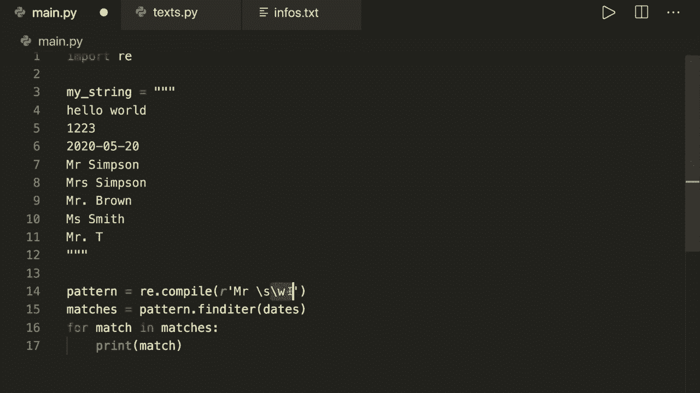

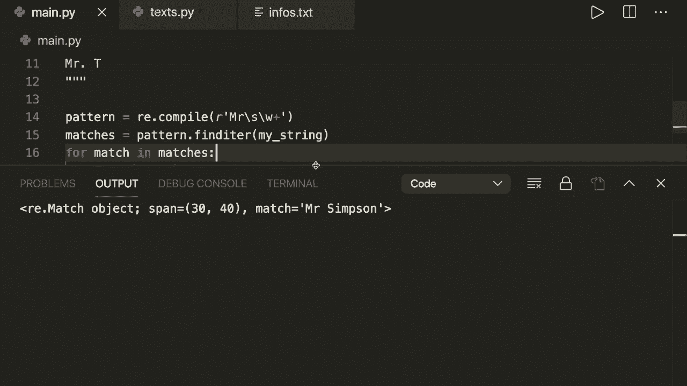

1 or more word characters。 And now， as a next step。

 let's also include a Mr where we have the dot here„ÄÇSo„ÄÇWe can have the dot„ÄÇ

 And now if you just write it like this and run it„ÄÇThen it finds„ÄÇ sorry„ÄÇ

 I have to use back slash dot， of course， here， because it's looking for an actual。

 I want to look for the actual dot„ÄÇ

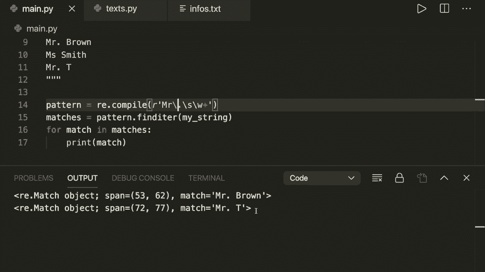

And now it only finds Mr。 Brown and Mr。 T， but not Mr。 Simpson any more。 So now， as we just learned。

 we have the optional quantifier with a question marks„ÄÇ And now let's make our dot optional„ÄÇ

 And now if we run this„ÄÇ Then we have all the Mr„ÄÇ

And now let's talk about where conditions are useful。 So in this case， we may not only have Mrer。

 but we may also have a miss or a misses„ÄÇ So then we can use a condition„ÄÇ So we use parentheses here„ÄÇ

 And then we separate them„ÄÇ

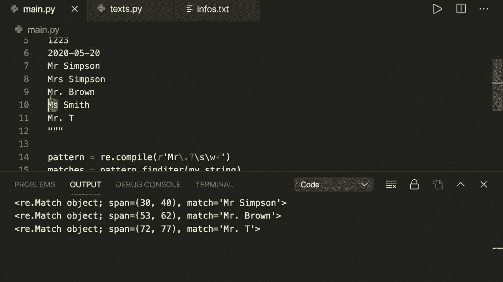

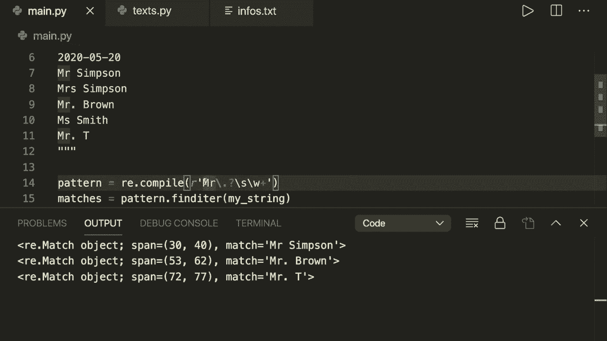

So let's have a look at this here。 This meta character is the either or。 So now， if we used this。

 we can write Mr or miss„ÄÇ

Or missus。 And then if we run this， then we see it extracted all the names from this text。

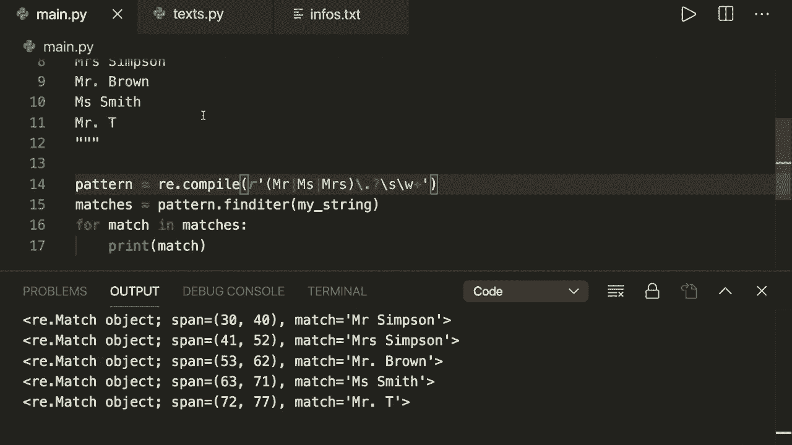

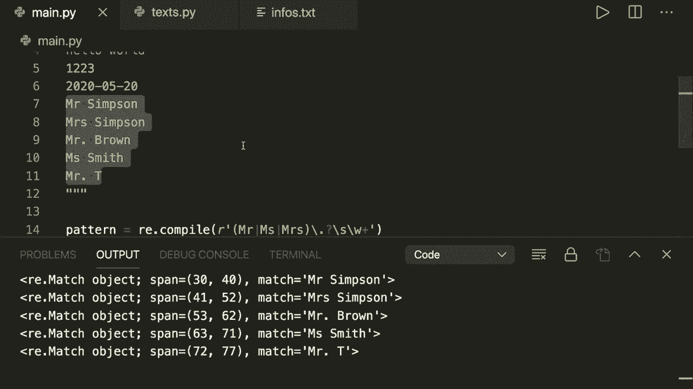

So this is where a condition is useful。And as we have just seen， we grouped this condition。

Together with the parentheses。 So this is， again， one meta character。

And now let's talk about grouping a little bit more„ÄÇ So let's do another example for this„ÄÇ

 This is also a typical example So let's copy some emails into our text„ÄÇ

 and let's say we only want to extract the emails from this string here„ÄÇ So again„ÄÇ

 let's build up our pattern„ÄÇ

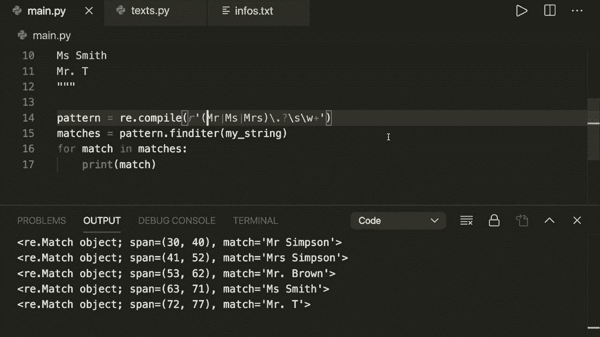

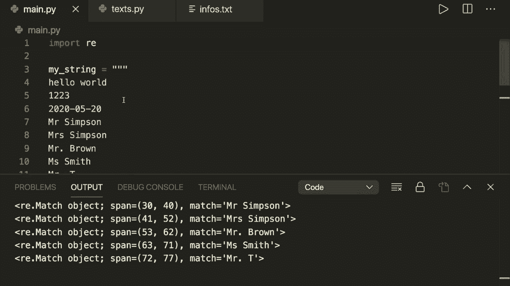

So what we can do here is we can use sets to do this„ÄÇSo let's build this up„ÄÇ

 So let's say we want to have some characters here„ÄÇ So this may be word characters„ÄÇ

 but this may also be a dash and numbers„ÄÇ

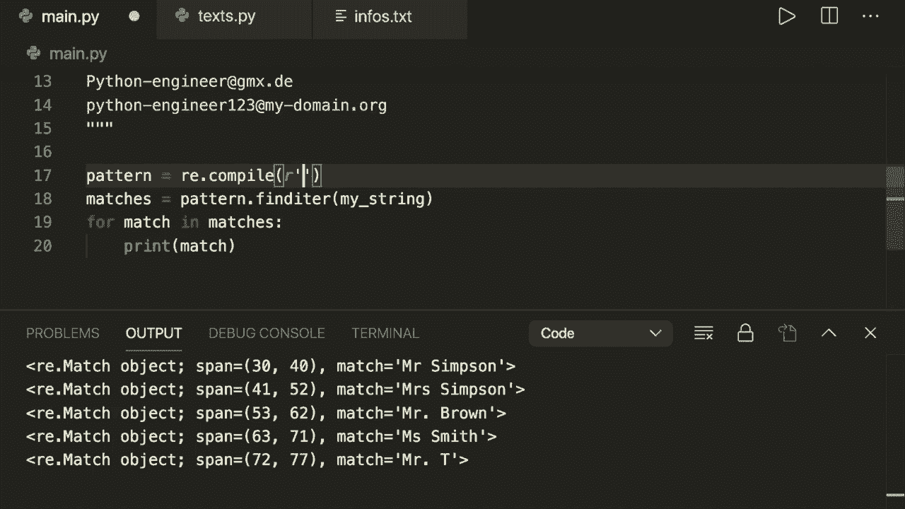

So let's use a set here„ÄÇ and let's use back to back ranges here so we can use small a to C or capital a to C„ÄÇ

Or also the diitchit 0 to 9„ÄÇ or we may also have a dash here„ÄÇ

 So now we are you looking for any of these characters here and we want to have multiple of them„ÄÇ

 So we say we want to have multiple„ÄÇ So one or more„ÄÇ So this combines this group into one match„ÄÇ

 and then it is followed by an at sign„ÄÇ So now if we compile this and run this„ÄÇ

 then we see that it extracted all these patterns here with any words or numbers or dashes and then an at sign„ÄÇ

 So this is the name before the email and then„ÄÇ

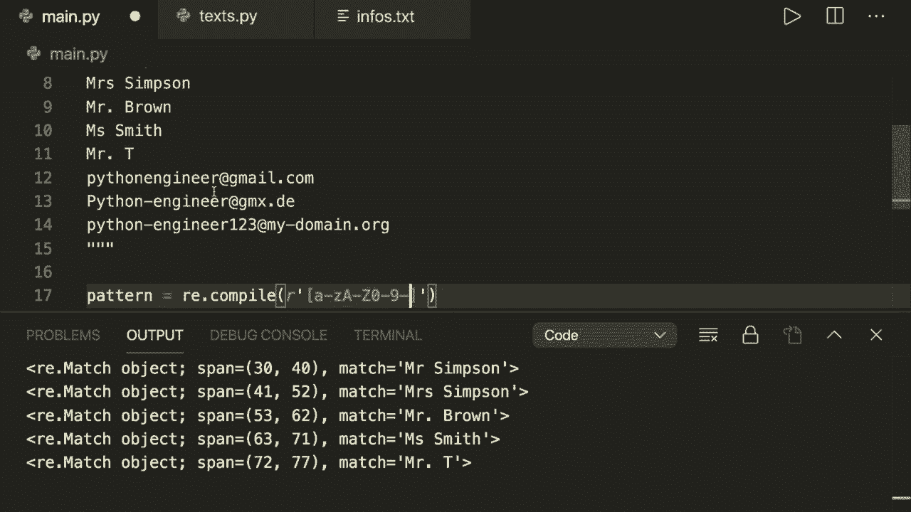

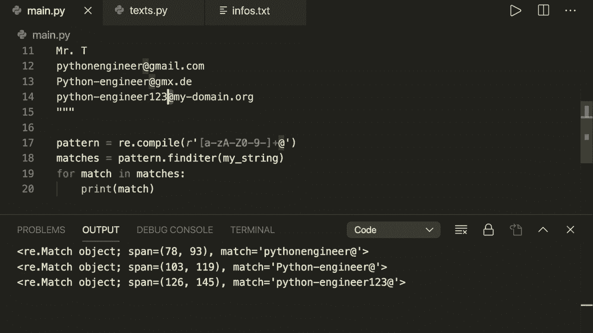

Our email can have different domains„ÄÇ So for example„ÄÇ

 we have at Gmail dot com at Gm X dot D or at my domain or my dash domain do org„ÄÇ

 So we want to extract all the different domains„ÄÇ And the next thing we want to look is to look for only for word characters„ÄÇ

 So the domain doesn't have a diitchit in it„ÄÇSo the only allowed characters are„ÄÇ

 let's use another set， and here we use again， maybe be a to C， capital A to C， and also a dash。

 and then we have the dot。So now let's run this。 And， of course， there are again， one or more。

 So here I have to do a plus„ÄÇ and then it's looking for one or more„ÄÇ

So now we see our match also includes the domain name and the dot„ÄÇAnd then here at the very end„ÄÇ

 let's do another set。 So here we say our ending， for example， we can say here we have dot。嗯。Sorry。

 again， I missed。 I was not looking for an actual dot here。 So this is a typical mistake that I make。

 So now it， for example， it would have also found this one here。

 but this is not a valid email address„ÄÇ So I have to look for the actual dot by using the back slash„ÄÇ

And then let's say I'm looking only for dot com， but it can also be dot D or dot org。 So。

 for example， I can use a group here by using parentheses。

 and then use the condition here Com or D E or dot org„ÄÇ

 So now it would only find these endings here and now let's not use a condition„ÄÇ

 but I just wanted to show you the condition here again， but we can also just use a set here。

 So let's use the set„ÄÇ and again here we may have„ÄÇA to C and A to C in capital„ÄÇ And then one or more„ÄÇ

And。No ditits here。 So now if you run this， then this will extract all the emails for us。

 So this is a typical regular expression pattern to look for emails„ÄÇ

 And this is what I showed you in the beginning„ÄÇ

So now you understand what this means„ÄÇ and now let's talk about grouping a little bit more„ÄÇ

 So there was one case just where I used the condition„ÄÇ

 and then I have had to use parentheses but we can also explicitly group our match object here into different substrs„ÄÇ

 So for example， I can put all of these before the a sign into a group。 So now let's use parentheses。

 and then„ÄÇ

Let's use the a sign„ÄÇ and then let's use the domain name„ÄÇ So this is one group until the dot„ÄÇ

 And then we have one group to have the ending year„ÄÇAnd now we have three groups here„ÄÇ

And as I showed you in the beginning， now， if we run this， then this will give the same results。

 And here we are printing the whole match object„ÄÇ

And then we can use the dot group to return the actual string„ÄÇAnd this is by default„ÄÇ

 This is group 0„ÄÇ So this is the whole match string„ÄÇ

 But now we can also print the single groups that we just defined。 So we， for example。

 we have group 1，2 and 3 now， and now if we run this and print this， then we see。

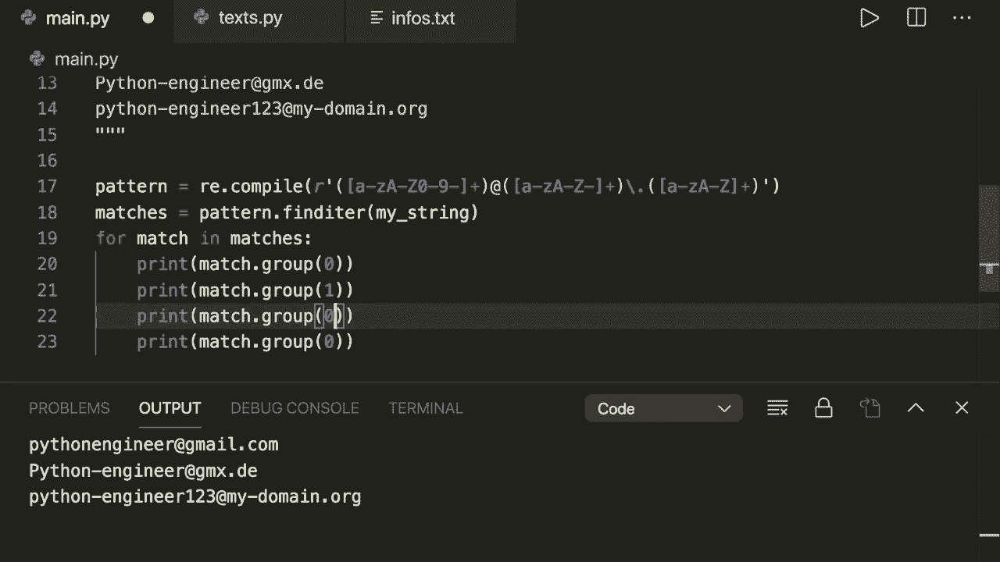

Let's just print the group one for now here„ÄÇ Let's comment this out too„ÄÇ

 Then we see it only prints this group here„ÄÇ So only the name of the email before the Ed sign„ÄÇ

 then here， this is the second group。 So now if we print the group 2， then this is the domain name。

 And if we want to have the ending„ÄÇ

Then we can print group 3„ÄÇ So this is where grouping is useful„ÄÇ

 If we only want to have a look at specific things in in our match， Then we can use parentheses。

 Now let's move on。 So now let's see we talked about grouping。 Now， let's talk about modifications。

 So we have two methods to modify a string， So we have the split method and we have the sub method。

 So let's talk about both of them„ÄÇ So the split method will split the string into a list and splits wherever our regular expression matches„ÄÇ

 and the sub method will find all substrs where the regular expression matches„ÄÇ

 and replaces them with a different string„ÄÇüòä„ÄÇ

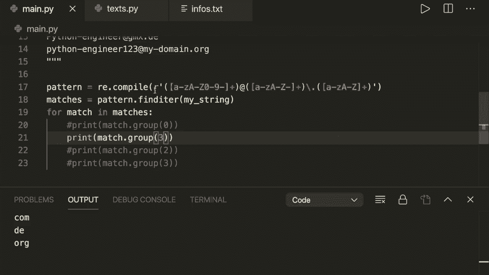

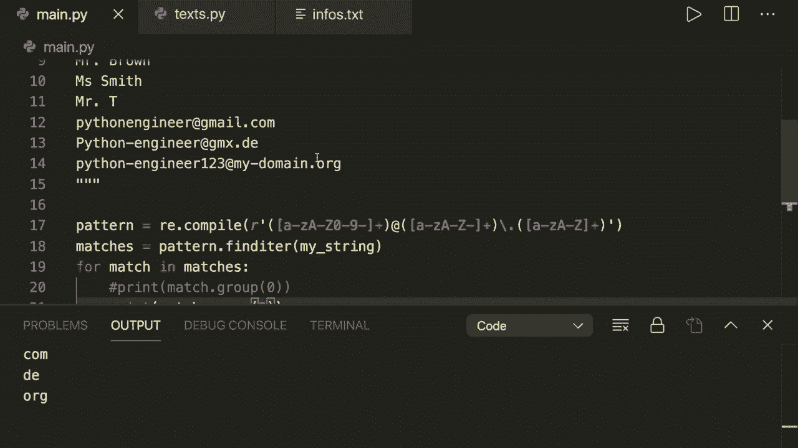

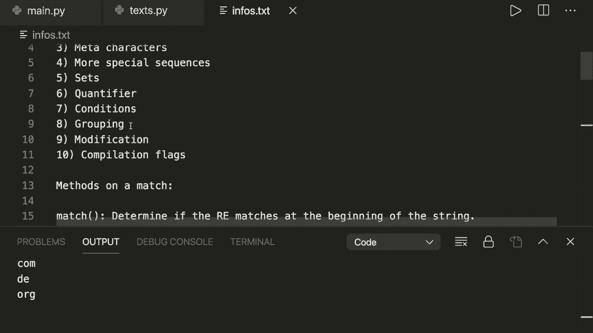

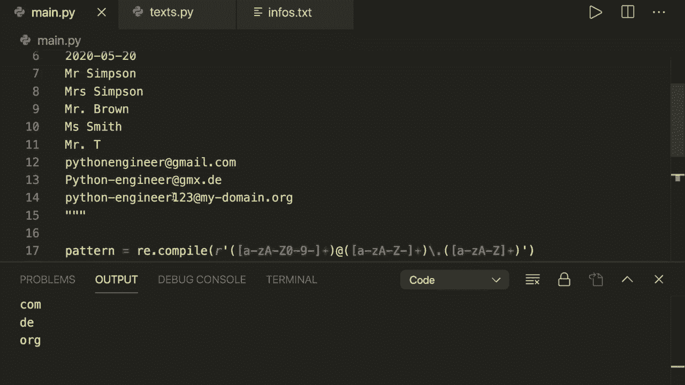

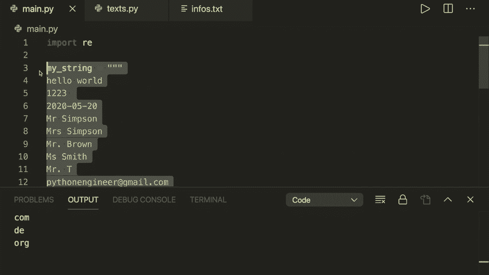

So let's look at two examples。 So let's say， let me grab a string here， so。

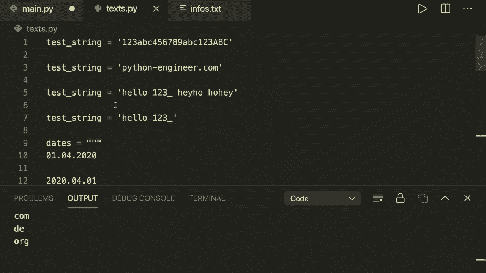

Let's use this one， again。So this is our test string。

 And now we use the pattern equals our E dot compile。 And then we are looking for the raw string 1，2。

3„ÄÇ

嗯。Oh， sorry， let's use a different one。 Do I have it here， No， let's write it myself。

 So let's say ABC，1，2，3。A，B，C， D， E， F， and capital letters， again，1，2 3 and ABC。

 And now let's say this is our patterns，1，2， and 3。And now we say our split it equals。

 and then we say pattern dot split and give the test string as argument„ÄÇ

 And now let's print the split it。 Now， this will be a list。Where our string split it oh， sorry。

 this was a bad example„ÄÇ So let's use ABC as split„ÄÇ

 And then we have splits where it split it our string into different substrs„ÄÇ

 and used this pattern here as the split„ÄÇ So here as the matching split So here it has ABC„ÄÇ

 So it split our string into this part„ÄÇ So there we have one to 3 And then this part„ÄÇ

 And then it found our pattern again， ABC。 And then again， it split the string。 And then at the end。

 we have the rest of the string„ÄÇ So this is the third substr that it found and„ÄÇ

And returned with this split method„ÄÇ So this is the split method„ÄÇAnd now„ÄÇ

 the sub method with the sub method， we find。All the substrs where our pattern matches and then replace them with a different string。

 So let's say our testing string equals hello world„ÄÇüòä„ÄÇ

And then let's say you are the best world。And use the， so we use the word world two times。

 And then let's say we want to look for the pattern world„ÄÇ

 So we say pattern equals our E dot compile„ÄÇ and then an R raw string„ÄÇ And here we have world„ÄÇ

 And then we say our spt string equals， and then we use pattern dot sup。

 And then what we want to put in as replacement„ÄÇ Let's say we want to put in planet„ÄÇ

And we also have to put in the test string。Now， it took our test string。

 looked for all the matches where pattern matches„ÄÇ it looked for world and replaced them with planet„ÄÇ

 So now this will return another string that was modified„ÄÇ And now if we print this„ÄÇ

 Then we see it printed Ho planet， you are the best planet。 So this is the sub method。 and。😊，Now。

 let's do another example to combine all that we have learned„ÄÇ

And again， use the sub method。 And yeah， so let's do this， so。

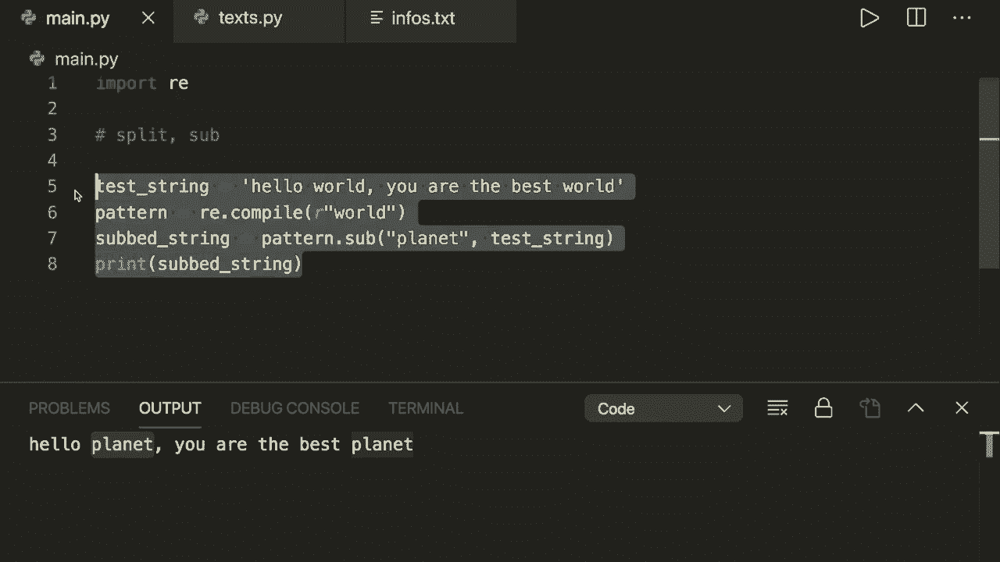

So let me grab this string here。 So this is our URL string。 So here we have， again。

 let's say we have different things here„ÄÇ

And then we are only looking for URLs， but they may have different formats。 So for example。

 we have an H TTP URL an H TTPS URL， and then sometimes we have a WwW。

 and sometimes we don't have this。And then we have the typical domain name， and。

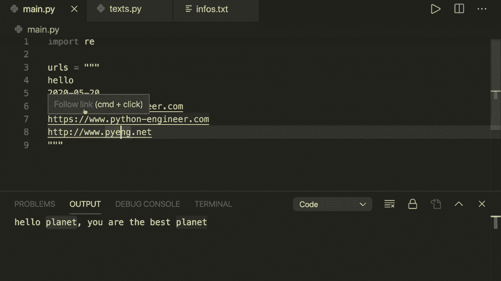

Ending„ÄÇ

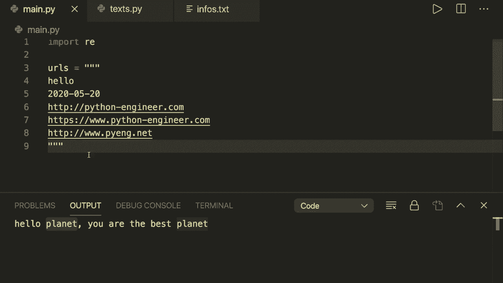

So， yeah。 So let's extract this。 So let's build up our pattern again So pattern equals R E dot compile。

 and then a raw string„ÄÇ So now let's start by saying it starts with H T T P„ÄÇ

And then a colon and two slashes， and。Then we have W， W， W， and then we have a dot。 So an actual dot。

And then， we have。1 or more were characters， so。For example。

 we can use a set here again and use a to C and upper case a to C and also a dash here„ÄÇ So like here„ÄÇ

 And so then we have a plus So one or more„ÄÇAnd let's put this into a group here right away„ÄÇ

 So this will return the same thing„ÄÇ And then we can later use this group here„ÄÇAnd the next thing„ÄÇ

 we again， have a dot。 So back slash dot。 And then again。

 we can use a setier a to C and capital a to C„ÄÇAnd now let's try this out„ÄÇ

 So let's say matches equals pattern dot find either„ÄÇ And then we call this URL„ÄÇ

 And then for matches in matches， we want to print。

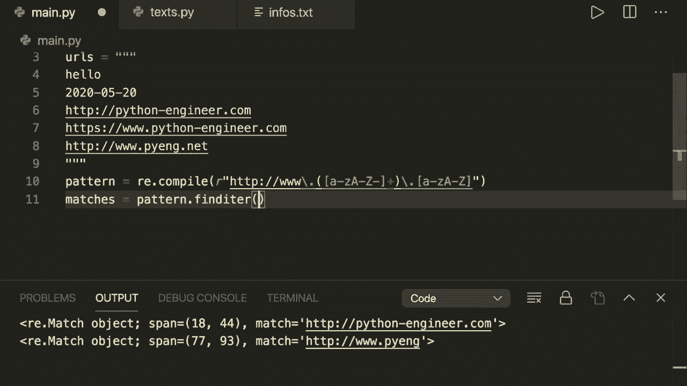

The match„ÄÇ and let's try this and run this„ÄÇ And then we see we made some mistakes here„ÄÇ

 And this is because here I have to say plus of course， a one or more and now it only found this URL。

 because it didn't find this one because we have H Ttps here„ÄÇ and this one doesn't have www„ÄÇ

 So the first thing we can do here is to use an S„ÄÇ and this is an optional S„ÄÇ

 So remember S question mark So this is optional then and if we don't put this into a group„ÄÇ

 then the question mark will only refer to this character here So now let's try this out And now we see it also found the H Ttps URL„ÄÇ

 and now the same thing„ÄÇ

With the Www So this may be there or may not be there。 So again， let's put this into a group。

And then use an question mark to make this optional„ÄÇ And now if we run this again„ÄÇ

 then it still doesn't find it。 And this is because our， it must be W W dot。

 So back slash dot which must be optional„ÄÇ And then I don't need it here anymore„ÄÇ So let's run this„ÄÇ

 And then we see that it found all of the URLs and extracted them„ÄÇ

 And now let's say our string has only the URLls here„ÄÇ

 And now let's say we want to return a new string where we replaced all of these optional beginnings„ÄÇ

 So it should only print the actual domain name with the ending„ÄÇ

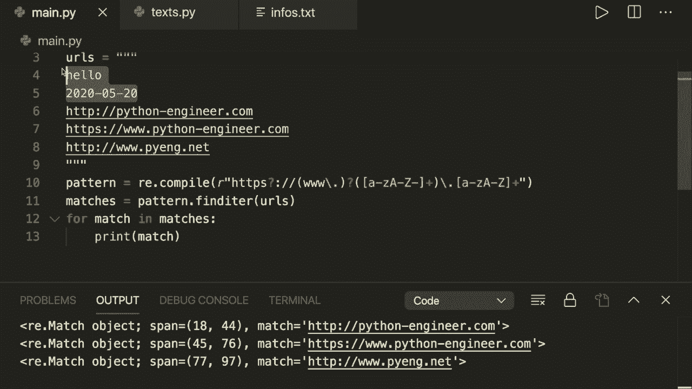

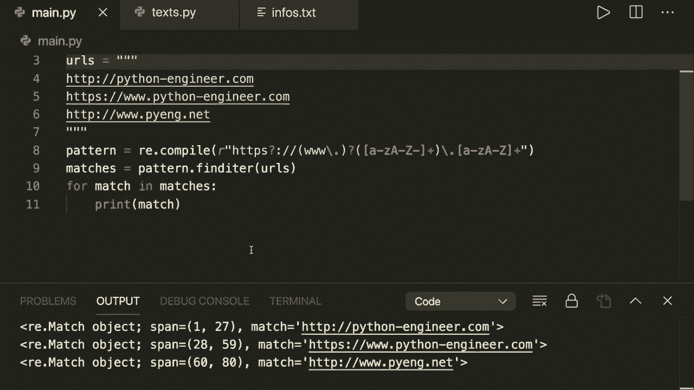

So as we have learned， we can use the s method。 So we can say instead of just finding the matches。

 what we want to do here is， let's also print this。 And then let's say our spped URL else equals。

 and then we use pattern and then sup„ÄÇ and then what we want to put in the replacement here„ÄÇ

 So for example， if we just say hello， and then U else as a string and then print。

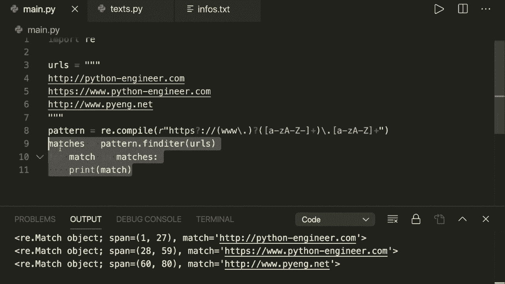

The spt URL„ÄÇ So then we see that this is the new string here„ÄÇ

 So it replaced all of the matches with hello。 And now， let's say we only want to put this。

In our string and only this， then what we can do here is we can group this， and we already did this。

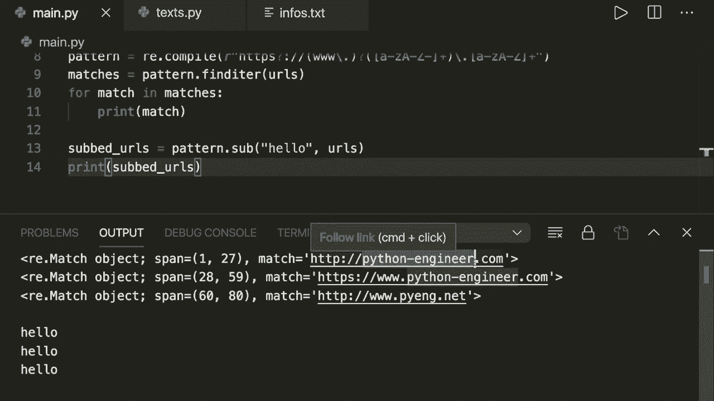

So。We have a group here。 We have a group here。 and let's also put this into our group， into a group。

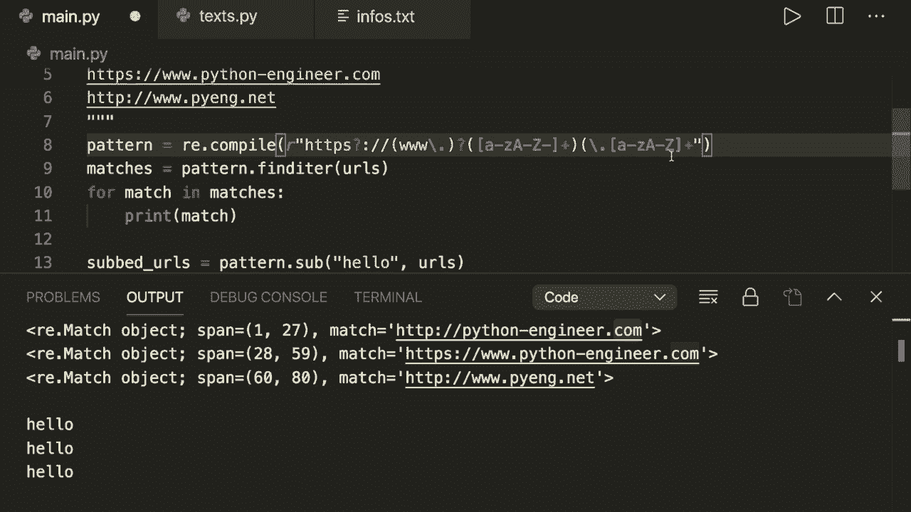

And then what we can do is we can use back references to replace them„ÄÇ

 So here we can say back slash 2 and。We must use a string， So a raw string。

And then we say back slash 2 and back slash 3。 And now if we run this， then this is our new string。

 So if I comment this out， then we see then this is our new string。 and what happened here， again。

 if we have a look at the group„ÄÇ So we can say let's print all the different group„ÄÇ

 So we have matched that group， So this will be the whole。

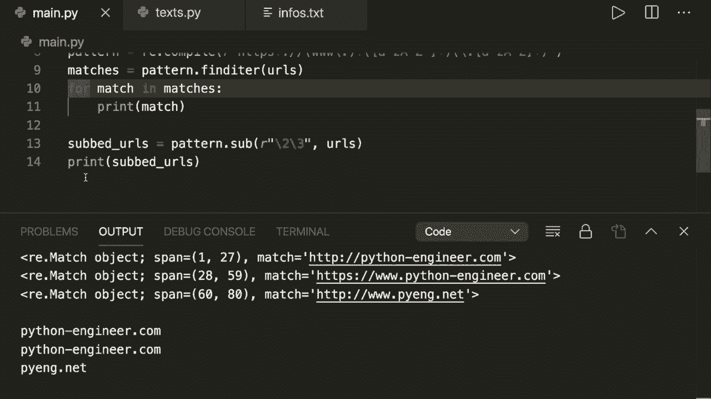

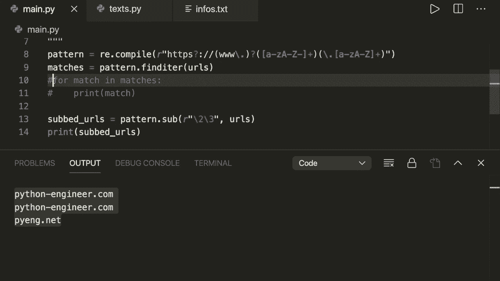

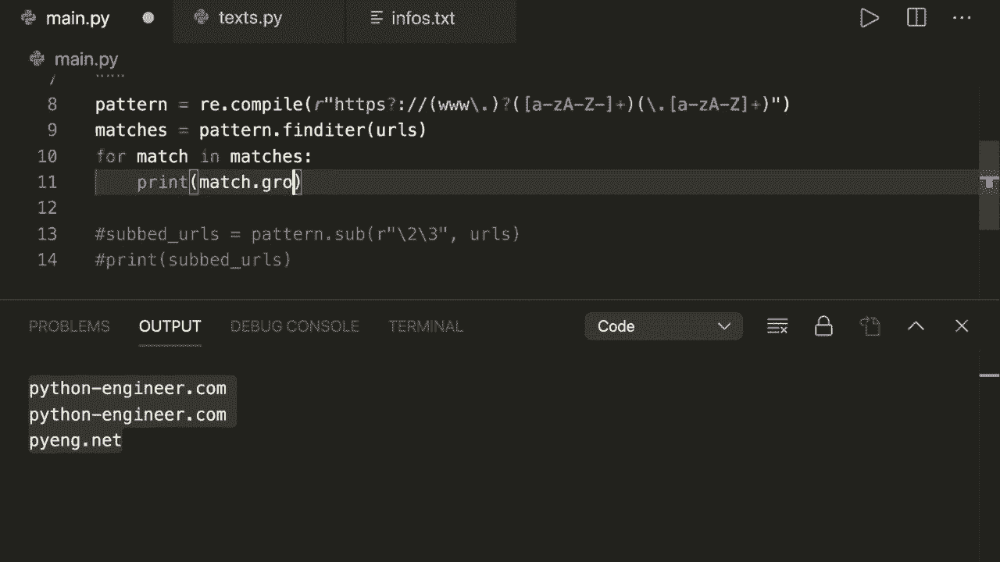

String„ÄÇ

And now so this is group 0 again。 Now， let's have a look at what is group 1。 So， for example， here。

 this is the group1， the first one in parentheses。 And because this may be optional。

 this may also be none。 So the first URL L has none as the first group because it doesn't have W， W。

 W„ÄÇ

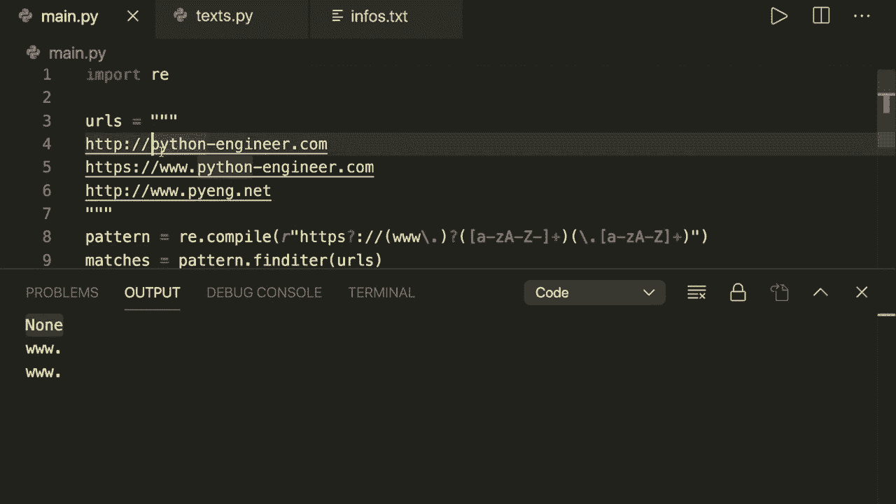

And this is the first group„ÄÇ So now let's print the second group„ÄÇ

 So this is the actual name of the domains at the beginning„ÄÇ

 And then the group 3 is the endings So dot com dot com dot net„ÄÇ

 And now here we use this group2 and group 3 with this back reference„ÄÇ

 And then replace the whole found pattern only with the domain name„ÄÇ So this is what happens here„ÄÇ

 And so this is also very often used in regular expressions„ÄÇ And now you know what this means„ÄÇ

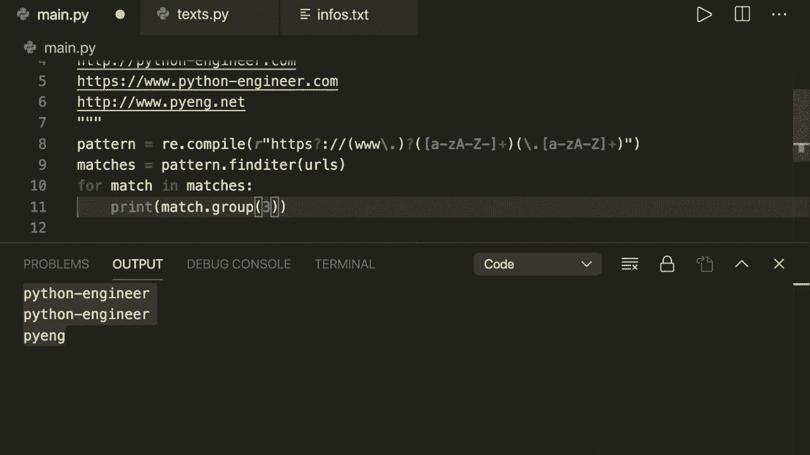

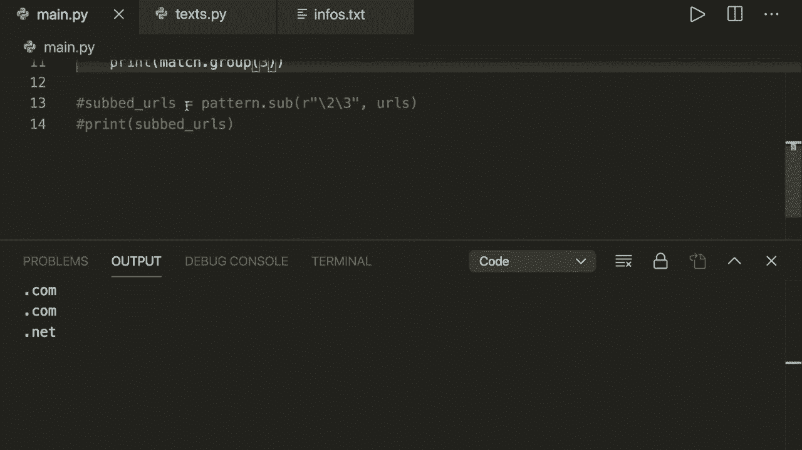

And I guess， now we are almost。

Through with all the context， all the。

Things that I wanted to show you。 And now， as a last thing。

 let's quickly talk about compilation flags„ÄÇ So when we compile the pattern„ÄÇ

 Then we also have the option to use different compilation flags„ÄÇ So here I listed them„ÄÇ And again„ÄÇ

 you don't have to remember them„ÄÇ Just keep a cheat sheet„ÄÇ

 So here we have the different compilation flag。 So askki dot all， ignore case。

 local multi line or verse„ÄÇ

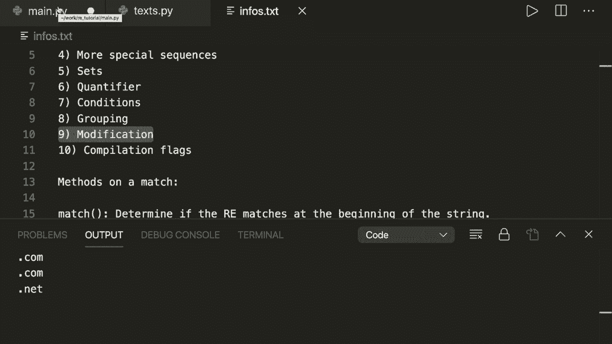

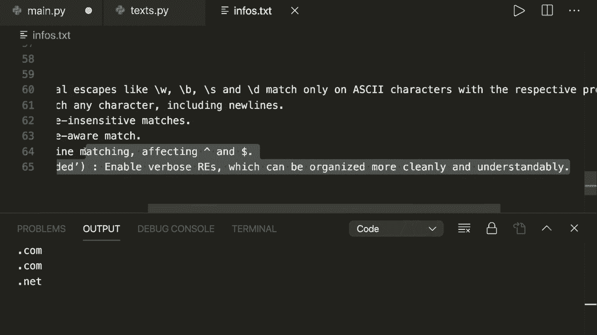

So I recommend that you check out the official documentation to see what all of them mean in detail„ÄÇ

 And now I„ÄÇI just want to show you the ignore case compilation flex„ÄÇ

 So this is also a very common use case„ÄÇ So let's say we have the string„ÄÇ

 my string equals hello world„ÄÇ And then we want to look for the string world„ÄÇ

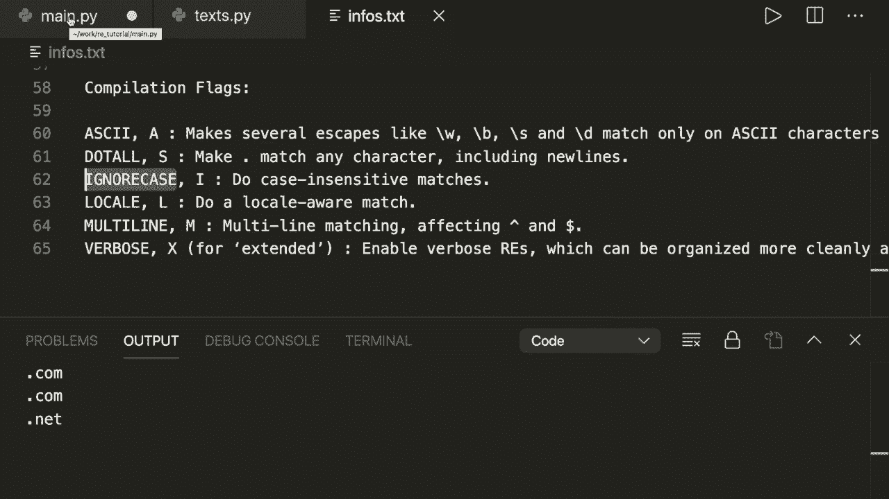

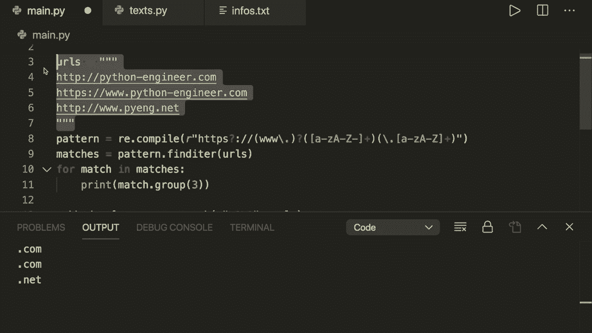

And now， if we compile this and then try to find the matches and print them。 So print the match。 Now。

 if we run this， sorry， this is called my string。 now if we run this。 then it doesn't find a string。

 So because remember this is case sensitive„ÄÇ Now if we make a capital W„ÄÇ

 then it finds the match world„ÄÇ And let's say we don't know what our string is„ÄÇ

 So it may be upper case， but it may not be upper K。 So it doesn't matter for us for us。

 then we can just use the compilation fl R E dot ignore case„ÄÇ

 so we can write this out so we can say ignore case„ÄÇ

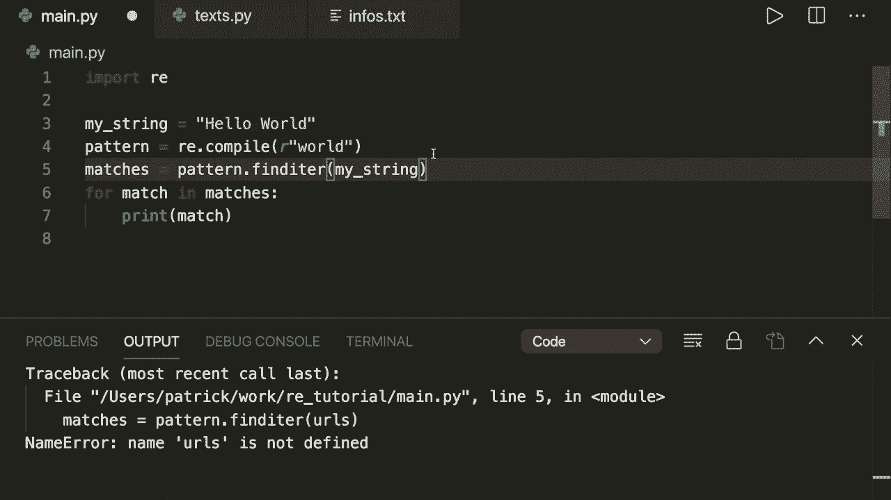

Or we can just say R R E dot I。And then if we use a small W， then it will still find the match。

 And because now it ignored the cases。 So this is the ignore case compilation flag。 And now， yeah。

 you also have„ÄÇ

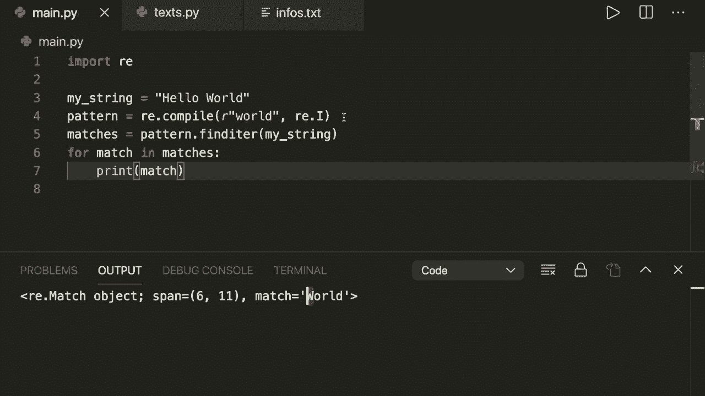

In these compilation flags„ÄÇ So I recommend that you check them out for yourself„ÄÇ

 I will provide a link to the official documentation in the description„ÄÇ And now I think we are done„ÄÇ

 and now you should be able to understand all the different regular expressions„ÄÇüòä„ÄÇ

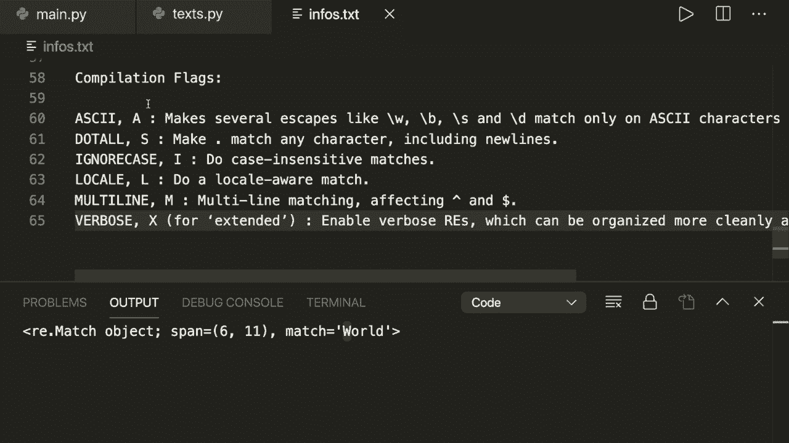

I hope it wasn't too complicated for you„ÄÇ and I hope you enjoyed this tutorial„ÄÇ If you like this„ÄÇ

 then please consider subscribing to the channel and leave me a like and see you next time， bye。

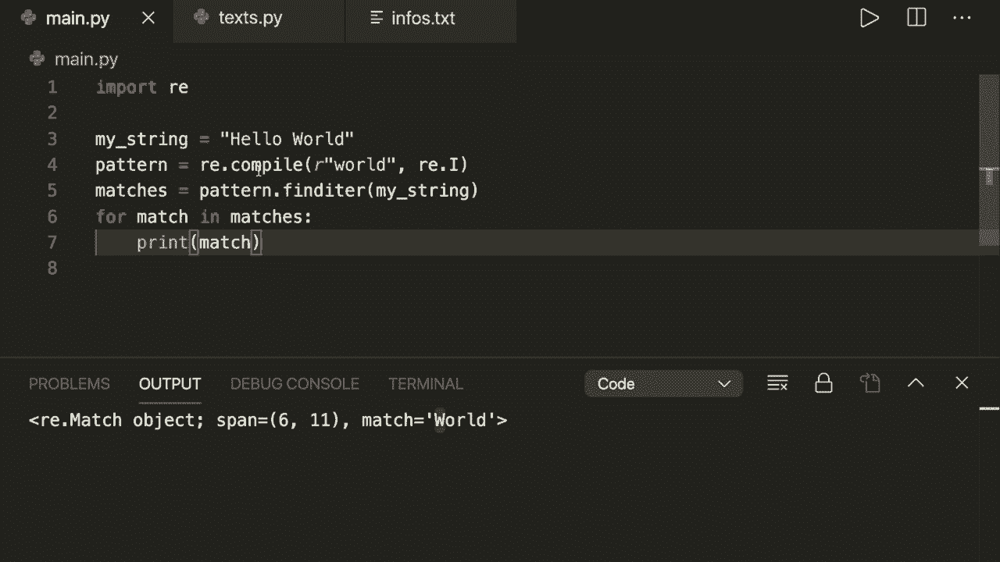