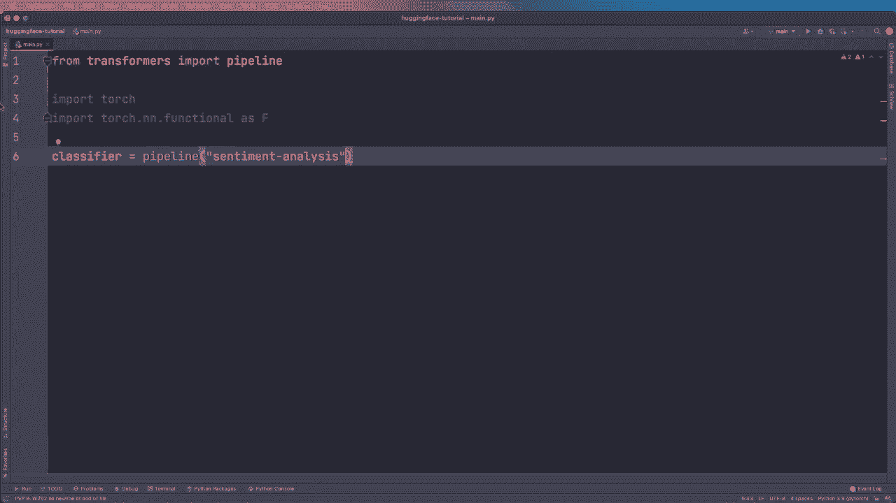
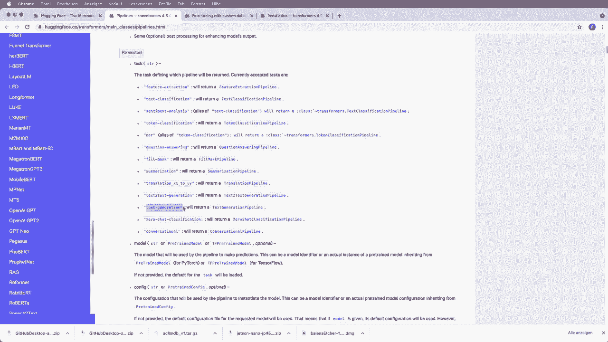

# 【双语字幕+资料下载】Hugging Face速成指南！一遍搞定NLP任务中最常用的功能板块＜实战教程系列＞ - P2：L2- Pipeline管道 - ShowMeAI - BV1cF411v7kC

Inst pytorch or Tensofflow first。 And then in order to install the Transers library。 you just have to say Pip install transformers。 or there's also a Conda installation command that you can find on the installation page。 So let's install it like this。 So I already did this。 And then we can start using this。 So we can say from transformers。 and then we import a pipeline as first thing and have a look at this。

 And then we also import some utilities that we need from the Pytorch library。 So we import torch。 and we import torch dot N and functional S F。 So we are going to use this later。 And now we can start using this pipeline。 So let's say classifier equals。 And then we create a pipeline。 And we need to specify the。Task that we want。 So in this case。

 we want to do sentiment analysis。 So we have to call it like this。 and you will find the different available tasks on the website。 So here we can see， for example。 we have this sentiment analysis， which is just an alias of text classification。 but for example。 we also have a question answering pipeline or a text generation or a conversational pipeline。

 So yeah， this is how we can define a pipeline。 And what a pipeline does is that it gives you a great and easy way to use model for inference。 And it abstracts a lot of the things for you。 So you will see what I mean in a moment。 So now we can just use this classifier and classify some text by saying rest for results equals。😊。

And then we call this classifier and we want to classify a example text。 So let me copy and paste some example text for you。 So we want to classify。 we are very happy to show you the smileyface transformers library。 And then let's print the result and see how this looks like。 So let's run the code。 Alright。

 and as you can see， we get the label is positive and the score is 0。99。 So it's very confident that this is a positive sentence。 And as you can see it only takes two lines of code with this pipeline to create a sentiment analysis code。 So yeah， this is exactly what we need so we need to see the label of the text if it's negative or positive。

 and we also get the score。 So yeah， this is really nice。 And now let's have a look at some more things that we can do with this pipeline。 So first of all。😊。Can put in more texts at once， so we can not just use one， so we can give it a list。 So let's。 for example， use a list。 and then let's use another example text。

 So let me copy and paste this one in here as well。 So we also want to classify this We hope you don't hate it。 And then we get multiple results back。 So let's call this result。 and then we can iterate over this。 So we can say four result in results。 and then we want to print the result And now let's run this code and have a look at how this looks like。

 Alright， and as you can see for the second text。 we get another result back。 So here the label is negative。 and the score is maybe not that confident in this case。 So this text might be a little bit confusing。 We hope you don't hate it。 But basically this is how you can pass in。Multiple texts at once。 And now， so right now。

 we only use the default pipeline with the default model。 But now let's have a look at how we can use a concrete model。 And then also how we can use a concrete tokenizer。 So what we can do is we can specify the model name and say model name equals。 And in this case。

 I use dist bird base uncased and then fine tuneund SST to English。 So I will show you where I got this string or this name in a moment。 But for now， yeah。 this is basically just a dist bird model， which is a smaller and faster version of bird。 But it was pretrained on the same corpus。 And then you see that it also was fine tuneund and this is just the name of the data。

 So in this case， it's an English data from the。Standford sentiment 3 bank version 2。 And yeah。 so now if we have the model name， we can give this to our pipeline with the model argument。 so we can say model equals and then we use this model name。 So now in this case。 I can tell you that the default model for the sentiment analysis task is already this model name。

 So this should do exactly the same。 But later we will switch this and then have a look at how we can use different models。 So first of all， let's run this again and see that this is still the same。 Alright。 so we see this is still the same result。 So this worked。 So now we just use this string to define our model。

 But now let's have a different approach to define a model and then also a tokenizer。 So this will give us a little bit more flexibility later。 So in order to。😊，Do this。 we want to say from transformers。 and then here I import a auto tokenizer class and auto model for sequence classification。 and this is just a generic class for a tokenizer and this is also a generic class。

 but a little bit more specifics。 in this case， I want to have it for sequence classification。 And then it will give me a little bit more functionality specifically for this task。 So don't worry about this right now， you can also find all the model classes available in the documentation。 So if you're interested then have a look at this。 And also if you use Tensorflow。

 then here you have to say Tf and then the name of this class。 but the rest is actually the same。 So yeah， this is how you use Tensorflow。 And now after importing。😊。We can create two instances of this so we can do we can say model equals and then we use this class。 so auto model for sequence classification and then we use a function that is called so let's say dot from pretrained and then it also needs the model name and we do the same with the tokenizer。

 So we say tokenizer equals the auto to tokenizer dot from pretrained and then it needs the model name So this dot from pretrained function is a very important function in Haging phase that you will see a lot so you will see this later a few more times So now that we created this we can also just give the actual model and not just the string to the classifier。

or to the pipeline so we can say our model equals our model and our tokenizer equals our tokenizer。 So now if we run this， we should still get the same results because these are the default versions and yeah。 as we see， we still get the same results。 But then later if you want to use a different model or tokenizer。 then you know how you can switch this。 So just by using a different model and tokenizer here for the pipeline。

 So now instead of using this pipeline。