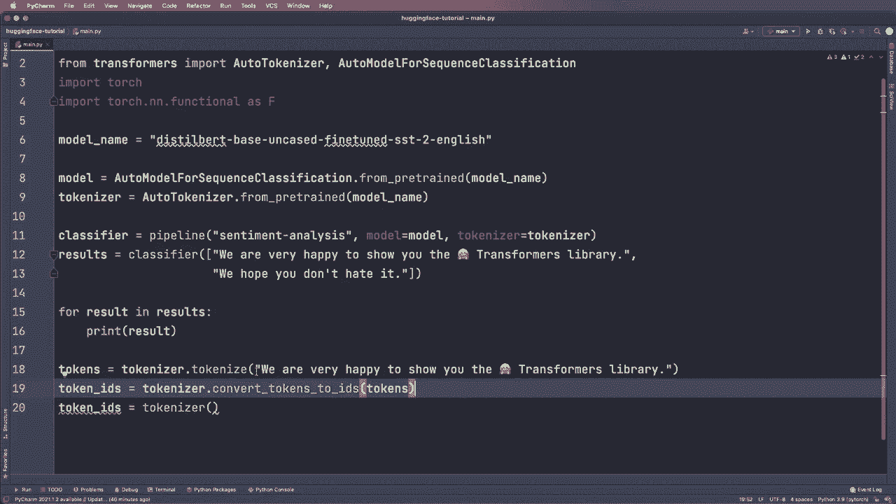

# 【双语字幕+资料下载】Hugging Face速成指南！一遍搞定NLP任务中最常用的功能板块＜实战教程系列＞ - P3：L3- 模型和分词器 - ShowMeAI - BV1cF411v7kC

让我们看看如何直接使用这个模型和分词器，并手动执行一些步骤。这会给你更多的灵活性。那么在这里，首先我们使用分词器，看看它的作用。首先，让我们调用 `tokenizer.tokenize` 函数。我们这样说。

我们先调用令牌，然后等于分词器的 `tokenize` 方法，接着是我们想要分词的字符串或句子。所以我们把这个复制并粘贴到这里。一旦我们得到了令牌，我们就可以使用它们并从中提取令牌。所以我们可以说令牌等于。然后我们再次使用分词器和函数 `convert_tokens_to`。😊

调用令牌并且遇到了令牌。这是实现这个的一种方法。或者我们可以直接这样做，令牌 I 等于。然后我们像调用函数一样调用这个分词器。然后我们再次给它同样的字符串。所以现在让我们打印这三个变量，看看有什么不同。

所以首先我们打印令牌，然后打印令牌。接着这里我们实际上给这个变量一个不同的名称。我们称之为 `input_I`。现在让我们运行这个，看看结果如何。好的，这就是结果。正如你所看到的，当我们调用 `tokenizer.tokenize` 时，我们得到一个字符串列表。

现在每个单词都是单独的令牌，举个例子，这个是我们的笑脸或者表情符号。所以这就是 `tokenized` 函数的作用，一旦我们调用 `convert_tokens_to_IDs`，我们会得到这个结果，所以现在每个令牌都被转换成一个ID，每个单词都有一个非常独特的ID，这基本上是我们的模型可以理解的数学表示或数值表示。这就是我们在这个函数之后得到的结果，如果我们直接调用 `tokenizer`，那么我们会得到一个字典，这里我们有键 `input`，还有注意力掩码。

目前你不必太担心这个，但我们来看看输入 IDs。如果我们比较 token IDs 和输入 IDs，我们会发现它们的 token ID 顺序完全相同，但我们还有 101 和 102 的 token，这只是字符串的开始和结束 token，但基本上是相同的。所以这是这三个函数之间的区别，这些输入 IDs 是我们稍后可以传递给模型以进行手动预测的内容。因此，就像之前一样，我们当然也可以为我们的 tokenizer 使用多个句子。例如，通常在你的代码中，你会有训练数据，比如 xtrain，在这个例子中就让我们。

使用这两个句子。所以这是我们的 X train，然后我们可以将其传递给我们的 tokenizer，称之为批次。这是我们稍后输入模型的批次。所以我们说 batch 等于 tokenizer，然后我们直接用训练数据调用这个 tokenizer。我还想向你展示一些有用的参数。因此我们说 padding 等于 true。

我们还设置了 truncation 为 true，并且设置了 max length 为 412，并且我们设置了 return tensors 为字符串 P 代表 pytorch。这将确保我们批次中的所有样本具有相同的长度。因此它将应用填充和截断。

这是必要的，这一点也很重要。所以在这种情况下，我们希望直接返回一个 pytorch tensor。我稍后会向你展示如果不使用这个会有什么不同。但现在让我们先使用这个，首先打印这个批次，看看它的样子。然后我们看到我们得到了一个字典，再次包含了键 input 和键 attention mask，这里有两个 tensor。第一个是第一句话，第二个是第二句话，attention mask 也是如此，总共两个 tensor。正如我所说，这些输入 ID 是我们模型可以理解的唯一 ID。

所以现在我们有了这个批次，现在我们可以将其传递给我们的模型。

并且。
