# 【双语字幕+资料下载】Hugging Face速成指南！一遍搞定NLP任务中最常用的功能板块＜实战教程系列＞ - P5：L5- 模型保存和加载 - ShowMeAI - BV1cF411v7kC

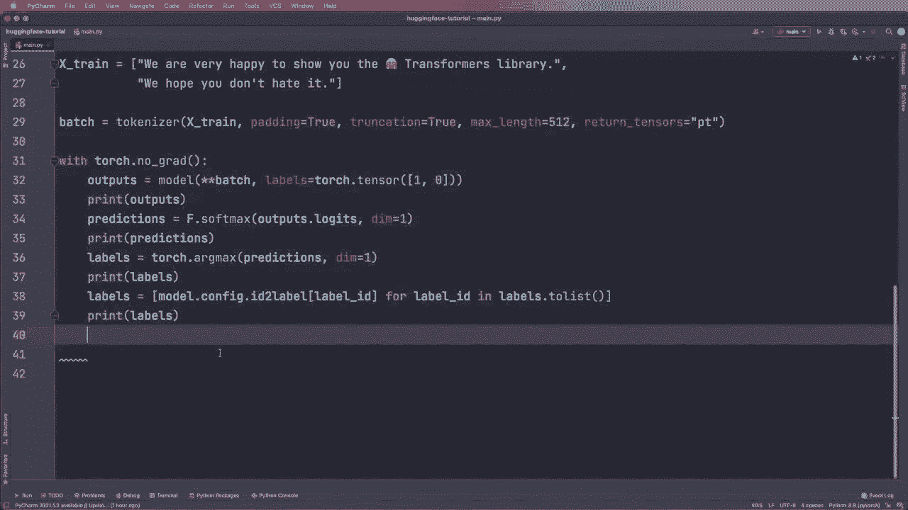

Then what we can do and we can say save directory and specify a directory。 So let's call the folder saved and then we can call tokenizer and then we can call dot safe pretrained and then the li just the save directory and the same with our model so we can say model dot save pretrained save underscore pretrained and then again the save directory and then we can load them in another application。

 for example， tokenizer equals and then again here we use this auto tokenizer class and then the from pretrained and then here we can give it a directory So this from pretrained we can either give it a model name or we can give it this directory and again。

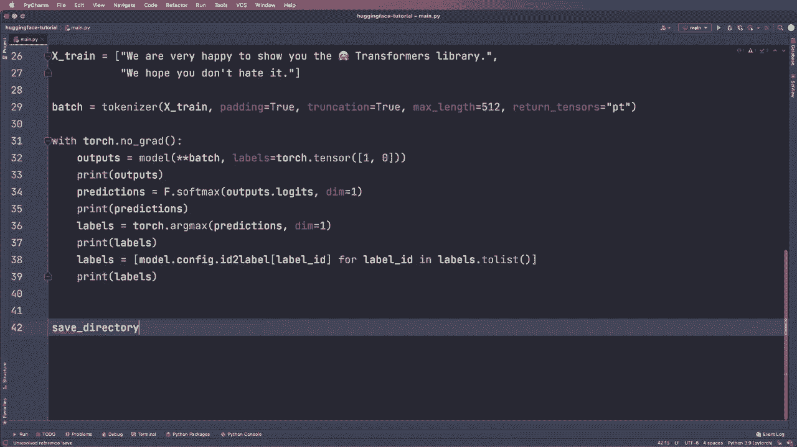

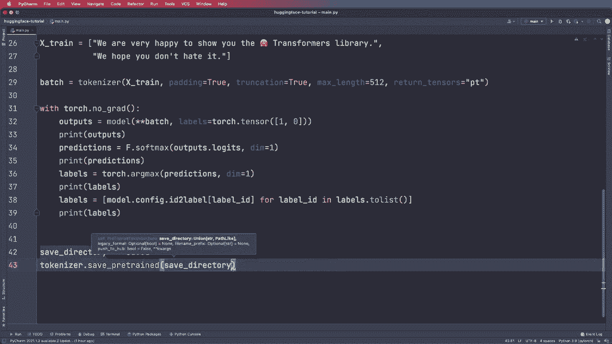

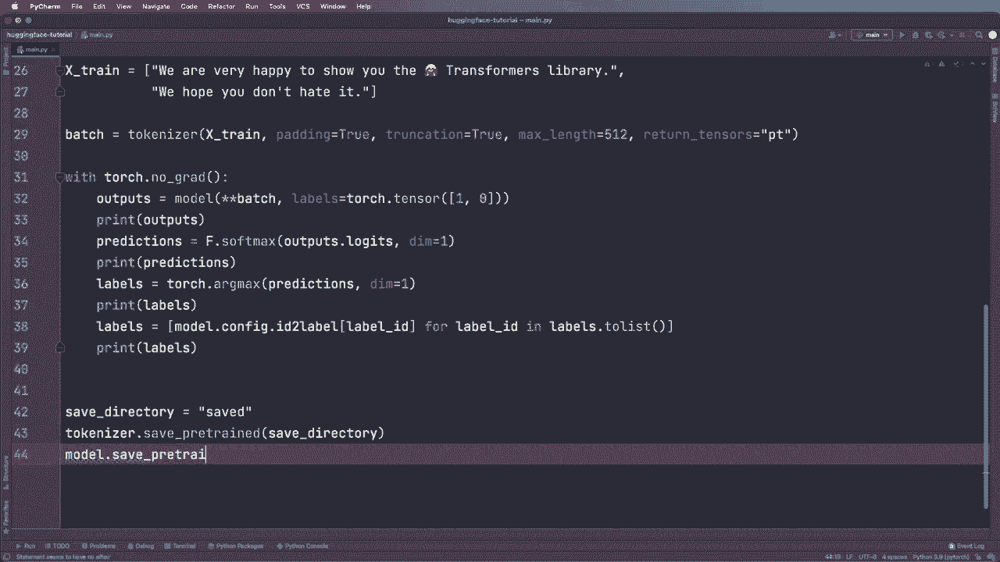

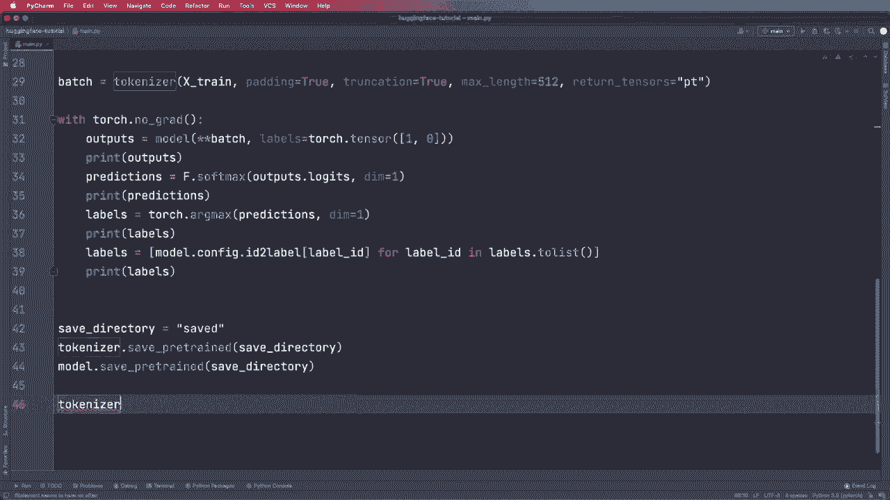

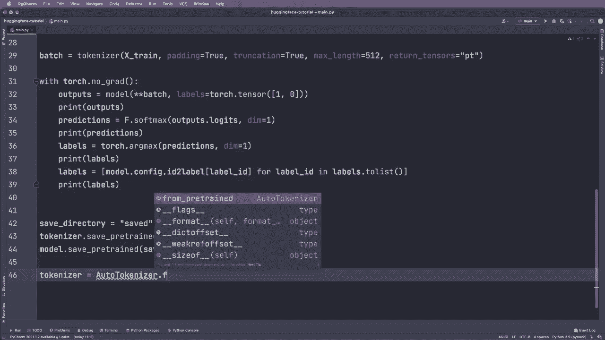

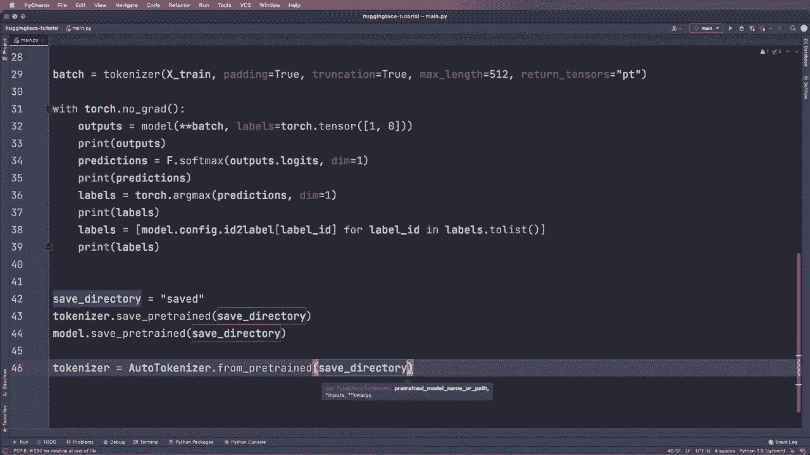

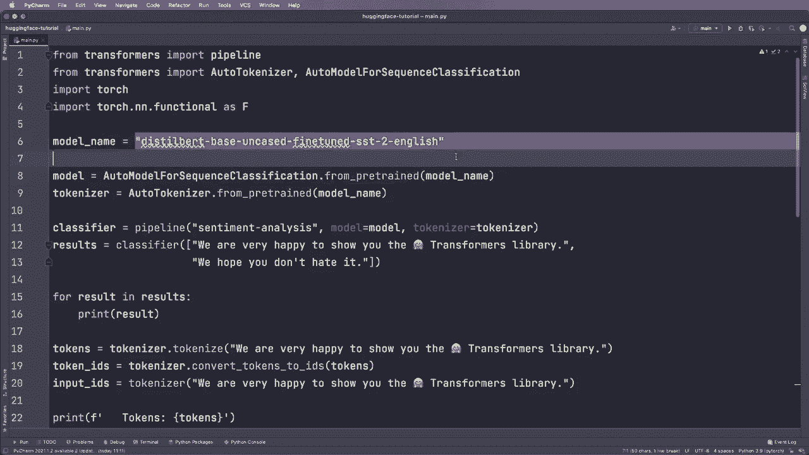

Same for the model， So model equals。 And then we use this auto model for sequence classification dot from pretrained and then the save directory。 So this should work。 And then you should get the exact same model and tokenizer bag。 And yeah。 as you might see these model at these dot from pretrained functions are very important。 and you will use them a lot of time。 Alright， so I think these are the basic functions you need to build a pipeline or to apply the model and tokenizer manually。

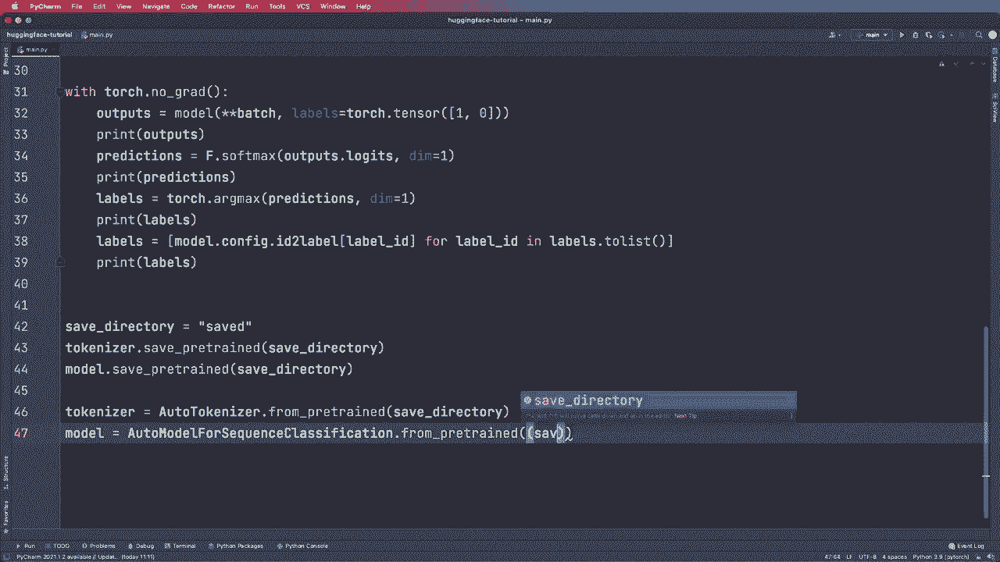

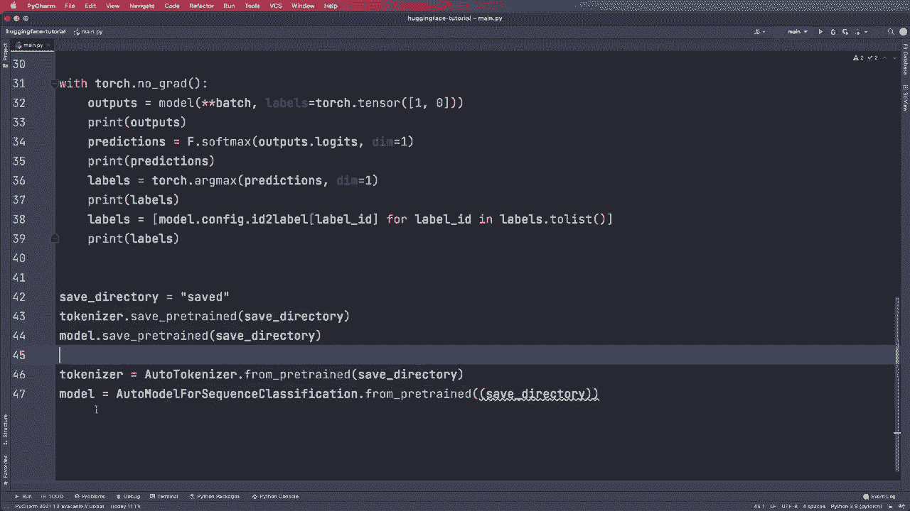

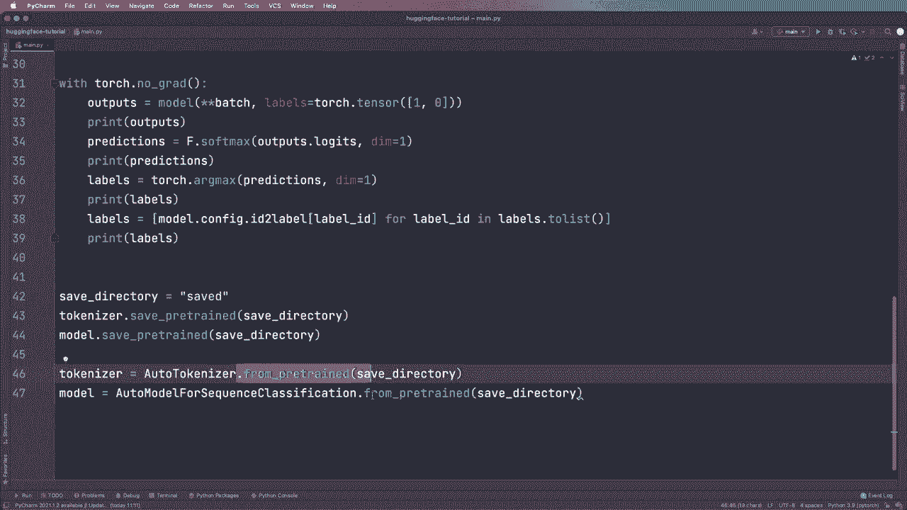

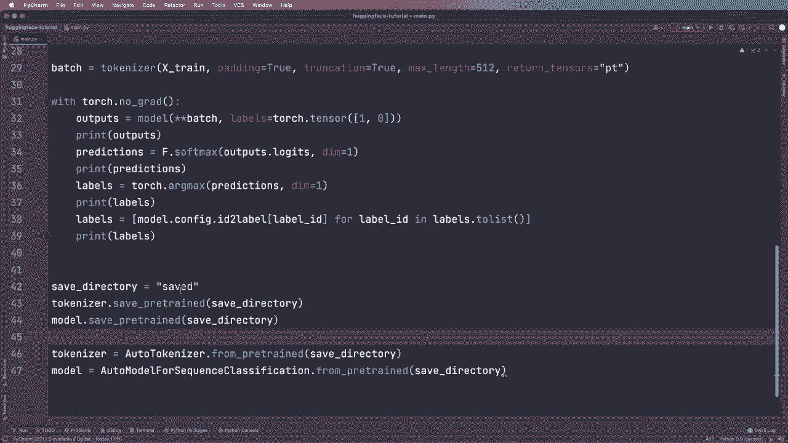

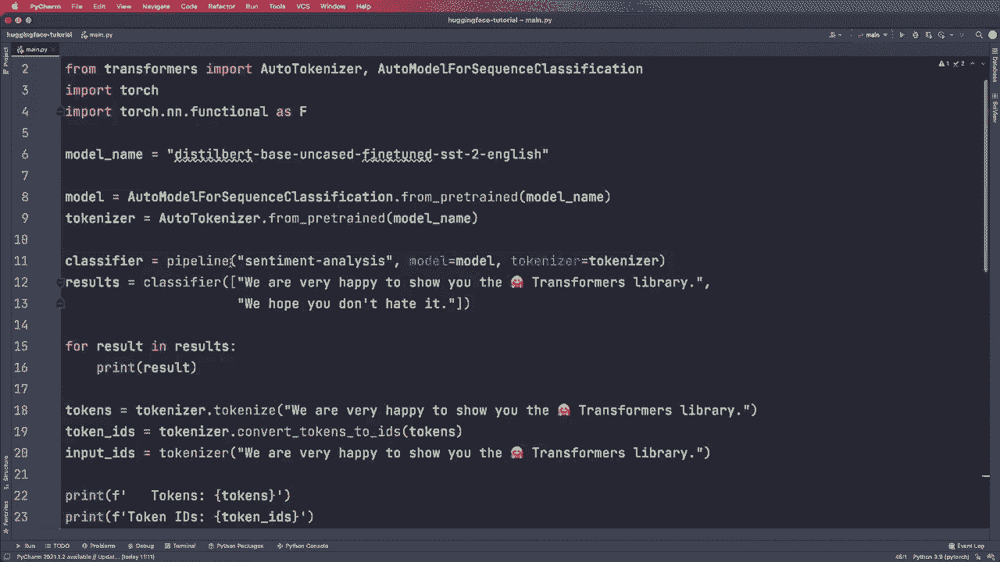