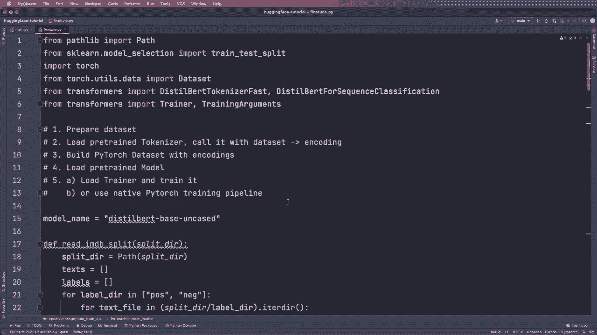
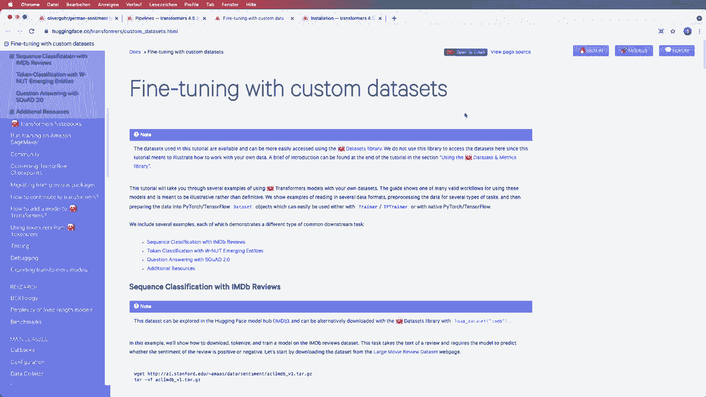
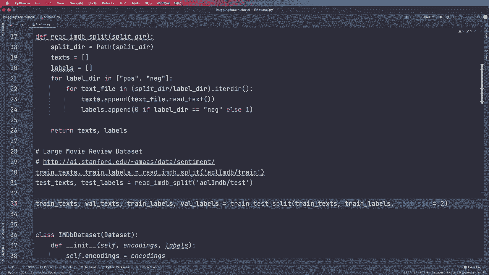
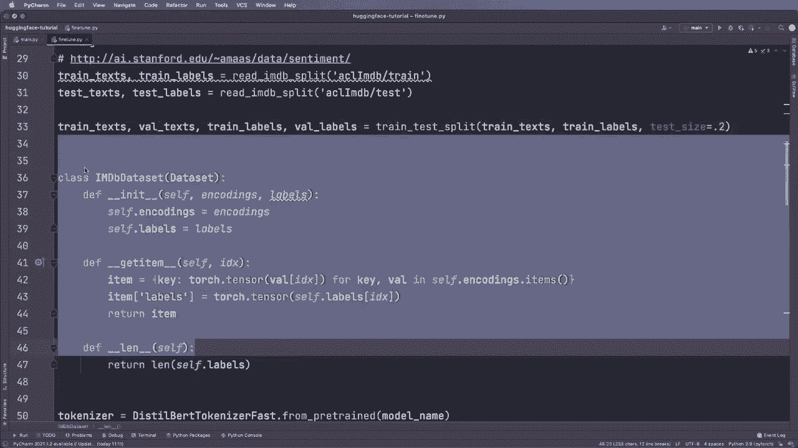
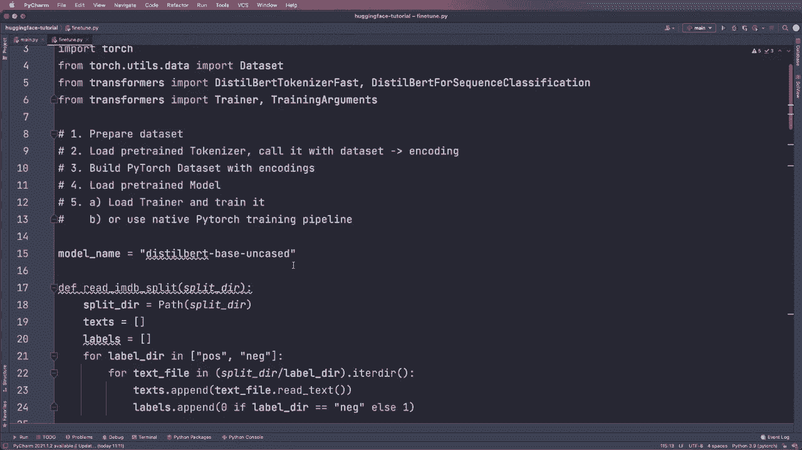

# 【双语字幕+资料下载】Hugging Face速成指南！一遍搞定NLP任务中最常用的功能板块＜实战教程系列＞ - P7：L7- 微调(Fine Tuning) - ShowMeAI - BV1cF411v7kC

Another a look at how we can finet tune our own models。 So this is very important。

 and I already prepared some code here， and I will go over this very roughly。

 but there's also a very great documentation about this。

 So we can go to this documentation page here。 and you can also open this in colo。

 So either with Pytorch or tens of flow code。 So this is really helpful。

 So I encourage you to check this out。 But now let's go over this briefly。

 So basically there are five steps you have to do。 So in this example， it's for Pytorch。

 So we have to prepare our data set， for example， load it from a Cv file or whatever。

 Then we have to load a pretrained tokenizer and then call it with our dataset set。

 So then we get the encodings or the token Is。😊。

Then we have to build a pytorch dataset set out of this with these encoding。

 So if you don't know what a pytorch dataset is， then I will have a link for you here where I explain this。

 Then we also load a pretrain model and then we can either load a hugging face trainer and train it。

 So this abstracts away a lot of things， or we can just use a native or normal pytorch training pipeline like in our other pytorch code。

 So yeah， this is what we have to do。 So let's go over this very quickly。 So in this case。

 we define our base model name。 So we want to start with a thistilbert face uncased version。

 So in this case， for example， not the fine tuned one。 So just this one。 then step 1。

 we prepare the data。 So we write a helpful function to create text and。

Labels out of the actual text and here we downloaded some data set and put it in our folder。

 so I already did this here and yeah this is available at this website and this contains movie reviews so we want to find you in our models on movie reviews for sentiment classification So here we create training text and the training labels with our helper function and we also do a train test split to get validation text and labels and yeah then as a next step we create or we define a Pytorrch data set。

 So this inherits from pitorrch data set so torch U data we import data and then we define this here So again I have a tutorial where I explain how this works but basically it needs the encodecodings and。

The labels and it stores them in here。 So yeah， this needs the encodings。 So for the encodings。

 we need a tokenizer。 So again， we use this from pretrain function with the model name And in this case。

 since we know we use the distill bird one， we can use this class。

 So remember before we used a generic tokenizer， this auto tokenizer class。

 And here we used a more concrete one So we use the distal bird tokenizer fast then we apply it to training validation and test set and get the encodings。

 then we put them in our data set and create the Pytorch data set and then we import a trainer and the training argument。

 So this is an available in Trans us library and then we can set this up so we can。

Create the arguments。 So here， for example， we specify the number of training epochs。

 the output directory， the learning rate and other parameters we want and then we create our model again from a concrete model class and then with this dot from pretrained function and then we set up this trainer and give it the model and the training arguments and then the training set and the validation set and then we simply have to call trainer the train and this will do all the training for us and afterwards you can test it on your test data set and then you have a fine tune model。

 So yeah， this is basically all you know it and then I also want to show you that instead of using this trainer if you want to do it manually and have even more flexibility you can just use a normal Pytht training loop。

For this， we use a data loader and we need an optimization。 So in this case。

 we use an optimizer from the Transformers library。

 and then here we specify our device then again we create this model。

 We push it to the device and set it to training mode then we create a data loader and the optimizer and then we do the typical training loop So we say for epoch in nu epos and for batch in our training loader and then we do the stuff we always do。

 we say optimizer zero grad， we also push it to the device if necessary。

 then we call the model and we calculate the loss with this and in this case this is already contained in the output so we can just access the loss like this then we call loss the backward and optimizer step and iterate and afterwards we can set our model to。

Evaluation mode again。 and yeah， this is how we do it in native Pythtorch code。

 and yeah so this is basically how we do a fine tuning and then can fine tune our own models And then afterwards you can also upload them to the hugging face model hub if you want So yeah I think that's pretty cool and yeah that's all that I wanted to show you for now I think that's enough to get started with hugging face and I hope you enjoyed this tutorial and then I hope to see in the next video。

😊。

