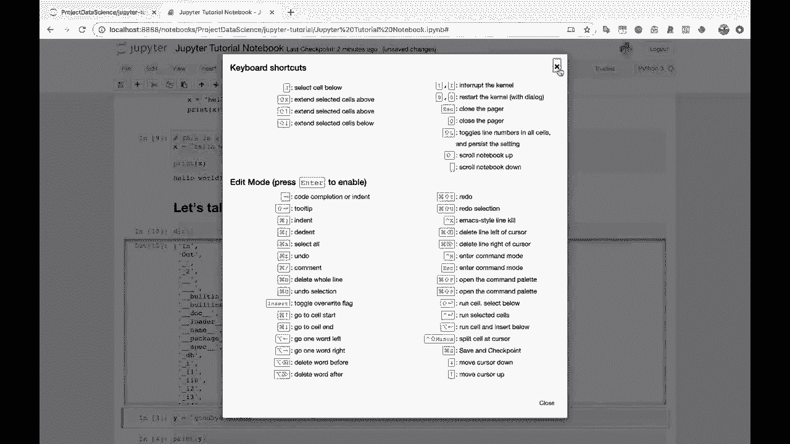

# 【双语字幕+资料下载】Jupyter Notebook 超棒教程！50分钟，把安装、常用功能、隐藏功能和Terminal讲解得清清楚楚。学完新手也能玩转！ - P10：10）使用 pandas 加载和显示数据 - ShowMeAI - BV1yv411379J

Alright， one of the main things that you are probably gonna to be doing in Jupyter notebooks is looking at and transforming and cleaning data。 So let's load some data using pandas and see how that looks。 So load。Data using pandas。 So the first thing I'm going to do is I'm going to import pandas as PD D。And if you watch some of the other project data science videos， this Jupyter notebook right now。

 as we are currently designing it is a mess， this is a disaster。I would definitely recommend watching some of the other videos to see kind of how to use a Jupyter notebook in a nice。Flow for a project。 typicallyyically I have all my imports at the very top of the Jupiter notebook。 and I keep them all there。But for now， this is just about using Jupyter notebooks。

 So we're just gonna do the import right down here。 So I need some data。 Let me go。 let me go grab some data。 So let's go to， if you Google， let's see Caggle heart disease。So I believe this heart disease UCI data set， this is one that we use in another project data science video。 I think the map plot Lib tutorial may let's download this data。

We'll click here。Unzip it。Let me drag over my download screen， all right， heart。tcsv。So I'll come back over here to my terminal really quick。 And I'm just gonna use the terminal to move this file。 So I'll move from my home directory。 from downloads to。Home project， data science， Jupiter tutorial。 Oh， and actually。

 I don't want to move the whole downloads folder。 I want to move heart do CSV。 There we go。Alright。 so I run this， you'll see that Heart dot CSsV disappears from my downloads folder。 let's close that out。Come back over to Jupiter Notes。Now。 the first thing I'm going to do is I'm going to run LS。 Now， LS is actually a。

 this is a terminal command。 This is like a bash command to list out the contents of the directory that you're currently in。 but it also works in Jupyter notebook code cells， which is really nice。 so you can you can type LS。😊，And print out the contents of the current directory that you're in。 so you'll see here is our heart。csv data。I will do DF equals P D dot read， CSV。

I'm just going to read in our data here。So we read this， you'll see that it executes fine。 Now。 if I just do D F。Here is how Jupiter notebooks displays this data。 So this is pretty nice。 actually。 You can see that if you hover over a row of data， it highlights it。You'll see that the rows are kind of nice。 You've got this alternating gray white。

 so you can see the data pretty easily。 I'll do DF dot head just to look at the first five rows of data。And and the columns are all nice and bolded here。 so you can see。What the column names are and which columns go with which which data here。So that's one of the nice things about using Jupyter notebooks with pandas for reading in your data。

