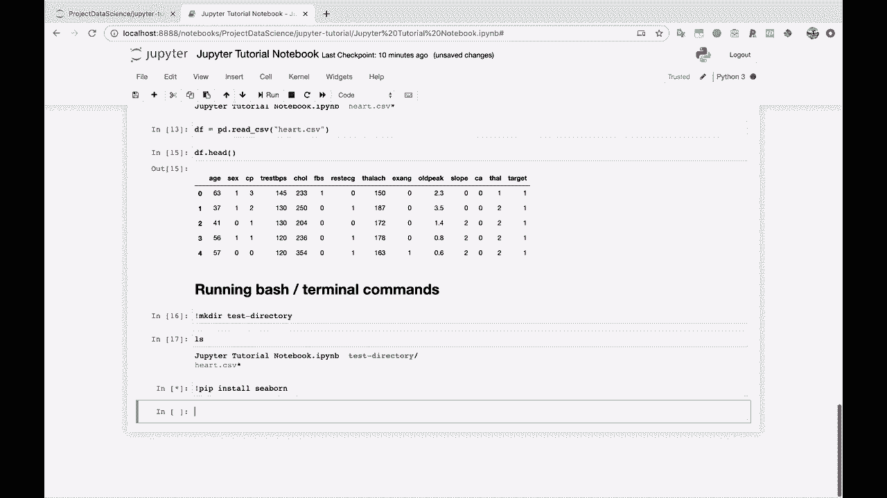

# 【双语字幕+资料下载】Jupyter Notebook 超棒教程！50分钟，把安装、常用功能、隐藏功能和 Terminal 讲解得清清楚楚。学完新手也能玩转！ - P11：11）在 Jupyter Notebook 中使用终端命令 - ShowMeAI - BV1yv411379J

好的，我们继续吧。我们在笔记本里还有几件事要做。然后我们将进行一次关于在 Jupyter 笔记本外部可以做的其他事情的 tour。接着我会给你展示一些扩展功能，然后我们就完成了。所以我们快到了。

好的，所以运行 bash 或终端。

这里的命令。关于 Jupyter 笔记本的一件好事是，即使我们在这里运行 Python，Jupyter 笔记本也允许你运行 bash 命令。所以举个例子，即使这个 LS 是一个 bash 命令，它也不需要我即将展示的这种特殊语法，也就是感叹号。所以通常来说。

如果你运行普通的 bash 或终端命令，你将使用这个感叹号告诉 Jupyter 笔记本你想要运行一个 bash 命令。所以假设我们想要创建一个目录。我们想要创建一个测试目录，类似这样的。

现在如果我运行 LS。

你会看到我们刚刚创建了一个新的测试目录。如果我回到我们的 Jupyter 笔记本主窗口，你会看到这里是我们的测试目录。所以我们能够在 Jupyter 笔记本中运行一个 batchsh 命令。如果需要安装新包，比如说，你也可以这样做。

比如说你想安装数据可视化库 Cborn。你可以在 Jupyter 笔记本里直接做到这一点。😊。

虽然你也可以直接跳回终端去做这个。所以，你知道，你不一定要在这里做这个，但。

就这样。
