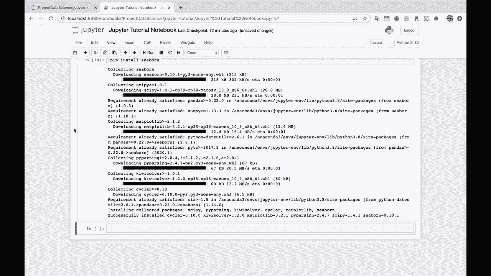
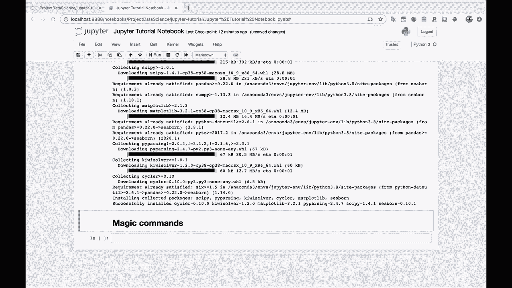
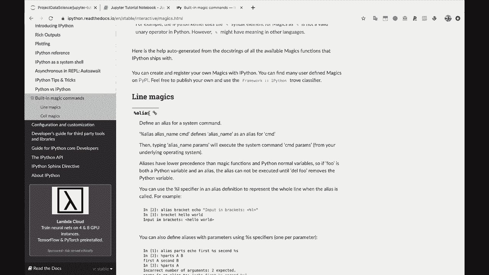
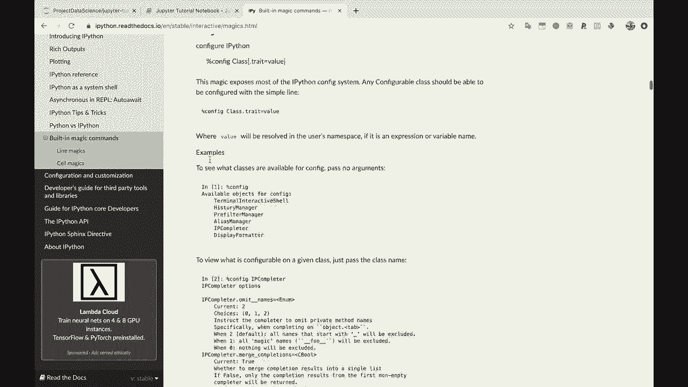
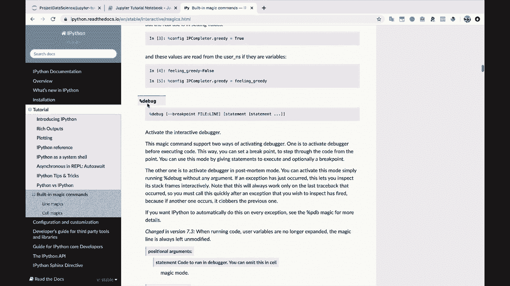
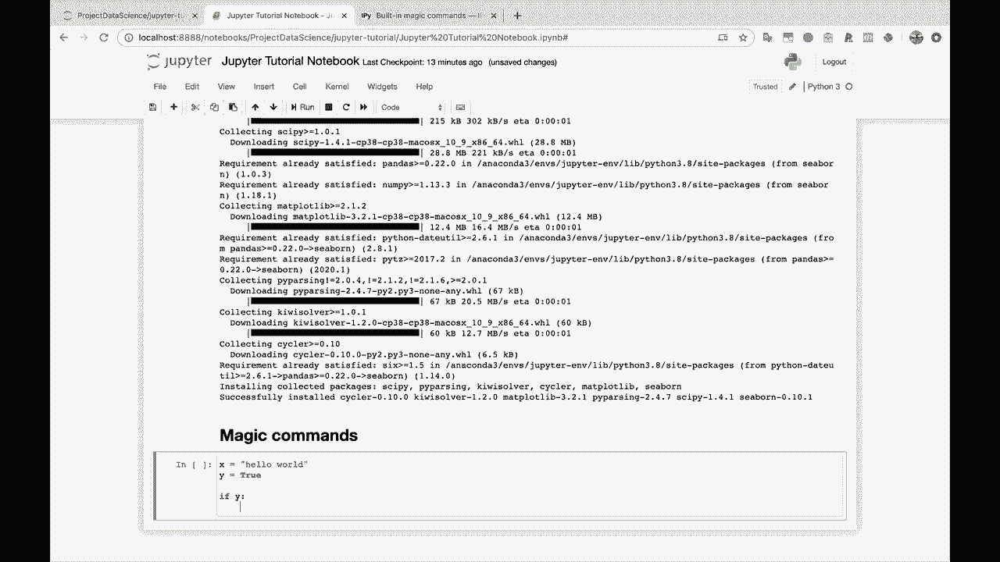
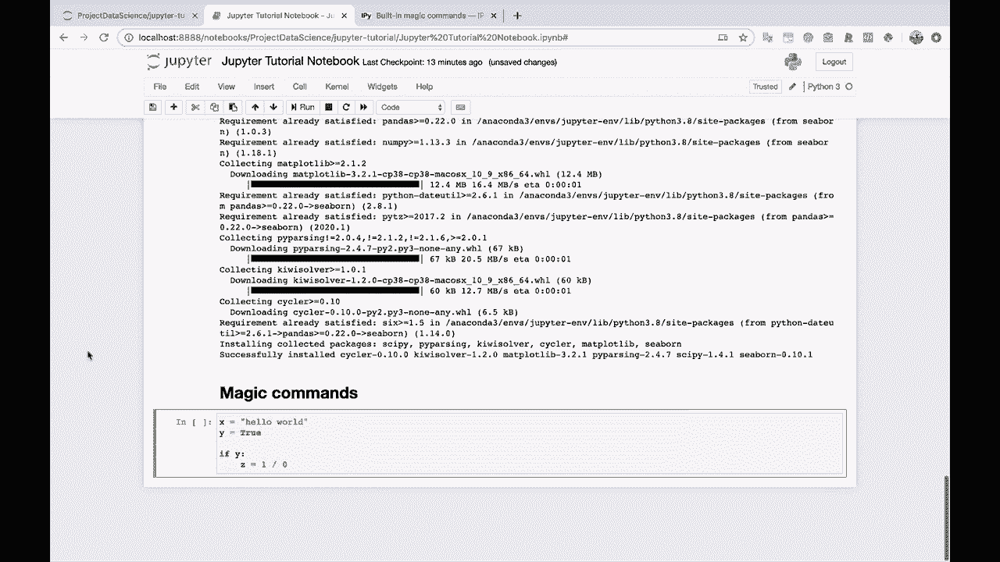
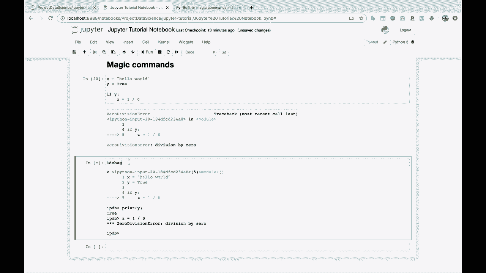
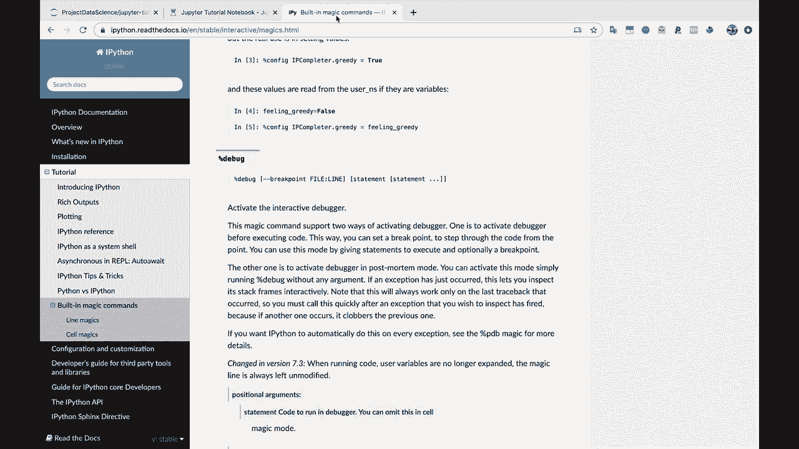
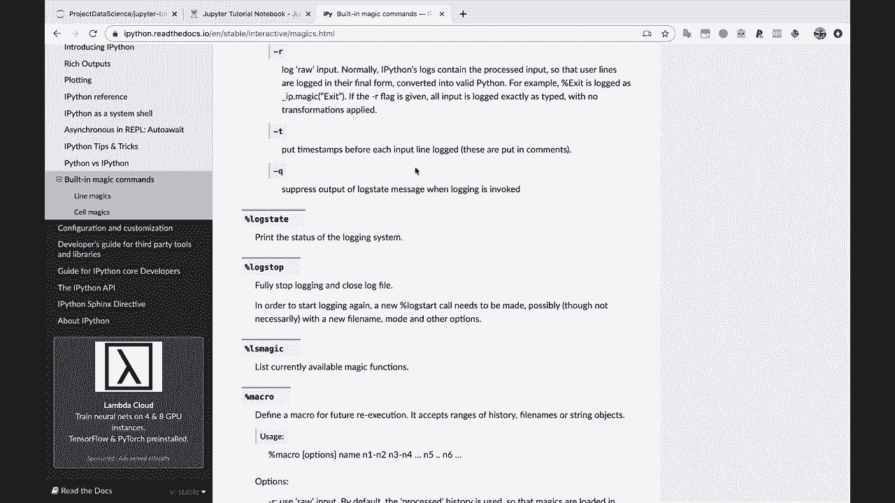

# 【双语字幕+资料下载】Jupyter Notebook 超棒教程！50分钟，把安装、常用功能、隐藏功能和Terminal讲解得清清楚楚。学完新手也能玩转！ - P12：12）Jupyter Notebook魔术命令 - ShowMeAI - BV1yv411379J

好吧，那么在我们保存并退出笔记本之前，我要给你展示的最后一件事是魔术命令。现在，这是个很酷的名字。魔术命令让你感觉非常强大，确实如此。因为这些命令非常酷，所以。😊。

我会，看看。让我复制这个链接。或者其实。如果你只是谷歌一下Jupyter魔术命令。

应该在这里的顶部弹出，内置的魔术命令。

所以这些都是你在标准Python中无法做到的事情。

在Jupyter笔记本中。所以，例如，让我们向下滚动。

有一个很酷的，叫debug。所以。Debug，例如，假设我们让某段代码崩溃。

所以也许我会说，你知道，在这个单元中，假设x等于。Hello world。然后我们可能会说y等于true。也许如果y，那么我们尝试z等于1除以0。让我们，打破这个代码。

所以我们运行这个。这会崩溃。让我们输入debug，好吗，因为我们想调试我们的代码。这样我们就能在代码崩溃的执行点进入这个单元。如果我打印出y，比如说。那么你会看到y为真。也许我想尝试z等于1除以0。你会看到我们得到了零除错误。

所以你能够直接进入代码崩溃的地方，使用这个方便的Dbug魔术命令。现在，这里有很多其他魔术命令。

例如，你可以保存Jupyter笔记本的各个部分。你可以改变笔记本的运行方式，各种有趣的东西。你可以查看你运行过的历史记录。各种酷炫的东西。我建议至少浏览一下这些，以便在需要时能使用它们。

