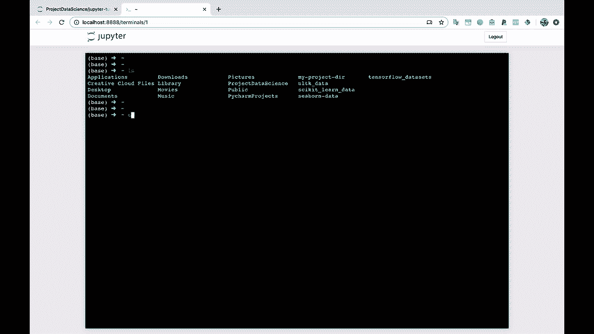
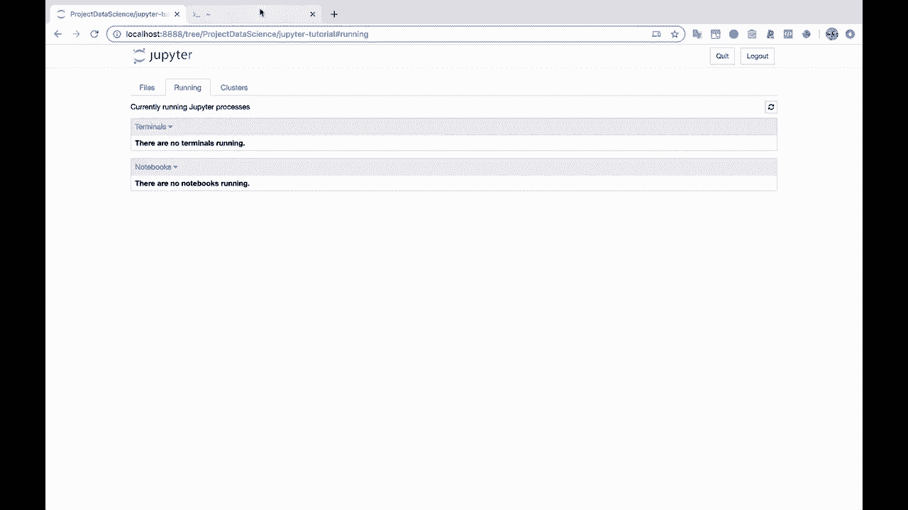

# 【双语字幕+资料下载】Jupyter Notebook 超棒教程！50分钟，把安装、常用功能、隐藏功能和Terminal讲解得清清楚楚。学完新手也能玩转！ - P13：13）Notebook之外的其他功能 - ShowMeAI - BV1yv411379J

The future。 Alright， so let's save this notebook。 So I'll command S saveve the notebook。 Let's close out of it。 I'll go ahead and shut it down。

I'll delete this。Test directory that I created inside there。

And let's show you a couple other things in here， and then I'll leave you with some resources and we' be done。Alright， so if you go over here to the right under this new button。 you'll also notice that we have options under other for a text file。And a terminal。 So if you want to run terminal right here within Jupyter Notes， you have that ability。

 And in my case， you'll notice that this looks very similar to my terminal that I have out here。 So it is running Zish so I can， you know， I can do LS and print out all of the directories here。

If I wanted to， if I was using version control with git。 I could do that or anything else that I wanted to do inside of this terminal here。 So I'll go ahead and exit out of this。 You'll notice that this has closed now。

And under running， there are no terminals running because I exited out if we had left it running。Let's just keep that open for a second。And refresh。 There you go。 You'll see that we have one terminal running。 Now。 I'll go ahead and shut this down。

And that closes it for us， as well。