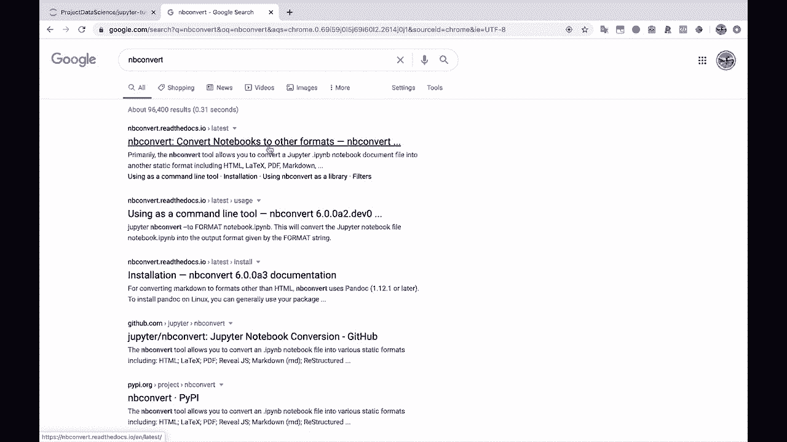
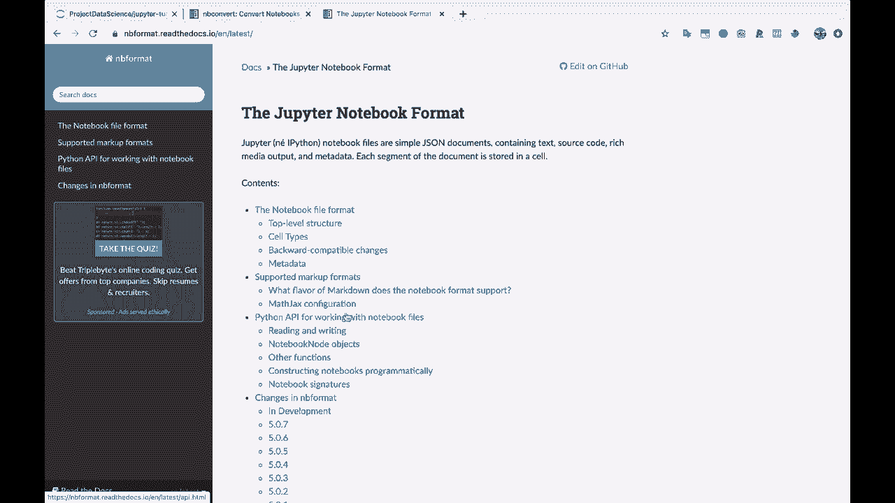
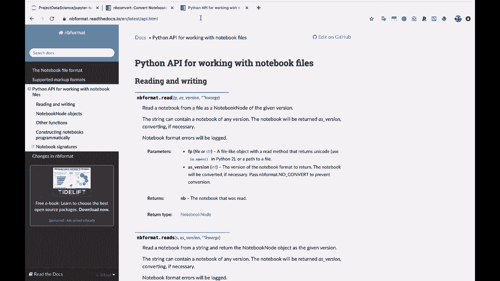
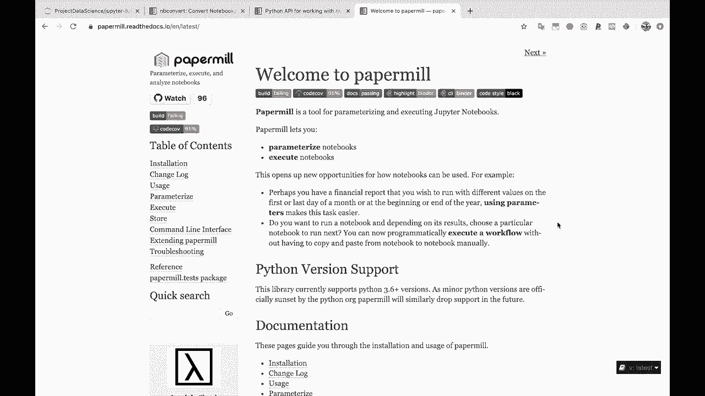
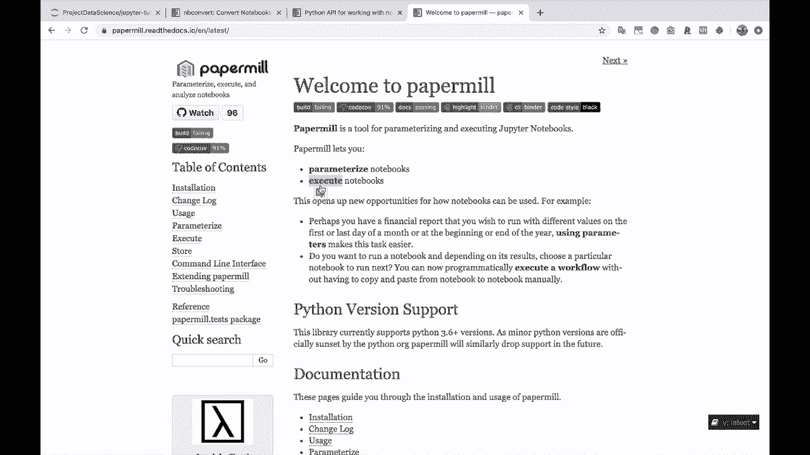
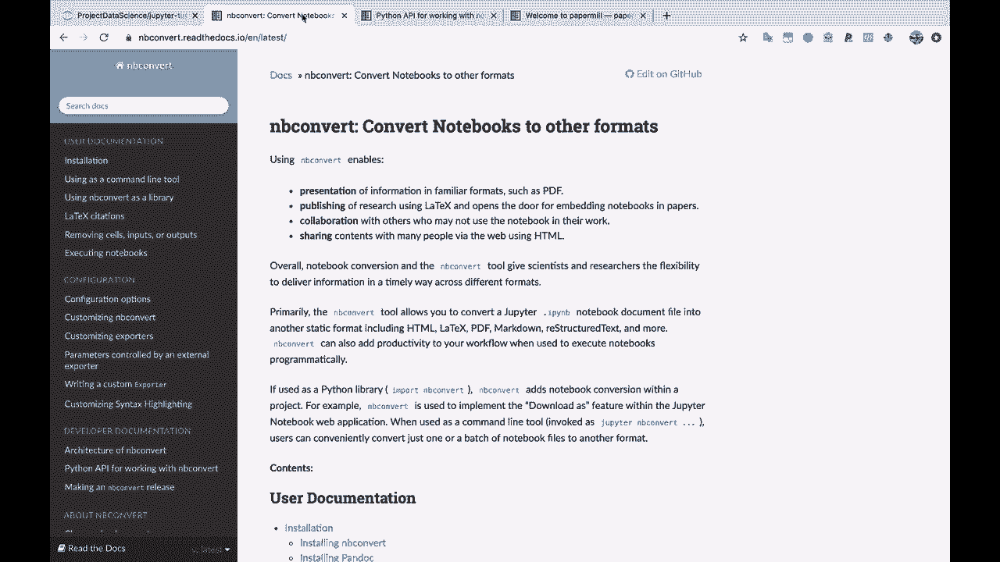
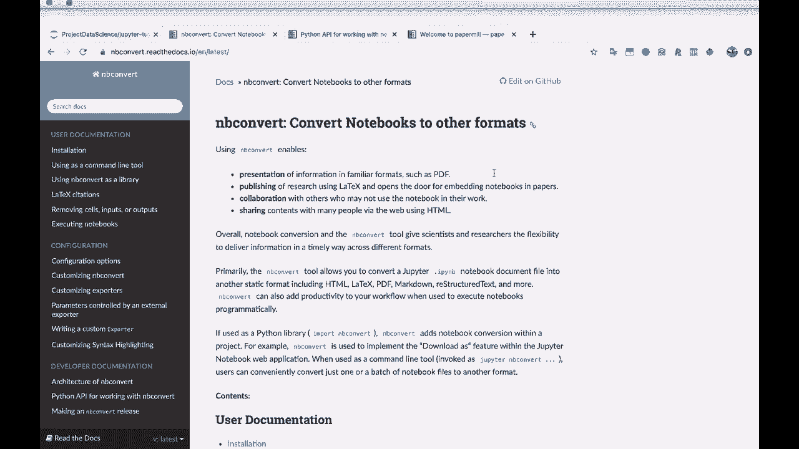
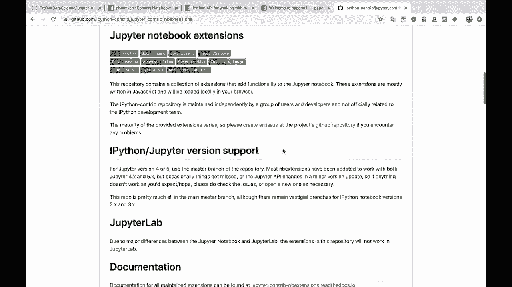
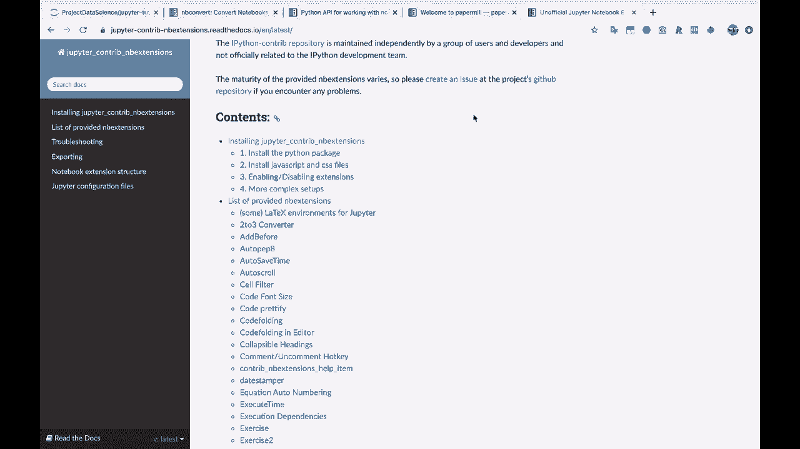

# 【双语字幕+资料下载】Jupyter Notebook 超棒教程！50分钟，把安装、常用功能、隐藏功能和Terminal讲解得清清楚楚。学完新手也能玩转！ - P15：15）Jupyter Notebook扩展和其他库 - ShowMeAI - BV1yv411379J

And that is pretty much it for our Jupiter notebook tutorial here。

 So I want to leave you with a couple other resources。

 I'm not gonna go into into too much depth here because I think you've gotten a really good foundation that you can start with。

 but I want to make you aware of these， in case they are helpful for what you want to do with Jupyter notebooks。

 So the first tool which is part of the Jupiter notebooks installation， I believe is in be convert。

 So notebook convert here。 So this basically helps you convert notebooks to other formats。

 like it says here， very helpfully。 you can convert to Pdfs， you can convert to latex Hml， etc ceter。

 This can be very， very handy。 The second resource I want to point you to is in B format。

So if you Google in B format and then click here the Jupyter notebook format and specifically this Python API for working with notebook files。

So this is also something that just comes with your Jupyter notebook installation。

And this is a way to programmatically work with notebook files within Python scripts。 So。

 for example， imagine that you want to create a certain type of Jupyter notebook。

 Maybe you want to create。Various code cells and different kinds of markdown cells based on the type of data that you have。

 And you， you have some logic for how you want to create the Jupyter notebook itself。 Well。

 in B format can help you do that。Additionally， you can read in existing notebooks and edit them and then save them back out as Jupiter notebooks。

 So this is very， very helpful for programmatically working with different Jupiter notebooks。

And this resource here， combined with this next one， paper mill can be a very powerful combination。

So paper mill does not come with Jupiter Notes natively， you have to install it separately。

But paper mill lets you parameterize notebooks and execute notebooks。 So whenever I say parameterize。

This means passing variables into the notebook。So let's say that you have an experiment inside of a Jupyter notebook and you want to run it with different sets of parameters。

 Well， you can use paper mill to pass in different values of your parameters to the notebook and then automatically execute the whole notebook and spit out kind of a final。

Completed， executed Jupyter notebook on the output side of things。

Or thinking about it with in B format， you could dynamically create a certain type of notebook with In B format using Python。

 you could then execute that notebook using paperm。

 and then maybe you could convert that notebook into a PDFf。 and， you know。

 maybe automatically email it out or something like that。

 So this is kind of a way that these extensions are very powerful and can be used in conjunction with one another。

Now， the very last thing I want to leave you with。Is just if you Google Jupiter notebook extensions。

And then come to this i Python contri Jupiter contri in B extensions。And let's see specifically。

 here is a link to the documentation。

So any kind of functionality that you want with in Jupyter notebooks might exist with a Jupyter notebook extension。

 So there are all kinds of things that you can do here from let's see。

 code font size to automatically liing your code。To let's see here， do do do do。

You've got all kinds of different extensions in here。 you have a spell checker。You have this， oh。

 the hinter land one， which gives you code hints or autocompte for your code， all kinds of， oh yeah。

 code folding here。All kinds of different extensions for Jupiter notebooks that you can check out here。

 so if you want certain functionality， it might exist here。

