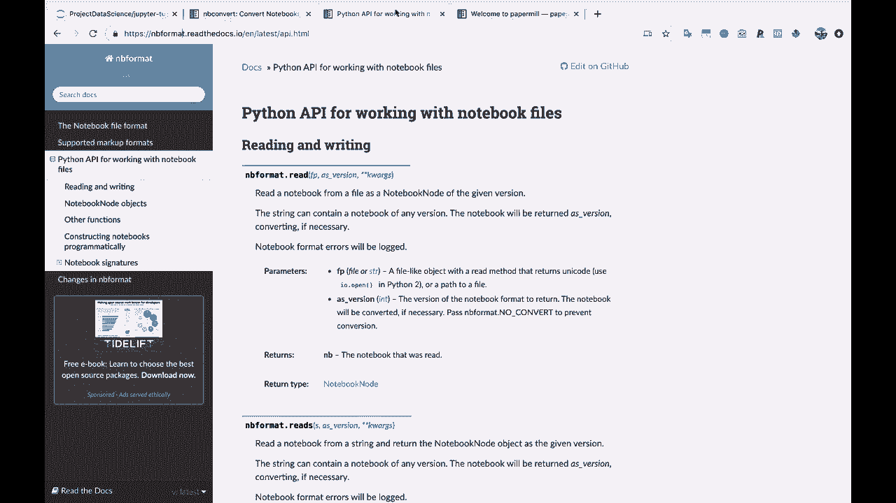

# 【双语字幕+资料下载】Jupyter Notebook超棒教程！50分钟，把安装、常用功能、隐藏功能和Terminal讲解得清清楚楚。学完新手也能玩转！ - P15：15）Jupyter Notebook扩展和其他库 - ShowMeAI - BV1yv411379J

这基本上就是我们这里的Jupyter笔记本教程。所以我想给你留几个其他资源。我不会深入讲解，因为我认为你已经打下了很好的基础，可以开始了，但我想让你知道这些，以防它们对你想要做的事情有帮助。

所以第一个工具，我相信是Jupyter笔记本安装的一部分，是nbconvert。所以这里的notebook convert。这基本上帮助你将笔记本转换为其他格式。正如这里所说，非常有帮助。你可以转换为PDF，可以转换为LaTeX、HTML等等。这会非常方便。第二个我想指出的资源是B格式。

所以如果你在B格式中搜索，然后点击Jupyter笔记本格式，特别是这个用于处理笔记本文件的Python API。

这也是随你的Jupyter笔记本安装提供的。这是一种在Python脚本中以编程方式处理笔记本文件的方法。因此，例如，想象一下你想创建某种类型的Jupyter笔记本。也许你想创建不同类型的数据对应的各种代码单元和不同类型的markdown单元。

你有一些逻辑来决定如何创建Jupyter笔记本。好吧，B格式可以帮助你做到这一点。此外，你可以读取现有笔记本并编辑，然后将其保存为Jupyter笔记本。这对于以编程方式处理不同的Jupyter笔记本非常有帮助。

而这个资源，加上下一个，paper mill可以形成非常强大的组合。所以paper mill并不是Jupyter笔记本自带的，你需要单独安装。

但是paper mill让你可以参数化笔记本并执行笔记本。所以每当我说参数化，这意味着将变量传入笔记本。所以假设你在Jupyter笔记本中有一个实验，想用不同的参数集运行它。

好吧，你可以使用paper mill将不同的参数值传入笔记本，然后自动执行整个笔记本，最终输出一个完成的、执行过的Jupyter笔记本。

或者从B格式考虑，你可以使用Python动态创建某种类型的笔记本，然后使用paper mill执行该笔记本，也许你可以将该笔记本转换为PDF，并且，知道吗？也许自动发送电子邮件之类的。

所以这是一种这些扩展非常强大且可以相互结合使用的方式。

现在，我想留给你们的最后一件事就是。如果你在谷歌上搜索Jupyter笔记本扩展，然后来到这个i Python contri Jupiter contri in B扩展。让我们具体看看。这里是文档的链接。

所以你在Jupyter笔记本中想要的任何功能可能都可以通过Jupyter笔记本扩展实现。所以在这里你可以做各种各样的事情，比如说代码字体大小，自动对齐代码。让我们看看，你有各种不同的扩展。你有拼写检查器。你有这个，哦。

hinter land one，提供代码提示或代码自动补全，各种各样的，哦对了。这里有代码折叠。你可以在这里查看各种不同的Jupyter笔记本扩展。如果你想要某种功能，它可能就在这里存在。

