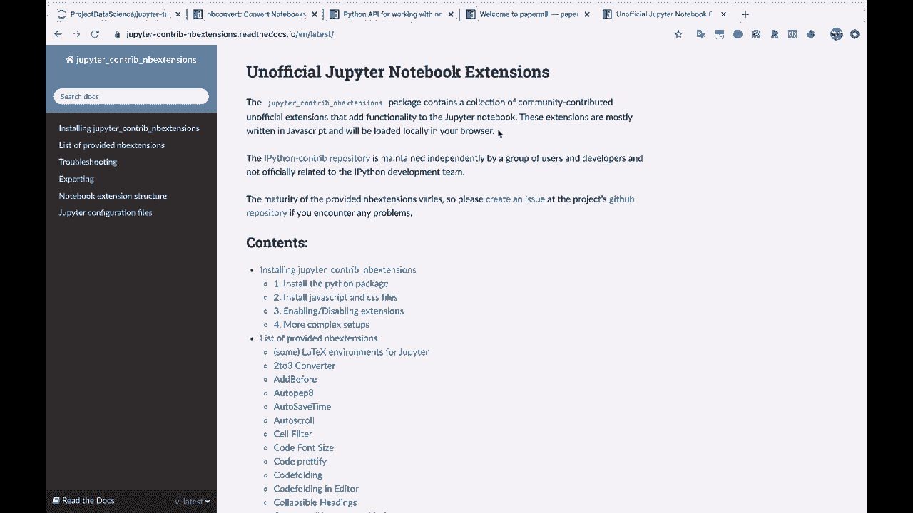
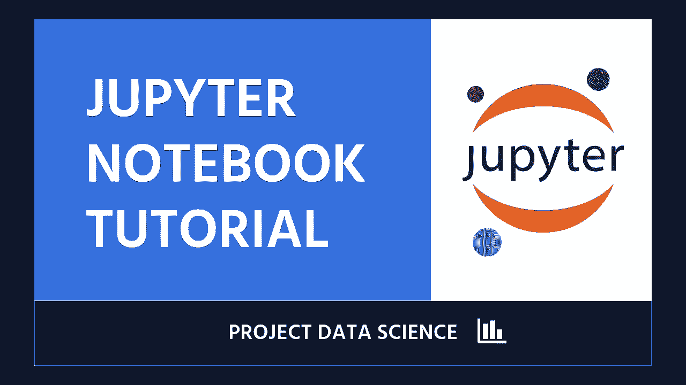

# 【双语字幕+资料下载】Jupyter Notebook 超棒教程！50分钟，把安装、常用功能、隐藏功能和Terminal讲解得清清楚楚。学完新手也能玩转！ - P16：16）结论与致谢 - ShowMeAI - BV1yv411379J

And with that， I think you have a very solid foundation for using Jupyter notebooks。 I hope that you' found this tutorial valuable。 I hope that you find other project data science tutorials valuable。And happy learning， we will see you around later at a future tutorial。 Alright， good luck。😊。

