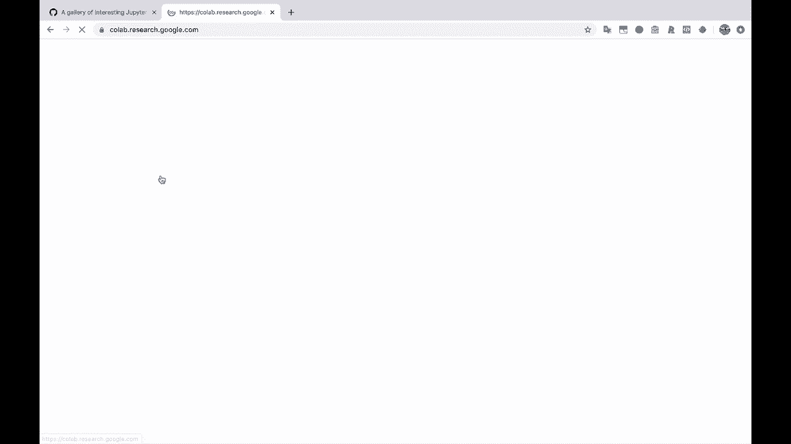
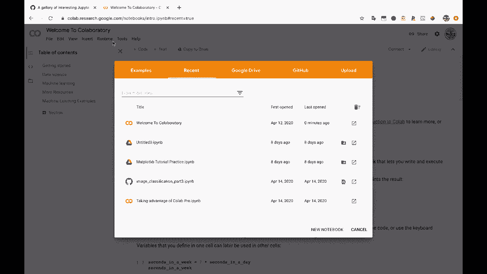
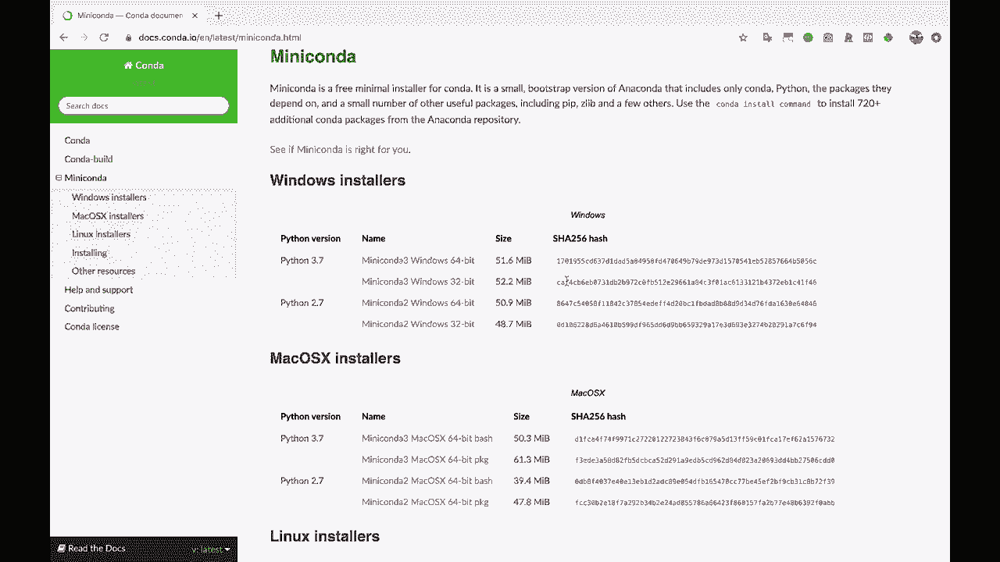

# 【双语字幕+资料下载】Jupyter Notebook 超棒教程！50分钟，把安装、常用功能、隐藏功能和Terminal讲解得清清楚楚。学完新手也能玩转！ - P3：3）安装 Python 和 Jupyter Notebook - ShowMeAI - BV1yv411379J

And。Allright， first things， first whenever we're getting started with Jupiter notebooks is we need to install Python and Jupiter。

 So if you already have Python and Jupiter installed， feel free to skip this step。

 if you don't want to install anything on your computer currently。

 you can use let me just Google Google coabab here。

So Google Colllabab is kind of like Jupiter notebooks in the cloud。

 You can just run these in your browser。 They're not going to be identical to Jupyter notebooks。

 So some of the things that we go through in this tutorial might not be the same。

But this is a great way to get up and running with a code notebook。 You know， it's。

 it's basically the exact same concept here。 You've got text， and then you've got code。

 and you can share it with people。 So it's the exact same concept。

 Some of the specifics are going to be a little different。

 But if you don't want to install Jupiter on your computer currently。 or if you can't。

 for whatever reason。 then feel free to use Google Coab。 I think this is really great resource。😊。

But。For those of us who are installing Python and Jupiter on our computers， let's go to miniconnda。

 So miniconda。Is how I recommend installing Python？

And the various data science packages that you use with Python。 So what is Minconda。

 Well Minconda comes with Python， and it also includes this handy dandy Conda tool here。 Now。

 Conda is used for installing packages like pandas。

 like Jupiter notebooks like other Python libraries that you need to install。

And Conda is also used for creating virtual environments and virtual environments are kind of a best practice for wrapping up your Python installation and your packages into an isolated directory that's separate from your main Python installation。

Anyways， feel free to do more research on that if you want otherwise。

I recommend that you install the right version of this for your system， installs the Python 3。

7 version。 Most people are using Python 37 these days unless your company specifically uses Python 27 and you can install that。

So install Minconda for Python 3， and then once you get that installed。

Let's hop over to a terminal。Or bash， or I'm using Zish。 If you're on Windows。

 you can use the command prompt， so。Alright， so what we're going to do is I like to start every new project and every new tutorial video by creating a new virtual environment。

 So we're just going to create a nice little wrapped up place to install Jupiter into and I'm also going to install pandas because I want to show you how a panda's data frame looks within Jupiter so。

😊，Let's Conda create in， and we're going to create a new virtual environment。 I'm going to name it。

 I'll just name it Jupiter I for right now。And then I can list out the packages that I want to install right away as I'm creating this new virtual environment。

 So I want to install Jupiter。And I want to install pandas。 And I think that might be it actually。

 So I'll go ahead and create this new virtual environment named。😊，Jupiter in， that's what this。

 this dash in flag stands for is the name of the environment。

 and I'm going to install the Python packages， Jupiter and pandas into this virtual environment。

And it's also going to install all of these， which are dependencies of Jupiter and pandas。

 These have to be installed in order for these to work。So it asks me if I want to proceed。

 I'll go ahead and type why for yes。This will go through and install everything。

 and I'll come back whenever it's done。Alright， it looks like everything installed successfully and Conda very helpfully gives us this little block right here to activate this environment。

 use Conda activate Jupyter in。 So I'm going to go ahead and do that so that we' are using and I'll actually。

 I'll show you really quick。 if I type which Python right now。

 So is gonna to show me which version of Python I'm currently using if I run Python。 so。😊。

The current version I'm using is under Anaconda 3 bin Python。Now。

 if I activate my virtual environment。And then I type which Python。

You'll see that I'm now using a completely different version of Python。

 so this is the whole point of a virtual environment。

 is we are wrapping up our installation into this new folder here so that if we you know。

 if we need to have multiple installations on our computer at any given time， we are able to do that。

