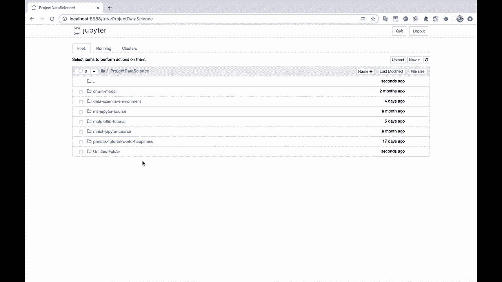
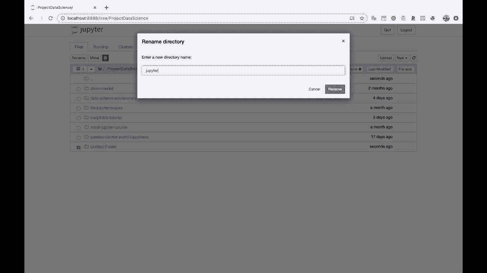
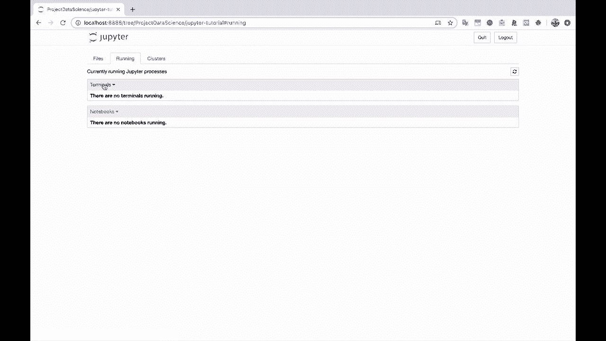

# 【双语字幕+资料下载】Jupyter Notebook 超棒教程！50分钟，把安装、常用功能、隐藏功能和Terminal讲解得清清楚楚。学完新手也能玩转！ - P4：4）启动 Jupyter 笔记本 - ShowMeAI - BV1yv411379J

Al right， so we have Python installed now。 we have Jupiter installed。

 and all that we need to do to launch Jupiter notebooks is type Jupiter Note。

 and then I put an ampersand after this to run this in the background of this terminal here so that we can still use the terminal if we want to。

Al right， And that just popped open a window on my other screen。 Let me drag this over here。

 Let's close that out。And here we go。 Were inside of Jupiter notebooks。

 and I launched this inside of my home directory。 So you'll actually see that we have access to all of the folders。

 all the directories。That I have in my home directory and specifically where I want to create a new notebook is I'm going to go into this project data science folder here and you'll see that these are all the folders within my project data science directory。

And let's go ahead and create a new。 I'll create a new folder。

And let's rename that。 So let's call this Jupiter tutorial。

Now， I'll click in here。And so， this is the basic。The basic screen that you're going to be introduced to whenever you run Jupiter notebooks here。

 So we have a file browser， we've got this running tab， which basically shows which， you know。

 do we have any notebooks that are running， Do we have any terminals that are running。

 and then we've got this clusters tab over here。 we're not going to do anything with this one。

