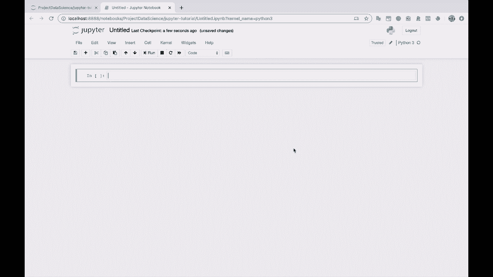
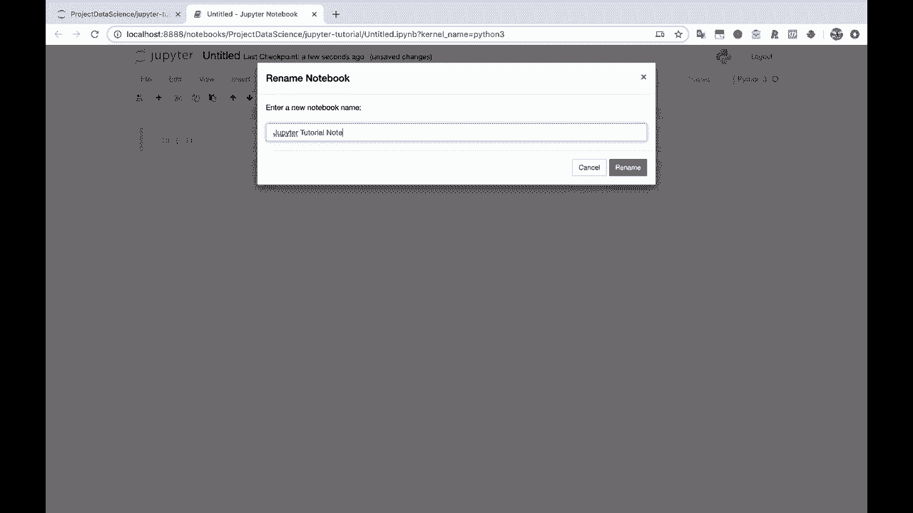
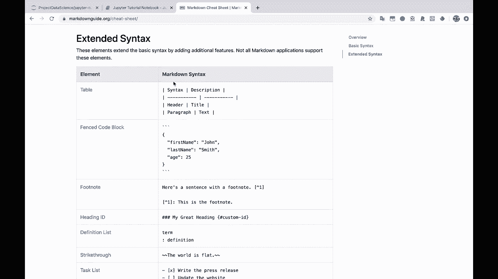

# 【双语字幕+资料下载】Jupyter Notebook 超棒教程！50分钟，把安装、常用功能、隐藏功能和Terminal讲解得清清楚楚。学完新手也能玩转！ - P5：5）基本的Notebook功能 - ShowMeAI - BV1yv411379J

Da。But basically， what I do as soon as I launch Jupyter notebooks is I'll come over here to new。And then you can just select a new Python 3 notebook here。And this creates a new notebook。 Let's give it a name。 We'll just call it Jupiter Tu notebook。

U here。So what is a notebook， Well， a notebook is a way to be able to write plain text and to be able to execute code within different cells。So you can see here， here's one cell。And this cell is currently going to be a code cell。 And you can tell it's a code cell from this right here。 you can also tell by this in over here on the left with the square brackets。

So if I come into this cell here， I'll just click in and I'll just do something simple in Python。 You know， I'll set x equals hello world。And let's print out X。 Now， I am going to click shift enter。And that's going to run this cell。 And you'll see that we now have a little one next to it。 So this is a code cell。 We just ran that code and it executed this Python code here。And printed out。

 hello world。Now， if I come down into this next cell here and I just type in X and hit enter。 let's see what happens。Well now you'll see that we've got this out here and it just and it's telling us essentially。 what is x。 So we're not printing X。 rather， we we're kind of returning X to the standard out here in this notebook。 and it's telling us， hey， X is a variable and it's actually a string。

 and that string says hello world。And you'll notice that we still have access to this X variable。 even though we defined it up here in this previous cell。 and you'll see that we have the number two here beside this cell。 and this is because behind the scenes， what's going on is Jupiter notebooks is using a single single instance of Python。

 a single Python kernel where it's maintaining all the variables and keeping track of everything just like what happen in a normal Python script or in i Python interactive shell environment。So as soon as we define a variable anywhere in this notebook。 and this is actually this is one of the dangers of Jupyter Notes and I'll demonstrate this to you right now。I can I can define why down here， maybe why is。Let's say a goodbye world。 That's kind of edgy， right。

Alright， so I run this。 I haven't printed anything。 So I've just defined a variable why。 now。 if I come back up here to the top。And I insert a new cell。 So I insert cell above。 Let's insert cell above here。And now I print why。Even though this cell is before this cell。 so we're printing out a variable before it gets defined。

 but Jupyter notebooks doesn't care about the ordering of the cells here。 What it cares about is the order of execution of the cell。 So you'll notice this little side number here，1，2，3，4。 So we executed this cell。We assigned the variable。And then it doesn't matter where we use that variable now。

 because it's been assigned so we can use it up here if we want。 And， you know， this is very tricky。 I'm going to delete this cell， using the letter X。And now， if I print。Why， again。Well。 that still works。 It still works because even though we've deleted the cell where the variable assignment happened。 Y is still being stored in memory。 So just to show that， I'm going to type。

 let's type Dr really quick with。Two with parentheses here。And D， basically。Gives you a list of the different variables and the methods that are available to you。In your。Working session currently。 So in the current。In the current Python instance that you are working with。 So here you'll see that x and y are both defined。 These are the things that we've defined。

 And there are a bunch of other things that are predefined as well。 and we're not going to worry about about those right now。 But I just want to show you that you can see which variables are there。 And these variables will stay there。Until。We explicitly get rid of them， we explicitly delete them。

Or we shut down the notebook and come back into it。 We restart the kernel。 So we're getting a little bit ahead of ourselves here。 So let's go back。 let's go back to the basics。 Let's go back to the basics， so。All right， so we have a code cell。So I'll say this is a code cell。All right。Now we also have markdown cells。 So I'm going to come here。

 I'm going to type the letter M， but you could also come up here to this drop down and just select markdown。 Now， markdown is basically plain text。 So markdown is basically plain text。Except that you can format it using various special characters。 And then whenever you。 whenever you execute the markdown within this Jupyter notebook， it will format it for you。

 So markdown is basically plain text。Except you can。 And I'm going to make this bold format。 You can format things。Differently。Let's create a header here。 You can have headers， so。This is a header。Is a header 1。And say， you know， this is a。Header 2。😔，And here's some text。Including italics。And here's some other。Text with more bold。All right。

 so we've done a little bit of formatting， oh， sorry。This is a header2。 There we go。 And you'll notice that Jupiter notebooks。Pretty helpfully。Actually does the formatting while you are typing it in。 so you don't even have to wait necessarily to execute the cell to see what's going to happen。

So let's make this a header two。 Now， if I click， click shift enter。You will see that this just becomes plain text， so it's not code。 it's just markdown。 and this is a way that we can describe what we are doing inside of the Jupiter notebook。Alright。 so in the spirit of organization， I'm going to create a new cell。

 So rather than doing insert cell above， I usually like to use keyboard shortcuts。 I'm going to type the letter A， which inserts a cell above。 Now I'm going to type a letter the letter M in for markdown to create a markdown cell。 I'll hit enter。😊，And I will say， here is our basic introduction to markdown cells and code cells。

This is a markdown cell。You can have， and let's create a list here。 actually， you can have lists。Ordered and unordered。You can have bold text。 You can have it text。 You can have code blocks。And I'll say， etc cea。And just to show you an example of a little code block。Let's say here's an example of a code。Block， and so we are going to format it like code。

But it's not actually going to run light code， so。Let's say x equals hello world。Print X。There we go。So this is a markdown cell。 This is a code cell。 And in a nutshell。 that's basically Jupiter notebook。 So everything else that we talk about here is going to be。Details about this setup and extensions to the setup and and additional things that you can do。

 But with this knowledge， I mean， you have enough， you have enough to go on already。 these are markdown cells。 These are code cells。 There you go。 And if you ever want a markdown cheat sheet。 You can just Google something like markdown cheat sheet。This is how I find a lot of information， this is how everyone finds a lot of information using hand and to Google。

And go to markdown sheet sheet。I like this site Markdowngu do org。 is is a good one。 And you can see。 oh， here's how you create headings。 Here's how you create bold text， ordered lists。You can do links。 can， you can do tables。

All kinds of different things。