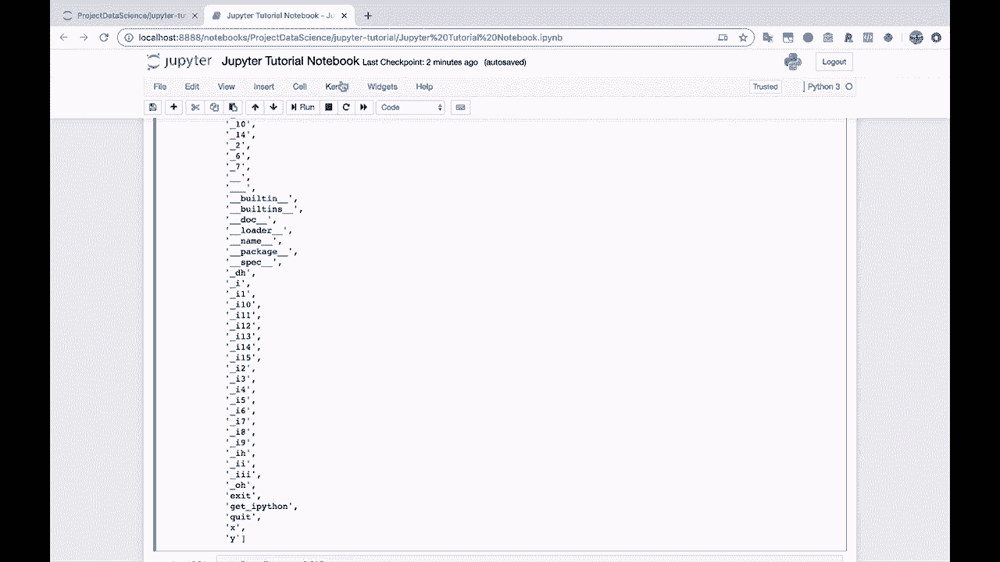
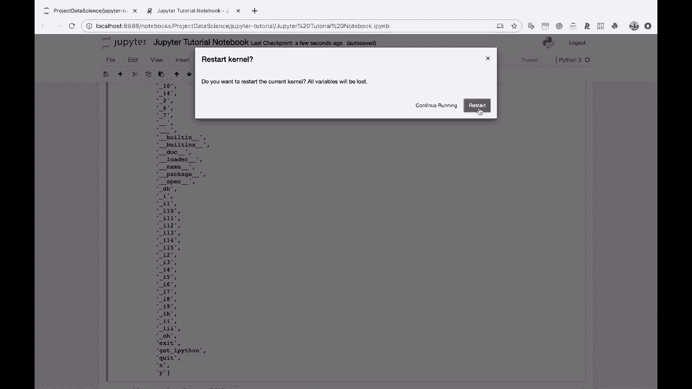

# 【双语字幕+资料下载】Jupyter Notebook 超棒教程！50分钟，把安装、常用功能、隐藏功能和Terminal讲解得清清楚楚。学完新手也能玩转！ - P6：6）内核和变量 - ShowMeAI - BV1yv411379J

All right。So let's create another section。 Let's talk about restarting the kernel。And variables。

So this is going to be touching on what I mentioned earlier。About assigning variables。

And then having access to them until you explicitly。Delete。

Delete the variable or restart the notebook。Let's take a look at our D。 right now。

 our directory of variables and everything we have access to。 So x and y are still defined。

 If I do print y。This is still there。Because we haven't deleted it using the DEL method there。

Delete why， so we haven't deleted it using that， and we haven't restarted the notebook。

So I'm going to show you both ways really quick。 So first， let's go ahead and delete why。

 So this doesn't return anything。 It just， it just deletes the variable。

 Let's come back up here and run D again。And you'll see that y no longer exists in our variable。

 So if we do print y。Oh， why is not defined。 It was defined。 And then we deleted it。

 And that's what's going on here。 So let's go ahead and define why again。Y equals good bye world。

Print Y。 that's looking good。 I went ahead and deleted that other cell using the X key。

 I'll go ahead and delete using the X as here， as well。And if we do D。

 you'll notice that y is now back， Y is now back。So I could close out of this notebook。Oh， yeah。

 actually， we， we do need to save our changes。 Thank you。 Little pop up。

 So I'm gonna save our changes， command S， or you can come in here， file and save and checkpoint。

Let's close out our notebook。And you'll notice that our notebook here listed inside of our Jupiter tutorial folder has a little has a little green book next to it。

 Now， this means that it's running。 and it says over here， running very helpfully。

 And if we click the running tab， you'll see that this notebook is running。

 just said running a lot a lot of times in a row。All right， so if we go back to files。

This means that our Python is still running under the hood here。

 It's still tracking all of our variables It still got everything stored in memory。

 So if I click this notebook again and open it back up。And I come down here。To the Dr。

 notice this number 14， This is the 14th cell that was executed before we saved it。

Let's run it again。Now， it's the 15th cell。And we still have access to X and Y。

 So I'm not going to run this assignment cell again。 I'm not going to run the cell where we assign Y。

 I'm going to print y。And it's still prints。 Y is still here。

Just closing the tab does not shut down the notebook。The notebook does not shut down。

Until you either explicitly shut it down， you can click beside it and click shut down in our main tab。

You can also do file， close， and halt。Or you can come back to the terminal and you can just shut down the whole Jupiter notebook。

A serviceervice that's running here。 You can just， you can shut the whole thing down and that will shut down all of your notebooks。

So the notebook keeps running。Until you tell it to stop。Another way。

To kind of reset this notebook here is to go to kernel。 So let's go to the kernel tab here。And。

You'll see that there are different things that we can do with the Python kernel here。

 So I am going to click。Restar， I'm going restart the kernel。 Now。

 this has the same effect as shutting down the shutting down the notebook and then opening it back up again。

So all of our variables are going to disappear。Why will no longer be in memory If we want Y to be equal to good by world。

 we're going to need to run this cell again。And， and X will also no longer be in memory。

 So this is kind of like rebooting your computer。 It's rebooting the notebook and you kind of lose。

 you lose the variables that are here in memory。 So let's go。 Let's save it。

Let's go to kernel， restart。

Let's restart this kernel。All right， flashed up blue here。 Colonel is ready。

Now let's run D and see what happens to this number here。Boom back down to one。That is telling us。

That this is a new version of Python under the hood here。

 And you will notice that X and y are both now gone because this is this kind of like closing out of Python。

And opening it back up again。 So if I go down here to print why。

Then we're going to get name Y is not defined because we're dealing with a new Python kernel here。

And we haven't defined it yet。So this is pretty important for Jupiter notebooks。

And this is a reason why， if you can。Try to run your cells。 I' I'm going to restart。

 restart again here。Try to write and run your cells from beginning to end so that everything makes sense when you run it。

 one cell at a time， from cell to cell to cell to cell。Because。If you assign the variable。

 Y right here。And then you print it up here before you've assigned it。This will technically work。

If you've already run this cell and then you come back up here and run this cell。

 And this is why Jupiter Notes can get pretty messy if you're not careful。

 if you're not careful because。Then if you restart this。

This notebook will now not be able to run in the kind of chronological logical order here。

 because as soon as it hits this cell， well， we're trying to print it before we assign it。

So typically， you want your notebooks to flow in a nice logical order beginning to end。

And if you keep that straight， that's gonna make you a Jupyter notebook wizard because I think a lot of people。

 a lot of people forget that。 So you've probably already learned more about Jupiter notebooks than a bunch of people who are using them。

 because you've now learned all about the kernel and how that relates to storing your variables。

