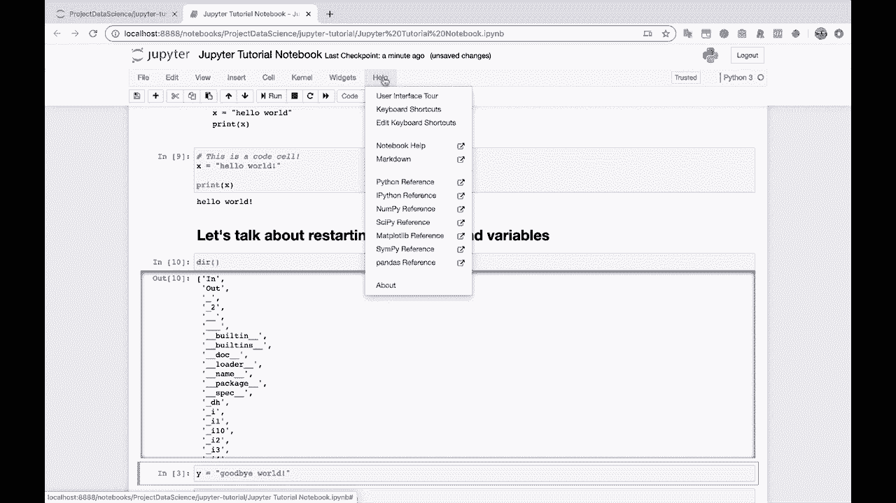
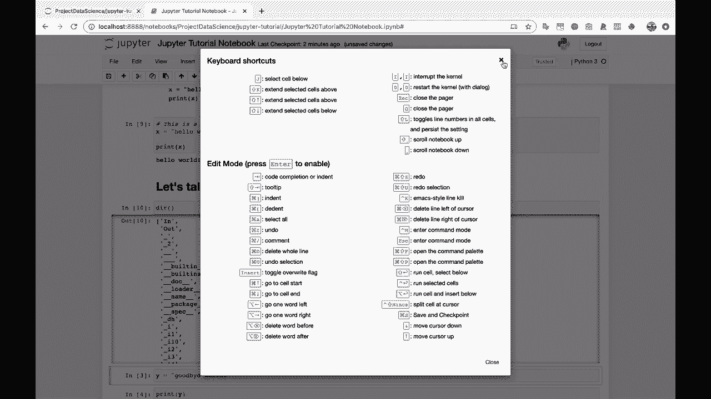

# 【双语字幕+资料下载】Jupyter Notebook 超棒教程！50分钟，把安装、常用功能、隐藏功能和Terminal讲解得清清楚楚。学完新手也能玩转！ - P9：9）Jupyter Notebook键盘快捷键 - ShowMeAI - BV1yv411379J

我现在就给你展示一个我最喜欢的帮助。

迷你项目，也就是键盘快捷键。所以我认为如果你学习了这些，只需要几个，就能让你在使用Jupyter Notebook时更快、更高效。让我看看我能找到哪些。这里我们开始。A 是在上方插入单元，B 是在下方插入单元，X 是剪切选中的单元。运行 shift enter 将会运行一个单元。

你会看到这里的进入是进入编辑模式，这就是我所说的。至于在单元格中输入代码与处于蓝色执行模式之间的区别，在这个模式下你可以使用这些键盘快捷键。所以这里有很多很棒的快捷键，确实值得花些时间去学习。如果你发现自己一直在重复某个操作，学习这个操作的键盘快捷键。

