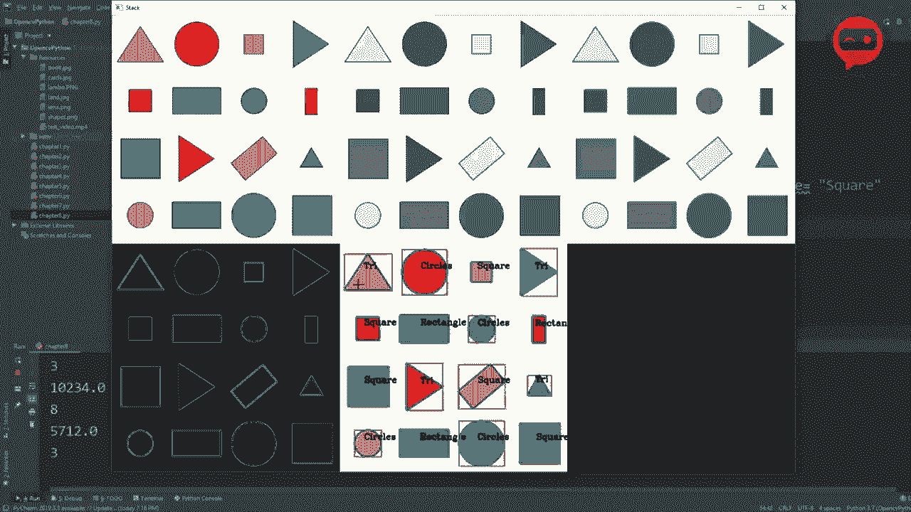

# 【双语字幕+资料下载】OpenCV基础教程，安装、原理、实战，3小时带你搞定这个热门计算机视觉工具库！＜实战教程系列＞ - P1：第0章：opencv介绍 - ShowMeAI - BV1zL411377L

在三个小时内学习OpenCV。🎼大家好，欢迎来到我的频道，在这个视频中，我们将学习开始使用OpenCV所需的一切。我们将使用Python，因为它是最流行的编程语言之一，并为各个行业开辟了众多就业机会。

😊。

我们将从安装过程开始，一直到创建令人兴奋的项目，如检测颜色、形状、人类甚至车牌。

🎼所以如果你是初学者，不用担心，这门课程适合你。我们将跳过所有自愿的内容，专注于实际实施。

因此，你可以在简历中获得你一直想要的计算机视觉技能。🎼到课程结束时，你将熟悉OpenCV的核心原则，并应用不同的技术来解决实际问题。

如果你想了解更多关于这些项目的内容，不要忘记订阅并点击通知铃铛，因为我每周都会上传视频。所以不再多说，让我们开始吧。

🎼在开始之前，让我们看一下课程结构。🎼我们将从图像介绍开始，然后进行必要的安装。🎼接着我们将学习读取图像、视频和网络摄像头。🎼同时还会涉及一些基本的安全功能。🎼之后，我们将学习如何调整大小和裁剪图像。

🎼然后我们将在图像上绘制不同的形状和文本。🎼从那里我们将深入一些更高级的话题，例如文字透视连接图像。颜色检测、轮廓检测，甚至人脸检测。在理解基本原理后，我们将基于这些核心原则创建三个不同的项目。

🎼这些项目将包括虚拟画板、Bapor Scner和车牌检测器。
