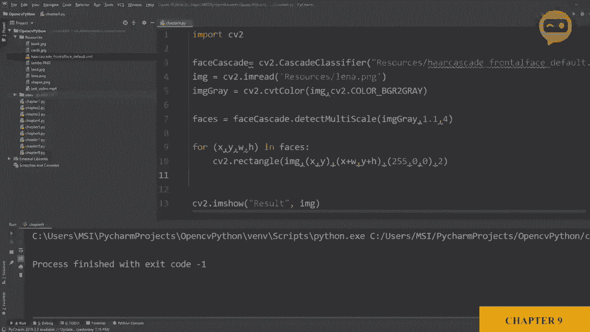
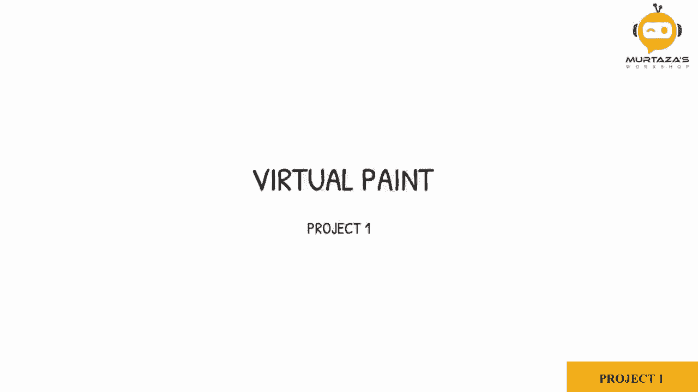
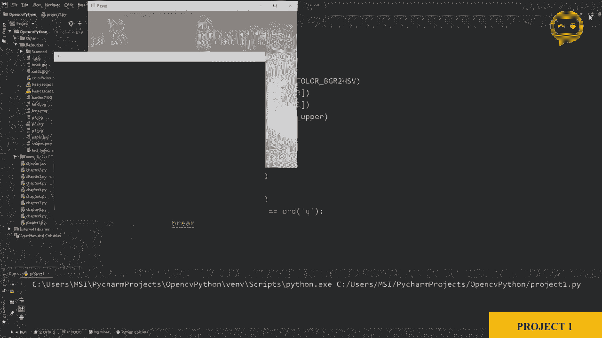
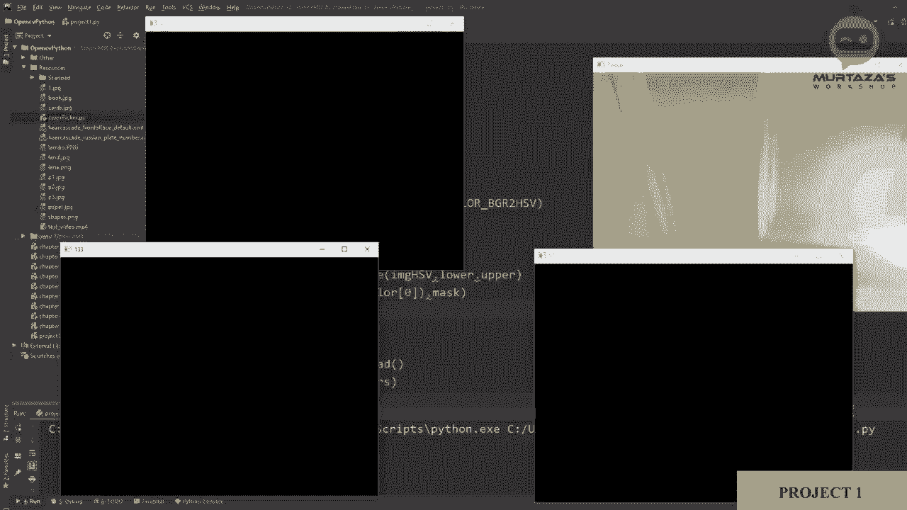
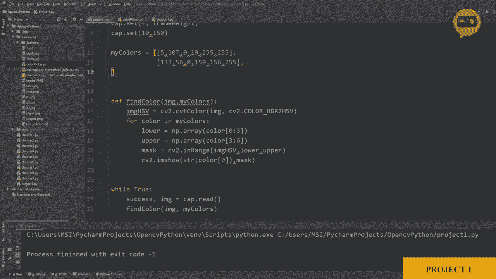
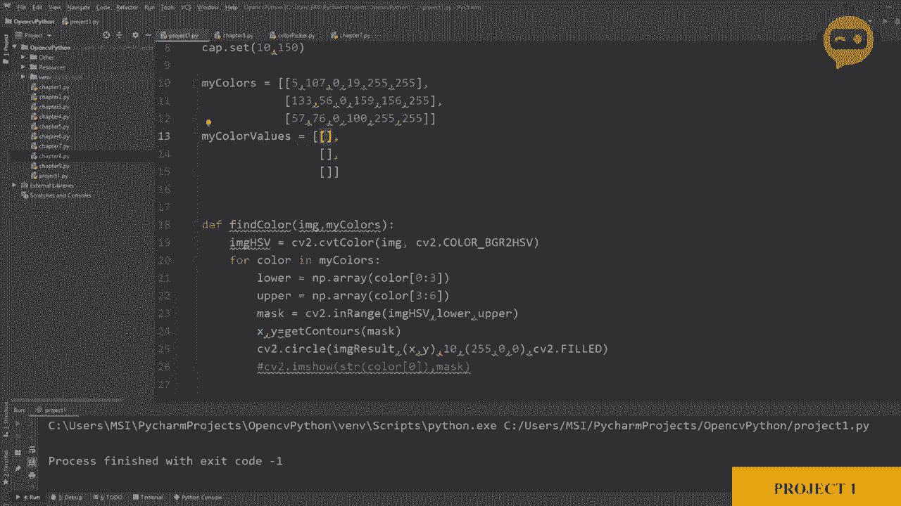

# 【双语字幕+资料下载】OpenCV 基础教程，安装、原理、实战， 3小时带你搞定这个热门计算机视觉工具库！＜实战教程系列＞ - P13：项目1：VR绘画 - ShowMeAI - BV1zL411377L

So for this project， we need to find our colors and we need to find it using a webcam and then we can place different points wherever we find our colors to create。The paint example， so what we need first is the webcam so what we are going to do is we are going to take the code from our different projects and we will merge these together so that we can see how we can efficiently create different projects so we are going to go back to our chapter1。

And here we have the code for our webcam， so we are going to copy this。And we will paste it。In our project。So as we can see we are importing our library。 we are setting the width and height of our frame and these are ID number three and ID number four then we are also setting up the brightness let's make it 150 and then we have our。Now our device is not zero， is' supposed to be one。

And then we are getting into our wide loop where we are getting our image and then we are displaying it using the IM show function and thats pretty much it。So if I run this now， it should。Show me the webcam。 And there you go。 So here we have our webcam。

And let's see if we can see， yeah， so that is clear。So once we have this。 the next step we are going to do is we are going to find our colors， so to find our color。 what we need to do is we need to bring in the code of the color detection so that was in chapter。7 or 6。 it wasn't7。 So here we have the code。 so we don't need the stacking。

We're trying to make it simplified。And so we don't need that。 So what we will do is we will copy the main code of our。Coner detection。 which is basically the lower upper and the mask。 so this is the main thing that we will be needing。And we will also need to convert it into this HSV space。 So the normal image into HSV。

 so let's let's copy that first， so we will copy it here。And here。We are going to。Define。Deefine a function to find our color。 So we will say。Find。Color儿。And then we are going to input an image。At least for now。 we will just keep it an image and then we will take this image and we will convert it into the HSV space。

And from there， we are going to use our upper and lower limits。2。So。Let me remove that。So here we have our upper and lower limits and then。What can we do。 then we can just show that if it's working properly or not， so cv2。 I show。And we can put。 for example， image and we need to show our mask。 So this just for testing， we'll remove it later on。

So we don't want to find just one color。 We want to find different colors。 So whenever we call upon the function find color， we want to find all the different types of colors and whatever is present。 we want to see that as the output。 So what we can do is。At the top here。 we can define something in the form of a list as our color minimum and maximum for the hue。

So what do I mean by that？ So let me write that down。 We will say my colors。Is equals to a list。 Now。 this is a list。 Let me。Common discs， annoying。So my colors is basically a list of colors that we have that we want to detect。 so we need to give it the minimum and the maximum hue and saturation values for that I have written down a code by the name color picker so basically what it does it it helps us pick the right h and saturation values using a webcam so it's pretty much the same code but added with the webcam that we have done in our color chapter。

So here we have our webcam and we have the color orange， so let me find the values for that。 What you need to do is you need to keep the orange。As white。

And the rest you have to remove。 So here you can see。You have to go until。Yeah。 so I would say that is a good point， so if I move it around， it's not so bad。 but my hand color is also being detected， so we need to remove that。😔，LetBring it down a little bit。And there you go， so it's much better now。So this way what we need to do is we need to note down these values。

 so it's 5，107，019255， so what we will do is we will create a list。

Over here and inside that list， we are going to write down these values， so let me write this down。So we have five。So we have five。5，10，7，0，19，2，55 and then 255。 so these are our values。 as you can see here。So we will create a list of these values， different types。Where。OhWhat happened there？Where we will write down all the different types of colors that we want to detect。

 so I have done it for blue， not blue， a purple and green， so we will just copy that。Values here。 So this is one of them。 And then we have。Another one。Over here。So these are our values。 so the first one is orange， then purple and then green。So these are the values that you can find from the color picker。 Once we have done that。

 now we can simply。Create our mask So here。We can see。That's okay， we need to add nupi。So。 import number by。Has N。And the second thing we need to do is we need to。Put down our values。 So we know that this part here is basically the first three values here。And then this part here is the。The other three values， sorry， the other three values over here。

 So what we can do is we can simply write。That。Our。What do you call list of my colors。Basically。 my colors。And we can define， let's say we will pick the first element， which is zero。 and then we will write down that from0。From 0 till3， we need those as the first element so。We can define here that we need my color as the input。And then we can do the same thing here。

And this will be the upper limit， which will be from three to six。So that should give us one of them。 which is the first one， which is。I think orange， so let's run that。This is the previous code we need to run。Project 1。So let's run that。And now we need to call the function as well。So here after this， we are going to call our function。嗯。

My colors。So let's turn that。

And there you go， we are getting the mask and if I bring my orange。Color。 and you can see that it is detected properly。 but that's the thing like we are only detecting orange。 We need to detect all the colors we have in this list。 So for that。 we need to add on a for loop so we can save for。

Let's say color。Color in my colors for each of these colors， we are going to create a mask。So we don't need to write this down， we can just replace this with colors。Color， And then again。Color。So if we want to display this out。We cannot have a genetic name。 we need to put a name that is changing。Let's use。So the first element is different for each one of them。

 so we can put that as a name so we can say string and then color。The first elements。And that should give us three different windows。 So if we run that。

And there you go， So we are getting three different windows。Forget about the naming for now we're just testing it out so if I put the orange color I can see the orange one。 if I put the purple one， I can see purple and then if I put green I can see the third one in green so if I wanted to add more colors I can simply just add it to the list and that should give me。

More colors， for example， if I remove this now。Let me remove that and it will only give me two of the masks。 so it will not show me green anymore。

So this way we have created something genetic that will work for multiple colors so you can keep adding more and more now for each of the masks that we have detected。 let me comment this out。For each of the masks that we have detected。 we need to find where is this object that we have found in our image。 now to find that we need to get our contours and we need to approximate the bounding box around it so we can find our location of the object。

So for that， we need to get into the code of our one of our previous chapters in which we learned how to find contours so if we go back。This is the code for finding conours。So what we will do is we will just get this function as it is。And we don't need to differentiate between different shapes， so we will get it till our bounding box。 we will copy this。And in the project， we will paste it。Here。

So this is our get contours function and now what we need to do is we need to change it a little bit so that we get the relevant information that we need。So。There's not a lot of things that will change。 so let's remove anything。Image contour。Okay。 what we can do is we can create a new image。We can say， let's say， image。Result。Is equals to。Image copy。 So this will be the image that will have all the final information on it。

 So all the drawings and everything will be on this image so we can copy image result and we can replace it here。 So it will draw the contours on this image。And then。What we don't need， Okay。 we can remove the parameters and we don't need the length or the object。And that's that's pretty much it。 So what we can do is now just to see if we are on the right track。

 we just can see that if it's printing properly or not。 So from the find color we are going to send this image of our mask to find the contours so we will send this。We will say get contours and we will send the mask。And because we are calling this function。 it should draw on this image， so let's see if that works。So what happened， Okay， I mean yeah。

 we remove that so it should not display any of the masks， so let's try that out。Orange， green。Purple， so none of them are working great。Let's find out why。So when we are sending the mask。Oh。 okay， because we did not put here image results。So we need to display the image result because that is the one that will have the elements on it。So let's run that there you go， so we have orange， we have green and we have purple， perfect。

So now that we know that we are getting those and we are getting the bounding box around it。All we need to do is we need to send these values。 Now we can send the center point。 but we want to draw from the tip of the pen， not from the center of the object detected。 so we will send the center rather than so we will send the tip rather than the center So what we will do is we will return。

So here we will return。And we are going to return the value of x。Plus， our weight。Divided by two。 so it's in the center。And then we are going to send the value of Y as it is。So this will give us the top point of our tip points and the center of it as well。And in case。If it's not， if it's not greater than 500 or if it's not detected， we still need to return something。

 So for that we need to declare these as zeros so we can say x Y。X， Y， W and height。 just in case if we need it later on， we can put all of them as zeros。So。We can get those。 so it will return this value so we need to get this value over here so that we can use it so we will put it here as x and y。So once we have that value， we can draw a circle around it so we can say Cv2 dot circle。

And we need to draw it on the image results。And our center point will be x and Y。And then we will define the radius， let's say 10， then we have to define the color for now。 let's say25，5，0 and0。And then we are going to write C2 dot filled as we want it to fill。So。If we run that now， let's see what happens。So if I go here， yeah。

 so I'm getting the blue point now I can see。That。I'm getting。你的。Correct point。Now again。 this this is the center of the bounding box， so if I turn it around the bounding box。 it will be the center of the bounding box， not the center of the contours to fix that it's a little bit tricky so we are not going to go into damaged detail。 but for now it should be fine if we keep the pen straight。Now。

 one thing we need to change is the color， so it should not be blue。 It should be the color that we are detecting so。We can remove the contour。We don't need the contours anymore， we know that we are detecting it properly。 but we need to change the colors of these objects so what we need to do is we need to define our color values so for example。

 if this is detected what should be my color on my drawing。So we can say that we can call this my color values。And again。 we have to create it as a list and in that list， we need to define all the colors that we want to display。 so we have three， so we will define three。Now， next here we are going to write our values。

So how can you find these values？So here we can see an example website where you can find the RGB values。 so if I go to orange， so orange right now， if I click on it， you can see it's 2，55，153 and 51。So this is my value of the orange。 So what I can do is I can use these values in my。What do you call code so。

So but again， you have to make sure you are writing in the format of BGR。 so let me write that down here， so it is BGR， not RGB， so we have to write so here we will have 51。 then 153 and then 255。Similarly， we can find for purple and green， so for that for purple。 it is 2550 and 255 and for green we all know it is BGR so it should be 0， 255 and0。

So these are our colors now and what we can do is we can draw the color of the circle based on these values。What happened？What we can say is we can say that we need。My color value as the input， as well。So if we go down。When we are sending the values， we need my color values as well， so we can say。What can we say， Okay， we need a counter to actually count how many times so we'll put the count is equals to0。

And every time it counts， we need to know which color are we talking about。 so we can say here counts。Plus， equals one。So instead of our main blue color here。 we can say my color values。And I need to get the value of my counter index。 So my count right now。 whatever my count is， I need to get that value from。This what you call list。

 So if it's count is equals to 0， it will get this value。 count is 1， it will get this value。So I can write here。呃。Count。So this should give us the correct color of our。What do you call marker。 So let's run that。So if I have purple， it's giving me the color purple， if I have orange。 it's giving me orange， it's a little bit hard to see。

 but you get the gesture and then you have green so we are getting green。So that is good we are getting the correct colors and the correct values now what we need to do is we need to draw these points so in order to draw it's actually fairly simple we are going to create a list of points and we are just going to display it every time and we are going to loop it around。

So at the bottom， let's go at the top first and we are going to create a list called My pointss。And inside this list， we are going to have three things， we are going to have the value of x。 we are going to have the value of y， and we are going to have the value of the color or not the color itself。 let's put the index of the color。So we can say if it's  zero， it will be this color， if it's one。

 it will be this color and so on。 So instead of the real thing， we can put this。 So let me copy that。And let me put it as a comment here。So。So what we can say is we can loop this my point and every time we can check the value of x Y and we can draw the circle of this color at this point。

 so it's fairly simple。So in order to do that， what we can do is we can create a new function。Called drawaw on Can。So， we can name it。Draw。On canvas。And then what do we need， we need。I， yeah。 we need the points。And we will also need the color values。Colored values。So what we will do is we will say that for each point。In。My points。

What we need to do is we need to iterate and we need to just draw a circle。 Let me just copy it from up。Here。You copy it。The circle。 and we can put it here that what we need to do is we need to。Draw on I am result， our image result。 and we need to use the color of our count。 So this time around。The values are inside the point。

 so we will say that point。At 0 is our x points at。One is our y and。Our I D is point at number 2。So this will give us the point at。This color of this color。 Now。 what we need to do is whenever we are finding the colors。We need to send to draw。Okay。 so what we can say is that we can say that our new points。

Point is equals to whatever we are getting from our colors。And then we need to draw them。So in order to draw them or should we do that first let's go up and let's return something over here。 So once we are finding the color we need to return our new points。 but we need to make sure that these points are not like they are detected properly these are not00 so if it's 00。

If the x and y， if the value that we are returning is 00， then we don't need to do anything。 we don't need to plot it。It will just add on the memory。 So what we can say is that before the count。We can see that if x is not equals to0。And if why。Is not equals to 0。Then only we are going to append our point。 So we will say new points。Dot append。

And we are going to say that we are going to write down the X。 Y and the count because that is our ID， and we need to define the new point every time。So every time the new points will change， so it will start with an empty empty list and then it will append and it will return these values。 So here we need to write return。Not in the loop， we need to write here return。

 and then we are going to return our points。So every time it。Adds on to these points。 it will send these new points over here Now once we have our new points。 what we can do is we can check if the new points are actually there or not。 so we will say that if the length of our new points。

Is not equals to 0 that we are getting something。Then oh what is that？Eals to 0。Then we need toerate through our points， so for new points。诶嗯。New points。We are going to append my points。 My points， thoughts append。And we are going to append our new point。So why why are we putting a full loop here because we are getting it as a list so we cannot put a list inside a list and then run our code of draw on canvas because it doesn't work that way we need all the points not a list inside a list so this is a list we need to break it down to points again so that's why we are putting a loop here so for new point in in our new points we are going to append each one of them in our points。

And at the end， we all we need to do is we need to draw these points if they are available so we can say that if the length of my points。Is not equals to 0。Then we need to draw them， so draw。Draw on canvas and my points and use my color can value。So this should draw all our colors in the right values， let's see。

So here we have our purple and there you go， so you can see it's drawing purple。Then we have orange。 it's drawing orange。And then we have our green， so it's drawing green。So there you go So this is very simple and it is a very kind of a generic code so that you can add onto it it's not hardcoded that this color equals this this color equals this we are not creating a lot of masks hard coded and putting them together So if you wanted to add a new color it's very simple all you need to do is you need to go and add to my colors and my color value So for example if I wanted to do blue。

I have checked out the values for blue and again you can use the color picker code to find the values。 you can add that and we know already that our blue is basically BGR so it will be 2550 and0 so this will add the blue color and if we run it now and let me try the blue here。

And there you go。 So now it's detecting blue as well。 So this is how simple it is to add more colors。 So the good thing about this is that it will detect all the colors at the same time as well。So if we look here。We have these four colors and we can detect them at the same time。 you can see that looks nice。

