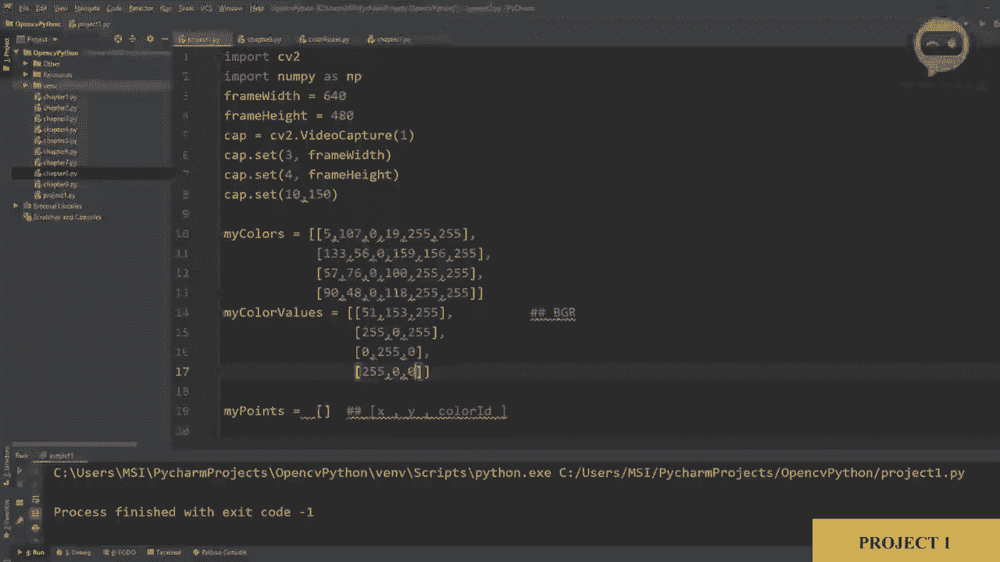
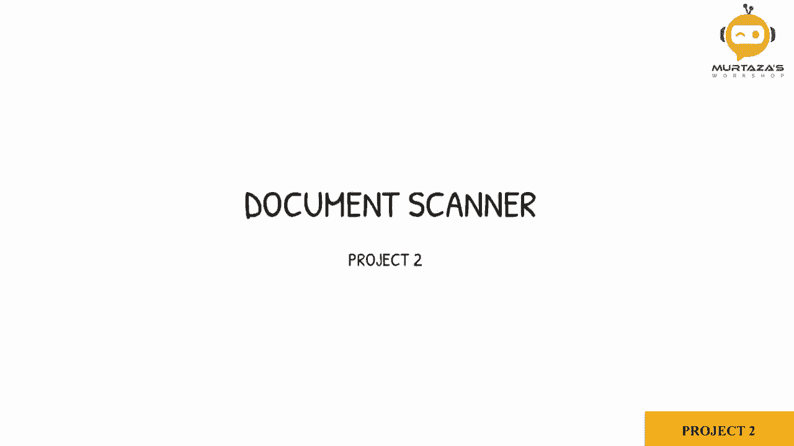
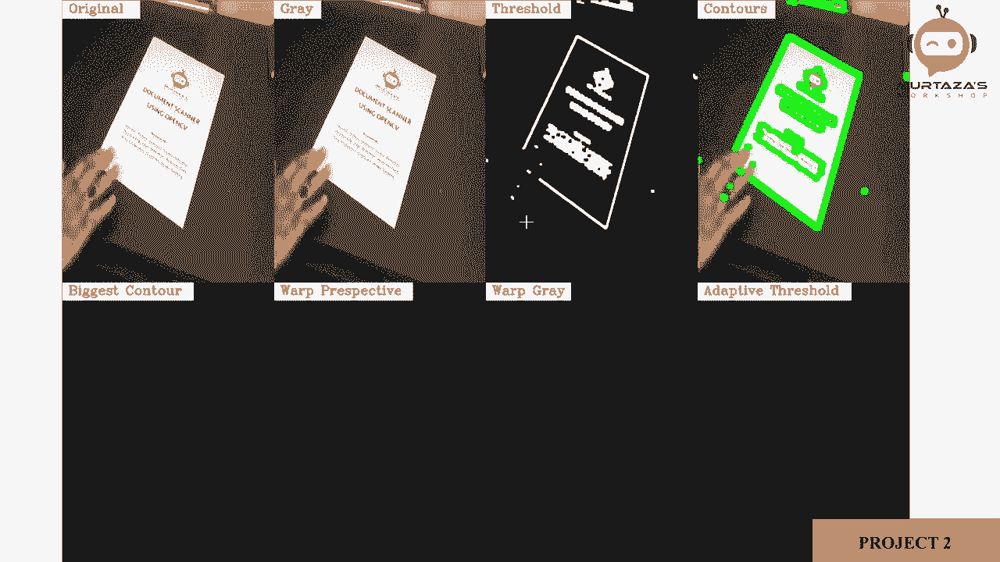
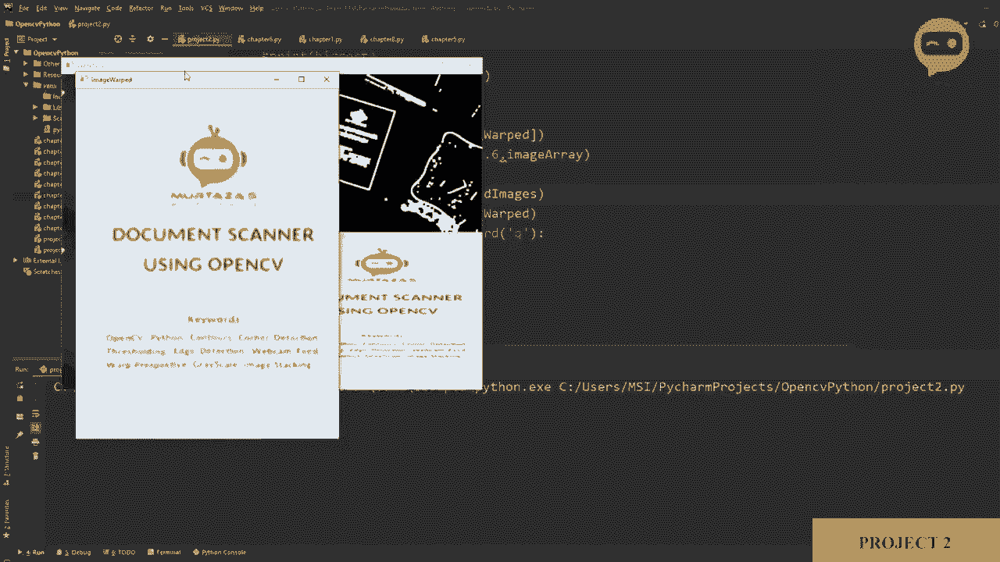
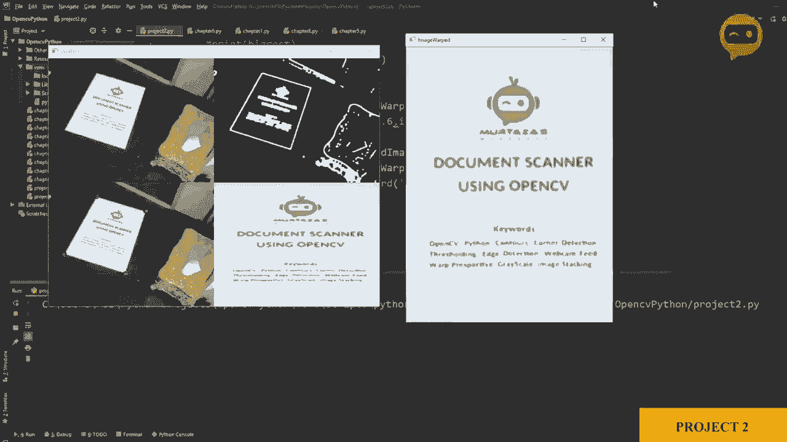
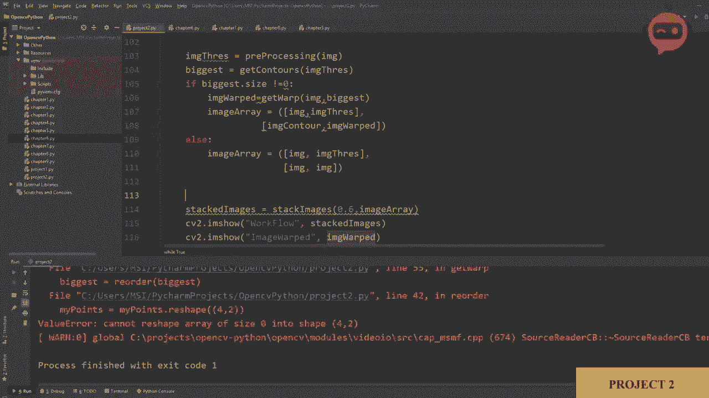
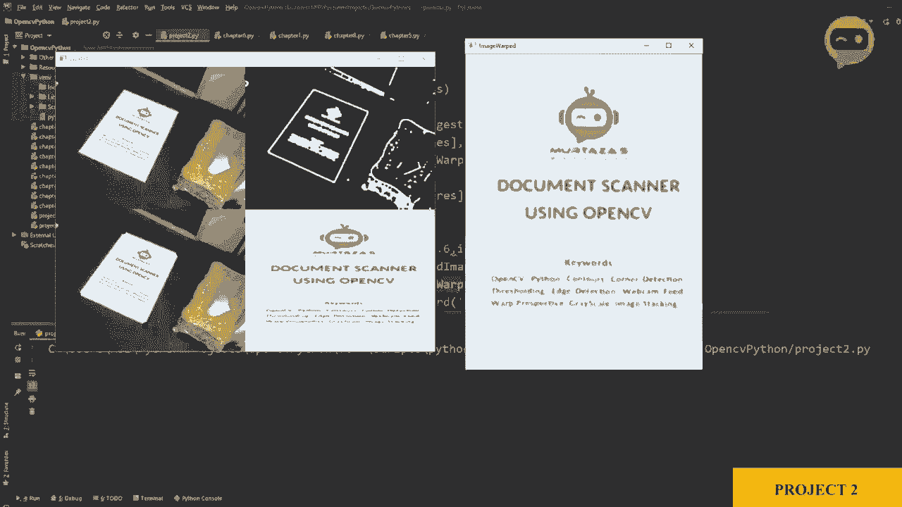

# 【双语字幕+资料下载】OpenCV 基础教程，安装、原理、实战，3小时带你搞定这个热门计算机视觉工具库！＜实战教程系列＞ - P14：项目2：文档扫描器 - ShowMeAI - BV1zL411377L

在这个项目中，我们将从摄像头代码开始。我们在第一章中做过，所以让我去复制这个。然后我们更改参数。我们将设置为 1，这将是 50。所以，让我们运行它。这里是我们的摄像头。我们将检测这个文档，然后使用透视变换获取文档的平面图像。

我们将进行扫描。现在。让我们继续。所以我们要做的第一件事是。我们将对图像进行预处理，所以我们将应用一些所谓的预处理技术，以便可以正确检测图像中的边缘。所以让我们定义一个函数。3e。处理。这里我们将输入一张图像。所以我们会说图像，然后我们将首先转换这张图像。

我们将调整大小，所以图像。等于 C2 点调整大小。或者我们在这里调整大小。这样大小保持不变。对于持有者过程，所以调整大小。我们将调整我们原始图像的大小。根据我们的宽度和高度，所以图像的宽度和高度。所以这个，我们可以在顶部声明。嗯。就是这样。

在这里创建一个新部分。说明。2，6，40。这个是48。所以我们去掉它。这。完成后。好的，所以我们要做的第一件事是将其转换为灰度图像。所以我们会说图像灰度等于。CV2 点，CT 颜色，然后是我们的源，即我们的主图像。然后我们想将其转换为灰度图像。所以 C2 点。颜色，P G，R 转灰度。

接下来我们将应用一些模糊，所以图像模糊等于 cv2。模糊。我们有我们的图像查询以模糊，然后我们将应用，我们将给出内核的大小为 5 x 5，然后 sigma x。我们说 1。然后，我们将使用我们的 Canny 边缘检测器查找边缘。所以我们会说图像 Canny。等于。CV2 点。Gny。我们的图像是模糊的。

然后我们有阈值。所以我们设置。假设 200 x 200，所以这些值我们可以在过程中更改。但现在我们将保持一些随机值，看看效果如何。一旦我们完成，有时边缘会很细。所以我们可以使用膨胀函数使其更粗，然后可以使用侵蚀函数再稍微变细。

我们可以应用两次膨胀和一次我们称之为侵蚀的处理。现在。这不是强制性的，但有帮助，所以最好这样做。膨胀等于 C2 点膨胀。是的，然后我们将使用我们的图像 Canny。我们将定义一个内核。然后，迭代次数。D。Rations 等于 2。所以。某处有个错误。好的，所以内核。

等于，我们将定义一个矩阵数组。在AtOnce，因此我们需要在这里定义。Numpy有N P。在这里，我们将说我们的卷积核是numpy的once。大小是5乘5。然后我们将进行腐蚀。因此图像。腐蚀。等于C2。实际上，这是最终结果。因此我们称之为阈值图像。阈值。等于C2.ero。

然后我们将输入我们的图像膨胀。接下来我们将定义我们的卷积核，迭代次数设为1。因此，一旦处理完成，我们可以返回我们的图像。它变成了。图像。阈值。所以我们可以在这里看到。嗯。图像阈值等于。我们主图像的重新处理。因此我们可以显示图像。好了，我们得到了。如果我们想查看这些步骤中的每一个输出。

我们可以简单地。你可以说注释掉，然后返回我们想要看到的轮廓。例如，如果我们想移除这两个，我们可以注释掉，然后返回canny。看看这个。这里你可以看到我们的边缘相当1。有时，当出现阴影或反射时，可能无法正确检测。

所以我们添加这个。这里也是。因此我们需要返回。这个阈值。好了，边界变得更厚，更容易检测图像中发生的事情。接下来，我们将继续处理我们的轮廓。我们需要在图像中找到最大的轮廓。这就是我们现在要做的事情。在第8章中，对于轮廓，我们使用函数获取轮廓。

所以我们将复制这个。直到我们的边界框。然后我们会做一些修改。现在我们会粘贴出来，得到了获取轮廓的函数。我们需要做的是找到可用的最大轮廓。首先，我们在这里获取轮廓，然后对每个轮廓进行循环。因此我们可以说，首先我们需要给出面积的阈值。

我觉得最好再加一个零，因为我们的面积会相当大。我们可以移除打印并进行绘制，我们可以在这里复制一个图像。因此我们可以说。图像，假设。轮廓。写一下。轮廓等于。图像.复制。实际上，我们应该在调整大小之后进行此操作，因为所有这些都应该是相同的。

所以我们往下走，然后写tear。然后在这里粘贴。这里我们将粘贴我们的图像轮廓。实际上，让我们使用这个拼写。这样更好。如何控制。然后。我们可以展示发生了什么。所以我们将移除这个参数，我们不需要查看长度。我们需要查看长度吗？是的，我们确实需要查看长度，应该是4。然后。

我们需要边界框吗？是的，好的，那么我们要做的是，首先获取我们的面积。然后检查是否大于5000，如果可以的话。然后我们将进入下一步，在我们的图像上绘制它，或者我们需要绘制吗？我们稍后会看是否需要移除。现在我们将获取我们的参数。

然后我们将找到我们的角点的近似。然后我们必须说。 如果我们的。区域。不是，抱歉。如果我们的。长度。我们的。近似等于4。在这种情况下。我们将说最大的。等于一个 pro。但在循环时。我们需要找到最大的。所以我们必须在这里添加另一个条件。

我们将说如果我们的区域。大于。最大区域。那我们就在这里结束。所以。我们将在这里放手。然后在这里我们会看到最大区域。等于我们当前的区域。那么这将不断循环，每当它找到一个比之前更大的值时。它会替换当前的值。所以这将给我们最大的。

区域和我们近似的最大值，将是我们的四个点。所以我们需要这个吗？不需要，因此我们可以用边界框去掉它。然后我们需要做的就是返回我们的。近似，所以我们将返回。近似。哦，抱歉。我们将返回最大的那个。最大。所以这将给我们最大的轮廓。好的。

所以让我们运行一下，看看会发生什么。现在我们需要在这里调用它。我们将说。获取轮廓，我们将发送图像阈值。好的。那么我们忘记做的一件事是定义。最初，我们的变量。所以第一个是一个列表。所以最大的。将是一个新的列表，一个新的数组，nuy。数组。还有。第二个是最大区域。

所以我们将说最大。区域等于20。因此如果我们再运行一次。看吧。现在我们正在获取我们的轮廓，并希望它返回给我们最大的那个。就是这个蓝色的。所以一旦我们有了最大的轮廓。接下来我们需要做的是使用它的角点。

我们需要扭曲我们的图像，获得鸟瞰图。因此，为了做到这一点，我们将。首先，在这里获取我们的近似，所以我们可以说我们的最大值等于获取轮廓图像阈值。然后在那之后，我们需要做的就是。我们需要发送它进行透视变换。因此我们将写一个新函数。所以，我们将说。获取。它成功了。并在内部。

我们将发送我们的图像。我们将发送我们需要发送的内容。我们需要发送我们最大的。轮廓点。因此，在这里。我们可以调用这个函数获取我们原始图像的透视变换，我们需要基于最大的点。因此，实际上，我们没有打印出来。让我们看看是否正确获取了它。让我们只打印一下。

一旦我们得到了最大的那个，让我们把它打印出来。看吧。我们得到了四个点。所以一个。2，三，和四。所以我们正确地得到了它们。因此，无论它们是否正确，我们会进一步查看。或者。嗯。我们现在可以打印出来吗？我们应该现在打印出来吗？是的，实际上，我们可以。

我们可以做的是，不打印它们所有。我们可以。复制这个。然后我们可以。注释掉这个。最后我们可以做的就是在发送之前打印出最大的一个，所以我们可以在这里说最大的。就这样，如果我们看看。让我增大一下那个尺寸。让我们设为 20。就这样。所以我们得到了最大轮廓的正确点，下一部分将是 verp。

所以现在我们要工作。那个函数在哪里，好的。在 workp 中，我们将遵循之前在扭曲章节中的例子，所以这里我们需要两个点，然后我们创建一个矩阵，然后得到我们的工作透视，所以我们会复制所有这些。然后带入我们的当前项目。所以我们需要找出这些 points1 和这些 points2。

然后我们创建矩阵。基于此，我们得到了宽度和高度。因此，这个宽度和高度基本上是我们图像的宽度和高度。所以我们会说。宽度图像和。高度图像，再次，宽度图像。和高度图像。然后。什么图像。然后。高损坏。好的，我们可以去掉基础。好的，下一步是将我们的点放在这里。

所以我们得到了最大的轮廓。我们需要做的就是输入。最大的轮廓在这里，所以已经有四个点。这样我们就可以轻松地直接放在这里。接下来是在这里找到。所以我们需要做的是看看我们的图像，这里有一个棘手的部分。

我会解释这是什么，但让我们先看看我们的输出图像，这里可以说返回。我们的图像。输出。这里。我们可以调用这个函数。我们可以说 get workb。然后我们可以保存。我们的。Pp。图像工作。没。Worb 等于那个。让我们展示一下。所以这样。现在我们知道我们的点被正确检测到了，但如你所见。

扭曲是不正确的。如果我移动它，它甚至会给我们一个错误。因此，扭曲错误的原因是我们有一个注释，有一个结构我们的点应该位于的位置。所以在我们最大轮廓中的第一个点应该是00，然后宽度0然后0高度，然后宽度和高度。如果在最大轮廓中我们的宽度和高度在第一个，00 在第二个，或者它们混合在一起，那么这意味着我们的词透视将无法正常工作。

所以我们需要确保的是，当我们将点发送到 verp 时，所有的点都要像这样对齐，最小的点应该是第一个，然后是宽度和高度，接着是宽度和高度，所以我们怎么能确保这一点，因为我们的值可能会变化。

这可以不断变化。所以我想说的是，这些值可以根据纸张的角度和轮廓而变化。所以我们必须做的是在发送之前整理这些值。这些最大点。在重新排序它们之前，我们需要创建一个新函数。我们会说，重新排序。在里面，我们需要我们的点。

所以我的要点是。我们需要一些内部点，然后我们将应用一些方法论来创建或重新排序我们的点。例如，如果我们有，让我简单一点，如果你想要这个。等一下。嗯。我们将这些值相加，接下来可以找到最小和最大的点。因此，例如，如果我们加上00，再加上宽度和高度，宽度和0。

0和高度，宽度和高度，最小的点将是00，最大的点将是宽度和高度。这意味着无论我们在这里给出什么点，如果我们将它们全部相加，最小的一个将是我们的00，最大的一个将是我们的宽度和高度，这样我们就能快速区分哪个是最大的，哪个是最小的，哪个是原点，哪个是我们矩形的对角点或最后一个点。

然后为了找到宽度和高度，我们可以相减，其中一个会给我们一个正值，而另一个会给我们一个负值，基于此我们可以判断哪个先来，哪个后来。所以我们需要做的是。首先让我在继续之前给你展示一些东西。嗯。在这里。

所以如果我们看一下我们的数组或矩阵的形状。最大的。让我们看看。它是4乘1乘2。所以我们有四个不同的点，我们理解，并且对于每个点，我们也理解X和Y。但是那个是多余的，所以我们将把它去掉。

所以当我们准备重新排序时，首先我们会说我的点。等于我的点。点reshape。我们希望将其重塑为4乘2。然后我们将创建一个新的矩阵，我们将把它发送到外部，并从这个函数返回。这矩阵应该与我们在这里收到的相同，即4乘1乘2。好的。

所以我们将写我的点。nuon等于nuier点zeros。Zeros。然后我们可以说。4乘1乘2。然后我们可以写它的类型，所以nuy点。Integer 32。我们要做的第一件事是我们将添加。正如我们所讨论的，我们将添加所有这些值。所以内部，我们有四个点。让我打印出来。这样更容易看到。我们将打印最大值。

所以我们要做的第一步是将它们逐一相加。所以1，85加55。然后61加279，依此类推。为了做到这一点，我们有一个简单的函数。我们可以说加法等于我的点。点和。我们将使用A 1。所以这将给我们。让我们打印出来，我们可以说。我们的加法。是。我们没有发送它进行重新排序。

所以这就是它不显示的原因。那么我们可以做什么呢？我们可以。在这里写。或者这应该在verp内部。因此，我们可以在这里写。重新排序。我们可以发送最大的点。所以如果我们停止它，我们可以看到这里，183加55是238，然后61加279是340，依此类推，我们得到了。我们的值。因此，这里最小的一个是我们的第一个。所以我们将说这是我们的00。

而这里最大的值是651。我们将说这是我们的宽和高。所以这个位于正确的位置。它应该在00。但这个位于错误的位置。这个应该是最后一个。所以我们将在新的点中重新排列顺序。因此，我们将在这里说我的点。新的。在数字0，也就是第一个。

等于我的点。我们将获取索引。因此我们首先要找到最小的。我们会说nuy点。A RG最小值。我们将说找到最小的。这个列表或这个矩阵中最小的索引。所以在这里我们将找到最小值，并获取其索引。

一旦我们有了索引，我们将在这里放置它。从中我们得到值。实际的x和y，然后将其存储在我们的新点中。我们对最大的点做同样的事情，它将是最后一个作为0，1，2，3。这次我们将写作max。因此，如果我们运行它。让我把它打印出来。Brent。

新的点。我们可以写。前にポ。所以如果我们打印出来。我们可以看到现在新的点最小的在第一个位置，最大的在最后一个位置。所以现在我们需要找到中间的点。因此，接下来，我们将。我们可以删除，或者让我们现在保留它们。接下来，我们将找到它们之间的差值。

所以我们可以说，差值等于nuy点。差异，我们将使用我的点。再次，我们将把我们的轴定义为一。实际上，让我写下来。你可以这样定义x为一。因此，基于此，我们将说我的点。新的点在数字一。等于这应该是我们的宽度和0。所以这个将是我的点。

在Nai点。我们微分的最小参数。同样的方式。让我在这里写。第二个将是我们参数的最大值。所以让我们运行它。好的。让我把这个打印出来。但在底部。好的，如果我们运行它。然后停止它。所以现在你可以看到我们的点被重新排列了，所以我们得到了宽度。

然后0，0，和高度为0，我是指这是一个较低的值。所以，这里我们的点被重新排列。你可以看到我们的原始点是这样的。然后我们的排列点是这样的。所以现在我们有了新点，可以将它们发送回去。那我应该删除吗？好的，让我把它放成注释。所以如果你想检查，可以去检查。

然后我们可以写return。我的点，新。所以这将给我们最大的点重新排列。所以我们会说最大等于reorder。最大。所以如果我们现在运行这个，希望它能正常显示。看，这样我们的图像显示正常。我们获得了我们的单词视角。图像已经生效。现在。

问题是宽度太大了。我们需要缩小它。让我们设为360。好吧，摄像头不能，所以640，我的摄像头有这个问题，所以必须是640乘40。我们可以这样做。😔，所以。为什么它还在，好的，好的，好的。所以这应该是相反的。所以这个应该是640，而这个应该是360。让我们设为480。いや、間違まる。

所以这就是我们得到的。现在的问题是我们的原始图像是640乘480。所以不要期待这里有很多分辨率，但我在资源文件夹中放了一张图像。所以如果你查看资源文件夹，我们有一张纸质图像，这张图像分辨率非常高。是4000乘3000。

所以如果你在这个上应用相同的方法，最后会给你一个非常好的扫描图像。但是因为我们是从实时摄像头获取的，只有640乘480，所以分辨率并不好。但如果你能提高值，就会得到更高的分辨率。所以现在这样就好，但有一点我们可以看到，verp很好，但最后我们可以看到一些线条。

而且我们不想要那个。我们可以做的是在边缘周围稍微裁剪一下，以便获得更好的结果。所以我们可以在变形后减少一些像素，所以让我们把它放在verp中。

所以在这里我们可以说我们的。假设是图像输出。还是应该给它起个不同的名字？我们就给它起个不同的名字吧。图像。嗯。Croed等于。我们将裁剪我们的图像。或者我们将说我们的原始图像是IMG output。然后我们将从每一侧去掉20个像素，所以我们会说20。然后，图像输出。

点shape。添加零，然后我们将从这里减去20，就像这样。然后我们再说20。然后我们会说我们的图像输出。点shape，也就是在1-20。这是我们在裁剪示例中做过的相同概念。所以如果你不记得，可以再查看那一章。

一旦我们完成了这一点，我们需要调整图像大小，以便它与之前的大小相同。因为这样处理会更方便。所以，Cbed等于C2点resize，然后是我们的图像裁剪。然后是我们图像的宽度和高度。然后我们可以输出裁剪后的图像。所以，如果我们了解这一点。

现在我们得到了一幅更干净的图像，我们从每一侧移除了20个像素，现在它看起来更像是一张扫描的纸。好的，接下来，我们可以看看你所称之的工作流。我们可以添加我们的连接代码，这就是我们的叠加。如果我们想这么做，我们可以回去。我们可以去第六章。这里有叠加的函数。我们可以复制这个。

我们可以把它粘贴到当前项目中。然后把所有这些图像放在一起。那么我们应该把哪些图像放在一起呢？这只是一个形式，看看发生了什么。所以，还有另一个案例我现在会讨论，你会看到这也很重要。我们先把图像叠放起来，所以我们会说我们的图像。

数组等于我们要声明一个数组。所以在这里我们将放置我们的原始图像。然后我们可以放置我们的图像轮廓。然后我们可以放置。图像。最大的。在哪里那张图像阈值。所以让我们放下它，这样我们可以把它放在这里。图像阈值。然后，我们可以放置。图像工作。所以这应该给我们一个好主意。然后我们只需说。叠加图像。

所以我们会看到它叠加的图像等于叠加图像。我们将定义一个缩放比例。假设为0.6。然后我们将定义我们的图像数组。哦，抱歉，图像。然后在这里我们将复制这个并粘贴。粘贴。所以现在我们可以看到工作流。我们有我们的文档，然后我们获取我们所称的最大的轮廓，然后实际上这应该在这里。

这个应该放在这里，反过来。所以。它在哪里。所以我想这样更好。是的。所以这样更好。所以再次，现在我们正在重新缩放它。因为这个。它看起来有点奇怪。但如果我们单独打印出来，它应该没问题。每个工作是什么？

所以，在这里我们得到了我们的。最终结果。现在你会注意到的一件事是，如果我删除文档。它应该给我们一个错误。

来吧。现在，这个错误是因为我们没有定义任何东西，当它没有定义最大的时。它找不到最大的轮廓。所以我们需要在这里写下这个。所以我们会说我们要找到最大的轮廓。让我看看我们想把它放在上面还是这里。好的。是的，我们正在发送。最大的。

我觉得把它放在这里更好。所以我们可以说，如果我们的最大值不等于0或者它不为空，那么我们需要继续前进，所以我们可以说。如果最大值。点，抱歉，点的大小。不等于0。那么我们将进行这项图像工作，否则。这个也应该在里面。而且这个可以在外面。否则，我们将仍然显示图像，但我们将。

不显示轮廓，因为我们没有找到它们，我们将不显示工作。我们只会。用原始图像替换它。所以让我们看看这是否有效。

所以如果我移除那个，是的，当我移除它时，它什么都不显示，然后当我把它带回来时，现在它给我显示的是实时图像。
