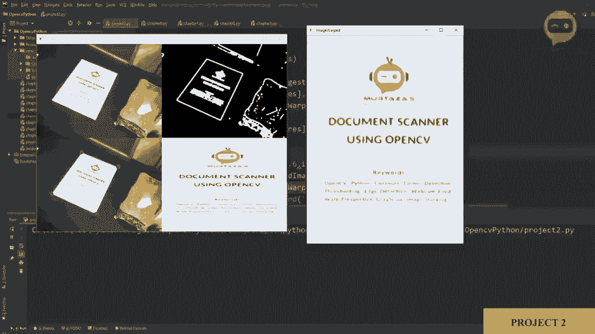
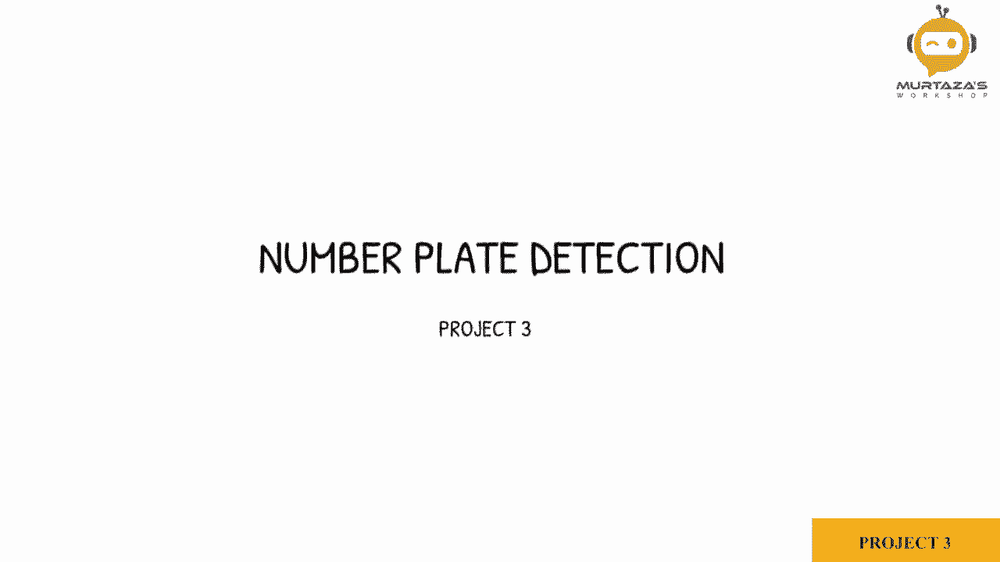
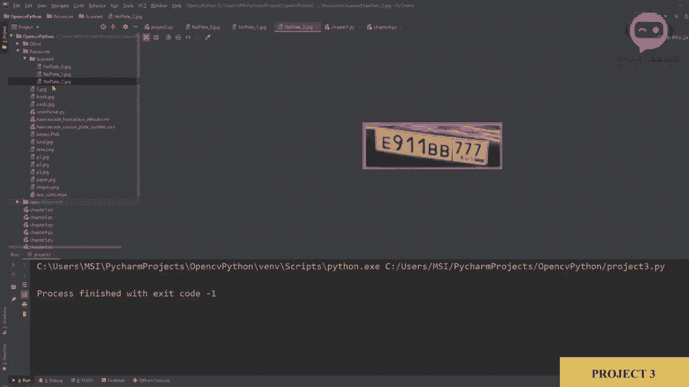

# 【双语字幕+资料下载】OpenCV 基础教程，安装、原理、实战， 3小时带你搞定这个热门计算机视觉工具库！＜实战教程系列＞ - P15：项目3：车牌检测 - ShowMeAI - BV1zL411377L

So in this project we are going to start off with our webcam and then we will detect number plates from different cars and we are going to do this in real time and we will be using the cascade method that we have learned before in our。Fse detection chapter and so let's start with our chapter number one where we started off。

With the webcam， so we will copy that code。And again， we will change this to one。So let's run that and see if it works properly。So here I have my webcam and it is connected and we can see we have a few images of our car and we have these three images and we are going to detect their number plates。

So once we have done that， we will go into chapter 9 where we did our。Cascade method。 and we are going to copy this。啊。We will paste it。In project3。So here to get the cascade。 we do not need to define it again and again， even though we have to get the image。 the image we're getting。From the webcam， we can remove that This， we have to bring it up。

In our parameters。 so here we can define our parameters。And then。We are converting our image to gray that is fine。And then we are detecting the。The faces。 So in this case， we can say that number。Plates。And we can copy this and paste it here。So instead of the face cascade， we should say。Plate cascadet， for example。Or number plates。Goashk。

So here we can say that。And。Do that again。Okay， and it's drawing the rectangle around it。 Now。 what we need to do is once we detect our。Object， we need to first create a filters。 so we are only taking objects that are bigger than a certain area。And then we need to define a way in which we can save our images once we are getting our number plate。

So let's do that。 So the first thing， we will add our filter。 So in order to do that。 we need to find our area。 So area is equals to width into height。And then we need to define our minimum area so we can say that if our area。Is greater than。 for example，500。So this is our minimum area， so we will say minimum area。And we will define it here。

Minimum area is equal to 500。 if it's greater than 500。 then we are going to detect it as our rectangle。And the next thing we will do is we will label it。So we will say C2。Dot put text。And we want to put it on our origin image。And then we are going to put a name， so we can say。Number， number plate。And then we have our x and Y。

So we can write X and y we want to place it a little bit higher， so we will sub， let's say five。And then we will write our font。So， C2 dots。Font， we can select any， let's。Select the complex small。 and then we'll put one。As our scale， and then we will put a color。So we can define color。 and then we will put the thickness as。2。So the color we can go up。And defined here as。2，5，5，0， and。

2，5，5。Yeah， and then what we can do is we can extract our region of interest， our number plate。 so once we have our rectangle x Y width and height。 we can use this information to get our original our number plate image so we can say that our image。Of our region of interest is image， our original image cropped。

 So as you know we are using crop So the first element will be our height。 so we are saying why。て。Y plus。H。The total height。And then we will say our width。Teill our， sorry， not to with x。Tell our x plus word。So this should give us the region of our number plate。So we need to place this here whenever the object is detected， whenever the number plate is detected。

 then only we are going to display our image。And the last thing we have to do is to change our cascadet。 which over here is the frontal face。In the resources， we have the Russian plate number。 so we are going to use that。So， we will change this to。Russian。Underscore plates， underscore。Number。So。Let's run that。So there we go， we are getting our number plate on the original image。

 and then we are extracting our ROi， as you can see here。It's a little bit small。 it is harder to grab。But you can see， we are getting our。Image correctly。 but the color here is blue， why is that blue？Yeah， we need to change it to 255， it's the same。So there you go so this is what we are getting and next what we can do is we can save this image in our scanned folder。

 so in the resources I've created a scanned folder。 so what we will do is we will write a code that will save this number plate and it will also give us feedback that we have saved it。So。To do that， we will write C2。So let's first change this from Q to S。 So whenever the S key is pressed， so we will write Cv2， Cv2 dot weight。CV2。 I am right。

And we will write the file name， so we will say resources and then scanned。And inside that。 we are going to write number。Plate underscore。And then we are going to add a string to it。And in that string， we are going to put account。So that we can save multiple images at the same time with different names。 so we can say dot JPG。And then we will say that our image of Ri。 Now， this count is not defined。

 so we have to define the count。 So each time we press this， we have to add to our counter。 so we will not break。 We will say count。Is plus equals one。And。We need to define the count in the beginning。Count is equals to 0。So that will save it。 but what we need is a little bit of feedback that we are actually saving it properly。

What we can do is we can create a rectangle and。Then we can display that with text on it so that we know。It has been saved， so we can write cv2 dot rectangle and then we will write our image。Here we will put it at0200， and then the final point will be 640 by， let's say 300。And then we will put a color0。2，5，5。0。And then Cv2 dot filled。

And then we are going to put some text on it， CV2。Thought， put text。And we will put our image and we are going to say scanned。Let's say scan， saved。And then we will put the initial values so we'll put 150 and 265。And then we will give it the font C2 dot font。Let's。Pick a random one。And then。Lets let's put down。

 let's put the font scale as two。Then we will put our color。0。0 and 2，5，5。 And then we will put our thickness as2。Lastly， we are going to show our image。 so I am show。And then we are going to write the same name results。And we are going to show the same image。And in order to see it properly， we will add a delay c2。

t weight key and we will put 500 milliseconds。So if I run this now。😔，And there you go。 So if I press S， it will say scan saved。And then if I go to the next image， I can。Save again。 I can go to the next image and I can save so all three of these number plates should have been saved if we go to our scan folder here。 we can double click it and we can see we have three images， this is the first one。

 this is the second one， and this is the third one。

