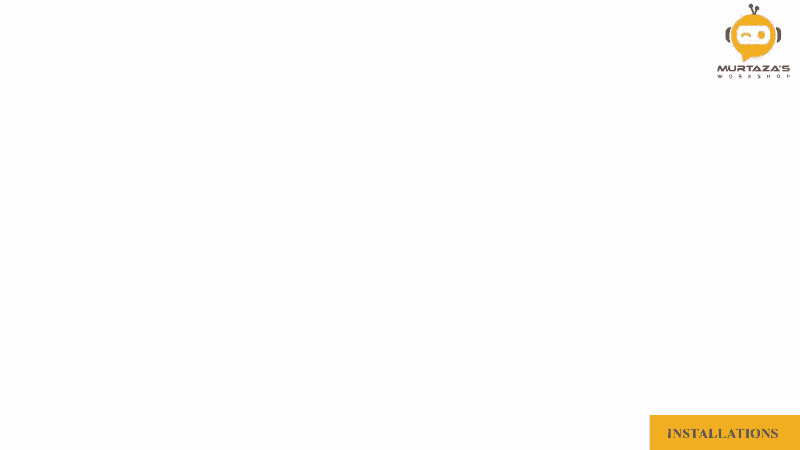
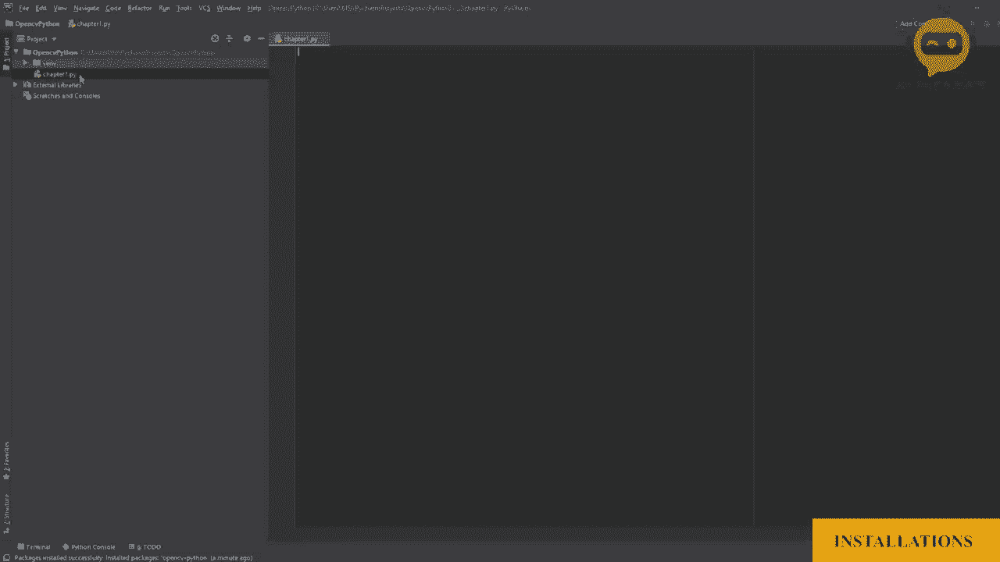

# 【双语字幕+资料下载】OpenCV 基础教程，安装、原理、实战， 3小时带你搞定这个热门计算机视觉工具库！＜实战教程系列＞ - P3：第0章：安装 - ShowMeAI - BV1zL411377L

So let's start with the installations。 First， we will go to Python。 or Rg。

 and we will go to the downloads section。Here we are not going to download the latest version。

 Instead we are going to download 3。7。6。

As this works well with Open C。So we will click on download， and then we will head on。

To the Windows version。 Now， if you have Mac， you can download the Mac version as well。

Once the download is complete， we will install。Make sure to add Python 3。7 to the path。

So once the installation is done， we will close the dialogueog。And head on to pie charm。

Now Pycharm is the IDE that we will be using to edit our code。

 so it is a code editor that will allow us to write our code。

 but it has a lot of functionalities which will help us in the coding process。

So we will head on to its download section and we will download the community version as it is free。

Once the download is complete， we will run the installation file。

Here we will associate the dot pie files to pie charm。

 and we will also add launchers directlyy to the path。Next。

 we will restart the computer and run pie chart。

So now we are going to create our new project。Here， before we start the project。

 we will look into the project interpreter。 Now this has to be 3。7。So if it's automatically detected。

 then we are good to go。So， let's write down。Open TV。换一托。And hit create。

So now this is the P Char environment over here we have the area where we will write the code and on the left hand side we have the project files and the project folders。

So if we open up our folder， we only have the environment， the virtual environment that was created。

 now we need to install libraries or packages in these in this environment， so we will go to file。

Sittings。Project， project interpreter and here we will add。And search。 now， we will write open C。

And here we have Open CV Python， so we will click on install package。

So once the installation is done， we will close this， hit O。

And now we will create our first Python file， so we will right click on our project。

We will go to new and we will create a Python file。Here， we will say， chapter 1。

Now as you can see in our project， we have the chapter 1 dot by file。

And here is where we can write our code。

So let's import our Open CB package。So we will write import and then CV2 CVv2 stands for computer Vi。

Then， we will print。Backage。Imported。Now， if everything runs fine， this should output。

Package imported。So we will right click on the chapter 1 and we will press run。

So now in the console we can see the package imported message has been sent。

 this means that our package is successfully imported and now we can proceed further。

