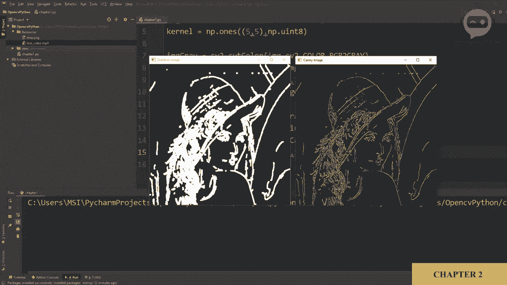
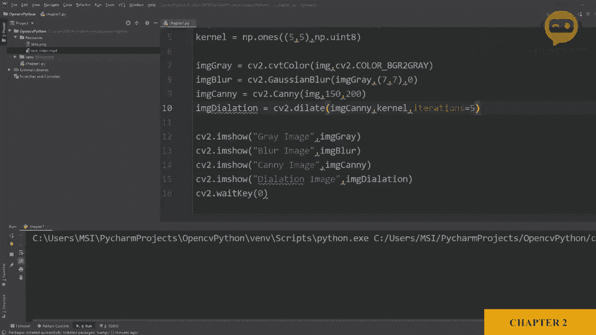

# 【双语字幕+资料下载】OpenCV 基础教程，安装、原理、实战， 3小时带你搞定这个热门计算机视觉工具库！＜实战教程系列＞ - P5：第2章：基础函数 - ShowMeAI - BV1zL411377L

So let's have a look at some basic functions that will be required quite often when we are building open CV projects。

So let's start by importing an image。We will use the IM read function。

And we will define the file La as Lina in the resources folder。Now。

 the first thing we will do is we will convert it into gray scale， so to do that。

 we will define our gray image IMG gray。Which is equals2。

Now we are going to use the functionality or the function from the CV2 package。Known as color C。Now。

 CT。Color basically converts your image into different color spaces。

 So you have to define your image， the one you want to convert。

 and then you have to define which color space do you want it to It convert it to。

 So here we are going to convert it into grayscale。 Now， conventionally， we use red， green and blue。

 which is RGB。 But in open C， the image convention， the channels are Bg R。So we will write B GR 2。

Gray。So let's output that and see what happens。 So we will use Cv2 dot I am show。

 and here we will write the file name or the window name。 Let's say we will call it gray image。

And we will display our gray image， I M T。Great。And again， we need to add C2 dot weight key。

And we will put it as 0。So let's play this and see what happens。So here we have our gray image。

Now let's move on to the next function， which is blur。So we will declare our blur image。Now。

 we are going to use the Rossian blur function to blur our image， so we will write。C。

V2 dot was in blur。And we will use our we can use our original image， which is the colored image。

 or we can use our gray image to add the blur， so let's use the gray image。And now next。

 if you see here you can see it says k size， which is your kernel size。

 so you need to define the kernel size， so we will say， for example， this is7 by 7。

 so it will add quite a bit of blur， so it has to be odd numbers so it can be3 by3，5 by 57 by 7。

So we will write that and then we will say that our sigma x is 0。

So don't worry about too much of all the details。 We are just scratching the surface of how we can get up and running。

 So we will copy this。And we will write here。Bur。And here we will change it to blur as well。

So let's play that。And here we can see the difference between these two images。

 So here is the gray image， and here is the image added with the blur。Next。

 we are going to look at an edge detector。 Now， this particular edge detector is known as canny edge detector。

So in order to find the edges in our image， we will use the image canny。

We will call it image canny and then we will use our canny function。We will assign the image。

And now we will add the threshold values。 So we have two thresholds。 So for the sake of simplicity。

 we will put it as hundred and hundred。 So now you can go higher or lower。But again。

 it depends on your particular situation。So， let's copy that。And we will go and write canny。

And here we will write the can。So let's run this。And there you go。 So here you have the canny image。

 the blur image， and the gray image。So here we can see we are getting a lot of curve a lot of edges。

 So if you wanted to reduce that， we will change the value of the threshold。 For example。

 we can put this to 200， and we can put this to 150。So let's run that again。

And here you can see the difference。 Now， the edges are quite low。 Next， we will look into dilation。

 Now， sometimes we are detecting an edge， but because there is a gap or because its not joined properly。

 it does not detect it as a proper line。So what we can do is we can increase the thickness of our edge。

 so in order to do that， we will use image。Dilation。And then we will write CBv2 dot diallate。

Now here we will use the image canny because we are talking about。Eddges。

And then we have to add a kernel。Now， a kernel is just a matrix that we have to define the size of and the value of。

 So in this case， we need a matrix which has all one values。

But we need to define the size of that matrix as well。So， as I've mentioned before。

There is a library or a package that helps us deal with matrices， and that library is Ny。

 but we did not install it yet， so we are going to go to file。We are going to go to Sis。

Here we will go to our projects。😔，And we will add numpy。And we will hit install。

Once the installation is done， we will go back and we will import Ny。As N。

So whenever we want to call a function， we can write NP dot， whatever the function is。

 So in this case we are going to define a kernel。So， let's say our kernel。Is equals 2。Numpy dot1。

 which means we want all of the values to be one。And we will define the size of the matrix。

 which is5。By 5。Then we are just defining the type of the object， which is。Unsigned integer of 8 bit。

Which means the values can range from 0 to 255。Sou。We go down。 and here we will add our kernel。

After that， we need to define how many iterations we want the kernel to move around。

 which means how much thickness do we actually need So iterations。Is equals2， let's say one。本当？

So we are going to copy that and we will write。Image dilation。And。Here， we will write dilation image。

Dlation。Image。

So let's run that and here you can see。😔，This is the original canny image。

 and this is the image with dilation。

So if we increase the iteration number， let's say we do something dramatic and put five。

Then we see a massive change。

In the thickness。

So。The next function we are going to learn is the opposite of dilation， which is erosion。

 so we are going to make it thinner。So for that， we will define our image as image eroded。

Is equals to C2 dot Ero function。And again， we need to define which image do we want to erode。

 so we will take the dilation image and we will erode that。

And then we need to define the kernel again， so we will keep the kernel same。And again。

 we need to define the number of iterations。So in this case， we are going to put， for example， one。

 so let's put this back to one。And we will add our image。For erosion。So here is our eroded image。

 here is our dilation image， and here is the original cadney image。

