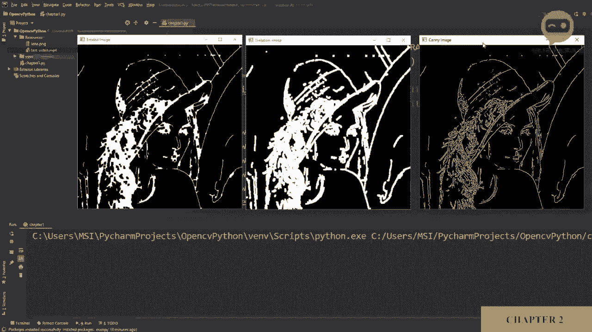
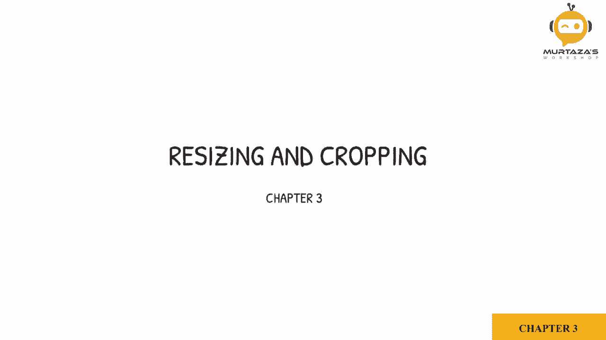
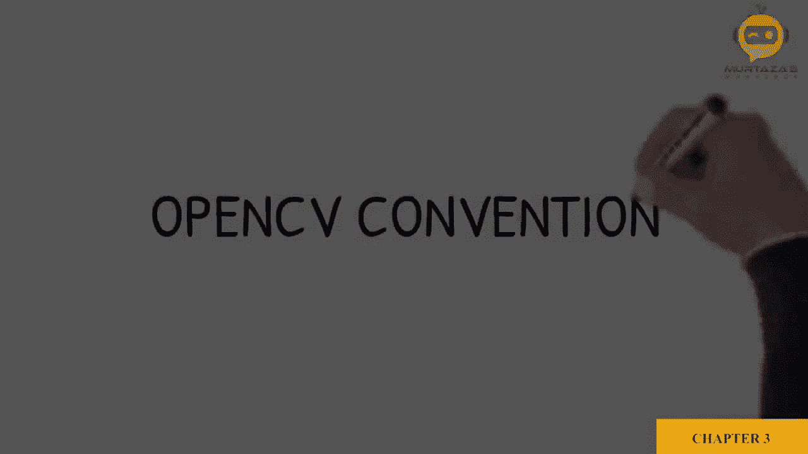
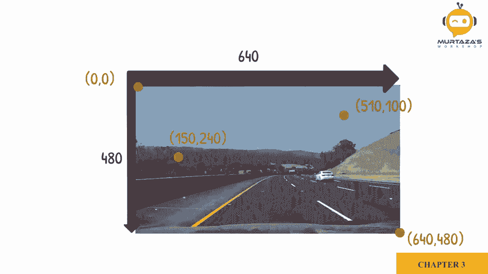
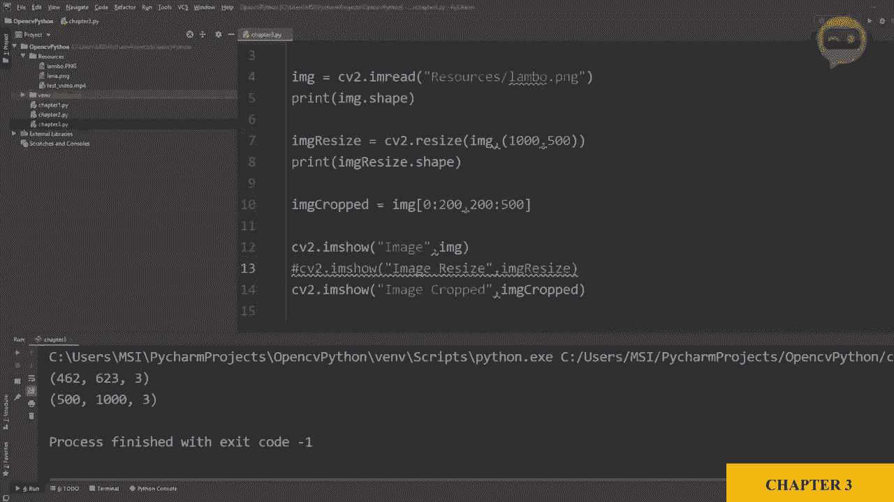

# 【双语字幕+资料下载】OpenCV基础教程，安装、原理、实战，3小时带你搞定这个热门计算机视觉工具库！＜实战教程系列＞ - P6：第3章：图像缩放与截取 - ShowMeAI - BV1zL411377L

让我们看一下Open TV约定。

在数学中，绘制图形时，X轴的正方向朝东，Y轴的正方向朝北。在Open C中，X轴是一样的，但正Y轴朝南。为了更进一步理解，我们来看一张图像。假设这张图像是640×480，图像的原点就在这一点。

此时，最大宽度和高度将是。看看更多的点，我们可以进一步理解约定。

首先我们要学习如何调整图像的大小。现在要调整图像大小，我们需要知道图像的当前大小。这里我们有一个简单的例子，我们导入库，然后导入一个名为Lamo的图像，这是兰博基尼的缩写，我们只是在展示它，让我们看看我们的图像。

所以这是我们的图像。现在要找到图像的大小，我们将写打印。然后我们将检查图像的形状，所以用 It dot shape。如果我们再运行一次，它会给我们462×623×3。第一个462是高度，623是宽度，3是通道的数量，即BGR。现在，为了调整大小。

我们将使用调整大小函数。所以我们将写。IM G。调整大小等于C2点res。在这里我们将写我们想要调整大小的图像，即我们的主图像。然后我们需要定义调整大小的宽度和高度。这里我们首先定义宽度，然后是高度，假设我们想把宽度设置为。

目前我们有623。让我们把它改为300。我们可以把高度改为200。现在让我们展示这个图像。这里是我们的原始图像，下面是我们调整大小后的图像。正如你所看到的，我们成功地调整了像素数量。如果你想再次检查形状，可以写打印，而不是图像，我们可以写图像调整大小。

所以如果你再打印一次，你可以看到上面的原始图像和下面的调整大小的图像。以同样的方式，你也可以增加像素数量，但当然它不会增加质量，但可以增加像素数量。例如，1000×500。所以这里我们有一个拉伸的图像。所以是的，你也可以这样做。

接下来我们要学习如何裁剪图像，裁剪在你想要图像的特定部分时非常有用。现在图像本身只是一个像素的矩阵或数组。所以我们可以以数组或矩阵的形式删除它。我们可以写。图像，裁剪。等于。图像，这就是我们想裁剪的主图像。

但是现在我们不需要使用OpenCV函数。我们可以直接使用矩阵功能，所以我们可以定义宽度和高度的起点和终点。例如，现在有点棘手，因为高度先来，然后在OpenCV函数中宽度在上面。

宽度先来，然后是高度，所以这里我们先有高度，然后是宽度。😊。所以我们想定义想要保持的高度，我们设定最大高度为462，所以我们打算保持从0到200，范围是0到200。

然后我们要保持的宽度，比如说，从200到500。所以，从200到500。现在我们要显示这个。所以让我们运行它。😔，你看，这就是你裁剪后的图像，所以我们可以隐藏我们的。重新裁剪的图像。然后你看，这就是直接来自主图像的裁剪图像，如果我们能把它放回去。

它会到这里，是的。所以我们所做的是，如果可以的话。是的，如果我们可以这样做。我们可以更好地看到数字，所以高度我们从0裁剪到200。这是你的起点0，到这里是200，所以这个区域到这里是200。然后宽度是从200开始，所以我们从这个点200开始，一直到500。

这是这个要点。所以这就是你如何裁剪一张图片。
