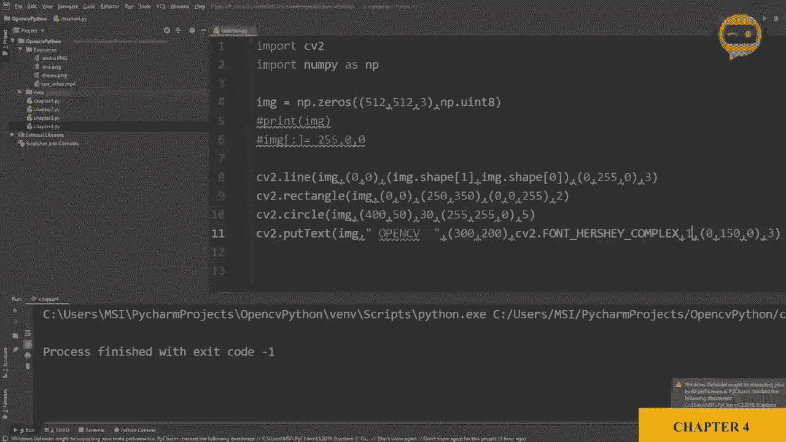
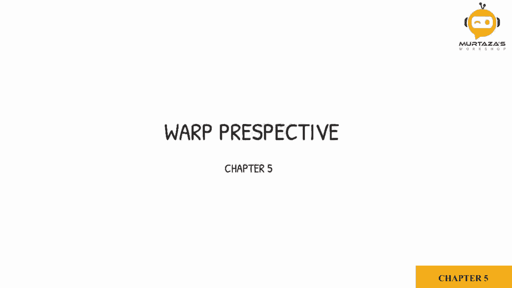

# 【双语字幕+资料下载】OpenCV 基础教程，安装、原理、实战， 3小时带你搞定这个热门计算机视觉工具库！＜实战教程系列＞ - P8：第5章：透视变换 - ShowMeAI - BV1zL411377L

So now we are going to learn how to use word perspective on an image to get its bird eye view。

So what we have here is an image by the name cards in the resources folder and all we are doing is we are displaying it using the IM show function So if we run this we will get our image。

What we will do is we will try to get this king of spades。And we will try to。

Get it as flat as possible。 So we will need the four points。And using these four points。

 we are going to apply the word perspective。So the first thing we will do is we will define our four corner points of the card。

 so I've already taken the numbers and we will just type them in， so we will declare points。

As a number array of float。And inside that， we will have four different points。

So let's type in the values where I have 111。Then we have2，1，9。

So this is for this particular image and for that particular card that we were referring to before。

 so this is 188。Then 1，54。 if you want to get these values， you can open up paint on Windows。

 and it will when you move your cursor around at the bottom。

 it will give you the values of the pixels。So。Those are our points。 Now， for each one of them。

 we need to define which corner are we referring to。

 So is this origin as in the first point on the left hand corner and is this the last one。

 So you have to define all of these。 So in point2。We are going to define it。Loat 32。And then again。

 we have four points。So first， we have our 0，0。Then we have width and0。Then we have0 and height。

And then we have。V1 height。Now， we did not define width and height。 That's why it's giving error。

 So let's define width and height。So。A playing card is normally 2。5 by 3。5 inches。

 so we will keep the aspect ratio。So we can put 250 by 350。So now we will get our matrix。

 the transformation matrix。That will be required for the perspective itself。

 So the matrix we can get by C2， so we have a function get perspective transform。So， get。P。

Perspective transform， there you go。 So you have to define the points， so。Points1， and  point2。

Now we can get our output image based on this matrix。So we can say image output is equals to C2。

Dot verp perspective。Wp。Perspective， and then we need to define our source image。

And we have to define our matrix。And then we have to define the width and the height。

That we defined earlier。 So with and the。Heい。So， now。If we output this image。Let's see。C。

 B2 dot I am show。And then， we can say。Outputs。And then we have our image output。Itcame double， okay。

So let's run that。😔，And there you go， so we are getting the word perspective of this image based on these points。

