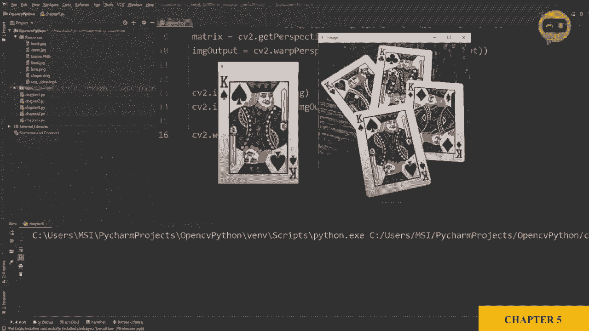
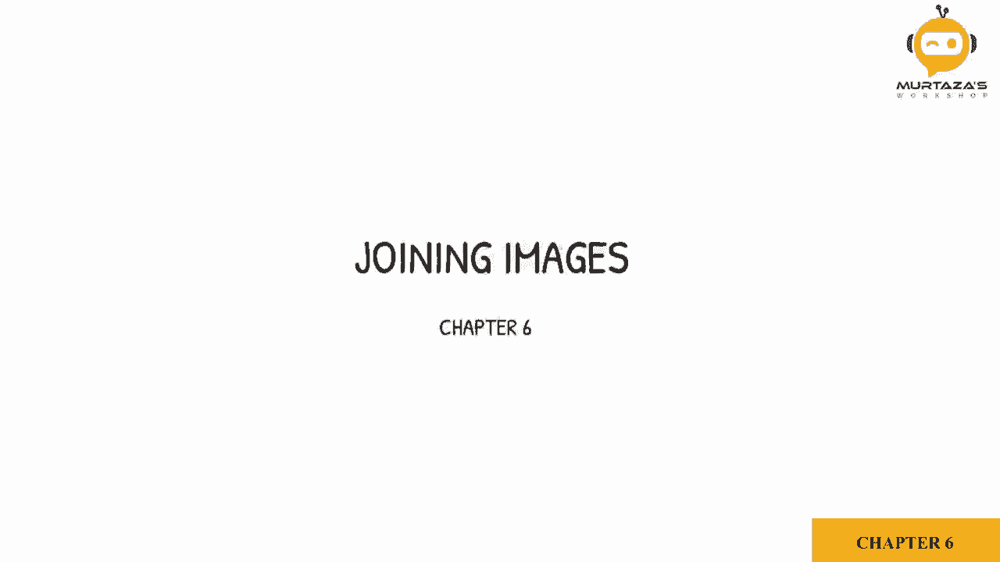
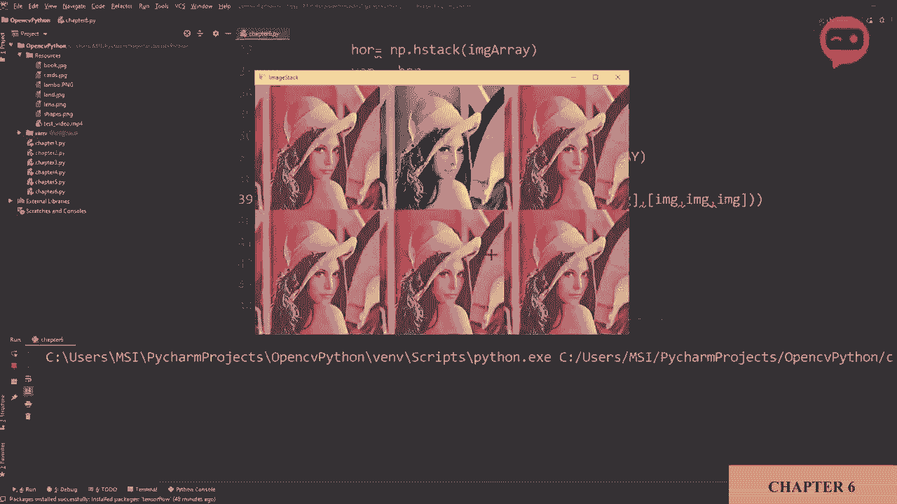

# 【双语字幕+资料下载】OpenCV 基础教程，安装、原理、实战，3小时带你搞定这个热门计算机视觉工具库！＜实战教程系列＞ - P9：第6章：图像拼接 - ShowMeAI - BV1zL411377L

现在我们要学习如何将图像连接在一起，这在你有很多图像并且需要反复运行时会很有用。因此，管理所有这些窗口会很困难，所以我们会把所有图像放在一个窗口中。

让我们看看如何做到这一点，我们在资源文件夹中有一个名为 Lina 的图像。我们将用它自己来堆叠，所以首先我们将使用水平堆叠函数。所以在这里，我们将说 Nmpy dot。这些是 Npy 函数，而不是 OpenCV 函数。所以我们将使用 Numpy 的水平堆叠。我们将首先写我们的图像，第一个图像是图像。

然后再次显示图像。所以让我们显示这个，我是 show。让我们显示这个 Cv2。im show。我们的窗口名称是 horizontal。我们会写我们的图像。实际上，最好写成 I G。😔。Horizontal，然后 IMT。Horizontト。所以让我们运行它。😔，看吧。现在我们已经将图像在水平方向上堆叠在一起了。

现在让我们做垂直堆叠。图像垂直等于 NP dot for vertical stack。然后我们将定义图像和图像。所以我们会复制这个。粘贴下来，图像垂直。我们会称之为 vert。好的，现在我们有两幅图像，一个是水平堆叠的，一个是垂直堆叠的。现在这个方法有一些问题。

首先，我们无法调整图像大小，它会保持原样。所以如果我想在右侧再堆叠两幅图像，它会占用整个空间，或者可能会超出框架。另一个问题是，如果图像没有相同数量的通道。

这意味着它们不是 RGB，两个都可能是灰度图像，或者一个是灰度，另一个是 RGB。这样的话就会不工作，所以它们必须有相同数量的通道，因为我们在讨论矩阵。那么解决方案是什么呢？为此，我创建了一个小函数，可以调用它来处理这些问题。所以你需要知道的就是如何调用那个函数。让我们来看看那个函数。

我会在这里复制它。所以，我会。只是。注释掉这一部分。然后在顶部，我会添加这个函数。所以这里就是我们的函数。让我们把它放下来。你不需要担心这个函数的所有细节。你只需知道它如何将图像堆叠在一起，以及如何使用它，这就是你需要知道的。

让我解释一下它是如何工作的。你需要创建一个图像堆叠。例如，你可以说 image.Stack 等于。现在你将调用函数 Stack images，然后如上所述，你必须提到比例，所以你可以将所有图像缩小，也可以放大它们。所以我们假设我们将比例设为 0.5，然后你需要定义图像的矩阵。

假设我有图像，图像和。图像。这将给我们一个需要显示的水平堆叠。因此让我们复制一下。😔，我们将在这里写。图像堆叠。我们将在这里写，图像。なか。所以好了。现在它缩小了，我们有三张图像在一起。所以现在如果我们想要添加垂直堆叠，我们只需添加一个逗号，然后可以再添加一行。

不过，如果你在第一行有三列，那么在第二行也必须有三列，这其实很直观。因此你可以看到，轻松地将所有图像叠加在一起，即使其中一张图像的通道不同，你仍然可以将它们叠加在一起。让我演示一下，图像灰度等于C2点。

CBT颜色，然后我们可以将我们的图像和C2点颜色，BGR转灰，并且我们可以放在中间这里。灰度图像，所以让我们运行一下。好了，你有一个灰度图像与其他图像叠加在一起。

彩色图像。
