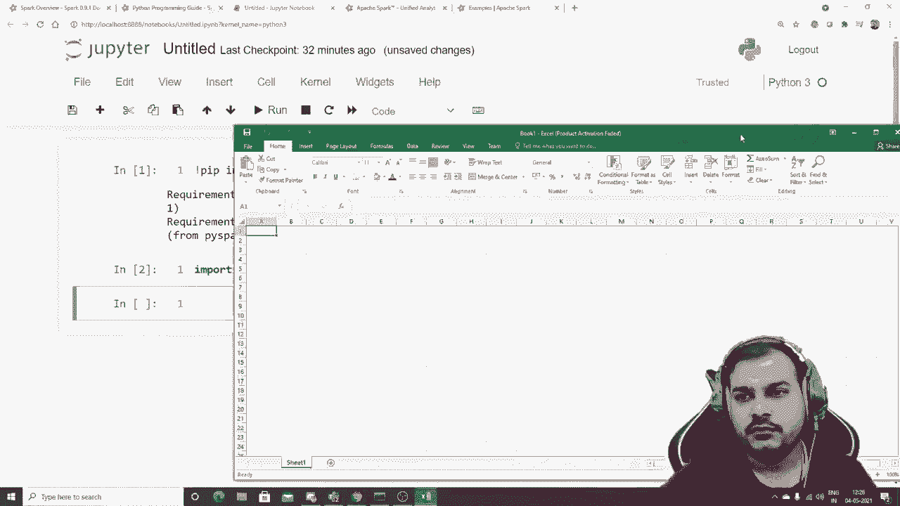
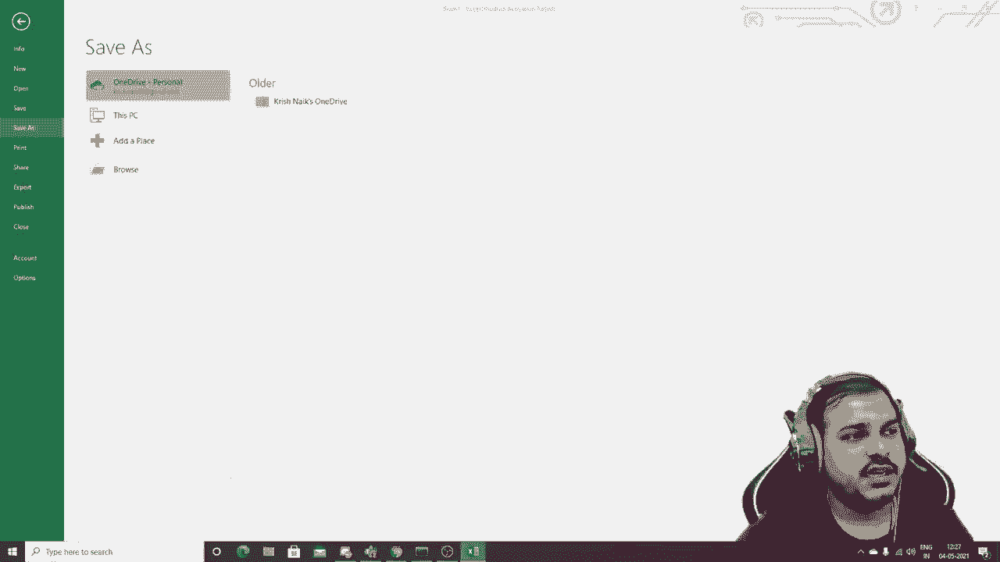
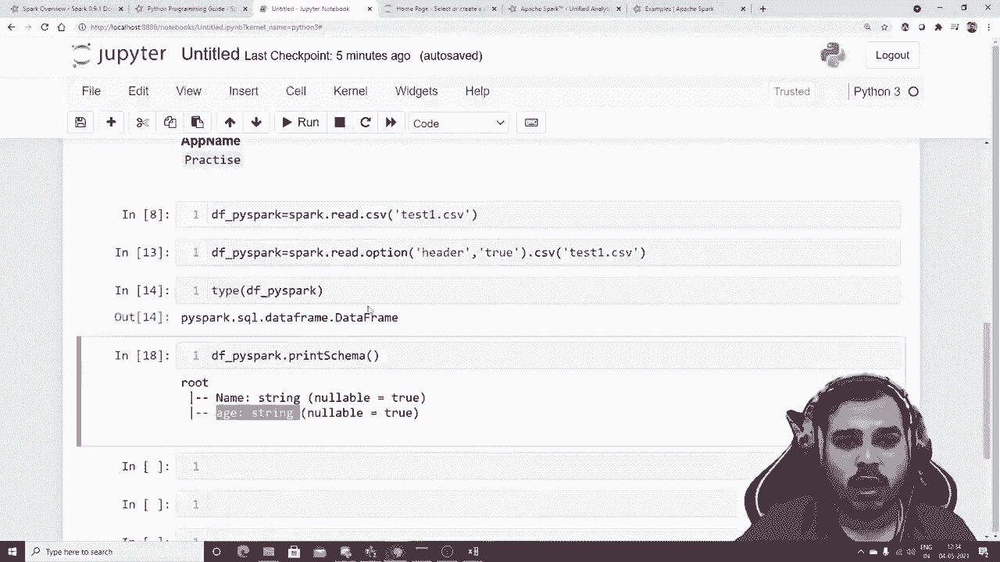
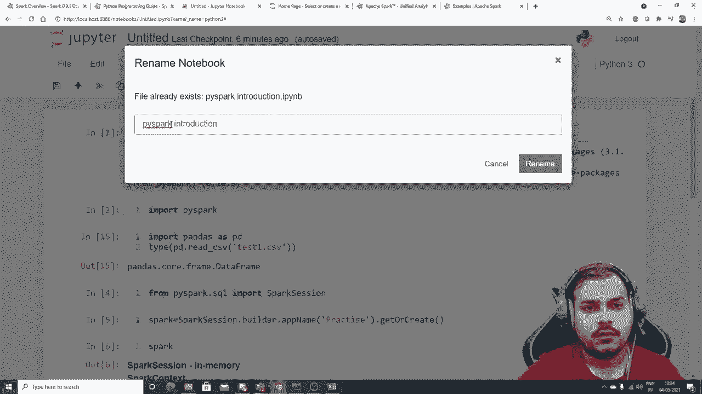
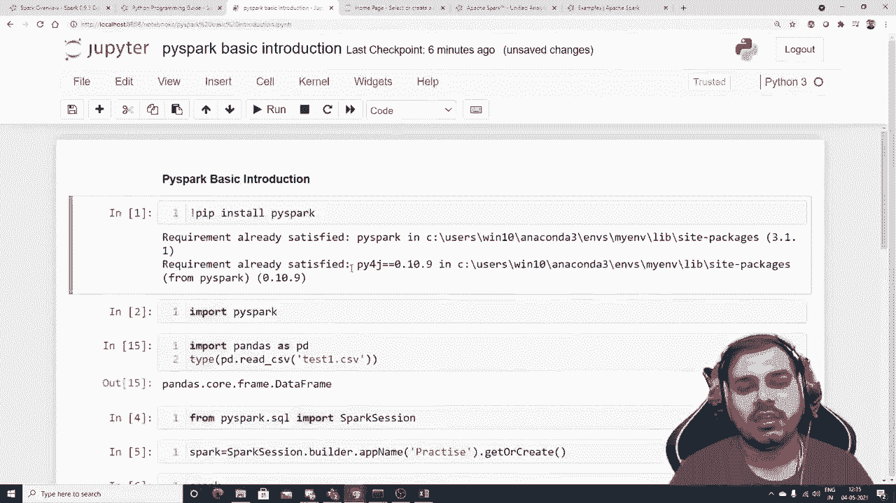

# 【双语字幕+资料下载】PySpark 大数据处理入门，带你玩转Python+Spark大数据操作与分析！＜实战教程系列＞ - P1：L1- Pyspark 介绍和安装 - ShowMeAI - BV1sL4y147dP

Hello all。 My name is Krisna and welcome to my YouTube channel。 So guys。

 we are going to start Apache Spark series， and specifically if I talk about Spark。

 we will be focusing on how we can use Spk with Python。

 So we are going to discuss about the library call Pi Spk。😊。

We will try to understand everything why Spk is actually required and probably we also try to cover a lot of things。

 There is something called as Mlib Spk Mlib， which will basically say that how you can apply machine learning。

 you know in Apache Spk itself with the help of this Spk API called as Pipark libraries and apart from that we'll also try to see in the future once we understand the basics of the Pipark library。

 how we can actually preprocess our data set， how we can use the Pipar data frames we'll also try to see。

How we can implement or how we can use Pipark in cloud platforms like data breaks， Amazon， Aws。

 you know， so all these kind of clouds will try to cover and remember Apache spark is quite handy。

 Let me tell you just let me just give you some of the reasons So why Aache spark is pretty much good because understand。

 suppose if you have a huge amount of data Okay suppose if I say that I'm having 64 gb data，1。

8 gb data， you know， we may have some kind of systems， a standalone systems， you know。

 where we can have 32 gb of Ram probably 64 gb of Ram right now in the workstation that I'm working in it has 64 gb Ram。

 So max to Mac， it can directly upload a data set of 32 gb。

48 gb But what if if we have a data set of 1。8 g you know that is the time guys。

 we don't just depend on a local system will try to preprocess that particular data perform any kind of operation in distribute。

uted systems right distributeded system basically means that all there will be multiple systems。

 you know， where we can actually run this kind of jobs or process or try to do any kind of activities that we really want and definitely Apache Sp will actually help us to do that and this has been pretty much amazing And yes。

 people wanted this kind of videos a lot So how we are going to go through this specific playlistes that will try to first of all。

 start with the installation。 We'll try to use Pipark because that is also Apache spark it is a spark API with Python when you are actually working with Python we basically use Pipark library And yes。

 we can also use spark with other programming languages like Java scale and all right and will try to understand from basics you know from basic how do we read a data。

 how do we connect to a data source probably how do we play with the data frames know in this Apache Sp that is your Pi。

😊，Also they provide you data structures like data frames。

 which is pretty much similar to the pans data frame， but yes。

 different kind of operations are supported over there which we'll be looking one by one as we go ahead and then we'll try to enter into Mlib Apache Sp Mlib so basically it is called as spark Mlib which will actually help us to perform machine learning which where we'll be able to perform some machine learning algorithm task where we'll be able to do regression classification clustering and finally well try to see how we can actually do the same operation in cloud where I'll try to show you some examples where we will be having a huge data set we will try to do the operation in the clusters of system you know in a distributed system and we'll try to see how we can use spark in that right so all those things will basically get covered now some of the advantages of Apache Sp and white is very much famous because it runs workloads hundred multiplied by。

times faster， you know， that basically means And if you know about big data guys。

 when we talk about big data， we are basically talking about huge data set， right。

 and there if you have heard of this terminology called as map produce， right。

Trusush mean Apache Spk is much more faster 00 times faster than map produce also。 okay。

 and it is some of the more advantage that it is ease of use。

 you can write application quickly in Java scalear Python or R， as I said。

 well be focusing on Python where we'll be using a library called Pipark。

 Then you can also combine SQL streaming and complex analytics。 When I talk about complex analytics。

 I'm basically talking about this Mlib machine learning libraries that will work definitely well with the Apache Spk。

And Apache sparks can run on Hadoop Apache meso Knet standalone in or in the clouds cloud。

 different types of cloud guys when I talk about Aws data breaks， all these things。

 we can definitely work。 and it actually runs in a cluster cluster basically means in a distributed So these are some of the examples。

 Now if I go with respect to which version ofpar spark will be usingpar 3。1。

1 will be using will try to work and if you just go and search for here you can see SQL and data frames and all here you can see spark streaming machineli that is called as machine learning in all And apart from that if I go and see the overview here you can see that Apache spark is a fast and general purpose cluster computing system。

 it provides highle APIs in scale or Java and Python that makes parallel job easy to write an optimized engine that supports general competition graph。

 So it is basically to work with huge amount of data。😊，And short， you know。

 and that is pretty much handy。 will'll try to work。 Now， if I go and search for this park in Python。

 you know， this page will get basically go open and this things will try to discuss how to install it。

 And in this video will try to install the Pipar library。

 if I talk about Pipar library you'll be able to see that Pipar library is pretty much amazing。

 this library is if you really want to work if you want to work this spark functionality with Python。

 you basically use the specific library and let's proceed and let's try to see that how we can quickly。

😊，Yeah， how we can quickly you know install the specific libraries and check out like what all things we can actually do。

 Okay， so all these things we'll try to see。 So let's begin。

 please make sure that you create a new environment when you are working with Pi So I have created a new environment called my and here。

 first of all， I'll try to install the Pi libraries。

 So I'll just install Pipar and let's see in this we'll focus on installation。

 we'll focus on reading some data sets and try to see that what all things we can actually do。

 Okay and after doing this what we can actually do is that you can see that our Pi has been installed in order to check whether the installation is perfect or not I'll just write import Pi So this this looks perfectly find it is working know we are able to see that the Pi is basically installed properly Now you may be facing some kind of problems。

 is with respect to Pipar So that is the reason why I'm telling you create a new environment If you' are facing some kind。

😊，Isue， just let me know what is the error that you are getting probably writing in the comment section。

 Okay， now let's do one thing。 I'll just open Excel sheet Okay。

 and probably I'll just try to create a。

Some data sets， I'll say name， probably， I'll just say name。And H， right。

 And suppose my name over here that I'm going to write is squ and also 31。 I'm going to say Suan S。

Right， Shoan Shu。 I will just say， okay， 30。 and probably。

 I'll just write some more names like Sunny。 Probably I'll also give the data as 29。

 So this three data will just try to see how we can read this specific file。 Okay。

 I'm just going to save it。Let's see。 I'll save it in the same location where my Jupiter notebook is guys。

 E I created a folder， I guess。You can save it in any location where your notebook file is open。

 right， So it is not necessary and just making sure that you don't see any of my files。Okay。

 and I'm just saving it。 Okay， I'm saving it as test 1。 Here you can see。

 I'm saving it as test 1 dot C SV。 So I'll save it。 Let's keep this particular file saved。 Okay， now。

 if I probably want to， you know。😊。

Read with the panda。 So what we write， we write P D dot read underscore CSV， right。

 And I basically use this particular data sets called as。testest1。Dot CS Sv。

 right So when I am executing this here， you will be able to see this specific information。 Now。

 when I really want to work with Pipar， always， first of all， remember。

 we need to start a spark session。 And in order to start a spark session。 first of all。

 let me create some more fields。 Just see this。 Just follow this particular steps with respect to creating a pass session。

 So Ill write from Pipar。😊，Dot sqL。Import。Spark session。 Okay， and then I'll execute this。

 You can see that it is exhibiting fine。 Then I'll write， sorry。I don't know what has opened。

 so Ill Ill create a variable called a spark and probably Ill use the spark session dot builder。

And I'll say app name and here， I'll just give my session name。 Okay， so it'll be like practice。

 suppose I'm practicing these things。 And then I can say get or create。

 So when I actually execute this， you'll be able to see a spark session will get created。

 And if you' are executing for the first time， itll probably take some amount of time other than that if I executed multiple times。

 then you'll be able to work it now here you can definitely see that in this when you're executing in a local。

 therell always be only one cluster。 But when you are actually working in a cloud。

 you can create multiple clusters and instances。 Okay。

 so the spark version that you'll be using is v 3。1。

1 here you can see that this is basically present in the master when probably you'll be working in multiple instances。

 there you'll be seeing masters and cluster one cluster to all those kind of information Okay so this is with respect to Sp Now let's I'll just write Df of pipar where I will try to read a data set。

😊，With respect to spark。 Okay， now in order to read a reader set what I can write。

 I can write like the spark dot。Read， dot。There is a lot of options like CSV format。

 JDBC parque scheme or table text， lot of options there。

 So here we are going to take CSV and here Im just going to write tips1。Teps 1， do C， right。

 And if I just try to execute it here， I'm getting some error saying that this particular file does not exist。

 Let me see。I think this file is present。嗯嗯嗯。Just let me see guys。 why this is not getting executed。

 Ti 1。D F file open。 here I can see test 1 dot C V。 Okay， sorry， I did not write that C SV file。

 I guess test 1 dot C SV。Okay， this has now work。 Now， if I go and see D dots Pipar。

 it is showing these two strings， right this two column C0 and C1。 Now here you can see that guys。

 I've created this particular Cv file right and it is just taking this A B as a default column probably So it is saying C0 and C1 So what we can actually do is that and probably if you really want to see your entire data set。

 you can basically see like this Df underscore Pipar dot show here we'll be able to see name and age this this information I really want to make my column name or age as my main column right But when I'm directly reading this Cv file。

 probably we are getting underscore c0 underscore C1。

 So in order to solve this what I will do is that we have a different technique So I'll write spark dot read dot option there is something called as option and inside this option what you can basically give is that there'll be an option with respect to。

😊，Header， like I see， there will be something like key value that you will be providing in option。

 So what you can do， you can just write header。Commer true。 So whatever value。

 the first column first row value will be there， that will be considered as your header。

 And if I write Csv with respect to test1。 now， I'm just going to read this test1 dataset set。

Test 1 dot CS Sv。 Now， once I execute this here， you'll be able to see that I am able to get now name string H string。

 Okay， but let's see our complete data set。 So here if I execute this now。

 I'll be able to see the entire data set with this particular columns。 Okay。

 so let me just quickly save this in my Df underscore Pi spark。😊，And now。

 let's go and see the type of。D F underscore pi spa， okay。Now， when I execute this here。

 you'll be able to see guys when I was reading this Df right when I was。

 if I go and see the type of this with the help of pandas here you'll be able to see that there is pandas dot code do frame do data frame。

 But here you'll be seeing that when you are reading this particular data set。

 it is of type Pipar do sQl do data frame do data frame。 Yes。

 so that is pandas data frame is sQL dot data frame data frame。 Yes。

 most of the Apis are almost same。 The functionalities are same There a lot of things that we will be learning as we go ahead。

 but。😊，If I quickly want to see my。Probably， I don't know whether head will work。 Let's see。 Yes。

 head is also working。 So if I use dot head， probably you'll be able to see the rose information I basically shown over here。

 Now， if I really want to see the more information regarding my columns I will be able to use something called as print schema now in this this print schema is just like Df dot info。

 which will actually tell about your columns like name is string and age string Okay so all these are some basic operations that you have actually done after installer again。

 the main thing why I'm focusing on this is that just try to install this spice spark and keep it ready for my next session I will be trying to show you how we can change the data type how we can work with data frames。

 how we can actually do data precrossing， how we can handle null values， missing values。

 how we can delete the columns， how we can do various things。

 all those things will basically really discussing over there， how to drop columns and So I hope。😊。

Like this particular video。 So this is just my pie spark introduction， okay。

And we will continue the next session。 Probably。 I'll also give you this information in my Github where we will probably。

 okay， Pi Sp is already there。

我。Basic introduction， fine， So we will try to do this and we'll try to cover this a entire thing as we go ahead in the next session。

 Remember， guys， again， our main aim is basically to make you understand how probably well be working in clouds。

 And before that， we really need to know all the basic stuffs that we need to understand regarding Pipar。

 But yes， it is an amazing library itll actually help us to implement all the spark APIpis functionalityities that are that basically supports with Python。

 So everything all the things that are related to machine learning we can also do with the help of Pi。

 So I hope you like this particular videoll see all in the next video have a great day。

 Thank you on doll。😊。

